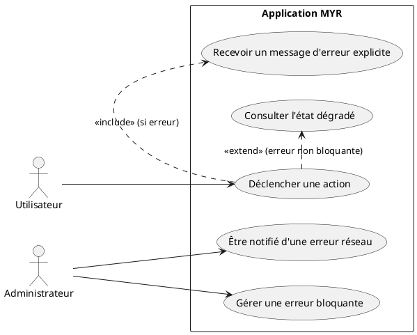
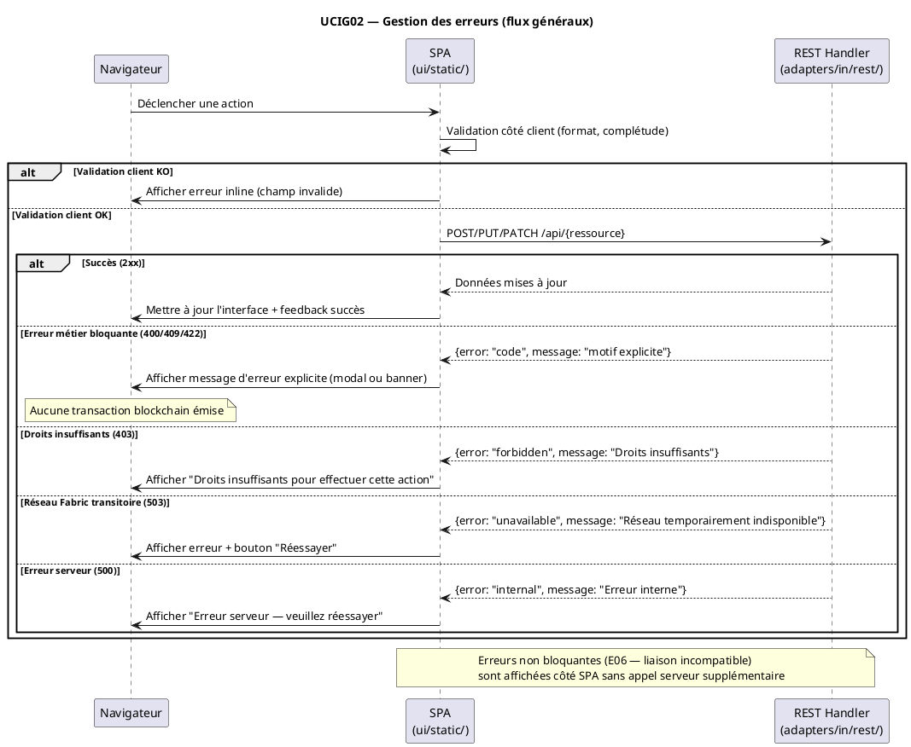

# Gestion des erreurs — comportements attendus

## Diagramme d'acteurs



## Contexte

Ce use case centralise les comportements attendus du système face aux situations d'erreur. Il ne décrit pas chaque erreur individuellement mais définit les **principes transversaux** applicables à tous les use cases.

Les erreurs sont classées en deux catégories :
- **Erreurs bloquantes** : empêchent toute transaction blockchain — affichent un message explicite
- **Erreurs non bloquantes** : l'état dégradé est affiché mais les données existantes sont préservées

La gestion basique des erreurs HTTP est en place dans les handlers REST. Ce use case décrit le comportement cible complet, incluant les messages côté SPA.

## Pré-conditions

- L'application MYR est ouverte et l'utilisateur est connecté
- L'utilisateur déclenche une action (soumission, liaison, dérivation…)

## Scénario

**Étape initiale :** L'utilisateur déclenche une action dans l'interface

### Flux nominal — Action réussie (pas d'erreur)

1. L'utilisateur déclenche une action (ex : créer une liaison, soumettre un module)
2. La SPA valide les données côté client (format, complétude)
3. La requête est envoyée au serveur REST
4. Le serveur valide les règles métier et soumet à Fabric si nécessaire
5. La réponse de succès est reçue
6. L'interface est mise à jour — un feedback visuel bref confirme le succès

### Flux erreur — Erreur bloquante détectée côté serveur

1. Le serveur retourne un code HTTP d'erreur (400, 403, 409, 422…) avec un corps JSON structuré
2. La SPA reçoit la réponse d'erreur
3. Un message d'erreur explicite est affiché (jamais un message générique)
4. Le message décrit le motif précis (ex : "Cette interface est déjà utilisée dans une liaison")
5. Aucune transaction blockchain n'a été émise
6. L'utilisateur peut corriger et réessayer

### Flux erreur — Erreur non bloquante (état dégradé)

1. Une modification rend une liaison existante incompatible (E06)
2. La liaison reste visible dans l'Atelier, marquée en rouge
3. Un message d'avertissement (non modal) explique l'incompatibilité
4. L'utilisateur décide de l'action suivante — la liaison n'est pas supprimée automatiquement

### Flux erreur — Erreur réseau Fabric (transitoire)

1. Le peer Fabric est temporairement inaccessible (durée < seuil configuré — E10)
2. Le serveur retourne une erreur 503 avec un message "Réseau temporairement indisponible"
3. La SPA propose un bouton "Réessayer" après un délai
4. Le système tente une resynchronisation automatique à la reconnexion du peer

### Flux erreur — Peer Fabric définitivement indisponible (E11)

1. Le peer Fabric est inaccessible depuis plus longtemps que le seuil configuré
2. Le serveur marque le peer comme injoignable
3. La SPA affiche une alerte persistante : "Peer [nom] injoignable — contacter l'administrateur"
4. L'administrateur est notifié et peut recréer le peer (UCADM01)

### Flux erreur — Droits insuffisants (E08)

1. L'utilisateur tente une action nécessitant un rôle supérieur
2. Le serveur retourne 403 Forbidden
3. La SPA affiche : "Droits insuffisants pour effectuer cette action"
4. Aucune transaction n'a été émise

### Flux erreur — Wallet non trouvé (E09)

1. L'utilisateur tente une opération nécessitant un wallet Fabric
2. Le wallet est absent ou corrompu
3. La SPA affiche : "Identité blockchain introuvable"
4. La procédure d'enrollment est proposée (lien vers `/api/auth/enroll-wallet` ou `/api/identity/enroll`)

## Post-conditions

- Pour les erreurs bloquantes : aucune transaction blockchain n'a été émise ; l'état du système est inchangé
- Pour les erreurs non bloquantes : l'état dégradé est visible et conservé
- L'utilisateur dispose d'un message explicite lui permettant de comprendre et corriger la situation

## Diagramme de séquence



## Règles métier déclenchées

- **E01** : Hash déjà présent → bloquer, notifier admin (UCCE01)
- **E02** : Similarité > 50 % → bloquer, notifier admin (UCCE01)
- **E03** : Licence incompatible → bloquer avant soumission (UCCE02)
- **E04** : Asset parent introuvable → bloquer la dérivation (UCCE01)
- **E05** : Interfaces incompatibles → liaison non créée, motif affiché (UCAM01)
- **E06** : Liaison devenue incompatible → visible en rouge, non supprimée automatiquement (UCAM01, UCAM03)
- **E07** : Interface déjà utilisée → empêcher la liaison (UCAM01)
- **E08** : Droits insuffisants → message explicite, aucune transaction (UCA05)
- **E09** : Wallet non trouvé → proposer enrollment (UCA02)
- **E10** : Peer déconnecté < seuil → resynchronisation automatique
- **E11** : Peer déconnecté > seuil → alerte admin, recréation (UCADM01)
- **E12** : Module sans liaison → bloquer soumission (UCMOD06)

## Exigences non-fonctionnelles

- Toute erreur bloquante affiche un message avec le motif précis — jamais un message générique
- Aucune transaction blockchain n'est émise tant qu'une erreur bloquante n'est pas résolue
- Les erreurs non bloquantes (état dégradé) ne suppriment pas les données existantes
- Les erreurs réseau transitoires (E10) ne déclenchent pas d'alerte immédiate — seuil configurable

## Notes d'implémentation

**État actuel :** Gestion basique des erreurs HTTP en place dans `adapters/in/rest/`. Les handlers retournent des codes HTTP appropriés (400, 403, 404, 500). Le format JSON des erreurs n'est pas encore standardisé.

**Format JSON d'erreur recommandé :**
```json
{
  "error": "code_machine",
  "message": "Message lisible par l'utilisateur",
  "detail": "Information technique optionnelle (debug)"
}
```

**Côté SPA :** Un intercepteur global des réponses fetch/XHR doit centraliser la gestion des erreurs HTTP et déclencher l'affichage des messages appropriés. À implémenter dans `ui/static/js/`.

**Erreurs non bloquantes (E06) :** La liaison incompatible est stockée avec `Incompatible: true` (voir règle 12 du CLAUDE.md). La SPA doit afficher les liaisons incompatibles en rouge dans l'Atelier sans appel serveur supplémentaire.
