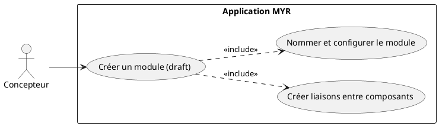
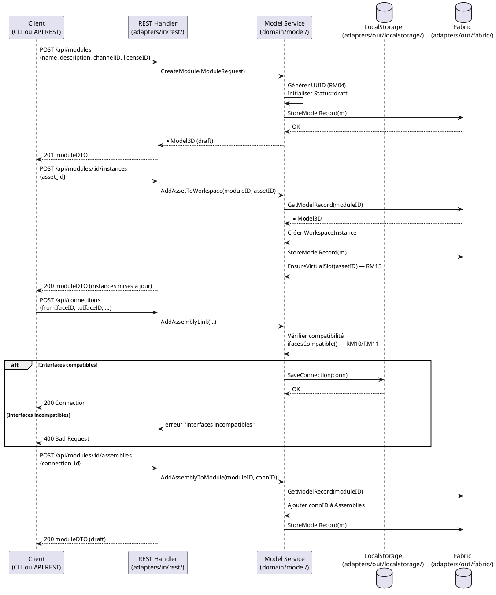

# Créer un Module

## Diagramme d'acteurs

## Contexte

Le Concepteur compose un Module en assemblant plusieurs Composants ou Modules existants via leurs Interfaces physiques. Cette composition est un état local côté serveur — hors blockchain, modifiable librement par actions directes sur le module (`AddAssetToWorkspace`, `AddAssemblyLink`).

Un Module nouvellement créé est toujours initialisé en état **draft** (RM16) : il existe localement mais n'est pas encore ancré sur la blockchain. Tant qu'il reste en état `draft`, le Concepteur peut ajouter, retirer ou reconfigurer des Liaisons (`Connection`) autant de fois que nécessaire.

La soumission à la blockchain est une étape distincte et explicite (UCMOD06). Elle crée une `ModuleVersion` immuable horodatée — snapshot figé et ancré, non modifiable après publication.

## Pré-conditions

- Identité authentifiée avec rôle **Concepteur** (`contributor`)
- Au moins un Composant ou Module existant disponible dans le système (en local ou sur la blockchain)
- Le module n'est pas encore créé (première création)

## Scénario

**Étape initiale :** `POST /api/modules` est appelée (ou l'équivalent CLI `myr module create`), pour le compte du Concepteur

### Flux nominal — Module créé en état draft

1. Le système appelle `POST /api/modules` → `service.CreateModule()` → initialise `Model3D` avec `Status=draft`, `Assemblies=[]`, `WorkspaceInstances=[]`
2. Des Composants sont ajoutés comme instances (`POST /api/modules/:id/instances`) — chaque ajout crée une `WorkspaceInstance` indépendante et garantit au moins un slot virtuel (RM13)
3. Des Liaisons sont créées entre Interfaces compatibles — le service vérifie la compatibilité (RM10/RM11 : catégorie + type + sens + plages de valeurs) et refuse toute liaison incompatible
4. Le module est nommé et configuré (nom, description, licence) via `PUT /api/modules/:id`
5. Le module est enregistré localement en état **draft**

### Flux alternatif — Liaison via interface virtuelle

1. Une connexion est demandée depuis un slot virtuel vers une Interface physique (`POST /api/virtual-connect`)
2. Le système appelle `ConnectVirtualToPhysical()` — matérialise l'interface virtuelle avec les attributs de l'interface physique cible (direction opposée)
3. Un nouveau slot virtuel est automatiquement recréé pour l'asset (invariant RM13)
4. La Liaison est créée et le module reste en état `draft`

### Flux erreur — Aucune liaison créée (sauvegarde bloquée)

1. Une tentative de finalisation du module est effectuée sans qu'aucune Liaison n'ait été créée
2. Le système détecte `len(m.Assemblies) == 0` — refus côté service
3. Message retourné : "Ajoutez au moins une liaison entre composants"

### Flux erreur — Erreur de persistance locale

1. Le service ne peut pas persister le `Model3D` (store indisponible)
2. Message d'erreur : "Impossible de créer le module — réessayez"
3. Aucune entrée créée — état du système inchangé

## Post-conditions

- Le module existe en état **draft** dans le store local (`adapters/out/localstorage/`)
- Le module possède un ID unique (UUID généré côté serveur — RM04)
- Les `WorkspaceInstances` ajoutées sont persistées
- Le module n'est pas visible sur le réseau (soumission requise — UCMOD06)
- Chaque asset instancié dispose d'au moins un slot virtuel (RM13)

## Diagramme de séquence

## Règles métier déclenchées

| Règle | Description | Point d'application |
|-------|-------------|---------------------|
| **RM04** | UUID généré par le système, jamais par le client | `generateID()` dans `CreateModule()` |
| **RM10** | Vérification de compatibilité à chaque création de Liaison | `ifacesCompatible()` dans `AddAssemblyLink()` |
| **RM11** | 5 critères : catégorie + tag (manquant E2) + type + sens + plages | `ifacesCompatible()` — tag absent du code |
| **RM13** | Au moins un slot virtuel garanti par asset instancié | `EnsureVirtualSlot()` dans `AddAssetToWorkspace()` |
| **RM16** | Module initialisé en état `draft` obligatoirement | `Status: ModuleDraft` dans `CreateModule()` |

## Exigences non-fonctionnelles

- **ENF12** : Rôle Concepteur vérifié côté serveur avant toute opération d'écriture
- **ENF18** : Le domaine ne connaît que des interfaces — aucune dépendance Fabric dans `domain/model/`
- **ENF31** : Validation des données avant toute soumission

## Notes d'implémentation

**Endpoints REST utilisés :**
- `POST /api/modules` → crée le module (handlers.go:~1010)
- `POST /api/modules/:id/instances` → ajoute un asset comme instance (handlers.go:~1127)
- `POST /api/modules/:id/assemblies` → associe une Liaison au module (handlers.go:~1078)
- `PUT /api/modules/:id` → met à jour nom/description/licence

**Commande CLI équivalente (cible) :** `myr module create --name <nom> --channel <id> [--owner-id <id>] [--description <texte>] [--license <id>]` appelle le même `CreateModule(ModuleRequest)` que `POST /api/modules`. L'ajout de composants comme instances et la création de liaisons se poursuivent avec `myr model instance add <moduleID> <assetID>` et `myr model link add` (mêmes méthodes `AddAssetToWorkspace` / `AddAssemblyLink`, mêmes vérifications RM10/RM11/RM13 côté service, quel que soit le canal). Voir `specs/3-Conception/DC_CLI_Model.md` § 3.6 et § 5. Ces commandes sont exécutées par l'administrateur du serveur via SSH, pour le compte du Concepteur (principe d'exécution distante, `CLAUDE.md`).

**Écart E2 à noter :** Le champ `Tag` est absent de `AssetInterface` dans `domain/model/entity.go`. La vérification RM11 ne comporte donc que 4 critères dans le code actuel (catégorie + type + sens + valeurs). Le champ `Tag` doit être ajouté pour la conformité complète à RM11.

**Écart E5 (RM19) :** `AddAssemblyToModule()` ne vérifie pas `Status != ModuleSubmitted` — un module soumis reste modifiable dans le code actuel. Le comportement attendu (fork obligatoire pour tout module soumis) est décrit dans UCMOD06 et doit être corrigé.
