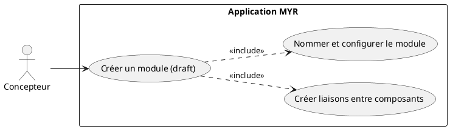
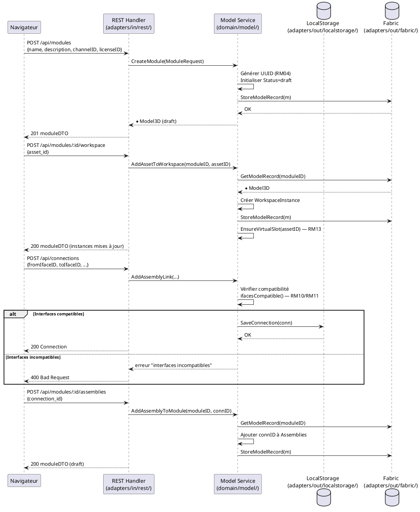

# Créer un Module

## Diagramme d'acteurs

## Contexte

Le Concepteur compose un Module en assemblant plusieurs Composants ou Modules existants via leurs Interfaces physiques dans l'Atelier. L'Atelier (`Workspace` dans le code) est un espace local côté serveur — hors blockchain, modifiable librement.

Un Module nouvellement créé est toujours initialisé en état **draft** (RM16) : il existe dans l'Atelier local mais n'est pas encore ancré sur la blockchain. Tant qu'il reste en état `draft`, le Concepteur peut ajouter, retirer ou reconfigurer des Liaisons (`Connection`) autant de fois que nécessaire.

La soumission à la blockchain est une étape distincte et explicite (UCMOD06). Elle crée une `ModuleVersion` immuable horodatée — snapshot figé et ancré, non modifiable après publication.

## Pré-conditions

- Utilisateur authentifié avec rôle **Concepteur** (`contributor`)
- Au moins un Composant ou Module existant disponible dans le système (en local ou sur la blockchain)
- Le module n'est pas encore créé (première création)

## Scénario

**Déclencheur :** Le Concepteur ouvre l'Asset UI d'un module depuis l'Explorer, puis clique le bouton **Atelier** pour activer la vue d'assemblage.

### Flux nominal — Module créé en état draft

1. Le Concepteur clique **Atelier** sur l'Asset UI d'un asset vide ou depuis **New Asset** (MenuBar)
2. Le système appelle `POST /api/modules` → `service.CreateModule()` → initialise `Model3D` avec `Status=draft`, `Assemblies=[]`, `WorkspaceInstances=[]`
3. Le Concepteur ajoute des Composants à l'Atelier (`POST /api/modules/:id/workspace`) — chaque ajout crée une `WorkspaceInstance` indépendante et garantit au moins un slot virtuel (RM13)
4. Le Concepteur crée des Liaisons entre Interfaces compatibles — le système vérifie la compatibilité (RM10/RM11 : catégorie + type + sens + plages de valeurs)
5. Les Interfaces non compatibles se grisent dans l'UI (tentative de liaison bloquée)
6. Le Concepteur nomme et configure le module (nom, description, licence) via `PUT /api/modules/:id`
7. Le module est enregistré localement en état **draft** — confirmation affichée

### Flux alternatif — Liaison via interface virtuelle

1. Le Concepteur glisse une Liaison depuis un slot virtuel (point `+`) vers une Interface physique
2. Le système appelle `ConnectVirtualToPhysical()` — matérialise l'interface virtuelle avec les attributs de l'interface physique cible (direction opposée)
3. Un nouveau slot virtuel est automatiquement recréé pour l'asset (invariant RM13)
4. La Liaison est créée et le module reste en état `draft`

### Flux erreur — Aucune liaison créée (sauvegarde bloquée)

1. Le Concepteur tente de nommer/sauvegarder sans avoir créé aucune Liaison
2. Le système détecte `len(m.Assemblies) == 0` — refus côté service
3. Message affiché : "Ajoutez au moins une liaison entre composants"
4. Le Concepteur est renvoyé vers la vue Atelier

### Flux erreur — Erreur de persistance locale

1. Le service ne peut pas persister le `Model3D` (store indisponible)
2. Message d'erreur : "Impossible de créer le module — réessayez"
3. Aucune entrée créée — état du système inchangé

## Post-conditions

- Le module existe en état **draft** dans le store local (`adapters/out/localstorage/`)
- Le module possède un ID unique (UUID généré côté serveur — RM04)
- Les `WorkspaceInstances` ajoutées sont persistées avec leurs positions
- Le module n'est pas visible sur le réseau (soumission requise — UCMOD06)
- Chaque asset de l'Atelier dispose d'au moins un slot virtuel (RM13)

## Diagramme de séquence

## Règles métier déclenchées

| Règle | Description | Point d'application |
|-------|-------------|---------------------|
| **RM04** | UUID généré par le système, jamais par le client | `generateID()` dans `CreateModule()` |
| **RM10** | Vérification de compatibilité à chaque création de Liaison | `ifacesCompatible()` dans `AddAssemblyLink()` |
| **RM11** | 5 critères : catégorie + tag (manquant E2) + type + sens + plages | `ifacesCompatible()` — tag absent du code |
| **RM13** | Au moins un slot virtuel garanti par asset dans l'Atelier | `EnsureVirtualSlot()` dans `AddAssetToWorkspace()` |
| **RM16** | Module initialisé en état `draft` obligatoirement | `Status: ModuleDraft` dans `CreateModule()` |

## Exigences non-fonctionnelles

- **ENF12** : Rôle Concepteur vérifié côté serveur avant toute opération d'écriture
- **ENF18** : Le domaine ne connaît que des interfaces — aucune dépendance Fabric dans `domain/model/`
- **ENF31** : Validation des données avant toute soumission

## Notes d'implémentation

**Endpoints REST utilisés :**
- `POST /api/modules` → crée le module (handlers.go:~1010)
- `POST /api/modules/:id/workspace` → ajoute un asset à l'Atelier (handlers.go:~1127)
- `POST /api/modules/:id/assemblies` → associe une Liaison au module (handlers.go:~1078)
- `PUT /api/modules/:id` → met à jour nom/description/licence

**Écart E2 à noter :** Le champ `Tag` est absent de `AssetInterface` dans `domain/model/entity.go`. La vérification RM11 ne comporte donc que 4 critères dans le code actuel (catégorie + type + sens + valeurs). Le champ `Tag` doit être ajouté pour la conformité complète à RM11.

**Écart E5 (RM19) :** `AddAssemblyToModule()` ne vérifie pas `Status != ModuleSubmitted` — un module soumis reste modifiable dans le code actuel. Le comportement attendu (fork obligatoire pour tout module soumis) est décrit dans UCMOD06 et doit être corrigé.
