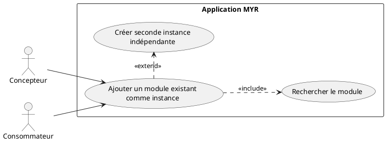
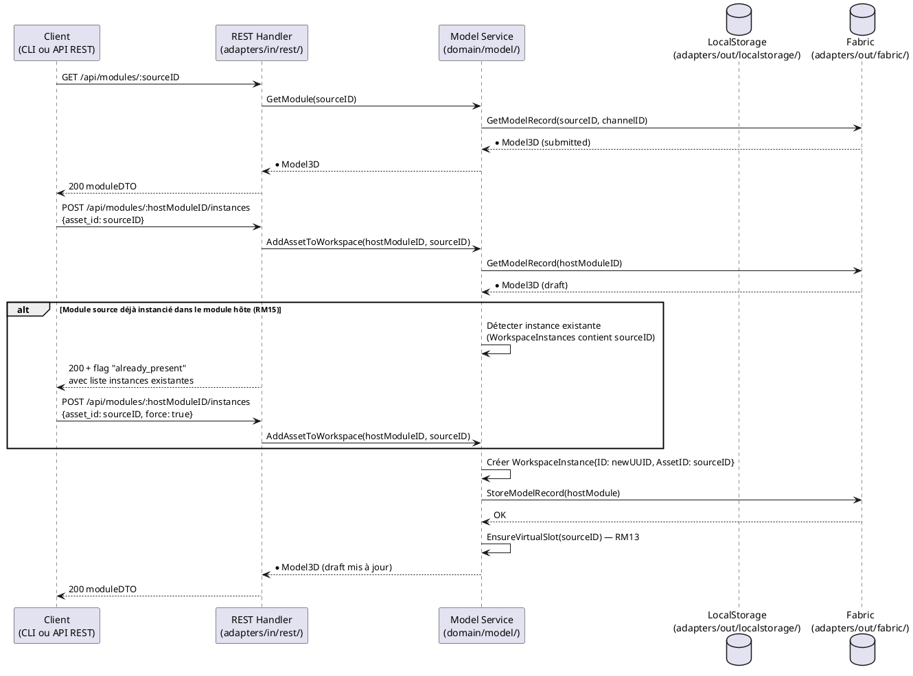

# Ajouter un Module existant

## Diagramme d'acteurs

## Contexte

Un Concepteur ou Consommateur souhaite réutiliser un Module déjà existant (contrôleur, caméra, visserie, sous-assemblage…) comme instance dans son propre module hôte. Le Module source peut provenir :
- du réseau blockchain (Module soumis, visible publiquement)
- d'une boutique partenaire liée au réseau

La clé de cette opération est la gestion des **instances indépendantes** (RM15) : le même Module peut être instancié plusieurs fois dans un module hôte, chaque instance ayant ses propres Liaisons sans affecter les autres. Cette règle est symétrique avec l'ajout de Composants (UCAM01).

## Pré-conditions

- Identité authentifiée avec rôle **Concepteur** (`contributor`) ou **Consommateur** (`consumer`)
- Un module hôte existe, en état `draft` (voir UCMOD01)
- Le Module cible est accessible sur la blockchain ou une boutique partenaire (état `submitted`)

## Scénario

**Étape initiale :** Le Module source est identifié par référence ou filtre (voir UCREC01/UCCL01), puis `POST /api/modules/:hostModuleID/instances` est appelée avec son identifiant (ou l'équivalent CLI `myr model instance add`)

### Flux nominal — Module ajouté (première instance)

1. Le Module source est récupéré depuis la blockchain (`GET /api/modules/:id`)
2. `POST /api/modules/:hostModuleID/instances` est appelée avec `{asset_id: moduleSource.ID}`
3. Service : `AddAssetToWorkspace(hostModuleID, assetID)` crée une `WorkspaceInstance` indépendante
4. Le slot virtuel est garanti automatiquement (RM13)
5. Le Module source est instancié dans le module hôte, avec ses interfaces exposées

### Flux alternatif — Module déjà instancié dans le module hôte (RM15)

1. Le Module cible possède déjà au moins une `WorkspaceInstance` dans le module hôte
2. `POST /api/modules/:hostModuleID/instances` avec `{asset_id: sourceID, force: true}` crée une nouvelle `WorkspaceInstance` avec un nouvel ID unique
3. La nouvelle instance est indépendante — ses futures Liaisons n'impactent pas la première instance
4. Les deux instances sont consultables via `GET /api/modules/:hostModuleID/instances`

### Flux erreur — Module introuvable sur la blockchain

1. L'ID ou la référence transmise ne correspond à aucun asset sur la blockchain
2. Message : "Module introuvable — vérifiez la référence"
3. Le module hôte reste inchangé

### Flux erreur — Module non soumis (état draft d'un autre utilisateur)

1. Le Module cible existe mais est en état `draft` — il n'est pas visible sur le réseau
2. Le système retourne une erreur d'accès interdit
3. Message : "Ce module n'est pas encore publié sur le réseau"

## Post-conditions

- Une nouvelle `WorkspaceInstance` est créée dans le module hôte avec un ID unique
- L'instance référence `AssetID` du Module source (pas une copie)
- Le module hôte reste en état `draft`
- Chaque instance dispose d'au moins un slot virtuel (RM13)
- Les Liaisons entre instances restent indépendantes (RM15)

## Diagramme de séquence

## Règles métier déclenchées

| Règle | Description | Point d'application |
|-------|-------------|---------------------|
| **RM13** | Slot virtuel garanti pour chaque asset instancié | `EnsureVirtualSlot()` dans `AddAssetToWorkspace()` |
| **RM15** | Seconde instance indépendante si le Module est déjà instancié dans le module hôte | Détection dans `AddAssetToWorkspace()` |

## Exigences non-fonctionnelles

- **ENF12** : Rôle vérifié côté serveur — seuls Concepteur et Consommateur peuvent ajouter un Module comme instance
- **ENF28** : Le Module source reste immuable — seule une référence (`AssetID`) est copiée, pas les données

## Notes d'implémentation

**Endpoints REST utilisés :**
- `GET /api/modules/:id` → récupère le Module source depuis la blockchain
- `POST /api/modules/:id/instances` → ajoute une instance au module hôte (handlers.go:~1127)

**Commande CLI équivalente (cible) :** `myr module list` (méthode `ListModules`) pour rechercher le Module source, puis `myr model instance add <hostModuleID> <sourceModuleID>` (méthode `AddAssetToWorkspace`) pour l'instancier dans le module hôte — chaque appel crée une nouvelle `WorkspaceInstance` indépendante, y compris pour une seconde instance du même Module (RM15). Une fois une Liaison créée, `myr module add-assembly <hostModuleID> <connID>` (méthode `AddAssemblyToModule`) la rattache au Module hôte. Voir `specs/3-Conception/DC_CLI_Model.md` § 5.

**RM15 — Détection de doublon :** La détection de doublon (instance déjà présente) n'est pas implémentée côté service dans le code actuel — `AddAssetToWorkspace()` crée toujours une instance sans vérifier. L'implémentation cible doit inspecter `m.WorkspaceInstances` et retourner un indicateur `already_present` dans la réponse, à charge du client (script, CLI ou GUI) de décider s'il force une seconde instance.

**Note architecture :** L'instance créée est une référence (`AssetID`), pas une copie de l'entité — les modifications du Module source sur la blockchain n'affectent pas les snapshots `ModuleVersion` déjà soumis, mais sont reflétées à la prochaine lecture du module hôte.
