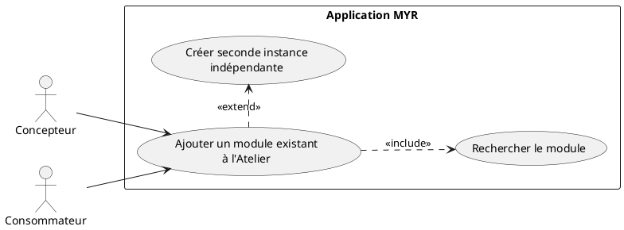
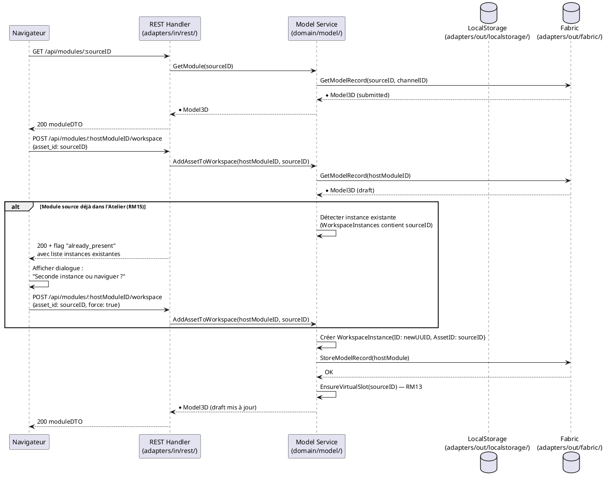

# Ajouter un Module existant

## Diagramme d'acteurs

## Contexte

Un Concepteur ou Consommateur souhaite réutiliser un Module déjà existant (contrôleur, caméra, visserie, sous-assemblage…) dans son propre Atelier. Le Module source peut provenir :
- du réseau blockchain (Module soumis, visible publiquement)
- d'une boutique partenaire liée au réseau

La clé de cette opération est la gestion des **instances indépendantes** (RM15) : le même Module peut être placé plusieurs fois dans un Atelier, chaque instance ayant ses propres Liaisons sans affecter les autres. Cette règle est symétrique avec l'ajout de Composants (UCAM-Atelier).

## Pré-conditions

- Utilisateur authentifié avec rôle **Concepteur** (`contributor`) ou **Consommateur** (`consumer`)
- Un Atelier ouvert (module en état `draft` — voir UCMOD01)
- Le Module cible est accessible sur la blockchain ou une boutique partenaire (état `submitted`)

## Scénario

**Déclencheur :** L'utilisateur recherche un Module et clique **Ajouter à l'Atelier**.

### Flux nominal — Module ajouté (première instance)

1. L'utilisateur saisit la référence ou filtre par nom/tags dans la Search UI (UCREC01)
2. Le système récupère le Module depuis la blockchain (`GET /api/modules/:id`)
3. L'utilisateur clique **Add to Explorer** puis **Ajouter à l'Atelier**
4. Le système appelle `POST /api/modules/:moduleID/workspace` avec `{asset_id: moduleSource.ID}`
5. Service : `AddAssetToWorkspace(moduleID, assetID)` crée une `WorkspaceInstance` indépendante
6. Le slot virtuel est garanti automatiquement (RM13)
7. Le Module source apparaît dans la vue Atelier avec son identité et ses interfaces exposées

### Flux alternatif — Module déjà présent dans l'Atelier (RM15)

1. L'utilisateur sélectionne un Module déjà instancié dans l'Atelier courant
2. Le système détecte la présence d'au moins une `WorkspaceInstance` avec cet `AssetID`
3. L'UI propose deux options :
   - **Ajouter une seconde instance indépendante**
   - **Naviguer vers l'instance existante**
4. L'utilisateur choisit **Ajouter une seconde instance**
5. Le système crée une nouvelle `WorkspaceInstance` avec un nouvel ID unique
6. La nouvelle instance est indépendante — ses futures Liaisons n'impactent pas la première instance
7. Les deux instances sont visibles dans l'Atelier

### Flux alternatif — Navigation vers l'instance existante

1. L'utilisateur choisit **Naviguer vers l'instance existante**
2. L'UI centre la vue sur l'instance déjà présente dans l'Atelier
3. Aucune nouvelle instance créée

### Flux erreur — Module introuvable sur la blockchain

1. L'ID ou la référence saisie ne correspond à aucun asset sur la blockchain
2. Message : "Module introuvable — vérifiez la référence"
3. L'Atelier reste inchangé

### Flux erreur — Module non soumis (état draft d'un autre utilisateur)

1. Le Module cible existe mais est en état `draft` — il n'est pas visible sur le réseau
2. Le système retourne une erreur d'accès interdit
3. Message : "Ce module n'est pas encore publié sur le réseau"

## Post-conditions

- Une nouvelle `WorkspaceInstance` est créée dans le module courant avec un ID unique
- L'instance référence `AssetID` du Module source (pas une copie)
- Le Module courant (hôte) reste en état `draft`
- Chaque instance dispose d'au moins un slot virtuel (RM13)
- Les Liaisons entre instances restent indépendantes (RM15)

## Diagramme de séquence

## Règles métier déclenchées

| Règle | Description | Point d'application |
|-------|-------------|---------------------|
| **RM13** | Slot virtuel garanti pour chaque asset dans l'Atelier | `EnsureVirtualSlot()` dans `AddAssetToWorkspace()` |
| **RM15** | Seconde instance indépendante si le Module est déjà dans l'Atelier | Détection dans `AddAssetToWorkspace()` + choix UI |

## Exigences non-fonctionnelles

- **ENF12** : Rôle vérifié côté serveur — seuls Concepteur et Consommateur peuvent ajouter un Module à un Atelier
- **ENF28** : Le Module source reste immuable — seule une référence (`AssetID`) est copiée, pas les données

## Notes d'implémentation

**Endpoints REST utilisés :**
- `GET /api/modules/:id` → récupère le Module source depuis la blockchain
- `POST /api/modules/:id/workspace` → ajoute une instance dans l'Atelier (handlers.go:~1127)

**RM15 — Détection de doublon :** La détection de doublon (instance déjà présente) n'est pas implémentée côté service dans le code actuel — `AddAssetToWorkspace()` crée toujours une instance sans vérifier. L'implémentation cible doit inspecter `m.WorkspaceInstances` et retourner un indicateur `already_present` pour permettre le dialogue UI.

**Note architecture :** L'instance créée est une référence (`AssetID`), pas une copie de l'entité — les modifications du Module source sur la blockchain n'affectent pas les snapshots `ModuleVersion` déjà soumis, mais impactent la vue Atelier temps-réel.
