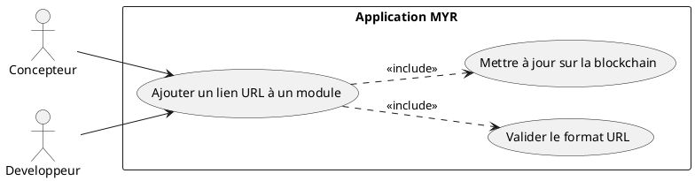
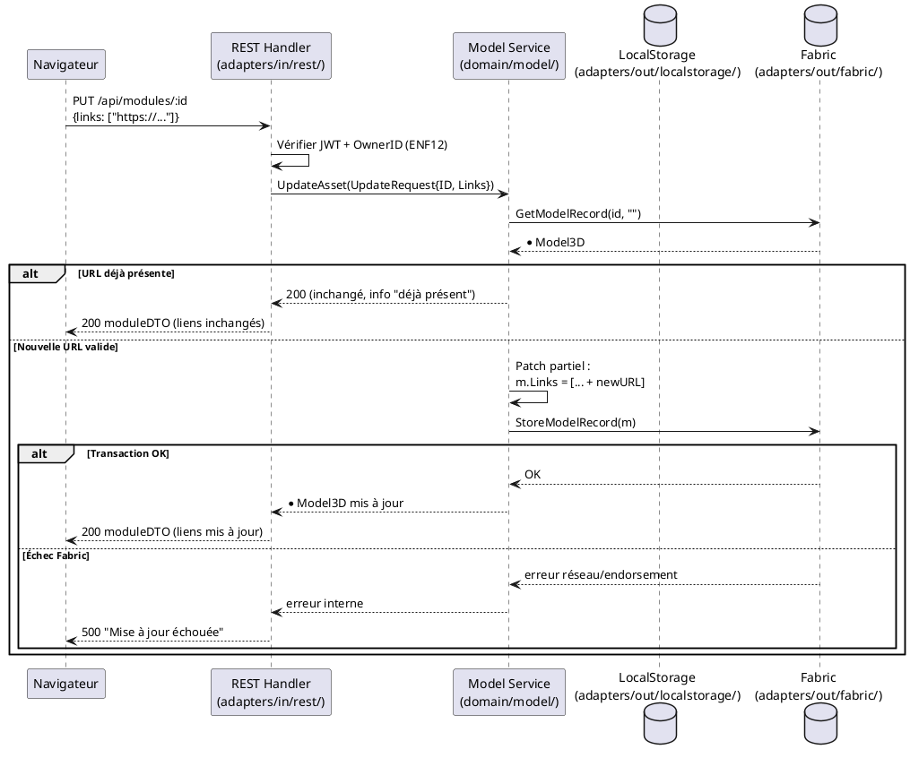

# Ajouter un lien URL d'un Module existant

## Diagramme d'acteurs

## Contexte

Un Module soumis sur la blockchain peut être enrichi par l'ajout d'une ou plusieurs URLs de référence (fiche produit boutique, documentation technique, dépôt GitHub, page fabricant). Ces liens permettent aux consommateurs et concepteurs de localiser le composant physique ou la documentation sans quitter l'application MYR.

L'opération modifie le champ `Links []string` de l'entité `Model3D`. Elle nécessite une transaction blockchain (le Module est déjà soumis). Seul le propriétaire du Module (`OwnerID`) peut modifier ses liens.

**Attention RM19 :** si le Module est en état `submitted`, toute modification de sa structure (y compris l'ajout d'URLs) doit selon les specs déclencher une nouvelle version. Dans l'implémentation actuelle, `UpdateAsset()` modifie directement le record blockchain sans créer de `ModuleVersion` — cet écart est documenté ci-dessous.

## Pré-conditions

- Utilisateur authentifié avec rôle **Concepteur** ou **Développeur**
- Être propriétaire du Module (`OwnerID == userID`)
- Le Module existe sur la blockchain (état `submitted` ou `draft`)
- L'URL fournie est syntaxiquement valide (format HTTP/HTTPS)

## Scénario

**Déclencheur :** L'utilisateur sélectionne un Module et accède à la section **Liens** dans l'Asset UI.

### Flux nominal — URL ajoutée avec succès

1. L'utilisateur clique **Ajouter un lien URL** dans la section Liens
2. Il saisit l'URL de référence dans le champ dédié
3. Le système valide le format (doit commencer par `http://` ou `https://`)
4. Le système appelle `PUT /api/modules/:id` avec `{links: [...existing, newURL]}`
5. Service : `UpdateAsset(UpdateRequest{ID, Links: [...]})` — patch partiel
6. L'adapter blockchain met à jour le record `Model3D` (`StoreModelRecord`)
7. Confirmation affichée — l'URL apparaît dans la liste des liens du Module

### Flux alternatif — Module en état draft

1. Le Module est encore en état `draft` (non soumis)
2. La mise à jour s'effectue de la même façon via `UpdateAsset()`
3. Aucune transaction Fabric distincte n'est créée — la modification sera incluse dans la `ModuleVersion` lors de la soumission (UCMOD06)

### Flux alternatif — URL déjà présente

1. L'URL saisie est identique à une URL déjà dans `m.Links`
2. Le système détecte le doublon et n'ajoute pas d'entrée dupliquée
3. Message informatif : "Ce lien est déjà associé à ce module"

### Flux erreur — Format URL invalide

1. L'utilisateur saisit une chaîne ne respectant pas le format HTTP/HTTPS
2. Validation côté client bloquée — le formulaire indique "URL invalide"
3. Si la validation client est contournée, le serveur retourne `400 Bad Request`
4. Aucune modification persistée

### Flux erreur — Droits insuffisants

1. L'utilisateur n'est pas propriétaire du Module (`OwnerID != userID`)
2. Le serveur retourne `403 Forbidden`
3. Message : "Vous n'êtes pas propriétaire de ce module"

### Flux erreur — Échec transaction blockchain

1. La transaction de mise à jour échoue (réseau Fabric indisponible, endorsement refusé)
2. Message : "Impossible de mettre à jour le module — réessayez"
3. Le Module reste dans son état précédent (ENF30)

## Post-conditions

- L'URL est ajoutée à `Model3D.Links` sur la blockchain
- Le Module reste dans son état (`draft` ou `submitted`) — le statut n'est pas modifié par cet UC
- L'URL est visible immédiatement dans l'Asset UI

## Diagramme de séquence

## Règles métier déclenchées

| Règle | Description | Point d'application |
|-------|-------------|---------------------|
| **RM07** | Validation complète côté serveur avant toute transaction blockchain | Vérification `OwnerID` + format URL |
| **RM19** | Modification d'un module soumis → nouvelle version requise | **Écart E5** : non implémenté — `UpdateAsset()` modifie directement sans fork |

## Exigences non-fonctionnelles

- **ENF12** : Contrôle d'ownership côté serveur obligatoire
- **ENF30** : En cas d'échec Fabric, état local préservé intact

## Notes d'implémentation

**Endpoints REST utilisés :**
- `PUT /api/modules/:id` → patch partiel via `UpdateAsset()` (handlers.go — handleModule, méthode PUT)

**Écart RM19 :** La spécification exige qu'un module `submitted` crée une nouvelle `ModuleVersion` à chaque modification. Dans le code actuel, `UpdateAsset()` (service.go:~401) modifie directement le record blockchain sans vérifier le statut ni créer de version. L'implémentation cible doit :
1. Détecter `m.Status == ModuleSubmitted`
2. Créer une nouvelle `ModuleVersion` (fork) avant d'appliquer la modification
3. Ou refuser la modification et proposer le fork explicitement (UCMOD06)

**Endpoint manquant :** Le routeur actuel ne distingue pas `PUT /api/modules/:id` du `DELETE`. Il faut s'assurer que la branche `PUT` existe dans `handleModule()` pour le patch de `links`.
