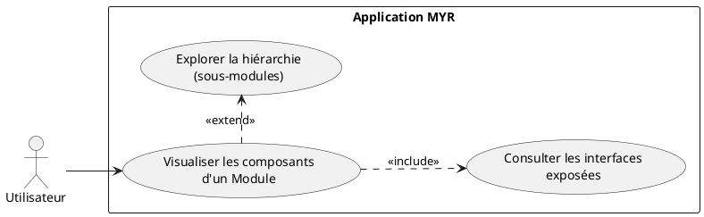
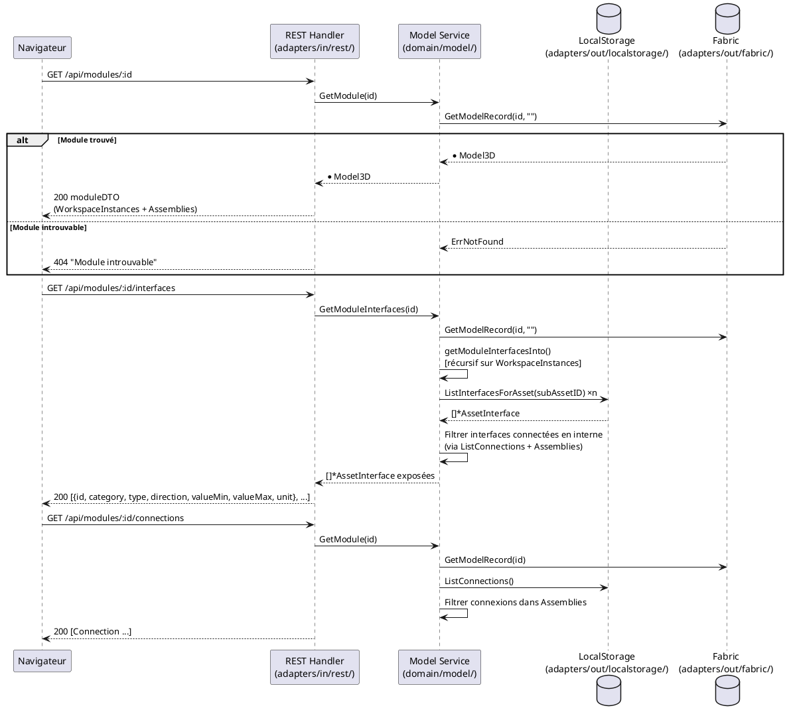

# Visualiser les composants d'un Module

## Diagramme d'acteurs

## Contexte

Un Module est structuré comme un graphe d'instances de Composants et de sous-Modules reliés par des Liaisons. Tout acteur authentifié doit pouvoir inspecter la composition interne d'un Module soumis pour en comprendre la structure, évaluer la réutilisabilité, préparer une commande ou planifier une intégration.

La visualisation est une opération en **lecture seule** qui ne modifie pas l'état du Module. Elle s'appuie sur trois sources de données :
- `Model3D.WorkspaceInstances` : liste des instances d'assets dans l'Atelier
- `Model3D.Assemblies` : IDs des Liaisons internes
- `GetModuleInterfaces()` : calcule les interfaces exposées (non connectées en interne) de façon récursive

## Pré-conditions

- Utilisateur authentifié (tout rôle)
- Un Module sélectionné dans l'Explorer UI ou l'Atelier
- Le Module est accessible (état `submitted` sur la blockchain, ou `draft` si le demandeur est le propriétaire)

## Scénario

**Déclencheur :** L'utilisateur clique sur un Module dans l'Explorer UI → l'Asset UI s'ouvre.

### Flux nominal — Vue composants affichée

1. Le système charge le Module via `GET /api/modules/:id`
2. L'Asset UI affiche :
   - La liste des `WorkspaceInstances` (composants et sous-modules présents dans l'Atelier)
   - Les Liaisons internes (connexions entre instances)
   - Les interfaces exposées du Module (non connectées en interne)
3. Pour chaque instance, le nom et la catégorie de l'asset référencé sont affichés
4. L'utilisateur peut cliquer sur une instance pour accéder à son propre Asset UI

### Flux alternatif — Module contenant des sous-modules (hiérarchie)

1. Le Module contient des instances référençant d'autres Modules (sous-modules)
2. L'utilisateur clique **Explorer** sur une instance de sous-module
3. Le système charge récursivement le sous-module via `GET /api/modules/:subModuleID`
4. Une vue imbriquée s'ouvre affichant la composition du sous-module
5. Un fil d'Ariane permet de remonter à la vue parente

### Flux alternatif — Consultation des interfaces exposées

1. L'utilisateur accède à l'onglet **Interfaces** dans l'Asset UI
2. Le système appelle `GET /api/modules/:id/interfaces`
3. Service : `GetModuleInterfaces(id)` calcule récursivement les interfaces non connectées en interne
4. La liste des interfaces exposées est affichée avec leurs attributs (catégorie, type, direction, valeurs, unité)

### Flux erreur — Module introuvable

1. L'ID du Module ne correspond à aucun record sur la blockchain
2. La page affiche une erreur 404 avec le message "Module introuvable"

### Flux erreur — Module en état draft appartenant à un autre utilisateur

1. Le Module cible est en état `draft` et l'utilisateur n'est pas le propriétaire
2. Le serveur retourne `403 Forbidden`
3. Message : "Ce module n'est pas encore publié"

## Post-conditions

- La composition complète du Module est visible (instances + liaisons + interfaces exposées)
- Aucune modification de l'état du Module
- L'utilisateur peut naviguer vers les assets constitutifs depuis la vue

## Diagramme de séquence

## Règles métier déclenchées

| Règle | Description | Point d'application |
|-------|-------------|---------------------|
| **RM13** | Slot virtuel garanti — affiché comme point de connexion libre | `GetModuleInterfaces()` inclut les slots virtuels |

## Exigences non-fonctionnelles

- **ENF12** : Accès en lecture restreint aux utilisateurs authentifiés (sauf si la configuration réseau autorise les Visiteurs)
- **ENF22** : Rendu compatible Chrome 120+, Firefox 120+, Safari 17+, Edge 120+

## Notes d'implémentation

**Endpoints REST utilisés :**
- `GET /api/modules/:id` → chargement principal (handlers.go:~1202)
- `GET /api/modules/:id/interfaces` → interfaces exposées via `GetModuleInterfaces()` (handlers.go:~1032)
- `GET /api/modules/:id/connections` → liaisons internes (handlers.go:~1047)

**Récursivité `GetModuleInterfaces()` :** La fonction `getModuleInterfacesInto()` (service.go:~640) parcourt récursivement les `WorkspaceInstances` pour calculer les interfaces non connectées en interne. Un cache par `assetID` évite les appels blockchain redondants. Les modules profondément imbriqués peuvent générer de nombreux appels — un mécanisme de profondeur maximale est à envisager pour les cas extrêmes.

**Rendu UI :** La vue Atelier utilise Three.js (bibliothèque JS embarquée dans `ui/static/js/`) pour le rendu 3D des instances et des liaisons. La navigation hiérarchique (drill-down dans les sous-modules) est à implémenter côté frontend via des appels GET récursifs.
