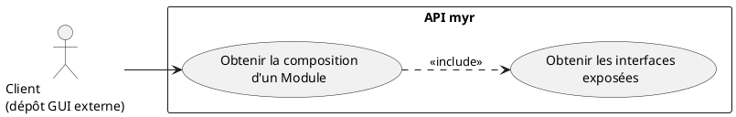
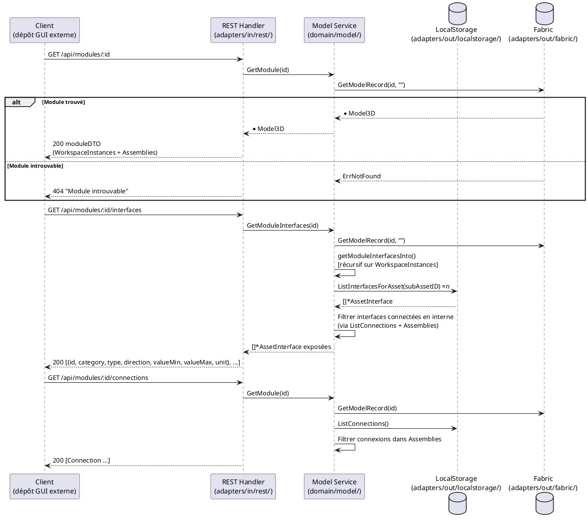

# Visualiser les composants d'un Module

## Diagramme d'acteurs

## Contexte

Un Module est structuré comme un graphe d'instances de Composants et de sous-Modules reliés par des Liaisons. Tout client authentifié doit pouvoir obtenir la composition interne d'un Module soumis pour en comprendre la structure, évaluer la réutilisabilité, préparer une commande ou planifier une intégration.

Cette lecture est une opération en **lecture seule** qui ne modifie pas l'état du Module. Elle s'appuie sur trois sources de données :
- `Model3D.WorkspaceInstances` : liste des instances d'assets composant le module
- `Model3D.Assemblies` : IDs des Liaisons internes
- `GetModuleInterfaces()` : calcule les interfaces exposées (non connectées en interne) de façon récursive

> La présentation (navigation hiérarchique, fil d'Ariane, rendu 3D) relève du dépôt GUI externe — hors périmètre de ce document. Seuls les contrats REST et CLI ci-dessous font partie de `myr` — le CLI n'est pas un citoyen de seconde zone par rapport à l'API.

## Pré-conditions

- Utilisateur authentifié (tout rôle)
- Un Module identifié (ID connu du client)
- Le Module est accessible (état `submitted` sur la blockchain, ou `draft` si le demandeur est le propriétaire)

## Scénario

### Flux nominal — Composition du module retournée

1. Le client appelle `GET /api/modules/:id`
2. La réponse contient :
   - La liste des `WorkspaceInstances` (composants et sous-modules composant le module)
   - Les Liaisons internes (connexions entre instances)
3. Pour chaque instance, le nom et la catégorie de l'asset référencé sont inclus

### Flux alternatif — Module contenant des sous-modules (hiérarchie)

1. Le Module contient des instances référençant d'autres Modules (sous-modules)
2. Le client appelle récursivement `GET /api/modules/:subModuleID` pour obtenir la composition de chaque sous-module

### Flux alternatif — Consultation des interfaces exposées

1. Le client appelle `GET /api/modules/:id/interfaces`
2. Service : `GetModuleInterfaces(id)` calcule récursivement les interfaces non connectées en interne
3. La liste des interfaces exposées est retournée avec leurs attributs (catégorie, type, direction, valeurs, unité)

### Flux erreur — Module introuvable

1. L'ID du Module ne correspond à aucun record sur la blockchain
2. Le système retourne une erreur 404 "Module introuvable"

### Flux erreur — Module en état draft appartenant à un autre utilisateur

1. Le Module cible est en état `draft` et l'utilisateur n'est pas le propriétaire
2. Le serveur retourne `403 Forbidden`

## Post-conditions

- La composition complète du Module est retournée (instances + liaisons + interfaces exposées)
- Aucune modification de l'état du Module

## Diagramme de séquence

## Règles métier déclenchées

| Règle | Description | Point d'application |
|-------|-------------|---------------------|
| **RM13** | Slot virtuel garanti — affiché comme point de connexion libre | `GetModuleInterfaces()` inclut les slots virtuels |

## Exigences non-fonctionnelles

- **ENF12** : Accès en lecture restreint aux utilisateurs authentifiés (sauf si la configuration réseau autorise les Visiteurs)

## Notes d'implémentation

**Endpoints REST utilisés :**
- `GET /api/modules/:id` → chargement principal (handlers.go:~1202)
- `GET /api/modules/:id/interfaces` → interfaces exposées via `GetModuleInterfaces()` (handlers.go:~1032)
- `GET /api/modules/:id/connections` → liaisons internes (handlers.go:~1047)

**Récursivité `GetModuleInterfaces()` :** La fonction `getModuleInterfacesInto()` (service.go:~640) parcourt récursivement les `WorkspaceInstances` pour calculer les interfaces non connectées en interne. Un cache par `assetID` évite les appels blockchain redondants. Les modules profondément imbriqués peuvent générer de nombreux appels — un mécanisme de profondeur maximale est à envisager pour les cas extrêmes.

**Commande CLI équivalente (cible) :** `myr module get <id>` (méthode `GetModule`) est le strict équivalent en lecture seule de `GET /api/modules/:id`. `myr module interfaces <id>` (méthode `GetModuleInterfaces`) couvre `GET /api/modules/:id/interfaces`. Voir `specs/3-Conception/DC_CLI_Model.md` § 5.
