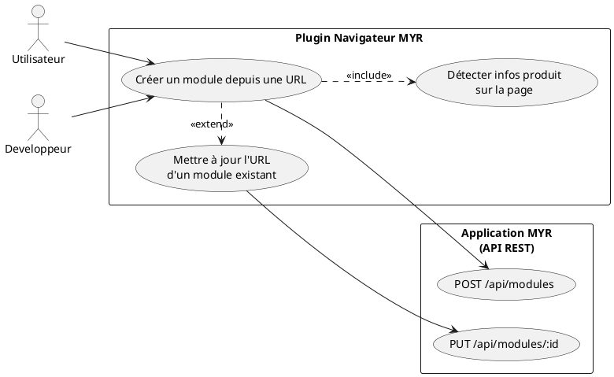
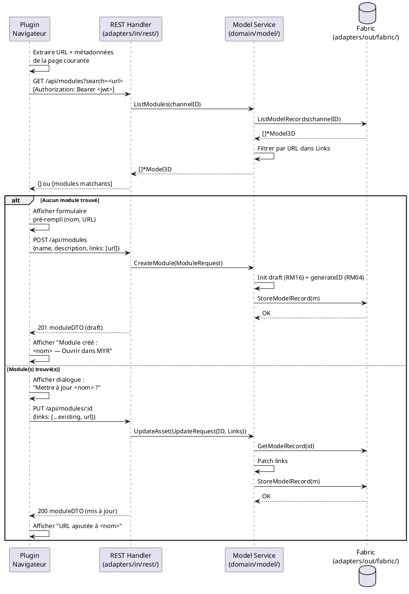

# Ajouter lien URL depuis Plugin Navigateur

## Diagramme d'acteurs

## Contexte

Un plugin navigateur (extension Chrome/Firefox) permet de capturer une URL de page produit (boutique en ligne, fiche fabricant, catalogue distributeur) et de l'associer directement à un Module MYR sans passer par l'interface principale. L'utilisateur navigue sur une page produit, active le plugin, et MYR crée ou met à jour le Module correspondant.

Ce cas d'usage est une variante de UCMOD03 déclenchée depuis un contexte externe (navigateur) au lieu de l'interface MYR. Le plugin interagit avec la même API REST.

**Statut d'implémentation :** Aucun endpoint dédié au plugin n'existe dans le code actuel. Le plugin appellerait les endpoints standards `POST /api/modules` et `PUT /api/modules/:id` déjà disponibles.

## Pré-conditions

- Utilisateur authentifié sur MYR (token JWT valide — le plugin doit l'avoir stocké)
- Plugin navigateur MYR installé, activé et configuré avec l'URL du serveur MYR
- L'utilisateur est sur une page produit dans son navigateur
- Connexion réseau active vers le serveur MYR

## Scénario

**Déclencheur :** L'utilisateur clique sur l'icône du plugin MYR dans sa barre de navigation.

### Flux nominal — Nouveau module créé depuis URL

1. Le plugin s'active et extrait depuis la page courante :
   - L'URL de la page
   - Le titre de la page (candidat pour le nom du Module)
   - La description meta si disponible
2. Le plugin interroge l'API : `GET /api/modules?search=<url>` pour vérifier l'existence d'un Module avec cette URL dans ses `Links`
3. Aucun Module trouvé → le plugin affiche un formulaire pré-rempli (nom, description, URL)
4. L'utilisateur confirme
5. Le plugin appelle `POST /api/modules` avec `{name, description, links: [currentURL]}`
6. Un nouveau Module est créé en état **draft** (RM16)
7. Le plugin affiche une confirmation avec un lien vers l'Asset UI du nouveau Module

### Flux nominal — Module existant mis à jour

1. Le plugin détecte un Module existant ayant la même URL dans ses `Links` (ou correspondance par nom)
2. Le plugin propose : "Mettre à jour l'URL du module `<nom>` ?"
3. L'utilisateur confirme
4. Le plugin appelle `PUT /api/modules/:id` avec `{links: [...existing, currentURL]}`
5. Le Module est mis à jour — l'URL est ajoutée à `Model3D.Links` (voir UCMOD03)
6. Confirmation affichée

### Flux alternatif — Correspondance ambiguë (plusieurs modules candidats)

1. La recherche retourne plusieurs Modules potentiels
2. Le plugin affiche la liste et demande à l'utilisateur de choisir le Module cible
3. L'utilisateur sélectionne le Module → flux "Module existant mis à jour"

### Flux erreur — Token JWT expiré

1. Le plugin tente un appel API mais le token est expiré
2. Réponse `401 Unauthorized` du serveur
3. Le plugin affiche : "Session expirée — reconnectez-vous à MYR"
4. Aucune action effectuée

### Flux erreur — Serveur MYR inaccessible

1. Le plugin ne peut pas joindre le serveur MYR (réseau, URL mal configurée)
2. Timeout ou erreur réseau
3. Message : "Impossible de joindre MYR — vérifiez votre connexion et la configuration du plugin"

## Post-conditions

- Le Module est créé (état `draft`) ou mis à jour avec la nouvelle URL dans ses `Links`
- L'URL est accessible depuis l'Asset UI du Module dans MYR

## Diagramme de séquence

## Règles métier déclenchées

| Règle | Description | Point d'application |
|-------|-------------|---------------------|
| **RM04** | UUID généré côté serveur | `generateID()` dans `CreateModule()` |
| **RM16** | Module créé en état `draft` | `Status: ModuleDraft` dans `CreateModule()` |
| **RM07** | Validation serveur avant toute soumission blockchain | Vérification JWT + ownership dans les handlers |

## Exigences non-fonctionnelles

- **ENF12** : Le JWT doit être transmis dans l'en-tête `Authorization: Bearer` — authentification serveur obligatoire
- **ENF28** : Si le module est `submitted`, l'ajout d'URL suit la contrainte RM19 (fork — voir UCMOD03)

## Notes d'implémentation

**Statut :** Use case **non implémenté** — aucun endpoint dédié au plugin. L'architecture cible réutilise les endpoints existants :
- `GET /api/modules` (avec paramètre `search` à ajouter pour filtrer par URL dans `Links`)
- `POST /api/modules` → déjà disponible
- `PUT /api/modules/:id` → déjà disponible (patch `links`)

**Paramètre `search` :** Le handler `handleModules` (handlers.go:~965) ne filtre pas encore par URL dans `Links`. Un paramètre query `?search=` ou `?url=` doit être ajouté côté backend pour la détection de doublon.

**Stockage JWT dans le plugin :** Le plugin doit stocker le JWT de façon sécurisée (storage chiffré de l'extension). La gestion de la rotation du token (refresh) est hors périmètre de cet UC.

**Questions ouvertes pour le PO :**
- Le plugin doit-il prendre en charge la création de Modules en état `submitted` directement, ou uniquement en `draft` ?
- Quels navigateurs sont ciblés (Chrome uniquement, ou Firefox aussi) ?
- La détection du produit sur la page est-elle générique (titre/URL) ou spécifique à certaines boutiques ?
