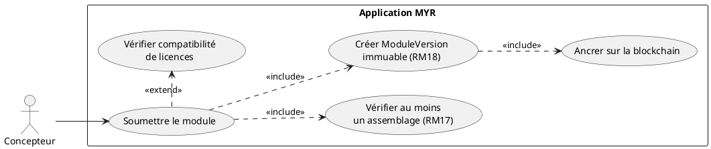
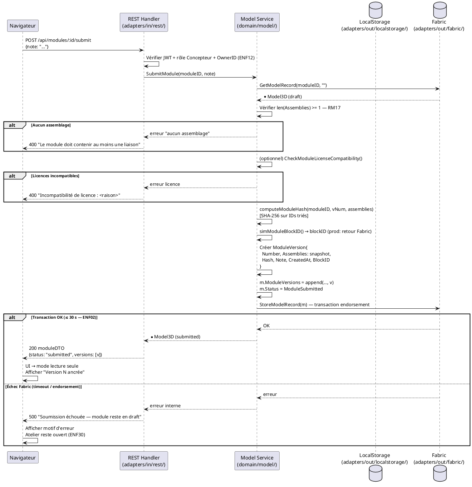

# Soumettre un module à la blockchain

## Diagramme d'acteurs



## Contexte

La soumission est l'étape **irréversible** qui fait passer un Module de l'état `draft` (local, modifiable) à l'état `submitted` (ancré blockchain, visible sur le réseau). Cette transition crée une `ModuleVersion` immuable horodatée : snapshot figé de l'assemblage avec hash SHA-256 calculé sur les IDs de connexions triés.

Une fois soumis, le Module est visible sur le réseau par tous les acteurs autorisés. Il ne peut plus être modifié directement — toute évolution nécessite la création d'une **nouvelle version** (fork — RM19). C'est la règle métier la plus critique du domaine Module.

**ENF02 :** La transaction Fabric doit se terminer en ≤ 30 secondes.
**ENF28 :** L'immuabilité blockchain est garantie — la `ModuleVersion` ne peut pas être supprimée.

## Pré-conditions

- Utilisateur authentifié avec rôle **Concepteur** (`contributor`)
- Être propriétaire du Module (`OwnerID == userID`)
- Le Module est en état **draft** (`Status == ModuleDraft`)
- Le Module contient **au moins un assemblage** (`len(m.Assemblies) >= 1`) — RM17
- La blockchain Fabric est accessible (nœuds disponibles)

## Scénario

**Déclencheur :** Le Concepteur clique **Soumettre** dans la vue Atelier du Module.

### Flux nominal — Soumission réussie

1. Le Concepteur clique **Soumettre** dans l'Asset UI / Atelier
2. Le système appelle `POST /api/modules/:id/submit` avec `{note: "..."}`
3. Service : `SubmitModule(moduleID, note)` :
   a. Vérifie `len(m.Assemblies) >= 1` (RM17) — rejet immédiat si vide
   b. Calcule le hash SHA-256 : `computeModuleHash(m.ID, vNum, m.Assemblies)` — tri déterministe des IDs
   c. Génère un `blockID` simulé (production : retour Fabric)
   d. Crée la `ModuleVersion` : `{Number, Assemblies: snapshot, Hash, Note, CreatedAt, BlockID}`
   e. Ajoute la version à `m.ModuleVersions`
   f. Met à jour `m.Status = ModuleSubmitted`
   g. Appelle `blockchain.StoreModelRecord(m)` — transaction Fabric
4. La transaction Fabric est soumise (endorsement, orderer, commit) — ≤ 30 s (ENF02)
5. Confirmation affichée : "Module soumis — Version N ancrée"
6. L'UI passe en mode lecture seule pour ce Module

### Flux alternatif — Module avec composants dérivés (licences parentales)

1. Le Module contient des Composants dérivés d'assets avec `ParentID` et `LicenseID`
2. Avant la soumission, le système vérifie la compatibilité de licence : `CheckModuleLicenseCompatibility(componentLicenseIDs, m.LicenseID)`
3. Toutes les licences compatibles → soumission se poursuit normalement (flux nominal à partir de l'étape 3b)
4. La `ModuleVersion` inclut la liste des dépendances de licences vérifiées

### Flux alternatif — Fork d'un module déjà soumis (RM19 — comportement cible)

> **Note RM19 :** Ce flux décrit le comportement **attendu par les specs**. Il n'est **pas implémenté** dans le code actuel (écart E5). Dans le code, un module `submitted` reste modifiable directement.

1. Le Concepteur tente de modifier un Module en état `submitted` (ajout d'assemblage, modification de liens…)
2. Le système détecte `m.Status == ModuleSubmitted` — **modification directe refusée**
3. Message : "Ce module est publié. Créez une nouvelle version pour le modifier."
4. Le Concepteur confirme la création d'une nouvelle version
5. Le système crée un nouveau `Model3D` en état `draft` avec les mêmes `WorkspaceInstances`, `Assemblies` et métadonnées (`ParentID` = ID du module original)
6. Le Concepteur modifie le fork dans l'Atelier
7. Le fork peut être soumis à son tour → nouvelle `ModuleVersion` indépendante

### Flux erreur — Aucun assemblage (RM17)

1. `len(m.Assemblies) == 0` détecté dans `SubmitModule()`
2. Réponse : `400 Bad Request`
3. Message : "Le module doit contenir au moins une liaison pour être soumis"
4. Le Module reste en état `draft` — l'Atelier reste ouvert pour ajout de liaisons

### Flux erreur — Incompatibilité de licences

1. `CheckModuleLicenseCompatibility()` retourne `Compatible: false`
2. Message détaillé : "Incompatibilité de licence entre `<composantA>` et la licence du module : `<raison>`"
3. La soumission est annulée — le Module reste en état `draft`
4. Le Concepteur doit corriger les licences avant de soumettre

### Flux erreur — Échec transaction Fabric (ENF30)

1. La transaction Fabric échoue (timeout > 30 s, endorsement refusé, orderer indisponible)
2. Le service retourne une erreur
3. Message : "Soumission échouée — `<motif>` — le module reste en état draft"
4. **Aucune donnée perdue** : le Module reste en état `draft` avec tous ses assemblages (ENF30)
5. Les `ModuleVersions` partiellement créées ne sont **pas** persistées (atomicité de `StoreModelRecord`)

## Post-conditions

- La `ModuleVersion` N est enregistrée de façon immuable sur la blockchain (ENF28)
- `m.Status == ModuleSubmitted`
- Le Module est visible sur le réseau pour les acteurs autorisés
- L'Atelier du Module passe en mode lecture seule (RM19 — implémentation cible)
- Toute modification ultérieure nécessite un fork (RM19)

## Diagramme de séquence



## Règles métier déclenchées

| Règle | Description | Point d'application |
|-------|-------------|---------------------|
| **RM07** | Validation complète côté serveur avant toute transaction blockchain | Vérification ownership + RM17 avant `StoreModelRecord` |
| **RM17** | Au moins une liaison requise pour soumettre | `len(m.Assemblies) == 0` → rejet dans `SubmitModule()` |
| **RM18** | `ModuleVersion` immuable horodatée créée à la soumission | `ModuleVersion{..., CreatedAt: time.Now(), BlockID}` |
| **RM19** | Module soumis → toute modification crée une nouvelle version (fork) | **Écart E5 — NON IMPLÉMENTÉ** dans le code actuel |

## Exigences non-fonctionnelles

- **ENF02** : Transaction Fabric ≤ 30 secondes — timeout à configurer dans l'adapter Fabric
- **ENF12** : Rôle Concepteur vérifié + ownership (`OwnerID == userID`) côté serveur
- **ENF28** : Immuabilité de la `ModuleVersion` — aucune opération de suppression (ErrNotSupported)
- **ENF30** : Résilience — état `draft` conservé intact en cas d'échec Fabric
- **ENF31** : Validation complète des données avant toute soumission blockchain

## Notes d'implémentation

**Endpoints REST utilisés :**
- `POST /api/modules/:id/submit` → `SubmitModule()` (handlers.go:~1181)

**Hash du module :** `computeModuleHash()` (service.go:~730) calcule `SHA-256` sur la chaîne `"<moduleID>|v<n>|<connID1>,<connID2>,..."` avec les IDs triés. Ce hash est déterministe et permet la vérification d'intégrité ultérieure.

**Écart E5 — RM19 (CRITIQUE) :** `AddAssemblyToModule()` et `AddAssetToWorkspace()` (service.go:~461, ~522) n'ont aucune garde sur `Status != ModuleSubmitted`. Un module soumis reste modifiable dans le code actuel. L'implémentation cible doit ajouter au début de ces fonctions :
```go
if m.Status == ModuleSubmitted {
    return fmt.Errorf("module soumis : créer une nouvelle version (fork) pour modifier")
}
```
Et implémenter une fonction `ForkModule(moduleID string) (*Model3D, error)` qui clone le module en état `draft`.

**BlockID en production :** `simModuleBlockID()` génère un ID aléatoire simulé. En production, le `blockID` doit être le numéro de bloc Fabric retourné par `StoreModelRecord()` — l'adapter Fabric doit être adapté pour retourner cette information.
