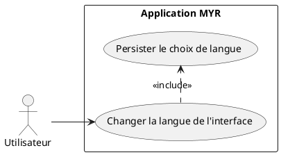
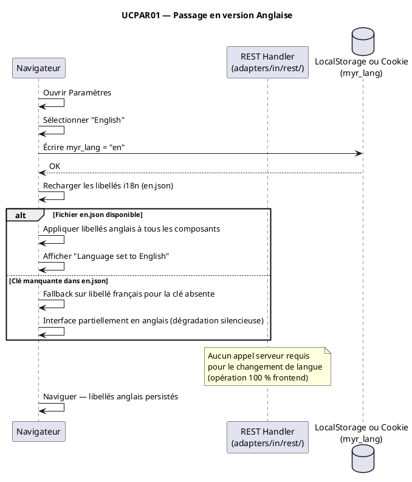

# Passage en version Anglaise

## Diagramme d'acteurs

## Contexte

L'interface MYR est développée initialement en français. Pour permettre une adoption internationale, elle doit être disponible en anglais. Ce use case couvre le passage de l'interface en version anglaise, langue la plus demandée pour les échanges internationaux dans les domaines industriels et de la conception 3D.

Aucun mécanisme i18n n'est actuellement implémenté, ni côté serveur (Go) ni côté frontend (Vanilla JS). Ce use case décrit l'architecture cible à mettre en place.

L'acteur concerné est tout utilisateur connecté, quel que soit son rôle (D10 — tous rôles sauf Visiteur).

## Pré-conditions

- L'application MYR est ouverte dans le navigateur
- L'utilisateur est sur n'importe quelle page de la SPA
- L'interface est actuellement affichée dans une langue (français par défaut)

## Scénario

**Étape initiale :** L'utilisateur accède aux paramètres de l'application

### Flux nominal — Basculement en anglais

1. L'utilisateur ouvre le panneau Paramètres (accessible depuis le menu ou un bouton dédié)
2. L'utilisateur sélectionne "English" dans le sélecteur de langue
3. La SPA recharge les libellés depuis le catalogue i18n `en`
4. L'intégralité de l'interface bascule en anglais (libellés, messages d'erreur, infobulles)
5. La documentation liée (UCDOC01–03) est servie dans la version anglaise si disponible
6. Le choix est persisté en localStorage (ou cookie) pour les visites suivantes
7. L'interface affiche un message de confirmation bref : "Language set to English"

### Flux alternatif — Préférence navigateur détectée au premier chargement

1. Au premier accès sans préférence enregistrée, la SPA lit `navigator.language`
2. Si la langue détectée est `en` ou `en-*`, l'interface s'affiche directement en anglais
3. L'utilisateur peut toujours modifier manuellement le choix via les paramètres

### Flux erreur — Catalogue i18n manquant ou incomplet

1. La SPA tente de charger le fichier de traduction `en.json`
2. Le fichier est absent ou une clé est manquante
3. La clé manquante affiche le libellé français par défaut (fallback)
4. Aucune erreur bloquante n'est remontée à l'utilisateur — dégradation silencieuse

## Post-conditions

- L'interface est intégralement affichée en anglais
- Le choix est mémorisé pour les sessions suivantes (localStorage ou cookie `myr_lang`)
- Toute nouvelle page chargée dans la SPA utilise les libellés anglais

## Diagramme de séquence

## Règles métier déclenchées

- **EF50** : L'interface doit être disponible en version anglaise
- Pas de règle métier blockchain — opération purement frontend

## Exigences non-fonctionnelles

- Le basculement de langue doit être instantané (< 100 ms) — aucun rechargement de page complet
- Le catalogue i18n doit couvrir 100 % des libellés visibles (messages d'erreur inclus)
- La persistance via localStorage fonctionne sans session active (applicable même à l'écran de connexion)

## Notes d'implémentation

**État actuel :** Non implémenté. Aucun mécanisme i18n côté serveur ou frontend.

**Architecture cible :**
- Côté frontend (`ui/static/js/`) : ajouter un module `i18n.js` qui expose `t(key)` — charge `en.json` / `zh.json` depuis `ui/static/locales/`
- Le catalogue de traduction est embarqué dans le binaire via `ui/embed.go`
- La langue par défaut est `fr` ; l'utilisateur peut basculer via les paramètres (persisté en `localStorage`)
- En mode `MYR_DEV=1`, les fichiers `locales/*.json` sont servis depuis le disque (hot-reload possible)

**Aucun endpoint REST n'est nécessaire** pour le changement de langue — la préférence est purement côté client. Si une préférence utilisateur côté serveur est souhaitée à terme, elle pourrait être stockée via `/api/auth/me` (PATCH profil).
