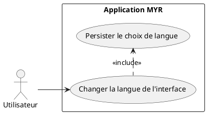
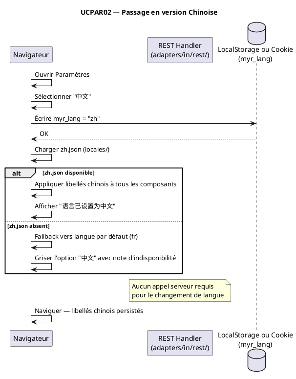

# Passage en version Chinoise

## Diagramme d'acteurs

## Contexte

Ce use case étend UCPAR01 (passage en anglais) à la langue chinoise (Mandarin simplifié). Il s'adresse à une adoption potentielle du système MYR sur des marchés asiatiques, notamment dans les secteurs de la fabrication et de la conception industrielle.

La priorité de ce use case est faible (importance = 1) comparé à UCPAR01 (importance = 20). Il partage exactement la même architecture i18n que UCPAR01 — seul le catalogue de traduction diffère.

Aucun mécanisme i18n n'est actuellement implémenté. Ce use case décrit le comportement cible une fois l'infrastructure i18n de UCPAR01 en place.

## Pré-conditions

- L'application MYR est ouverte dans le navigateur
- L'infrastructure i18n de UCPAR01 est en place (module `i18n.js`, support des catalogues)
- Un catalogue `zh.json` est disponible dans `ui/static/locales/`

## Scénario

**Étape initiale :** L'utilisateur accède aux paramètres de l'application

### Flux nominal — Basculement en chinois

1. L'utilisateur ouvre le panneau Paramètres
2. L'utilisateur sélectionne "中文" dans le sélecteur de langue
3. La SPA charge le catalogue i18n `zh`
4. L'intégralité de l'interface bascule en chinois simplifié (libellés, messages d'erreur, infobulles)
5. Le choix est persisté en localStorage (clé `myr_lang = "zh"`)
6. L'interface affiche un message de confirmation : "语言已设置为中文"

### Flux alternatif — Préférence navigateur détectée au premier chargement

1. Au premier accès sans préférence enregistrée, la SPA lit `navigator.language`
2. Si la langue détectée est `zh`, `zh-CN` ou `zh-Hans`, l'interface s'affiche en chinois
3. L'utilisateur peut modifier manuellement le choix via les paramètres

### Flux erreur — Catalogue zh.json manquant

1. La SPA tente de charger `zh.json`
2. Le fichier est absent
3. Fallback automatique vers le français (langue par défaut)
4. Le sélecteur de langue reste visible mais "中文" est grisé ou affiche une note d'indisponibilité

## Post-conditions

- L'interface est intégralement affichée en chinois simplifié
- Le choix est mémorisé pour les sessions suivantes (`myr_lang = "zh"`)

## Diagramme de séquence

## Règles métier déclenchées

- **EF51** : L'interface doit être disponible en version chinoise
- Pas de règle métier blockchain — opération purement frontend

## Exigences non-fonctionnelles

- Même exigences de performance que UCPAR01 (basculement < 100 ms)
- Le rendu des caractères CJK doit être testé sur les navigateurs cibles (ENF22 : Chrome 120+, Firefox 120+, Safari 17+, Edge 120+)
- La police utilisée doit supporter les caractères CJK — vérifier la directive `font-src` dans la CSP de `server.go`

## Notes d'implémentation

**État actuel :** Non implémenté. Dépend de UCPAR01.

**Dépendance :** Ce use case est un sous-ensemble de l'infrastructure i18n de UCPAR01. Il ne nécessite aucune architecture supplémentaire — uniquement la création du catalogue `zh.json`.

**Attention CSP :** La Content Security Policy définie dans `adapters/in/rest/server.go` autorise `https://fonts.googleapis.com` et `https://fonts.gstatic.com`. Si une police CJK Google Fonts est ajoutée, cette directive est déjà compatible.

**Priorité d'implémentation :** Could have (MoSCoW). À traiter après UCPAR01 (Should have).
