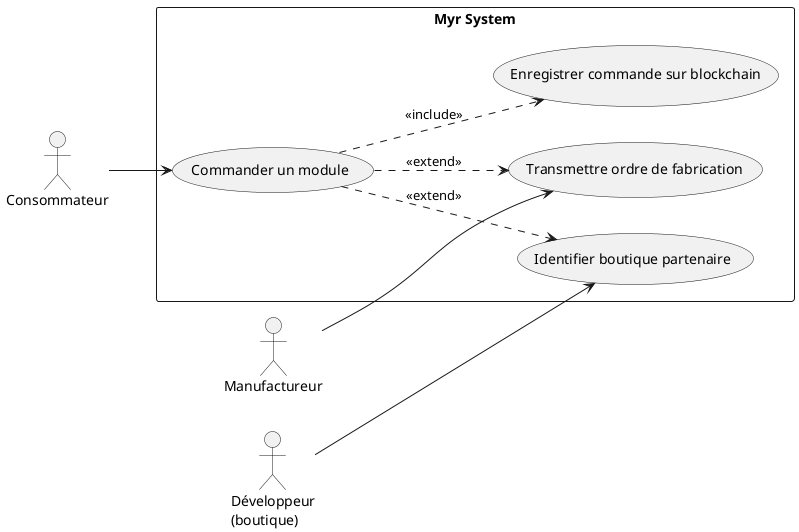
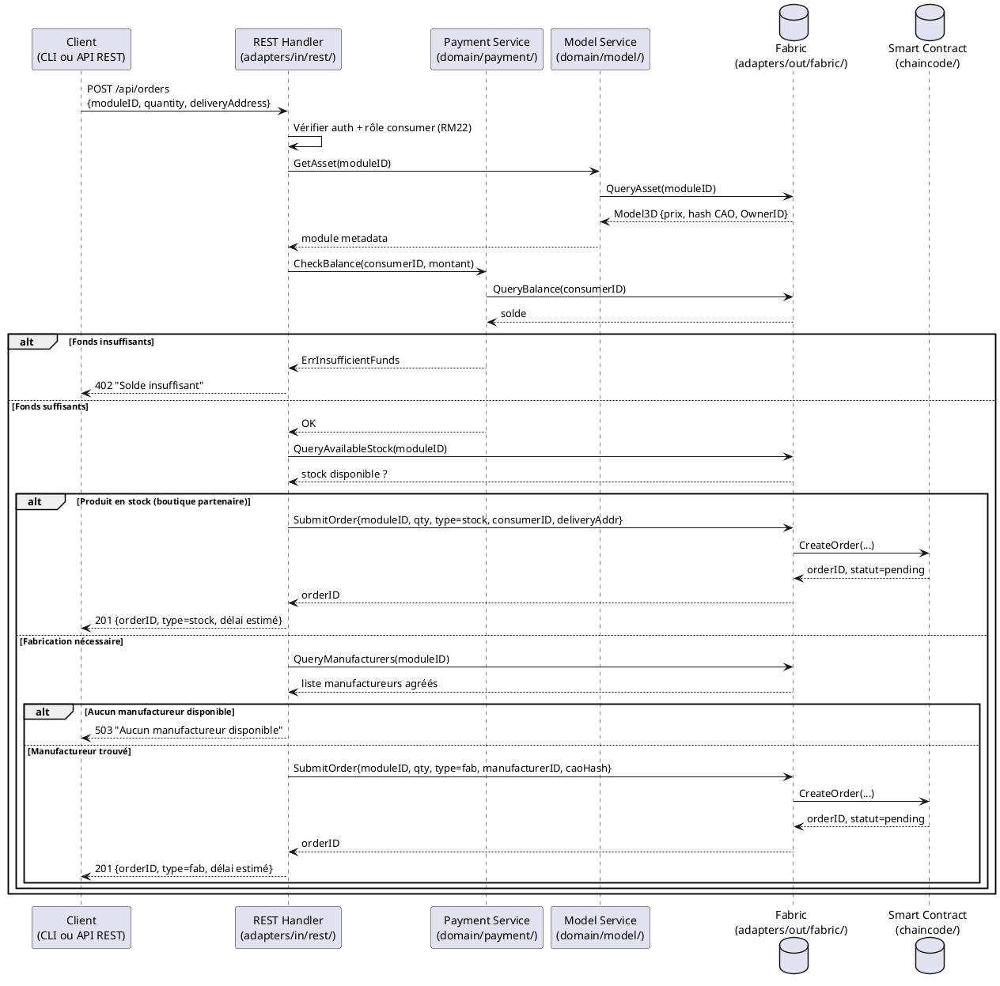

# Commander un Module complet

## Diagramme d'acteurs

## Contexte

Un consommateur souhaite acquérir physiquement un module disponible sur le réseau. Le système doit identifier si le produit est en stock chez une boutique partenaire ou s'il doit être fabriqué à la demande par un manufactureur agréé. Dans les deux cas, la commande est enregistrée sur la blockchain et déclenche ultérieurement la distribution des commissions (RM23, via UCAUT01).

Ce use case est le point d'entrée du cycle commercial — il crée la commande, mais c'est UCAUT01 (livraison confirmée) qui déclenche les paiements.

## Pré-conditions

- Le consommateur est authentifié avec le rôle `consumer`
- Le module est soumis sur la blockchain (`Status = submitted`) avec un prix défini
- Une adresse de livraison est renseignée dans le profil du consommateur
- Au moins une boutique partenaire ou un manufactureur agréé est disponible sur le réseau

## Scénario

**Étape initiale :** `POST /api/orders` est appelée (ou l'équivalent CLI `myr order create`) avec l'identifiant du module, la quantité et l'adresse de livraison

### Flux nominal A — Produit disponible en boutique

1. Le système interroge la blockchain pour obtenir les métadonnées du module (prix, disponibilité)
2. Le Payment Service vérifie que le consommateur dispose des fonds suffisants
3. Le système identifie une boutique partenaire disposant du module en stock
4. La commande est créée et soumise sur la blockchain (statut `pending`)
5. La boutique reçoit l'ordre de préparation
6. Le consommateur reçoit une confirmation avec délai de livraison estimé

### Flux nominal B — Fabrication nécessaire (aucun stock disponible)

1. Le système interroge la blockchain pour obtenir les métadonnées et le fichier CAO du module
2. Le Payment Service vérifie que le consommateur dispose des fonds suffisants
3. Aucune boutique partenaire ne dispose du produit en stock
4. Le système identifie un manufactureur agréé disponible sur le réseau
5. La commande de fabrication est créée et soumise sur la blockchain (statut `pending`)
6. Le fichier CAO est transmis au manufactureur via la blockchain
7. Le consommateur reçoit une confirmation avec délai de fabrication estimé

### Flux alternatif — Quantité > 1 avec capacité partielle

1. Le consommateur saisit une quantité > 1
2. La capacité d'un seul manufactureur est insuffisante
3. Le système propose une répartition entre plusieurs manufactureurs
4. Le consommateur accepte la répartition
5. Les ordres de fabrication sont soumis en parallèle sur la blockchain

### Flux erreur A — Fonds insuffisants

1. Le Payment Service retourne une erreur de solde insuffisant
2. Message affiché : "Solde insuffisant pour effectuer cette commande"
3. La commande n'est pas créée

### Flux erreur B — Aucun manufactureur disponible

1. Aucun manufactureur agréé n'est disponible sur le réseau
2. Message affiché : "Aucun manufactureur disponible — vous pouvez rejoindre la liste d'attente"
3. Le consommateur est placé en liste d'attente (enregistré localement)

### Flux erreur C — Échec de soumission blockchain

1. La transaction blockchain échoue (endorsement ou commit error)
2. Le draft de commande local est conservé intact
3. Message affiché : "Erreur réseau blockchain — réessayez ultérieurement"

## Post-conditions

- La commande est enregistrée de manière immuable sur la blockchain avec statut `pending`
- Le consommateur reçoit une confirmation (numéro de commande, délai estimé)
- Le manufactureur ou la boutique a reçu l'ordre de traitement
- Les fonds sont réservés (non distribués — la distribution intervient à la livraison via UCAUT01)

## Diagramme de séquence

## Règles métier déclenchées

| Règle | Description | Détail |
|-------|-------------|--------|
| RM22 | Contrôle d'accès par rôle | Seul le rôle `consumer` peut passer une commande |
| RM07 | Validation avant soumission blockchain | Fonds, disponibilité et adresse vérifiés côté serveur avant toute transaction |
| RM23 | Commissions distribuées à la livraison | Les fonds réservés sont distribués par smart contract lors de la livraison (UCAUT01) |

## Exigences non-fonctionnelles

| ENF | Description |
|-----|-------------|
| ENF01 | Temps de réponse ≤ 2 s pour la création de commande |
| ENF30 | En cas d'échec blockchain, l'état local est conservé intact |
| ENF12 | Contrôle du rôle consommateur vérifié côté serveur |

## Notes d'implémentation

- **Non implémenté** : Aucune route `/api/orders` n'existe à ce jour dans `adapters/in/rest/`
- **À créer** : `adapters/in/rest/handlers_payment.go` avec `POST /api/orders`
- **À créer** : service `Order` dans `domain/payment/` — l'entité `Payment` existante est insuffisante pour modéliser une commande (statut, type, destinataire manufactureur, adresse livraison)
- Le Payment Service actuel (`Pay(from, to, modelID, amount)`) ne gère pas la réservation de fonds — la distribution est distincte
- Le smart contract chaincode ne contient actuellement aucune logique de commande — à créer dans `chaincode/`
- L'identification des boutiques partenaires et manufactureurs suppose un registre sur la blockchain non encore défini
- **Parité CLI/REST :** conformément au principe de parité (CLAUDE.md), une commande de ce type devrait être reproductible en CLI pour le compte d'un consommateur. Le volet paiement recoupe `domain/payment.Pay(from, to, modelID, amount)`, déjà exposé via `myr payment pay <from> <to> <modelID> <amount>` — mais comme noté ci-dessus, l'entité `Order` (statut, type, manufacturier/boutique, adresse de livraison) n'existe pas encore : une commande CLI complète (`myr order create ...`) ne pourra être ajoutée qu'une fois ce domaine conçu, au même titre que la route REST manquante.
