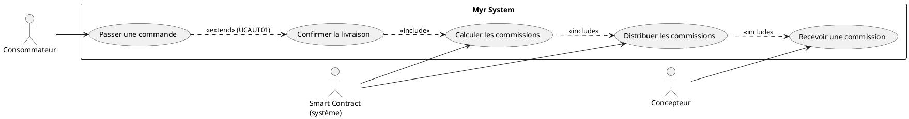
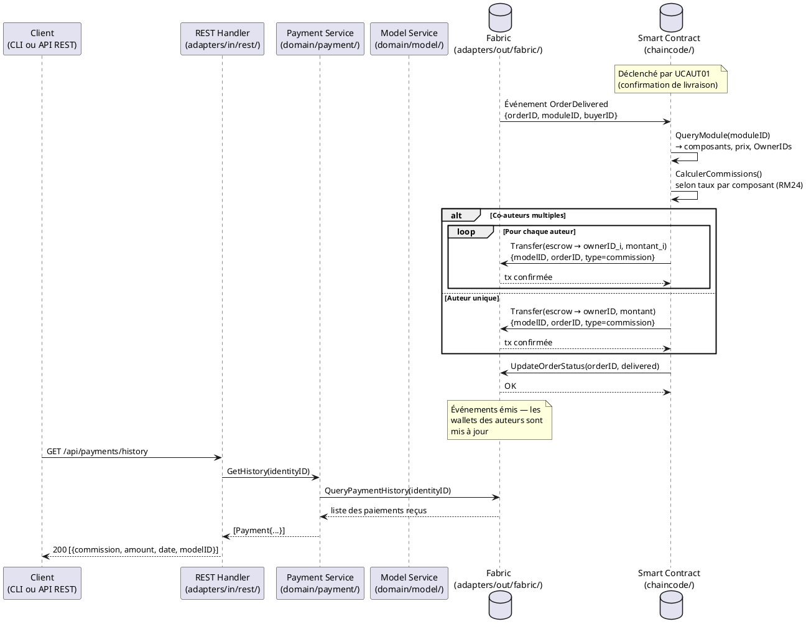

# Recevoir une commission sur l'utilisation d'un Module

## Diagramme d'acteurs

## Contexte

Lorsqu'un module est commandé et livré, le smart contract Fabric calcule automatiquement les commissions dues à chaque auteur impliqué dans la chaîne de propriété du module (composants constitutifs, dérivations). La distribution est atomique avec la confirmation de livraison — RM23 impose que les commissions soient distribuées **par** le smart contract, sans intervention humaine.

Ce use case est déclenché par UCAUT01 (livraison confirmée) et non directement par le consommateur. Le concepteur est un acteur passif : il reçoit, il ne demande pas.

## Pré-conditions

- Une commande est passée (UCPI01) et enregistrée sur la blockchain avec statut `pending`
- Le module est soumis (`Status = submitted`) avec un prix et des commissions définies sur ses composants
- Le manufactureur ou la boutique a confirmé la livraison (déclencheur externe — UCAUT01)
- Chaque auteur concerné dispose d'un wallet actif sur le réseau

## Scénario

**Étape initiale :** Le manufactureur ou la boutique confirme la livraison sur la blockchain (voir UCAUT01)

### Flux nominal — Commission distribuée à un auteur unique

1. Le smart contract reçoit l'événement de livraison confirmée (`OrderDelivered`)
2. Il lit les métadonnées du module sur la blockchain (OwnerID, prix, liste des composants)
3. Il calcule la commission due à l'auteur unique selon le taux défini sur le module
4. Une transaction de paiement individuelle est soumise : `from=escrow, to=ownerID, amount=commission, modelID`
5. La commission est créditée sur le wallet de l'auteur
6. L'auteur reçoit une notification de commission reçue (événement blockchain)

### Flux alternatif — Répartition entre plusieurs co-auteurs (RM24)

1. Le smart contract analyse les composants constitutifs du module
2. Pour chaque composant, il lit le `OwnerID` et le taux de commission défini
3. Il calcule la part proportionnelle de chaque auteur selon la contribution de chaque composant au prix total
4. Une transaction de paiement individuelle est créée par auteur (`for each ownerID : Transfer(escrow → ownerID, montant)`)
5. Les transactions sont soumises de façon atomique dans un seul bloc Fabric
6. Chaque co-auteur reçoit sa part et est notifié individuellement
7. L'historique complet des distributions est enregistré sur la blockchain

### Flux erreur A — Wallet d'un auteur inexistant ou inactif

1. Le smart contract détecte que le wallet d'un auteur n'est plus actif
2. La commission concernée est mise en séquestre (`escrow`) avec un identifiant de bénéficiaire
3. L'auteur peut réclamer sa commission ultérieurement après réactivation de son wallet
4. La livraison est confirmée malgré ce cas — les autres commissions sont distribuées normalement

### Flux erreur B — Échec blockchain lors de la distribution

1. Une transaction de commission échoue (endorsement refusé)
2. Toutes les transactions de la distribution sont annulées (atomicité garantie par Fabric)
3. La commande reste en statut `pending` — la livraison n'est pas confirmée
4. Une alerte est émise vers l'administrateur du réseau

## Post-conditions

- Chaque auteur concerné a reçu sa commission sur son wallet blockchain
- Chaque transaction de commission est enregistrée individuellement et immuablement sur la blockchain
- La commande passe au statut `delivered`
- L'historique des commissions est consultable par chaque auteur via son historique de paiements

## Diagramme de séquence

## Règles métier déclenchées

| Règle | Description | Détail |
|-------|-------------|--------|
| RM23 | Commissions distribuées automatiquement à la livraison | Le smart contract, pas le serveur, exécute la distribution |
| RM24 | Répartition proportionnelle par auteur | Calculée à partir du taux défini sur chaque composant constitutif |
| RM07 | Transactions Fabric immuables | Distribution atomique — tout ou rien |

## Exigences non-fonctionnelles

| ENF | Description |
|-----|-------------|
| ENF02 | Transactions blockchain confirmées en ≤ 5 s sous charge normale |
| ENF30 | En cas d'échec blockchain, aucune commission partielle — rollback complet |

## Notes d'implémentation

- **Non implémenté** : Le smart contract chaincode ne contient aucune logique de commission — seule l'entité `Model3D` est présente dans `chaincode/model/entity.go`
- **Non implémenté** : L'endpoint REST `GET /api/payments/history` n'existe pas — le service `GetHistory()` dans `domain/payment/service.go` est prêt mais non exposé
- **À créer** : Fonction chaincode `DistributeCommissions(orderID)` dans `chaincode/`
- **À créer** : Mécanisme d'escrow et de séquestre pour les wallets inactifs
- **À créer** : Route `GET /api/payments/history` dans `adapters/in/rest/handlers_payment.go`
- L'atomicité de la distribution multi-auteurs est garantie par le mécanisme de transaction Fabric (un seul bloc pour N transfers)
- La notion de "taux de commission" par composant n'est pas encore modélisée dans les entités (`Model3D`, `chaincode/model/entity.go`) — champ `CommissionRate float64` à ajouter
- **Parité CLI/REST :** conformément au principe de parité (CLAUDE.md), la consultation des commissions reçues devrait être exposée en CLI. `GetHistory(identityID)` existe déjà côté service mais n'est exposé ni en REST ni en CLI ; surtout, aucune notion de `CommissionRate` ni de distribution proportionnelle multi-auteurs n'existe dans le domaine (voir notes ci-dessus). Une commande CLI (par ex. `myr payment commissions <identityID>`) ne pourra être ajoutée qu'une fois ces éléments conçus au niveau domaine.
