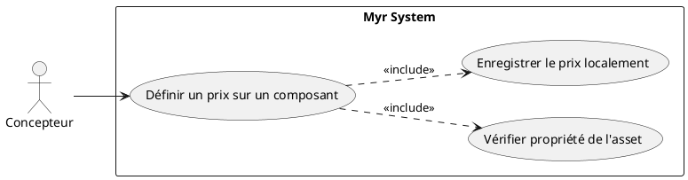
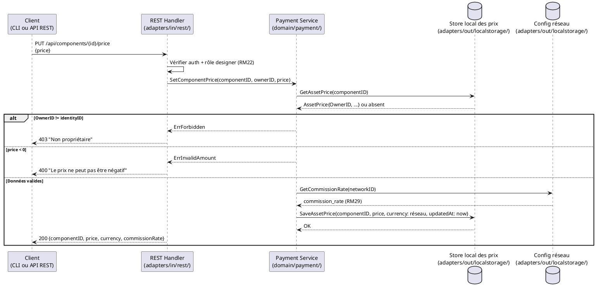

# Définir un prix sur un Composant proprietaire

## Diagramme d'acteurs

## Contexte

Un concepteur propriétaire d'un composant peut lui attribuer un prix unitaire pour son utilisation commerciale. Contrairement aux transactions du domaine (assets, liaisons, modules), ce prix n'est **pas** une donnée blockchain : il est enregistré localement côté serveur (`adapters/out/localstorage/`) et reste mutable (RM31, RM33) — voir UCPI11 pour sa modification ultérieure. Il s'applique automatiquement lors de chaque commande créée après son enregistrement, et contribue au calcul des commissions distribuées à la livraison (RM23, RM24), au taux défini par le réseau (RM29).

Le prix d'un composant dans la chaîne de dérivation remonte vers les modules qui l'intègrent — tout composant dérivé doit tenir compte du prix de ses parents pour calculer les commissions amont.

## Pré-conditions

- Le concepteur est authentifié avec le rôle `designer` ou `contributor`
- Le concepteur est le propriétaire du composant (`OwnerID == identityID`)
- Le composant est soumis sur la blockchain (`Status = submitted`)
- Le composant n'a pas déjà un prix verrouillé par une règle contractuelle

## Scénario

**Étape initiale :** `PUT /api/components/{id}/price` est appelée (ou l'équivalent CLI `myr model price set`) avec le prix unitaire

### Flux nominal — Prix défini et enregistré

1. Le système vérifie que l'appelant est bien le propriétaire du composant (`OwnerID`)
2. Le prix unitaire est transmis (valeur ≥ 0 — un prix nul rend le composant librement disponible, RM32)
3. La devise appliquée est celle du réseau (RM33) — non transmise par le client
4. Le taux de commission appliqué est celui défini par l'administrateur du réseau (RM29) — non transmis par le client
5. Le prix est enregistré localement (`adapters/out/localstorage/`)
6. La réponse confirme : prix unitaire, devise du réseau, taux de commission réseau
7. Le prix est actif immédiatement pour toute commande créée après l'enregistrement (RM31)

### Flux alternatif — Mise à jour d'un prix existant

1. Le composant possède déjà un prix enregistré localement
2. Le nouveau prix est transmis
3. Le service avertit : "La modification du prix ne s'applique qu'aux commandes futures — les commandes en cours conservent le prix d'origine (RM31)"
4. Le nouveau prix remplace l'ancien dans le store local (`AssetPrice.UpdatedAt` mis à jour) — voir UCPI11 pour le détail de cette modification

### Flux erreur A — Utilisateur non propriétaire

1. Le système détecte que `OwnerID != identityID de l'appelant`
2. Réponse `403 Forbidden` : "Vous n'êtes pas propriétaire de ce composant"

### Flux erreur B — Prix invalide (négatif)

1. Une valeur strictement négative est transmise
2. Réponse `400 Bad Request` : "Le prix ne peut pas être négatif"

> Un prix de 0 est valide : il rend le composant librement disponible, sans commission (RM32) — voir flux nominal.

### Flux erreur C — Échec d'écriture locale

1. L'écriture dans le store local échoue (ex. erreur disque, verrou concurrent)
2. Le prix précédent reste actif
3. Message affiché : "Erreur serveur — le prix n'a pas été enregistré"

## Post-conditions

- Le prix unitaire est enregistré localement (pas sur la blockchain — RM31, RM33) et actif pour toute commande créée après l'enregistrement
- Le taux de commission appliqué à la livraison reste celui défini par le réseau (RM29), indépendamment de ce prix
- Les modules intégrant ce composant refléteront le nouveau prix lors des prochaines commandes

## Diagramme de séquence

## Règles métier déclenchées

| Règle | Description | Détail |
|-------|-------------|--------|
| RM22 | Contrôle d'accès par rôle | Seul le propriétaire (role designer) peut modifier le prix |
| RM29 | Taux de commission défini par le réseau | Le taux appliqué à la livraison provient de la configuration réseau, pas d'une saisie du concepteur |
| RM31 | Modification de prix applicable aux commandes futures uniquement | Voir UCPI11 pour le détail de la modification |
| RM32 | Asset à prix nul → libre accès, aucune commission | Un prix de 0 est une valeur valide, pas une erreur |
| RM33 | Devise unique par réseau, non modifiable par l'auteur | La devise appliquée est toujours celle du réseau |
| RM23 | Commissions distribuées à la livraison | Le prix enregistré ici est utilisé par le smart contract lors de UCAUT01 |
| RM24 | Répartition proportionnelle par auteur | Le prix par composant détermine la part de cet auteur dans un module |

## Exigences non-fonctionnelles

| ENF | Description |
|-----|-------------|
| ENF12 | Contrôle de propriété vérifié côté serveur (pas côté client) |
| ENF27 | Le prix étant une donnée locale (pas blockchain), il suit les mêmes garanties de sauvegarde que le reste de `adapters/out/localstorage/` |

## Notes d'implémentation

- **Non implémenté** : aucun endpoint REST de tarification n'existe dans `adapters/in/rest/`, aucun store de prix dans `adapters/out/localstorage/`
- **À créer** : structure `AssetPrice{AssetID, OwnerID, Amount, Currency, UpdatedAt}` dans `domain/payment/`, persistée via `adapters/out/localstorage/price_store.go` — **pas** de champ prix dans `Model3D` ni dans le chaincode (RM31 : le prix n'est pas une donnée blockchain)
- **À créer** : route `PUT /api/components/{id}/price` dans `adapters/in/rest/handlers_payment.go`, appelant le service domaine `payment` — même chemin de code que UCPI11 (modification), pas de duplication
- Le taux de commission n'est **pas** saisi par le concepteur : il est lu depuis la configuration du réseau (RM29, `domain/network/`)
- La devise est celle du réseau (RM33) — pas de sélection ni de conversion côté composant
- **Parité CLI/REST :** `myr model price set <id> <montant>` doit appeler le même service domaine `payment` que la route REST — aucun accès direct à `localstorage` depuis l'adapter CLI
