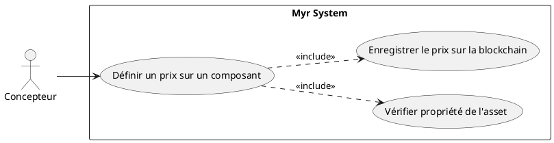
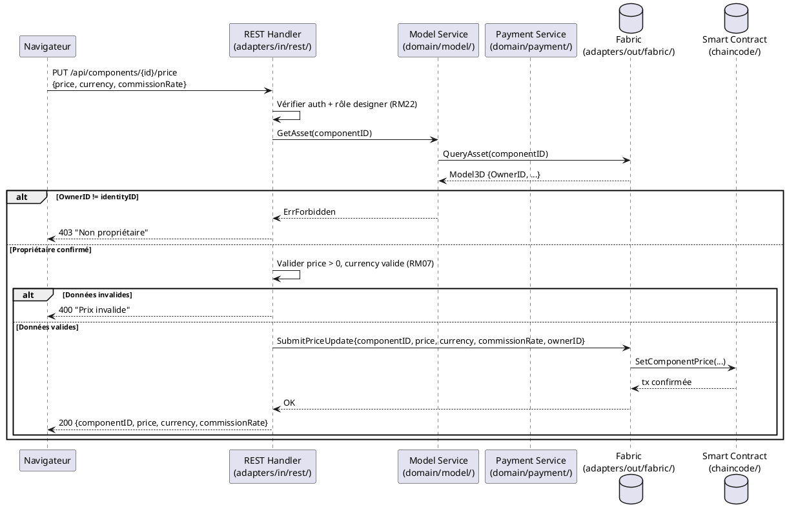

# Définir un prix sur un Composant proprietaire

## Diagramme d'acteurs

## Contexte

Un concepteur propriétaire d'un composant peut lui attribuer un prix unitaire pour son utilisation commerciale. Ce prix est enregistré de manière immuable sur la blockchain et s'applique automatiquement lors de chaque commande intégrant ce composant. Il contribue au calcul des commissions distribuées à la livraison (RM23, RM24).

Le prix d'un composant dans la chaîne de dérivation remonte vers les modules qui l'intègrent — tout composant dérivé doit tenir compte du prix de ses parents pour calculer les commissions amont.

## Pré-conditions

- Le concepteur est authentifié avec le rôle `designer` ou `contributor`
- Le concepteur est le propriétaire du composant (`OwnerID == identityID`)
- Le composant est soumis sur la blockchain (`Status = submitted`)
- Le composant n'a pas déjà un prix verrouillé par une règle contractuelle

## Scénario

**Étape initiale :** Le concepteur accède à la fiche de son composant et ouvre la section "Tarification"

### Flux nominal — Prix défini et enregistré

1. Le système vérifie que l'utilisateur est bien le propriétaire du composant (`OwnerID`)
2. Le concepteur saisit le prix unitaire (valeur numérique positive)
3. Le concepteur sélectionne la devise (ex. token réseau, EUR, USD)
4. Le concepteur saisit le taux de commission applicable lors des dérivations
5. Le système affiche un récapitulatif : prix unitaire, devise, taux commission, impact estimé sur les modules parents
6. Le concepteur valide — la transaction est soumise sur la blockchain
7. Le prix est enregistré sur la blockchain et immédiatement appliqué aux futures commandes

### Flux alternatif — Mise à jour d'un prix existant

1. Le composant possède déjà un prix enregistré sur la blockchain
2. Le concepteur saisit le nouveau prix
3. Le système avertit : "La modification du prix ne s'applique qu'aux commandes futures — les commandes en cours conservent le prix d'origine"
4. La nouvelle entrée de prix est soumise sur la blockchain (l'ancienne version est conservée dans l'historique — immuabilité)

### Flux erreur A — Utilisateur non propriétaire

1. Le système détecte que `OwnerID != identityID de l'utilisateur connecté`
2. Message affiché : "Vous n'êtes pas propriétaire de ce composant"
3. La section Tarification est en lecture seule

### Flux erreur B — Prix invalide (négatif ou nul)

1. Le concepteur saisit une valeur ≤ 0
2. Message affiché : "Le prix doit être strictement positif"
3. Le formulaire n'est pas soumis

### Flux erreur C — Échec de soumission blockchain

1. La transaction blockchain échoue
2. Le prix reste inchangé sur la blockchain
3. Message affiché : "Erreur réseau blockchain — le prix n'a pas été enregistré"

## Post-conditions

- Le prix unitaire est enregistré de manière immuable sur la blockchain
- Le taux de commission est enregistré et sera utilisé par le smart contract lors de la livraison (RM23)
- Les modules intégrant ce composant refléteront le nouveau prix lors des prochaines commandes

## Diagramme de séquence

## Règles métier déclenchées

| Règle | Description | Détail |
|-------|-------------|--------|
| RM22 | Contrôle d'accès par rôle | Seul le propriétaire (role designer) peut modifier le prix |
| RM07 | Validation avant soumission blockchain | Prix et devise validés côté serveur avant transaction |
| RM23 | Commissions distribuées à la livraison | Le taux enregistré ici est utilisé par le smart contract lors de UCAUT01 |
| RM24 | Répartition proportionnelle par auteur | Le taux de commission défini ici détermine la part de cet auteur |

## Exigences non-fonctionnelles

| ENF | Description |
|-----|-------------|
| ENF12 | Contrôle de propriété vérifié côté serveur (pas côté client) |
| ENF30 | En cas d'échec blockchain, le prix précédent reste actif |

## Notes d'implémentation

- **Non implémenté** : Aucun endpoint REST de tarification n'existe dans `adapters/in/rest/`
- **À créer** : Route `PUT /api/components/{id}/price` dans `adapters/in/rest/handlers_payment.go`
- **À créer** : Champ `Price`, `Currency`, `CommissionRate` dans l'entité `Model3D` (`domain/model/entity.go`) et dans le chaincode (`chaincode/model/entity.go`)
- **À créer** : Fonction chaincode `SetComponentPrice(componentID, price, rate)` dans `chaincode/`
- L'historique des prix (immuabilité blockchain) implique une structure append-only — ne pas écraser, ajouter une nouvelle entrée `PriceHistory[]`
- La notion de devise doit être normalisée (enum ou code ISO) — à définir avec le product owner
