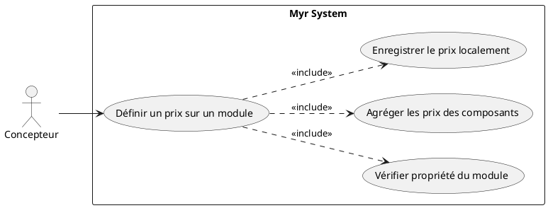
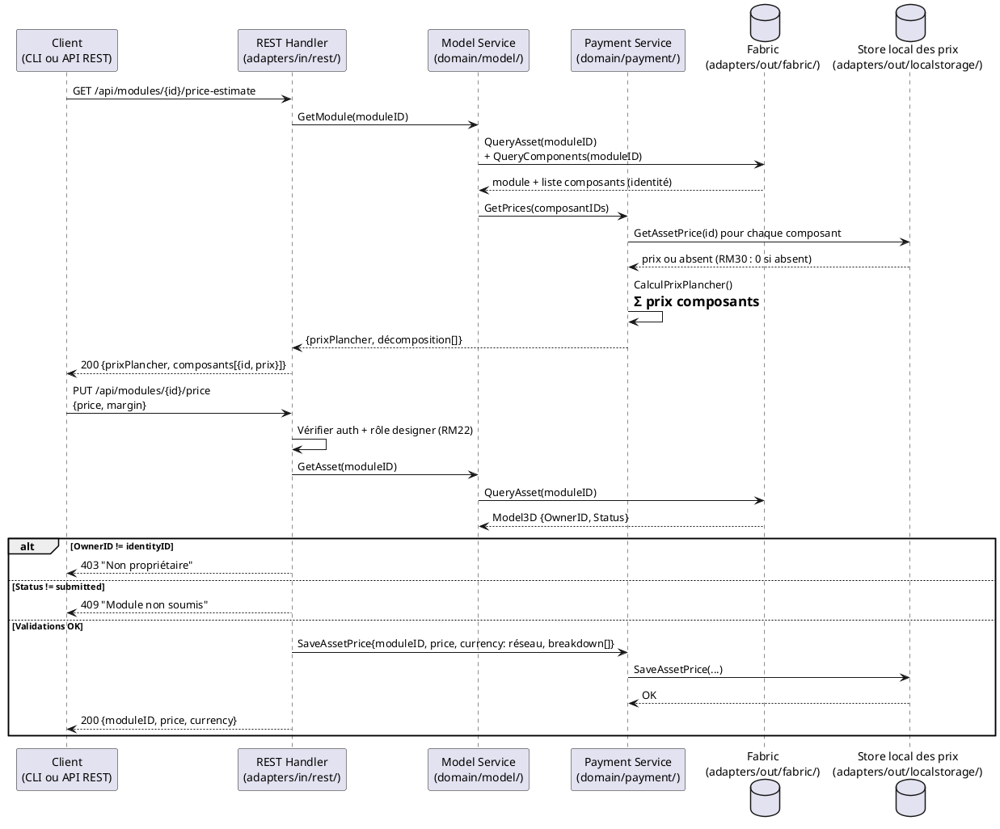

# Définir un prix sur un Module proprietaire

## Diagramme d'acteurs

## Contexte

Un concepteur propriétaire d'un module peut lui attribuer un prix global. Ce prix agrège les prix des composants constitutifs plus une marge définie par le concepteur du module. Comme pour UCPI04, ce prix n'est **pas** une donnée blockchain (RM31, RM33) : il est enregistré localement côté serveur (`adapters/out/localstorage/`) et reste mutable — voir UCPI11 pour sa modification ultérieure. Il sert de base au calcul de la commande (UCPI01) et des distributions de commissions à la livraison, au taux défini par le réseau (RM23, RM29).

Si le concepteur ne définit aucun prix, RM30 s'applique : le prix du module est calculé automatiquement comme la somme des prix unitaires de ses composants (un composant sans prix comptant pour 0).

La différence avec UCPI04 : le module est un agrégat — son prix est la somme des prix de ses composants plus une marge optionnelle. Le système doit calculer automatiquement le prix plancher (somme des composants) et permettre au concepteur d'ajouter une marge.

## Pré-conditions

- Le concepteur est authentifié avec le rôle `designer` ou `contributor`
- Le concepteur est le propriétaire du module (`OwnerID == identityID`)
- Le module est soumis sur la blockchain (`Status = submitted`, au moins une liaison — RM17)
- Tous les composants constitutifs du module ont un prix défini (sinon, avertissement)

## Scénario

**Étape initiale :** `GET /api/modules/{id}/price-estimate` puis `PUT /api/modules/{id}/price` sont appelées (ou l'équivalent CLI `myr module price estimate` / `myr module price set`)

### Flux nominal — Prix calculé et validé

1. Le système vérifie que l'appelant est bien le propriétaire du module (`OwnerID`)
2. Le système récupère la liste des composants constitutifs du module (identité via la blockchain, prix via le store local — UCPI04)
3. Pour chaque composant, le système lit son prix unitaire enregistré localement (RM30 : compté à 0 si absent)
4. Le système calcule le prix plancher : somme des prix unitaires de tous les composants
5. La réponse à `GET .../price-estimate` détaille : prix plancher, décomposition par composant, taux de commission réseau (RM29)
6. Une marge (valeur absolue ou pourcentage sur le prix plancher) est transmise via `PUT .../price`
7. Le prix final du module = prix plancher + marge transmise
8. Le prix est enregistré localement (`adapters/out/localstorage/`)

### Flux alternatif — Un ou plusieurs composants sans prix défini

1. Lors de l'étape 3, certains composants n'ont pas de prix défini (RM30 : comptés pour 0 dans le prix plancher)
2. Le système avertit : "X composant(s) sans prix — le prix plancher est incomplet"
3. Le prix plancher partiel peut être accepté, ou une valeur globale manuelle transmise à la place
4. Un indicateur "prix incomplet" est enregistré localement aux côtés du prix du module (pas sur la blockchain)

### Flux alternatif — Mise à jour d'un prix existant

1. Le module possède déjà un prix enregistré localement
2. Le système avertit : "Les composants ont des prix mis à jour depuis la dernière tarification du module — recalcul recommandé"
3. Le nouveau prix est recalculé et transmis
4. Le nouveau prix remplace l'ancien dans le store local (`AssetPrice.UpdatedAt` mis à jour) — la modification ne s'applique qu'aux commandes futures (RM31, voir UCPI11)

### Flux erreur A — Module non soumis (encore en draft)

1. Le système détecte `Status != submitted`
2. Message : "Le module doit être soumis sur la blockchain avant de définir un prix"

### Flux erreur B — Utilisateur non propriétaire

1. `OwnerID != identityID` détecté côté serveur
2. Message : "Vous n'êtes pas propriétaire de ce module"

### Flux erreur C — Échec d'écriture locale

1. L'écriture dans le store local échoue
2. Message : "Erreur serveur — le prix n'a pas été enregistré"

## Post-conditions

- Le prix global du module est enregistré localement (pas sur la blockchain — RM31, RM33) et actif pour toute commande créée après l'enregistrement
- La décomposition (composants + marge) est conservée localement pour audit
- Le module peut désormais être commandé via UCPI01 avec ce prix appliqué

## Diagramme de séquence

## Règles métier déclenchées

| Règle | Description | Détail |
|-------|-------------|--------|
| RM22 | Contrôle d'accès par rôle | Seul le propriétaire (role designer) peut définir le prix |
| RM17 | Module soumis exige au moins une liaison | Le module doit être soumis avant d'être tarifé |
| RM29 | Taux de commission défini par le réseau | Utilisé lors de la distribution à la livraison, pas saisi ici |
| RM30 | Prix module = somme des composants si non défini | Base du calcul du prix plancher — composant sans prix compté à 0 |
| RM31 | Modification de prix applicable aux commandes futures uniquement | Voir UCPI11 pour le détail de la modification |
| RM33 | Devise unique par réseau, non modifiable par l'auteur | La devise appliquée est toujours celle du réseau |
| RM23 | Commissions distribuées à la livraison | Le prix et la décomposition servent au calcul lors de UCAUT01 |
| RM24 | Répartition proportionnelle par auteur | La décomposition (prix par composant) détermine la part de chaque auteur |

## Exigences non-fonctionnelles

| ENF | Description |
|-----|-------------|
| ENF03 | Calcul du prix plancher ≤ 5 s pour un module de 100 composants |
| ENF12 | Contrôle de propriété vérifié côté serveur |
| ENF27 | Le prix étant une donnée locale (pas blockchain), il suit les mêmes garanties de sauvegarde que le reste de `adapters/out/localstorage/` |

## Notes d'implémentation

- **Non implémenté** : aucun endpoint REST de tarification module dans `adapters/in/rest/`, aucun store de prix dans `adapters/out/localstorage/`
- **À créer** : routes `GET /api/modules/{id}/price-estimate` et `PUT /api/modules/{id}/price` dans `adapters/in/rest/handlers_payment.go`, appelant le service domaine `payment` — **pas** de champ `Price`/`PriceBreakdown[]` dans `Model3D` ni dans le chaincode (RM31 : le prix n'est pas une donnée blockchain)
- **À créer** : structure `AssetPrice{AssetID, OwnerID, Amount, Currency, Breakdown[], UpdatedAt}` dans `domain/payment/`, persistée via `adapters/out/localstorage/price_store.go` — même store que UCPI04/UCPI11, pas de duplication
- L'algorithme de calcul du prix plancher traverse la chaîne de composants du module (identité via Fabric, prix via le store local) — une traversée profonde peut être coûteuse (prévoir mise en cache, ENF03)
- La règle « price >= prixPlancher » est une contrainte métier à discuter avec le PO — un concepteur pourrait vouloir brader intentionnellement (open-source + prix symbolique), voire fixer 0 (RM32)
- **Parité CLI/REST :** `myr module price set <id> <montant>` / `myr module price estimate <id>` doivent appeler le même service domaine `payment` que la route REST — aucun accès direct à `localstorage` depuis l'adapter CLI
