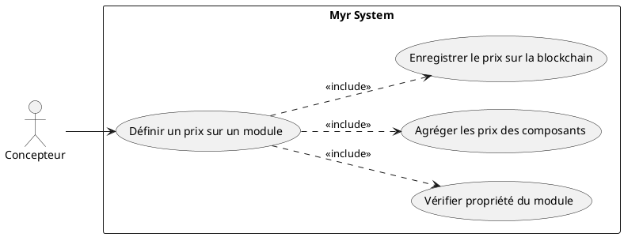
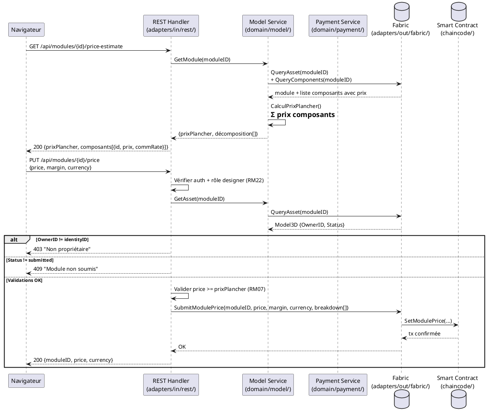

# Définir un prix sur un Module proprietaire

## Diagramme d'acteurs

## Contexte

Un concepteur propriétaire d'un module peut lui attribuer un prix global. Ce prix agrège les prix des composants constitutifs (et leurs commissions remontées via la chaîne de dérivation) plus une marge définie par le concepteur du module. Il est enregistré de manière immuable sur la blockchain et sert de base au calcul de la commande (UCPI01) et des distributions de commissions à la livraison (RM23).

La différence avec UCPI04 : le module est un agrégat — son prix est la somme des prix de ses composants plus une marge optionnelle. Le système doit calculer automatiquement le prix plancher (somme des composants) et permettre au concepteur d'ajouter une marge.

## Pré-conditions

- Le concepteur est authentifié avec le rôle `designer` ou `contributor`
- Le concepteur est le propriétaire du module (`OwnerID == identityID`)
- Le module est soumis sur la blockchain (`Status = submitted`, au moins une liaison — RM17)
- Tous les composants constitutifs du module ont un prix défini (sinon, avertissement)

## Scénario

**Étape initiale :** Le concepteur accède à la fiche de son module et ouvre la section "Tarification"

### Flux nominal — Prix calculé et validé

1. Le système vérifie que l'utilisateur est bien le propriétaire du module (`OwnerID`)
2. Le système récupère la liste des composants constitutifs du module depuis la blockchain
3. Pour chaque composant, le système lit son prix unitaire et son taux de commission
4. Le système calcule le prix plancher : somme des prix unitaires de tous les composants
5. Le système affiche le détail : prix plancher, décomposition par composant, commissions amont
6. Le concepteur saisit sa marge (valeur absolue ou pourcentage sur le prix plancher)
7. Le prix final du module = prix plancher + marge du concepteur
8. Le concepteur valide — la transaction est soumise sur la blockchain

### Flux alternatif — Un ou plusieurs composants sans prix défini

1. Lors de l'étape 3, certains composants n'ont pas de prix défini
2. Le système avertit : "X composant(s) sans prix — le prix plancher est incomplet"
3. Le concepteur peut continuer avec le prix plancher partiel ou définir une valeur globale manuelle
4. Un avertissement est enregistré dans les métadonnées du module sur la blockchain

### Flux alternatif — Mise à jour d'un prix existant

1. Le module possède déjà un prix enregistré
2. Le système avertit : "Les composants ont des prix mis à jour depuis la dernière tarification du module — recalcul recommandé"
3. Le concepteur recalcule et valide le nouveau prix
4. La nouvelle entrée est soumise sur la blockchain (immuabilité — ancienne version conservée)

### Flux erreur A — Module non soumis (encore en draft)

1. Le système détecte `Status != submitted`
2. Message : "Le module doit être soumis sur la blockchain avant de définir un prix"

### Flux erreur B — Utilisateur non propriétaire

1. `OwnerID != identityID` détecté côté serveur
2. Message : "Vous n'êtes pas propriétaire de ce module"
3. La section Tarification est en lecture seule

### Flux erreur C — Échec de soumission blockchain

1. La transaction échoue
2. Message : "Erreur réseau blockchain — le prix n'a pas été enregistré"

## Post-conditions

- Le prix global du module est enregistré de manière immuable sur la blockchain
- La décomposition (composants + marges + commissions) est enregistrée pour audit
- Le module peut désormais être commandé via UCPI01 avec ce prix appliqué

## Diagramme de séquence

## Règles métier déclenchées

| Règle | Description | Détail |
|-------|-------------|--------|
| RM22 | Contrôle d'accès par rôle | Seul le propriétaire (role designer) peut définir le prix |
| RM07 | Validation avant soumission blockchain | Prix ≥ plancher, données valides avant transaction |
| RM17 | Module soumis exige au moins une liaison | Le module doit être soumis avant d'être tarifé |
| RM23 | Commissions distribuées à la livraison | Le prix et la décomposition servent au smart contract lors de UCAUT01 |
| RM24 | Répartition proportionnelle par auteur | La décomposition (prix par composant) détermine la part de chaque auteur |

## Exigences non-fonctionnelles

| ENF | Description |
|-----|-------------|
| ENF03 | Calcul du prix plancher ≤ 5 s pour un module de 100 composants |
| ENF12 | Contrôle de propriété vérifié côté serveur |
| ENF30 | En cas d'échec blockchain, le prix précédent reste actif |

## Notes d'implémentation

- **Non implémenté** : Aucun endpoint REST de tarification module dans `adapters/in/rest/`
- **À créer** : Routes `GET /api/modules/{id}/price-estimate` et `PUT /api/modules/{id}/price` dans `adapters/in/rest/handlers_payment.go`
- **À créer** : Champs `Price`, `Currency`, `PriceBreakdown[]` dans l'entité `Model3D`
- **À créer** : Fonction chaincode `SetModulePrice(moduleID, price, breakdown)` dans `chaincode/`
- L'algorithme de calcul du prix plancher doit traverser récursivement la chaîne de dérivation des composants — une requête blockchain peut être coûteuse si le module est profondément imbriqué (prévoir mise en cache ou calcul différé)
- La règle "price >= prixPlancher" est une contrainte métier à discuter avec le PO — un concepteur pourrait vouloir brader intentionnellement (open-source + prix symbolique)
