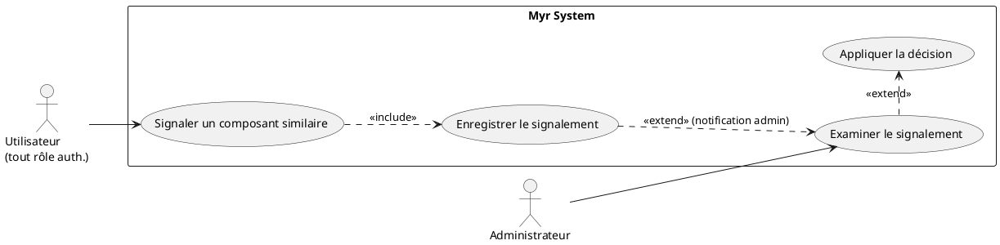
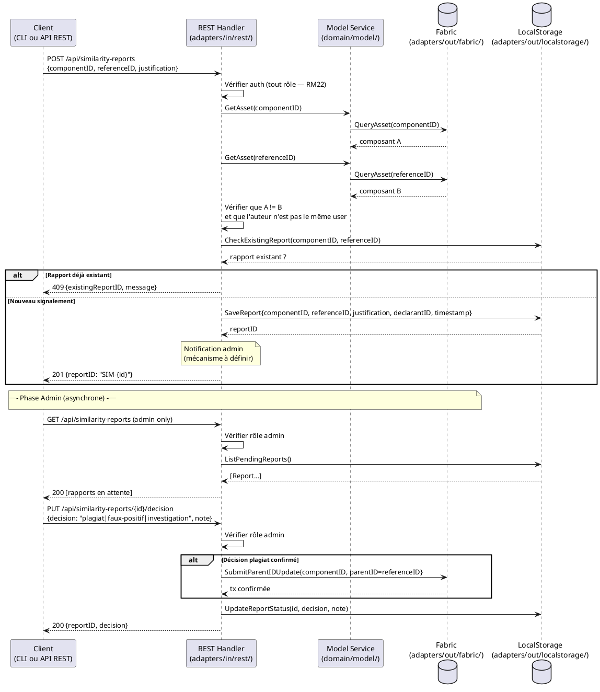

# Déclarer un composant similaire

## Diagramme d'acteurs

## Contexte

Ce use case constitue le mécanisme de protection communautaire contre le plagiat non détecté automatiquement. Lorsqu'un utilisateur identifie deux composants non liés dans le système mais présentant une similarité structurelle, il peut le signaler. L'administrateur examine ensuite le signalement et décide de l'action à mener.

Ce mécanisme complète la vérification anti-plagiat automatique (RM01 — SHA-256 + SCM > 50%) en capturant les cas que l'algorithme n'a pas détectés (similarité visuelle, fonctionnelle, ou cas limites SCM ≤ 50%).

## Pré-conditions

- L'utilisateur est authentifié (tout rôle, y compris `reader`)
- L'utilisateur a identifié deux composants existants sur la blockchain non liés (`ParentID` différent ou absent)
- Les deux composants ont des UUIDs distincts sur la blockchain

## Scénario

**Étape initiale :** `POST /api/similarity-reports` est appelée (ou l'équivalent CLI `myr model report-similar`) avec le composant signalé, le composant de référence et une justification

### Flux nominal — Signalement soumis

1. Le composant de référence (similaire existant) est transmis via son UUID
2. Une justification textuelle est transmise (obligatoire, minimum 20 caractères)
3. Le système enregistre le signalement localement avec les métadonnées : composantA (signalé), composantB (référence), justification, identité du déclarant, horodatage
4. Le signalement est soumis à l'administrateur du réseau via notification
5. Le système confirme : "Signalement enregistré — référence : SIM-{id}"

### Flux alternatif — Signalement déjà existant entre ces deux composants

1. Le système détecte qu'un signalement actif existe déjà pour cette paire de composants
2. Message : "Un signalement existe déjà pour cette paire (réf. SIM-{id}). Vous pouvez ajouter un commentaire au signalement existant."
3. L'utilisateur peut ajouter un témoignage complémentaire au signalement existant

### Flux traitement admin — Signalement examiné (acteur : Administrateur)

1. L'administrateur consulte la liste des signalements en attente
2. Il compare les deux composants (données récupérées via `GET /api/components/:id` pour chacun)
3. **Décision A — Plagiat confirmé** : l'administrateur marque le composant signalé comme dérivé du composant de référence, met à jour le `ParentID` sur la blockchain, et notifie le déclarant et les deux auteurs
4. **Décision B — Faux positif** : l'administrateur rejette le signalement avec une justification, notifie le déclarant
5. **Décision C — Enquête approfondie** : le signalement est placé en statut `investigating` — les deux auteurs sont notifiés et invités à fournir des preuves de création

### Flux erreur A — Composant de référence introuvable

1. L'UUID ou le nom saisi pour le composant de référence n'existe pas sur la blockchain
2. Message : "Composant de référence introuvable — vérifiez l'identifiant"

### Flux erreur B — Signalement sur ses propres composants

1. L'utilisateur tente de signaler deux composants dont il est lui-même l'auteur
2. Message : "Vous ne pouvez pas signaler une similarité entre vos propres composants"

## Post-conditions

- Le signalement est enregistré dans le système (stockage local — pas sur la blockchain)
- L'administrateur est notifié
- Le déclarant reçoit une référence de signalement
- Si plagiat confirmé : le `ParentID` du composant est mis à jour sur la blockchain (transaction immuable)

## Diagramme de séquence

## Règles métier déclenchées

| Règle | Description | Détail |
|-------|-------------|--------|
| RM01 | Vérification anti-plagiat | Ce UC complète RM01 pour les cas non détectés automatiquement |
| RM05 | ParentID obligatoire pour les assets dérivés | Si plagiat confirmé, le ParentID est mis à jour sur la blockchain |
| RM07 | Transactions Fabric immuables | La mise à jour du ParentID est définitive |
| RM22 | Contrôle d'accès | Signalement : tout utilisateur auth. — Décision : admin uniquement |

## Exigences non-fonctionnelles

| ENF | Description |
|-----|-------------|
| ENF12 | Contrôle du rôle admin pour les décisions — vérifié côté serveur |
| ENF18 | Aucune dépendance technique dans le domaine |

## Notes d'implémentation

- **Non implémenté** : Aucun endpoint REST pour les signalements dans `adapters/in/rest/`
- **À créer** : Routes `POST /api/similarity-reports`, `GET /api/similarity-reports`, `PUT /api/similarity-reports/{id}/decision` dans `adapters/in/rest/handlers_admin.go` ou `handlers_model.go`
- Les signalements sont stockés **localement** (pas sur la blockchain) — utiliser `adapters/out/localstorage/` ou une table SQLite
- La mise à jour du `ParentID` est une opération blockchain sensible — l'opération inverse n'existe pas (RM07)
- La notification admin est un mécanisme non encore défini — email, webhook, ou notification in-app ?
- Un algorithme de similarité automatisé pour aider à la décision (au-delà de la simple consultation des deux fiches) est hors périmètre de ce UC
- **Parité CLI/REST :** conformément au principe de parité, le signalement d'un composant similaire devrait pouvoir être initié en CLI. Comme noté ci-dessus, aucune route REST ni entité de signalement n'existe dans le domaine `model` — une commande CLI (par ex. `myr model report-similar <id> <referenceID> --reason <texte>`) ne pourra être ajoutée qu'une fois ce mécanisme conçu, au même titre que les endpoints REST manquants.
