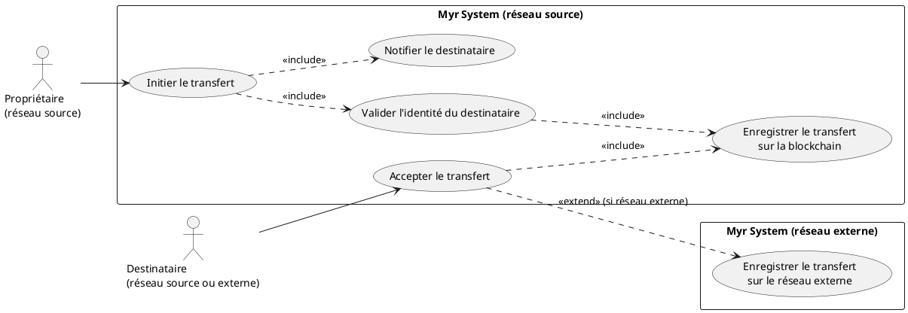
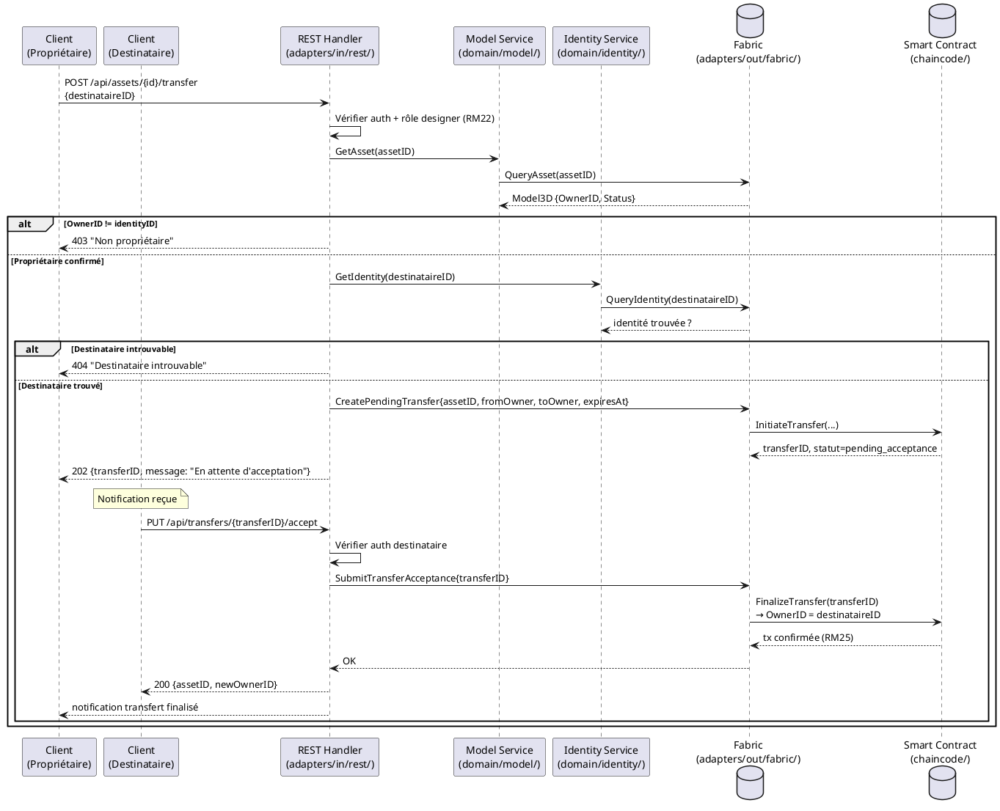

# Transfert de propriété intellectuelle

## Diagramme d'acteurs

## Contexte

Un propriétaire souhaite transférer définitivement la propriété intellectuelle d'un asset à un autre utilisateur ou organisation. Ce transfert change le champ `OwnerID` sur la blockchain de manière **immuable et définitive** (RM25) — l'ancien propriétaire perd tous les droits d'édition et de tarification sur l'asset.

Ce use case est à faible probabilité (1) car il est irréversible — les utilisateurs sont peu enclins à transférer leur PI. Mais son impact est fort (3) car toute erreur est définitive.

## Pré-conditions

- Le propriétaire est authentifié avec le rôle `designer` ou `contributor`
- Le propriétaire est le titulaire actuel de l'asset (`OwnerID == identityID`)
- L'asset est soumis sur la blockchain (`Status = submitted`)
- Le destinataire est identifié par son `IdentityID` sur le réseau Myr

## Scénario

**Étape initiale :** `POST /api/assets/{id}/transfer` est appelée (ou l'équivalent CLI `myr model transfer initiate`) avec l'identifiant du destinataire

### Flux nominal — Transfert sur le même réseau

1. L'identifiant du destinataire (IdentityID ou adresse email si le réseau le permet) est transmis
2. Le système vérifie que le destinataire existe bien sur le réseau Myr courant
3. La transaction de transfert est soumise sur la blockchain en statut `pending_acceptance` : `OwnerID` cible = destinataireID — cette action est **définitive et irréversible** une fois acceptée, l'ancien propriétaire perdra tous droits d'édition
4. Le destinataire reçoit une notification et doit accepter le transfert (`PUT /api/transfers/{id}/accept`)
5. Après acceptation, l'`OwnerID` est finalisé sur la blockchain

### Flux alternatif — Transfert vers un réseau externe

1. L'identifiant du destinataire est sur un réseau Myr externe (format `identityID@reseauExterne`)
2. Le système génère un token de transfert signé cryptographiquement (JWT signé + expiration)
3. Le token contient : assetID, assetHash, ancienOwnerID, destinataireID, expiration
4. Le destinataire est notifié sur son réseau avec le token
5. Le destinataire accepte en présentant le token sur son réseau — la transaction est soumise sur les deux réseaux
6. Les deux réseaux enregistrent le transfert avec le même UUID (RM26 — traçabilité inter-réseaux)

### Flux alternatif — Destinataire qui refuse le transfert

1. Le destinataire reçoit la notification de transfert
2. Un refus est transmis (`PUT /api/transfers/{id}/reject`)
3. La transaction de transfert est annulée (si en attente d'acceptation, pas encore finalisée)
4. L'`OwnerID` reste inchangé — le propriétaire d'origine conserve la propriété
5. Le propriétaire d'origine est notifié du refus

### Flux erreur A — Destinataire introuvable sur le réseau

1. L'IdentityID saisi n'existe pas sur le réseau Myr courant
2. Message : "Destinataire introuvable sur ce réseau — vérifiez l'identifiant"

### Flux erreur B — Token de transfert expiré (réseau externe)

1. Le destinataire présente un token expiré (délai > 48h par défaut)
2. Message : "Token de transfert expiré — le propriétaire doit initier un nouveau transfert"

### Flux erreur C — Échec de soumission blockchain

1. La transaction échoue lors de l'enregistrement
2. L'`OwnerID` n'est pas modifié — l'ancien propriétaire conserve ses droits
3. Message : "Erreur réseau blockchain — le transfert n'a pas été effectué"

## Post-conditions

- L'`OwnerID` de l'asset est modifié de manière immuable sur la blockchain (RM25)
- L'ancien propriétaire ne peut plus modifier l'asset ni sa tarification
- Le nouveau propriétaire dispose de tous les droits sur l'asset
- La transaction de transfert est enregistrée dans l'historique de l'asset avec horodatage

## Diagramme de séquence

## Règles métier déclenchées

| Règle | Description | Détail |
|-------|-------------|--------|
| RM25 | Transfert PI définitif et immuable | Le changement d'`OwnerID` est irréversible — aucune annulation possible après finalisation |
| RM22 | Contrôle d'accès par rôle | Seul le propriétaire courant peut initier le transfert |
| RM07 | Validation avant soumission blockchain | Identité du destinataire vérifiée avant toute transaction |
| RM26 | UUID préservé lors du clonage inter-réseaux | S'applique au flux alternatif réseau externe |

## Exigences non-fonctionnelles

| ENF | Description |
|-----|-------------|
| ENF12 | Contrôle de propriété côté serveur obligatoire |
| ENF30 | En cas d'échec blockchain, l'OwnerID reste inchangé |

## Notes d'implémentation

- **Non implémenté** : Aucun endpoint REST de transfert dans `adapters/in/rest/`
- **À créer** : Routes `POST /api/assets/{id}/transfer` et `PUT /api/transfers/{id}/accept` dans `adapters/in/rest/handlers_model.go` ou `handlers_payment.go`
- **À créer** : Fonction chaincode `InitiateTransfer` et `FinalizeTransfer` dans `chaincode/`
- Le mécanisme de "transfert en deux temps" (initier + accepter) est essentiel pour éviter les transferts accidentels — ne pas implémenter en un seul appel
- Le token JWT signé pour le transfert inter-réseaux nécessite une clé publique partagée entre réseaux — mécanisme à définir avec le PO
- La durée d'expiration du token (48h par défaut) doit être configurable par l'administrateur du réseau
- Question ouverte : un transfert vers une organisation (pas un individu) est-il supporté ? L'`OwnerID` peut-il être un OrgID ?
- **Parité CLI/REST :** conformément au principe de parité, l'initiation puis l'acceptation d'un transfert de propriété devraient être exposables en CLI. Comme noté ci-dessus, aucune fonction `InitiateTransfer`/`FinalizeTransfer` n'existe dans `domain/model` ni de route REST correspondante — des commandes CLI (par ex. `myr model transfer initiate/accept <id> ...`) ne pourront être ajoutées qu'une fois ce domaine conçu.
