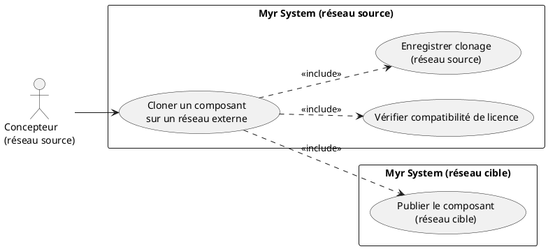
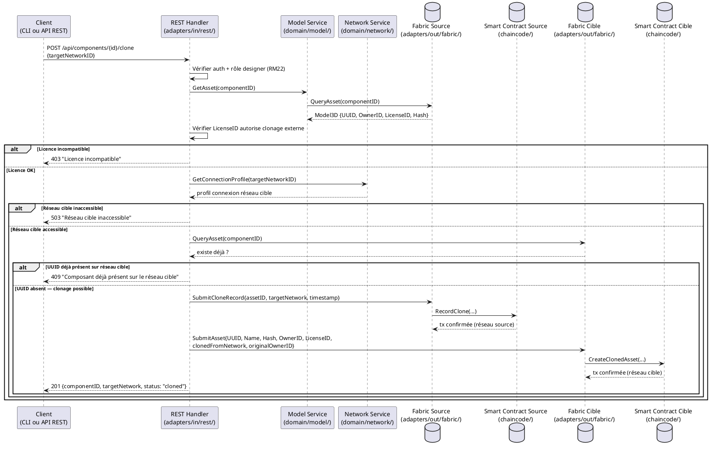

# Cloner un Composant sur un réseau exterieur

## Diagramme d'acteurs

## Contexte

Un concepteur souhaite diffuser un composant vers un autre réseau MYR, par exemple pour partager sa création avec une communauté d'un autre réseau ou pour la rendre accessible à des manufactureurs sur un réseau spécialisé. Le clonage préserve l'UUID et les métadonnées d'origine (RM26), et une transaction de traçabilité est enregistrée sur les deux réseaux.

La licence du composant doit autoriser le clonage — certaines licences peuvent interdire la diffusion hors réseau d'origine.

## Pré-conditions

- Le concepteur est authentifié avec le rôle `designer` ou `contributor`
- Le composant est soumis sur la blockchain du réseau source (`Status = submitted`)
- La licence du composant autorise le clonage inter-réseaux
- Le réseau de destination est accessible (profil de connexion disponible dans `connection-profiles/` ou saisi manuellement)
- Le concepteur a un compte actif sur le réseau de destination (ou le réseau de destination autorise l'import sans compte préalable)

## Scénario

**Étape initiale :** `POST /api/components/{id}/clone` est appelée (ou l'équivalent CLI `myr model clone`) avec l'identifiant du réseau cible

### Flux nominal A — Réseau cible connu (profil de connexion existant)

1. Le réseau de destination transmis est déjà référencé dans `connection-profiles/`
2. Le système vérifie la compatibilité de licence (règle 8 : RM03 — si licence restrictive, bloquer)
3. La transaction de clonage est soumise sur le **réseau source** : `{assetID, clonedToNetwork, timestamp}`
4. Le composant (UUID + métadonnées + hash CAO) est transmis au réseau cible
5. La transaction de réception est enregistrée sur le **réseau cible** : `{assetID, clonedFromNetwork, originalOwnerID, timestamp}`
6. Confirmation : "Composant cloné — disponible sur {réseau cible}"

### Flux nominal B — Réseau cible non encore référencé (saisie manuelle)

1. Les informations de connexion du nouveau réseau sont transmises (URL gateway, MSP ID, certificat CA)
2. Le système tente une connexion au réseau cible
3. Connexion réussie — le nouveau profil est enregistré localement dans `connection-profiles/`
4. La suite suit le flux nominal A à partir de l'étape 2

### Flux erreur A — Licence incompatible

1. La vérification de licence (étape 3) échoue — la licence du composant interdit le clonage externe
2. Message : "La licence du composant ne permet pas le clonage vers ce réseau"
3. Le concepteur peut demander une dérogation à l'auteur de la licence (hors périmètre système)

### Flux erreur B — Réseau cible inaccessible

1. La connexion au réseau cible échoue (timeout ou certificat invalide)
2. Message : "Réseau de destination inaccessible — vérifiez le profil de connexion"
3. Le clonage n'est pas initié — aucune transaction soumise

### Flux erreur C — Composant déjà présent sur le réseau cible (même UUID)

1. Le réseau cible contient déjà un asset avec le même UUID
2. Message : "Ce composant existe déjà sur le réseau de destination (UUID : {id})"
3. Le système propose de consulter la version existante sur le réseau cible

### Flux erreur D — Échec partiel (source OK, cible KO)

1. La transaction sur le réseau source est confirmée
2. La transaction sur le réseau cible échoue
3. Message : "Transaction partielle — clonage enregistré sur le réseau source, échec sur le réseau cible. Réessayez ultérieurement."
4. La transaction source n'est pas annulée (immuabilité blockchain)

## Post-conditions

- Le composant est disponible sur le réseau de destination avec le **même UUID** (RM26)
- Les métadonnées originales (auteur, licence, hash CAO) sont préservées sur les deux réseaux (RM26)
- Une transaction de traçabilité est enregistrée sur le réseau source et sur le réseau cible
- La liste des réseaux où ce composant est présent est consultable via l'API

## Diagramme de séquence

## Règles métier déclenchées

| Règle | Description | Détail |
|-------|-------------|--------|
| RM26 | UUID et métadonnées originales préservés lors du clonage | L'UUID ne change pas sur le réseau cible |
| RM03 | Vérification de compatibilité de licence | La licence doit autoriser le clonage externe |
| RM22 | Contrôle d'accès par rôle | Seul le concepteur (propriétaire) peut initier un clonage |
| RM07 | Validation avant soumission blockchain | Licence et accessibilité vérifiées avant toute transaction |

## Exigences non-fonctionnelles

| ENF | Description |
|-----|-------------|
| ENF12 | Contrôle de propriété côté serveur |
| ENF30 | En cas d'échec partiel, l'état local est conservé |

## Notes d'implémentation

- **Non implémenté** : Aucun endpoint de clonage inter-réseaux dans `adapters/in/rest/`
- **À créer** : Route `POST /api/components/{id}/clone` dans `adapters/in/rest/handlers_model.go`
- **À créer** : Le `Network Service` (`domain/network/`) doit exposer la gestion des profils de connexion et la connectivité multi-réseaux — actuellement sans endpoint REST
- **À créer** : Fonctions chaincode `RecordClone` et `CreateClonedAsset` dans `chaincode/`
- L'échec partiel (source OK, cible KO) est un cas difficile — la transaction source est immuable. Envisager un mécanisme de "clone en attente" avec retry automatique
- La gestion des `connection-profiles/` (dossier existant) doit être exposée via le `Network Service` — actuellement c'est un dossier statique sans service dédié
- Question ouverte : le clonage est-il réservé au propriétaire ou tout utilisateur avec licence compatible peut-il cloner ?
- **Parité CLI/REST :** conformément au principe de parité, le clonage d'un composant vers un réseau externe devrait être exposable en CLI. Comme noté ci-dessus, ni `domain/model` ni `domain/network` n'exposent d'opération de clonage inter-réseaux, et aucune route REST n'existe — une commande CLI (par ex. `myr model clone <id> --target-network <id>`) ne pourra être ajoutée qu'une fois ce domaine conçu.
