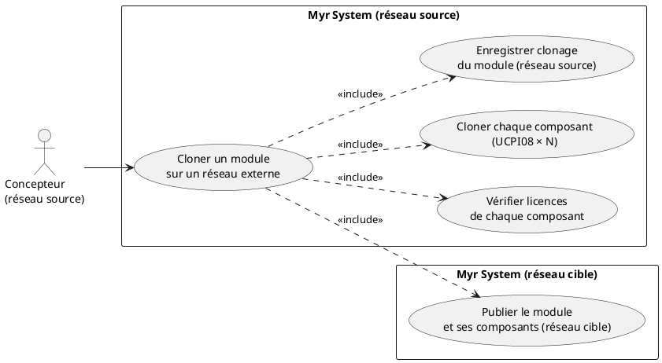
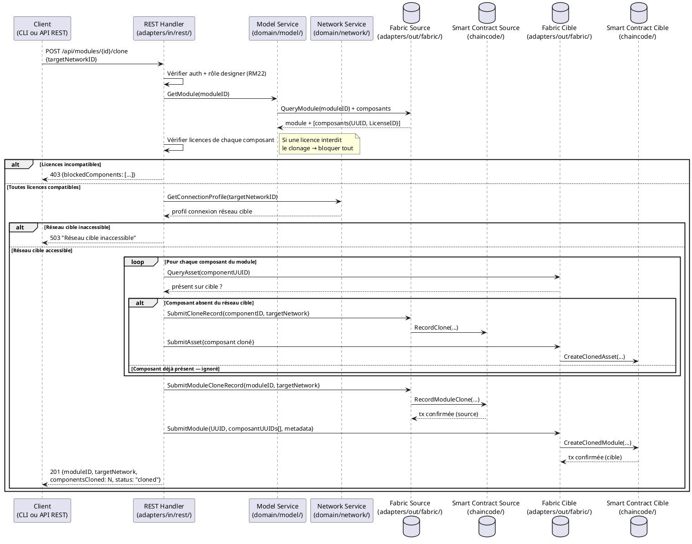

# Cloner un Module sur un réseau exterieur

## Diagramme d'acteurs

## Contexte

Le clonage d'un module sur un réseau externe est une opération composite : elle implique de vérifier la compatibilité de licence de **chaque composant constitutif** du module, puis de cloner le module et tous ses composants sur le réseau cible. L'UUID du module et de chaque composant sont préservés (RM26).

C'est une généralisation de UCPI08 (clonage d'un composant) appliquée à un agrégat. Une seule licence incompatible bloque le clonage de l'ensemble.

## Pré-conditions

- Le concepteur est authentifié avec le rôle `designer` ou `contributor`
- Le module est soumis sur la blockchain du réseau source (`Status = submitted`)
- **Toutes** les licences des composants constitutifs autorisent le clonage inter-réseaux
- Le réseau de destination est accessible (profil de connexion disponible ou saisi manuellement)
- Le concepteur a les droits nécessaires sur le réseau de destination

## Scénario

**Étape initiale :** `POST /api/modules/{id}/clone` est appelée (ou l'équivalent CLI `myr module clone`) avec l'identifiant du réseau cible

### Flux nominal — Clonage autorisé (toutes licences compatibles)

1. Le système récupère la liste complète des composants constitutifs du module depuis la blockchain
2. Pour chaque composant, le système vérifie la compatibilité de licence avec le réseau cible
3. Toutes les licences sont compatibles — la réponse détaille : module + N composants à cloner
4. Pour chaque composant non encore présent sur le réseau cible : clonage selon UCPI08 (UUID préservé)
5. La transaction de clonage du module est soumise sur le réseau source
6. La structure du module (avec les UUIDs de ses composants) est transmise au réseau cible
7. La transaction de réception du module est enregistrée sur le réseau cible
8. Confirmation : "Module et {N} composant(s) clonés sur {réseau cible}"

### Flux alternatif — Certains composants déjà présents sur le réseau cible

1. Lors de l'étape 5, le système détecte que certains composants existent déjà sur le réseau cible (même UUID)
2. Ces composants sont ignorés (pas re-clonés) — seuls les composants manquants sont ajoutés
3. Le clonage continue avec les composants manquants uniquement

### Flux erreur A — Une ou plusieurs licences incompatibles

1. Lors de l'étape 2, un ou plusieurs composants ont une licence interdisant le clonage externe
2. Le système liste les composants bloquants avec leur licence respective
3. Message : "Le clonage est bloqué — {N} composant(s) avec une licence incompatible : [liste]"
4. Le clonage ne peut pas avoir lieu — aucune transaction n'est soumise

### Flux erreur B — Réseau cible inaccessible

1. Connexion au réseau cible échoue
2. Message : "Réseau de destination inaccessible — vérifiez le profil de connexion"
3. Aucune transaction soumise

### Flux erreur C — Échec partiel lors du clonage des composants

1. Certains composants ont été clonés, puis une erreur survient sur un composant suivant
2. Les composants déjà clonés restent sur le réseau cible (transactions immuables)
3. Le module lui-même n'est pas encore transmis sur le réseau cible
4. Message : "Clonage partiel — {X}/{N} composants clonés. Le module n'a pas été transmis. Réessayez pour compléter."
5. Un état de "clonage en cours" est enregistré localement pour permettre la reprise

## Post-conditions

- Le module est disponible sur le réseau de destination avec le **même UUID** (RM26)
- Tous les composants constitutifs sont disponibles sur le réseau cible avec leurs UUIDs d'origine (RM26)
- Les transactions de traçabilité sont enregistrées sur les deux réseaux pour le module et chaque composant
- Les métadonnées originales (auteurs, licences, hashes) sont préservées

## Diagramme de séquence

## Règles métier déclenchées

| Règle | Description | Détail |
|-------|-------------|--------|
| RM26 | UUID et métadonnées originales préservés lors du clonage | UUID du module et de chaque composant inchangés |
| RM03 | Vérification de compatibilité de licence | Chaque composant doit avoir une licence compatible |
| RM22 | Contrôle d'accès | Seul le propriétaire du module peut initier le clonage |
| RM07 | Validation avant soumission blockchain | Vérifications complètes avant toute transaction |

## Exigences non-fonctionnelles

| ENF | Description |
|-----|-------------|
| ENF03 | Vérification des licences de 100 composants ≤ 5 s |
| ENF12 | Contrôle de propriété côté serveur |
| ENF30 | En cas d'échec partiel, état local conservé pour reprise |

## Notes d'implémentation

- **Non implémenté** : Aucun endpoint de clonage de module inter-réseaux dans `adapters/in/rest/`
- **À créer** : Route `POST /api/modules/{id}/clone` dans `adapters/in/rest/handlers_model.go`
- **À créer** : Fonctions chaincode `RecordModuleClone` et `CreateClonedModule` dans `chaincode/`
- Ce UC est une orchestration de N appels UCPI08 — envisager un traitement asynchrone avec statut de progression pour les modules comportant de nombreux composants
- L'état de "clonage en cours" pour la reprise en cas d'échec partiel nécessite un stockage local de l'état d'avancement — table dans SQLite ou fichier JSON dans `adapters/out/localstorage/`
- Question ouverte : le concepteur doit-il être propriétaire de **tous** les composants, ou suffit-il que les licences soient compatibles ? (Un concepteur peut vouloir cloner un module intégrant des composants d'autrui avec une licence open-source)
- **Parité CLI/REST :** conformément au principe de parité, le clonage d'un module (orchestration multi-composants) devrait être exposable en CLI. Comme noté ci-dessus, cette orchestration n'existe dans aucun domaine ni route REST — une commande CLI (par ex. `myr module clone <id> --target-network <id>`) ne pourra être ajoutée qu'une fois ce domaine conçu, généralisation de l'écart déjà constaté pour UCPI08.
