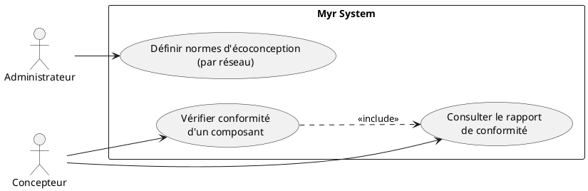
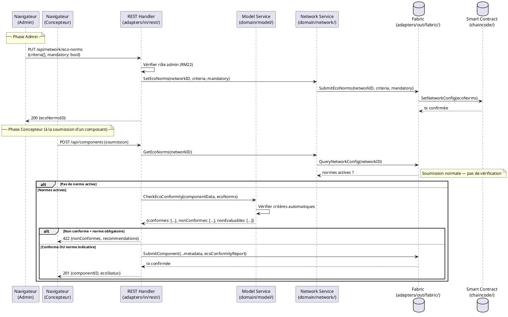

# Norme de conception écoconception

## Diagramme d'acteurs

## Contexte

Un réseau MYR peut imposer des normes d'écoconception à ses composants et modules, définies par l'administrateur. Lors de la création ou modification d'un composant, le système vérifie automatiquement la conformité aux critères définis. Ce use case est à faible importance (2) car il est optionnel — tous les réseaux ne définissent pas de normes d'écoconception.

Ce use case est en marge du domaine PI principal (commissions, transferts, clonage) — il relève d'une gouvernance réseau optionnelle.

## Pré-conditions

**Pour la définition des normes (admin) :**
- L'administrateur est authentifié avec le rôle `admin`
- Le réseau est actif

**Pour la vérification de conformité (concepteur) :**
- Le concepteur est authentifié avec le rôle `designer` ou `contributor`
- Des normes d'écoconception sont définies sur le réseau
- Un composant ou module est en cours de création ou de modification

## Scénario

### Flux A — Définition des normes (acteur : Administrateur)

**Étape initiale :** L'administrateur accède aux paramètres du réseau et ouvre "Normes écoconception"

1. L'administrateur définit les critères de conformité (ex. : matériaux recyclables requis, durée de vie minimale, réparabilité, empreinte carbone maximale)
2. Il définit si la norme est obligatoire (bloque la soumission) ou indicative (avertissement seulement)
3. Les normes sont enregistrées sur la blockchain du réseau (configuration réseau immuable)
4. Tous les composants soumis après cette date sont soumis aux nouvelles normes

### Flux B — Vérification automatique (acteur : Concepteur)

**Étape initiale :** Le concepteur crée ou modifie un composant

1. Le système détecte que des normes d'écoconception sont actives sur le réseau
2. Le système vérifie automatiquement la conformité aux critères définis
3. **Flux B1 — Conforme** : un indicateur vert s'affiche sur le composant, le rapport de conformité est accessible
4. **Flux B2 — Non conforme (norme indicative)** : un avertissement jaune s'affiche, les critères non respectés sont listés, des recommandations sont proposées — la soumission est possible
5. **Flux B3 — Non conforme (norme obligatoire)** : un blocage rouge s'affiche, la soumission est impossible jusqu'à correction

### Flux alternatif — Réseau sans norme définie

1. Aucune norme n'est active sur le réseau
2. La section "Conformité écoconception" n'est pas affichée sur les composants
3. Aucune vérification n'est effectuée

### Flux erreur — Critères de conformité impossibles à évaluer automatiquement

1. Certains critères nécessitent une évaluation humaine (ex. : "matériau recyclable" sans données dans le fichier CAO)
2. Le système marque ces critères comme "Non évaluable automatiquement"
3. Le concepteur doit attacher une documentation justificative
4. Un administrateur peut valider manuellement ces critères

## Post-conditions

**Après définition des normes :**
- Les normes sont enregistrées sur la blockchain du réseau
- Tous les futurs composants sont soumis à ces normes

**Après vérification de conformité :**
- Le rapport de conformité est enregistré dans les métadonnées du composant
- Si conforme et norme obligatoire : la soumission est autorisée
- Si non conforme et norme obligatoire : la soumission est bloquée

## Diagramme de séquence

## Règles métier déclenchées

| Règle | Description | Détail |
|-------|-------------|--------|
| RM22 | Contrôle d'accès | Seul l'admin définit les normes ; tout designer soumet des composants |
| RM07 | Validation avant soumission | La conformité est vérifiée côté serveur avant toute transaction blockchain |

## Exigences non-fonctionnelles

| ENF | Description |
|-----|-------------|
| ENF12 | Vérification du rôle admin pour la définition des normes |

## Notes d'implémentation

- **Non implémenté** : Aucun endpoint de gestion des normes écoconception dans `adapters/in/rest/`
- **À créer** : Route `PUT /api/network/eco-norms` dans `adapters/in/rest/handlers_admin.go`
- **À créer** : Champ `EcoNorms` dans la configuration réseau — à définir dans `domain/network/` et le chaincode
- L'algorithme de vérification automatique des critères est dépendant des données disponibles dans le fichier CAO — ce périmètre est à préciser avec le PO (quels critères sont réellement évaluables automatiquement ?)
- La validation manuelle des critères non évaluables automatiquement implique un workflow admin hors périmètre de ce UC — à traiter dans un UC dédié si nécessaire
- Ce UC est de faible priorité (importance = 2) — peut être différé après implémentation des UC de plus haute importance
