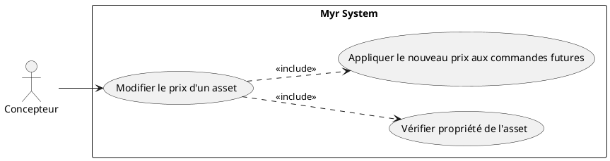
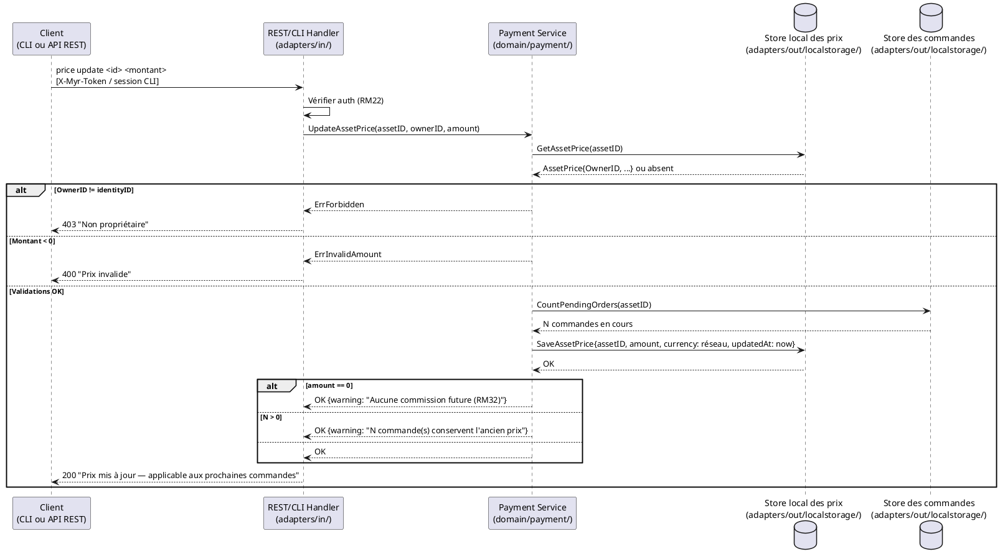

# Modifier le prix d'un asset

## Diagramme d'acteurs

## Contexte

Contrairement à UCPI04/UCPI05 (définition initiale du prix), ce use case couvre la **modification** d'un prix déjà existant sur un composant ou un module — indifféremment, puisque `Model3D` unifie les deux (§6.3 `Analyse_des_besoins.md`).

Point structurant (RM31/RM33) : **le prix n'est pas une donnée blockchain**. Contrairement au reste du domaine `payment` (commissions, transferts), le prix d'un asset est stocké **localement** côté serveur et reste **mutable** — seule la devise est fixée par réseau et non modifiable par l'auteur. La modification n'a d'effet que sur les commandes créées après la mise à jour ; les commandes déjà passées ou livrées conservent le prix figé dans `OrderItem.UnitPrice` à leur création.

Conformément au principe de parité CLI/REST, la modification doit être exposable identiquement en CLI (`myr model price update` / `myr module price update`) et via l'API REST.

## Pré-conditions

- Le concepteur est authentifié et propriétaire de l'asset (`OwnerID == identityID`)
- L'asset a un prix déjà défini (UCPI04/UCPI05) ou est en cours de première tarification
- La devise transmise, si fournie, correspond à celle du réseau (RM33) — sinon elle est ignorée au profit de la devise réseau

## Scénario

**Étape initiale :** `myr model price update <id> <montant>` (ou `myr module price update <id> <montant>`) est exécutée, ou l'appel API équivalent (`PUT /api/{components|modules}/{id}/price`)

### Flux nominal — Prix mis à jour

1. Le système vérifie que l'appelant est propriétaire de l'asset (`OwnerID`)
2. Le prix actuel est lu dans le store local (ou "non défini" en première tarification)
3. Le nouveau prix unitaire est validé (valeur ≥ 0) — la devise appliquée est celle du réseau, non modifiable (RM33)
4. Le nouveau prix est persisté localement avec horodatage (`AssetPrice.UpdatedAt`)
5. Réponse : "Prix mis à jour — applicable aux prochaines commandes"

### Flux nominal — Passage à gratuit (prix = 0)

1. Le nouveau prix transmis est 0
2. Le service avertit : "Prix nul — aucune commission ne sera générée pour les commandes futures (RM32)"
3. L'asset passe en libre accès pour toute commande future

### Flux alternatif — Commandes en cours pour cet asset

1. Des commandes existent avec `OrderItem.Status != delivered` pour cet asset
2. Le service retourne un avertissement informatif : "X commande(s) en cours conserveront l'ancien prix"
3. La modification est appliquée malgré tout — aucune commande en cours n'est bloquée ni recalculée (RM31)

### Flux erreur A — Utilisateur non propriétaire

1. `OwnerID != identityID` détecté côté serveur
2. Erreur `ErrForbidden` — "Vous n'êtes pas propriétaire de cet asset"

### Flux erreur B — Prix invalide (négatif)

1. Le montant transmis est strictement négatif
2. Erreur de validation — aucune écriture effectuée

## Post-conditions

- Le nouveau prix est actif pour toute commande créée après la mise à jour
- Les commandes existantes ou livrées conservent leur `OrderItem.UnitPrice` d'origine, inchangé (RM31)
- Si le prix passe à 0 : l'asset est en libre accès, aucune commission future n'est générée (RM32)
- Le prix n'a fait l'objet d'aucune transaction blockchain — seul l'état local a changé

## Diagramme de séquence

## Règles métier déclenchées

| Règle | Description | Détail |
|-------|-------------|--------|
| RM31 | Modification de prix applicable aux commandes futures uniquement | `OrderItem.UnitPrice` figé à la création de la commande, jamais recalculé rétroactivement |
| RM32 | Asset à prix nul → libre accès, aucune commission | Prix = 0 désactive la génération de commission pour les commandes futures |
| RM33 | Devise unique par réseau, non modifiable par l'auteur | La devise transmise par le client est ignorée au profit de celle du réseau |
| RM22 | Contrôle d'accès par rôle | Seul le propriétaire de l'asset peut modifier son prix |

## Exigences non-fonctionnelles

| ENF | Description |
|-----|-------------|
| ENF12 | Contrôle de propriété vérifié côté serveur, pas côté client |
| ENF27 | Le prix étant une donnée locale (pas blockchain), il suit les mêmes garanties de sauvegarde que le reste de `adapters/out/localstorage/` |

## Notes d'implémentation

- **Non implémenté** : aucun champ `AssetPrice`/`Price`/`Currency` sur `Model3D`, aucune route REST ni sous-commande `price` en CLI
- **À créer** : structure `AssetPrice{AssetID, OwnerID, Amount, Currency, UpdatedAt}` dans `domain/payment/`, persistée via un nouveau store `adapters/out/localstorage/price_store.go` — même store que UCPI04/UCPI05 (définition initiale du prix), pas de duplication
- **À créer** : routes `PUT /api/components/{id}/price` et `PUT /api/modules/{id}/price`, réutilisées par UCPI04/UCPI05 pour la première définition et par UCPI11 pour la modification — un seul chemin de code, pas de duplication
- **Parité CLI/REST :** `myr model price update <id> <montant>` et `myr module price update <id> <montant>` doivent appeler le même service domaine `payment` que la route REST — aucun accès direct à `localstorage` depuis l'adapter CLI
