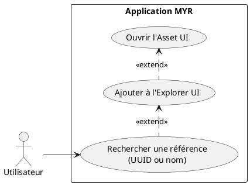
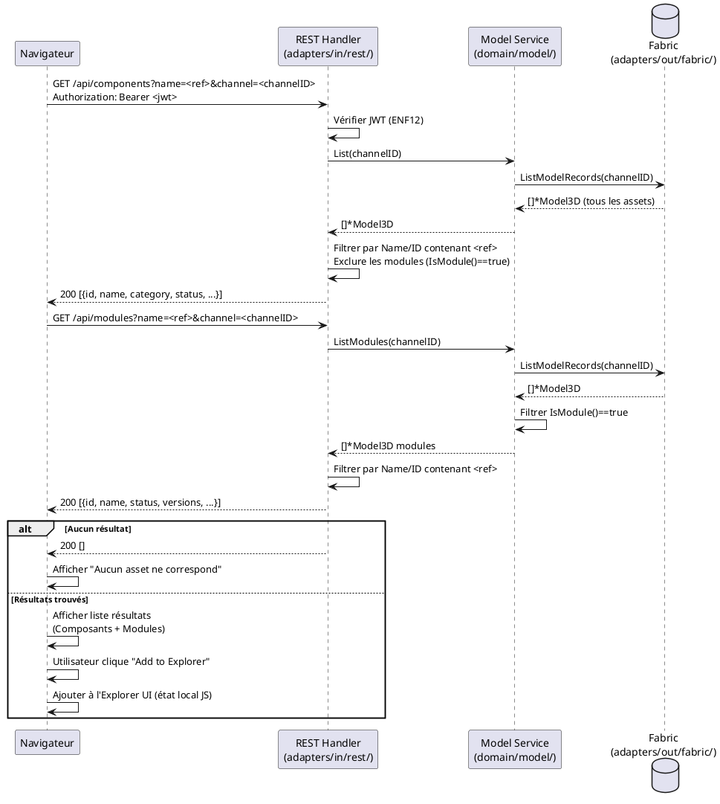

# Rechercher une référence existante

## Diagramme d'acteurs

## Contexte

La recherche par référence est le point d'entrée principal pour trouver un Composant ou un Module sur le réseau. Elle interroge la blockchain via l'API REST et retourne les assets correspondants. Les résultats peuvent être ajoutés à l'**Explorer UI** pour consultation ou édition ultérieure.

Cette fonctionnalité est accessible à tout utilisateur authentifié (`Lecteur`, `Concepteur`, `Consommateur`…). Elle est le use case de recherche le plus fréquent (importance 20 — la plus haute du domaine D8).

## Pré-conditions

- Utilisateur authentifié (rôle `Lecteur` minimum)
- Connexion réseau active
- Au moins un asset publié sur la blockchain du réseau courant

## Scénario

**Déclencheur :** L'utilisateur clique **Recherche** dans la MenuBar — la Search UI s'ouvre dans la MainWindow.

### Flux nominal — Référence trouvée (UUID exact)

1. L'utilisateur saisit l'UUID ou la référence exacte du Composant/Module dans le champ de recherche
2. Le système appelle `GET /api/components?name=<ref>` ou `GET /api/modules?name=<ref>`
3. Service : `List(channelID)` puis filtrage côté handler sur `ID == ref` ou `Name == ref`
4. Le Composant ou Module correspondant est affiché dans les résultats avec : nom, catégorie, statut, description courte
5. L'utilisateur clique **Add to Explorer** — l'asset est ajouté à l'Explorer UI
6. L'utilisateur peut cliquer l'asset dans l'Explorer pour ouvrir son Asset UI

### Flux nominal — Recherche par nom (correspondance partielle)

1. L'utilisateur saisit un nom partiel (ex : "moteur")
2. Le système filtre les assets dont `Name` contient la chaîne (insensible à la casse)
3. La liste des résultats correspondants est affichée
4. L'utilisateur sélectionne l'asset voulu et clique **Add to Explorer**

### Flux nominal — Référence introuvable

1. Aucun asset ne correspond à la référence saisie
2. Message affiché : "Aucun asset ne correspond à cette référence"
3. La Search UI reste ouverte — l'utilisateur peut affiner sa recherche

### Flux alternatif — Résultats mixtes (Composants ET Modules)

1. La recherche retourne à la fois des Composants et des Modules
2. Les deux types sont affichés avec une indication du type (icône ou badge "Composant" / "Module")
3. L'utilisateur peut filtrer par type

## Post-conditions

- L'asset trouvé est ajouté à l'Explorer UI (si l'utilisateur a cliqué **Add to Explorer**)
- L'utilisateur peut ouvrir l'Asset UI depuis l'Explorer
- Aucune modification de la blockchain

## Diagramme de séquence

## Règles métier déclenchées

| Règle | Description | Point d'application |
|-------|-------------|---------------------|
| **RM22** | Contrôle d'accès par rôle — lecture autorisée dès `Lecteur` | Middleware JWT dans les handlers REST |

## Exigences non-fonctionnelles

- **ENF12** : Authentification JWT obligatoire pour accéder à `/api/components` et `/api/modules`
- **ENF22** : Interface compatible Chrome 120+, Firefox 120+, Safari 17+, Edge 120+

## Notes d'implémentation

**Endpoints REST utilisés :**
- `GET /api/components` → `handleComponents()` (handlers.go:~441 — filtre les modules)
- `GET /api/modules` → `handleModules()` (handlers.go:~965)

**Filtrage actuel :** `handleComponents()` filtre les assets avec `m.IsModule() == true` (exclusion des modules — handlers.go:~441). Le filtrage par `name` est côté handler (boucle sur les résultats) — pas de requête filtrée côté Fabric. Pour les gros réseaux, un index de recherche côté chaincode est à envisager.

**Add to Explorer :** Cette action est entièrement côté frontend (état JS local) — elle n'appelle pas d'endpoint API. Elle mémorise l'`assetID` dans la liste affichée par l'Explorer UI.

**Accès Visiteur :** La spec D4 indique que l'accès public (sans JWT) devrait être possible pour les assets publics. Le code actuel applique `requireAuth` systématiquement — l'accès visiteur reste à implémenter (écart documenté dans l'analyse D4).
