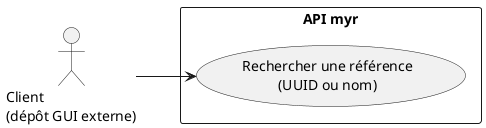
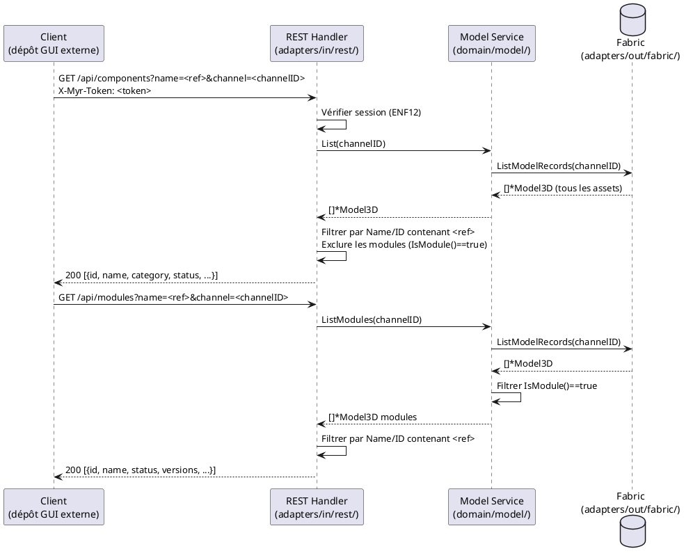

# Rechercher une référence existante

## Diagramme d'acteurs

## Contexte

La recherche par référence est le point d'entrée principal pour trouver un Composant ou un Module sur le réseau. Elle interroge la blockchain via l'API REST et retourne les assets correspondants au client (le dépôt GUI externe, typiquement, pour affichage et exploration ultérieure).

Cette fonctionnalité est accessible à tout utilisateur authentifié (`Lecteur`, `Concepteur`, `Consommateur`…). Elle est le use case de recherche le plus fréquent (importance 20 — la plus haute du domaine D8).

> La présentation des résultats (Explorer, Asset UI, MenuBar, etc.) relève du dépôt GUI externe — hors périmètre de ce document. Seuls les contrats REST et CLI ci-dessous font partie de `myr`.

## Pré-conditions

- Utilisateur authentifié (rôle `Lecteur` minimum)
- Connexion réseau active
- Au moins un asset publié sur la blockchain du réseau courant

## Scénario

### Flux nominal — Référence trouvée (UUID exact)

1. Le client envoie l'UUID ou la référence exacte du Composant/Module recherché
2. Le système appelle `GET /api/components?name=<ref>` ou `GET /api/modules?name=<ref>`
3. Service : `List(channelID)` puis filtrage côté handler sur `ID == ref` ou `Name == ref`
4. Le Composant ou Module correspondant est retourné avec : nom, catégorie, statut, description courte

### Flux nominal — Recherche par nom (correspondance partielle)

1. Le client fournit un nom partiel (ex : "moteur")
2. Le système filtre les assets dont `Name` contient la chaîne (insensible à la casse)
3. La liste des résultats correspondants est retournée

### Flux nominal — Référence introuvable

1. Aucun asset ne correspond à la référence fournie
2. Le système retourne une liste vide

### Flux alternatif — Résultats mixtes (Composants ET Modules)

1. La recherche retourne à la fois des Composants et des Modules
2. Chaque résultat porte une indication de son type (Composant / Module)

## Post-conditions

- Le client reçoit la liste des assets correspondants
- Aucune modification de la blockchain

## Diagramme de séquence

## Règles métier déclenchées

| Règle | Description | Point d'application |
|-------|-------------|---------------------|
| **RM22** | Contrôle d'accès par rôle — lecture autorisée dès `Lecteur` | Middleware `requireAuth`/`requireRole` dans les handlers REST |

## Exigences non-fonctionnelles

- **ENF12** : Authentification par session (token opaque `X-Myr-Token`) obligatoire pour accéder à `/api/components` et `/api/modules`

## Notes d'implémentation

**Endpoints REST utilisés :**
- `GET /api/components` → `handleComponents()` (handlers.go:~441 — filtre les modules)
- `GET /api/modules` → `handleModules()` (handlers.go:~965)

**Filtrage actuel :** `handleComponents()` filtre les assets avec `m.IsModule() == true` (exclusion des modules — handlers.go:~441). Le filtrage par `name` est côté handler (boucle sur les résultats) — pas de requête filtrée côté Fabric. Pour les gros réseaux, un index de recherche côté chaincode est à envisager.

**Accès Visiteur :** La spec D4 indique que l'accès public (sans session) devrait être possible pour les assets publics. Le code actuel applique `requireAuth` systématiquement — l'accès visiteur reste à implémenter (écart documenté dans l'analyse D4).

**Commande CLI équivalente (alias limité) :** `myr model get <id>` (méthode `Get`) est l'équivalent direct d'une recherche par UUID/référence exacte. `myr model list [--channel <id>]` (méthode `List`) permet de parcourir les assets pour une recherche par nom partiel, en l'absence de méthode de filtre serveur dédiée dans `ModelService` (même limite que UCCL01). `myr module list` couvre le pendant module de `GET /api/modules?name=<ref>`.
