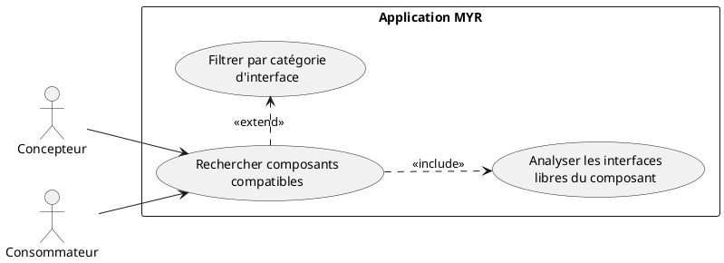
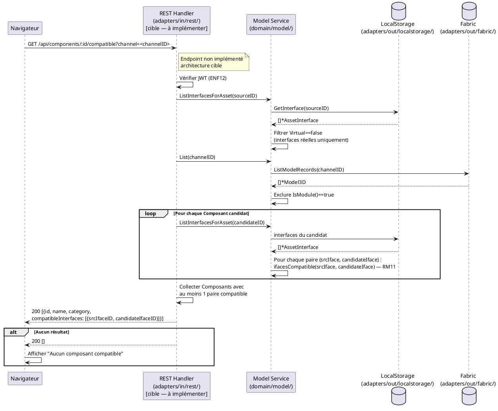

# Rechercher les Composants compatibles

## Diagramme d'acteurs

## Contexte

À partir d'un Composant sélectionné, lister tous les Composants du réseau dont les Interfaces sont compatibles avec au moins une Interface libre du Composant source. Cette fonctionnalité est essentielle pour guider la composition dans l'Atelier : elle permet au Concepteur de découvrir les Composants complémentaires avant d'assembler un Module.

La compatibilité est déterminée par l'algorithme `ifacesCompatible()` (RM11) : même catégorie + même tag (manquant — E2) + même type + sens complémentaires + plages de valeurs se chevauchant.

**Statut d'implémentation :** L'endpoint `/api/components/:id/compatible` est **absent** du code actuel. Cette fonctionnalité est à implémenter.

## Pré-conditions

- Utilisateur authentifié (rôle `Concepteur` ou `Consommateur`)
- Un Composant sélectionné dans l'Explorer UI ou l'Asset UI
- Le Composant possède au moins une Interface définie (non virtuelle)
- La blockchain est accessible

## Scénario

**Déclencheur :** L'utilisateur sélectionne un Composant et accède à **Composants compatibles** depuis l'Asset UI.

### Flux nominal — Composants compatibles trouvés

1. L'utilisateur clique **Composants compatibles** sur l'Asset UI d'un Composant
2. Le système appelle `GET /api/components/:id/compatible`
3. Handler : récupère les Interfaces du Composant source via `ListInterfacesForAsset(sourceID)` — filtre les virtuelles
4. Handler : récupère tous les Composants du réseau via `List(channelID)` — exclut les modules
5. Pour chaque Composant candidat, récupère ses Interfaces et applique `ifacesCompatible()` entre chaque paire (source libre ↔ candidat libre)
6. La liste des Composants ayant au moins une Interface compatible est retournée
7. Les résultats sont affichés avec : nom, catégorie, type d'interface compatible
8. L'utilisateur peut ajouter directement un Composant compatible à l'Atelier depuis les résultats

### Flux nominal — Aucun Composant compatible

1. Aucun Composant du réseau n'a d'Interface compatible avec les interfaces libres du Composant source
2. Message : "Aucun composant compatible trouvé sur ce réseau"
3. L'Asset UI reste affichée

### Flux alternatif — Filtrage par catégorie d'interface

1. L'utilisateur filtre les résultats par catégorie d'interface (`ELEC`, `MECA`, `HYD`)
2. La liste est mise à jour pour n'afficher que les Composants avec une compatibilité dans cette catégorie
3. L'utilisateur peut combiner plusieurs catégories

### Flux erreur — Composant sans interface définie

1. Le Composant source n'a aucune Interface définie (seulement un slot virtuel)
2. Aucune interface réelle à comparer — la recherche retourne une liste vide
3. Message informatif : "Ce composant n'a pas encore d'interface physique définie — ajoutez des interfaces pour trouver des composants compatibles"

### Flux erreur — Blockchain indisponible

1. L'appel à `ListModelRecords(channelID)` échoue
2. Message : "Impossible de contacter la blockchain — réessayez"

## Post-conditions

- La liste des Composants compatibles est affichée
- Aucune modification de la blockchain
- L'utilisateur peut initier un ajout à l'Atelier depuis les résultats

## Diagramme de séquence

## Règles métier déclenchées

| Règle | Description | Point d'application |
|-------|-------------|---------------------|
| **RM10** | Compatibilité vérifiée selon les critères RM11 | `ifacesCompatible()` (service.go:~211) réutilisée |
| **RM11** | 5 critères : catégorie + tag (absent E2) + type + sens + valeurs | `ifacesCompatible()` — tag manquant dans le code |

## Exigences non-fonctionnelles

- **ENF12** : Authentification JWT obligatoire
- **ENF22** : Interface compatible navigateurs modernes

## Notes d'implémentation

**Endpoint manquant :** `GET /api/components/:id/compatible` n'existe pas dans `server.go` ni dans `handlers.go`. Il doit être ajouté :
1. Route dans `server.go` : `mux.HandleFunc("/api/components/", contrib(s.handler.handleComponent))`  — la route générique existe mais le chemin `/:id/compatible` n'est pas géré dans `handleComponent()`
2. Handler : extraire l'ID source depuis le path, appeler `ListInterfacesForAsset()`, itérer les candidats, appliquer `ifacesCompatible()`

**Performance :** L'algorithme est O(n × m) où n = nombre de Composants sur le réseau et m = interfaces par Composant. Pour les gros réseaux (milliers de Composants), un index par catégorie d'interface côté chaincode est recommandé. La version initiale peut se contenter du filtrage côté handler.

**Réutilisation de `ifacesCompatible()`** : La fonction est déjà implémentée dans `service.go:~211`. Elle doit être rendue accessible depuis le handler ou encapsulée dans une méthode de service publique comme `FindCompatibleAssets(sourceID, channelID string) ([]*Model3D, error)`.

**Écart E2 (tag manquant) :** L'algorithme actuel compare catégorie + type + sens + valeurs (4 critères). RM11 en définit 5. Le champ `Tag` doit être ajouté à `AssetInterface` avant l'implémentation complète.
