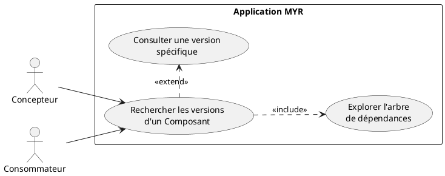
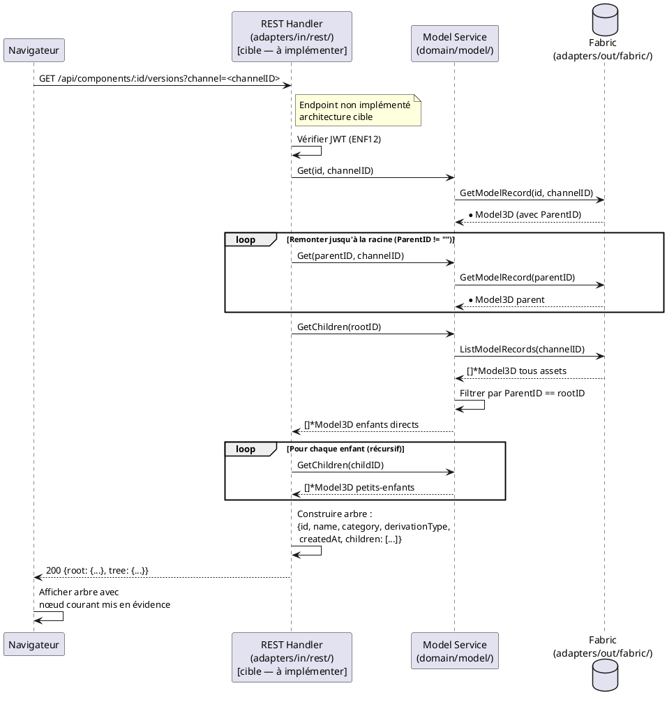

# Rechercher les versions des Composants

## Diagramme d'acteurs

## Contexte

Chaque Composant peut avoir une généalogie : il peut dériver d'un parent (via `ParentID`) selon l'une des 7 catégories de dérivation (RM02 : amélioration, variation, adaptation, dérivation, extension, régression, découpage). L'arbre de versions permet de visualiser cette généalogie : parent → enfants avec leur type de relation.

Cette fonctionnalité permet au Concepteur de naviguer dans la lignée d'un Composant pour trouver la version la plus adaptée (plus récente, plus légère, adaptée à une contrainte spécifique…). Elle permet aussi de tracer l'impact d'une modification : "quels Composants dépendent de celui-ci ?"

**Note :** Le champ `Model3D.Versions []Version` porte l'historique des fichiers CAO d'un même Composant (SHA-256 + référence IPFS), distinct de la généalogie `ParentID` qui représente la relation entre Composants différents. Cet UC traite la **généalogie `ParentID`** (relations entre assets), pas les versions de fichier.

**Statut d'implémentation :** `GetChildren(parentID)` est implémenté dans le service (service.go:~251). Aucun endpoint dédié à l'arbre de versions n'existe — à implémenter.

## Pré-conditions

- Utilisateur authentifié (rôle `Lecteur` minimum)
- Un Composant sélectionné dans l'Explorer UI ou l'Asset UI
- Le Composant est accessible sur la blockchain

## Scénario

**Déclencheur :** L'utilisateur sélectionne un Composant et accède à **Versions** depuis l'Asset UI.

### Flux nominal — Arbre de versions affiché

1. L'utilisateur clique **Versions** sur l'Asset UI d'un Composant
2. Le système appelle `GET /api/components/:id/versions`
3. Handler : remonte la chaîne ascendante via `ParentID` jusqu'à la racine (`ParentID == ""`)
4. Handler : descend récursivement via `GetChildren()` pour trouver tous les enfants
5. L'arbre est construit : nœud racine → branches par type de dérivation
6. Chaque nœud affiche : nom, catégorie de dérivation, date de création
7. Le Composant courant est mis en évidence dans l'arbre

### Flux alternatif — Navigation dans l'arbre

1. L'utilisateur clique sur un nœud de l'arbre (version parente ou enfant)
2. L'Asset UI du Composant sélectionné s'ouvre
3. L'arbre se recentre sur le nouveau Composant

### Flux alternatif — Composant racine (aucun parent)

1. Le Composant a `ParentID == ""` — il est une `base` ou une racine orpheline
2. L'arbre n'affiche que le nœud courant et ses enfants (descend seulement)
3. Message : "Ce composant est une version racine"

### Flux alternatif — Composant feuille (aucun enfant)

1. `GetChildren(id)` retourne une liste vide
2. L'arbre affiche uniquement la chaîne ascendante jusqu'à la racine
3. Message : "Aucune version dérivée de ce composant"

### Flux erreur — Composant introuvable

1. L'ID ne correspond à aucun asset sur la blockchain
2. Message : "Composant introuvable"

## Post-conditions

- L'arbre complet des versions du Composant est visible (ancêtres + descendants)
- Aucune modification de la blockchain
- L'utilisateur peut naviguer vers n'importe quelle version depuis l'arbre

## Diagramme de séquence

## Règles métier déclenchées

| Règle | Description | Point d'application |
|-------|-------------|---------------------|
| **RM02** | 8 catégories de dérivation — affichées sur chaque nœud de l'arbre | `Model3D.Category` |
| **RM05** | `ParentID` obligatoire pour tout asset non-`base` | Invariant pour les nœuds non-racine de l'arbre |

## Exigences non-fonctionnelles

- **ENF12** : Authentification JWT obligatoire
- **ENF22** : Interface compatible navigateurs modernes

## Notes d'implémentation

**Endpoints manquants :** `GET /api/components/:id/versions` n'existe pas. La route `handleComponent()` gère `/api/components/:id` mais pas le chemin enfant `/versions`.

**`GetChildren()` existant :** `service.GetChildren(parentID)` (service.go:~251) effectue un `ListModelRecords("")` puis filtre par `ParentID`. Réutilisable directement pour construire l'arbre descendant.

**Remontée ascendante :** Aucune fonction de remontée n'existe — à implémenter par itération sur `Get(m.ParentID)` jusqu'à `ParentID == ""`. Protéger contre les cycles potentiels (compteur de profondeur max, ex : 50).

**Catégorie `decoupage` absente (E1) :** La catégorie `decoupage` (RM02) n'est pas définie dans `entity.go`. Les Composants créés via UCAM05 n'auront pas cette catégorie dans le code actuel. L'arbre doit prévoir ce cas.

**Rendu UI :** D3.js est disponible dans `ui/static/js/` — il est adapté pour le rendu d'arbres de dépendances (force-directed graph ou tree layout). Le rendu hiérarchique est à implémenter côté frontend.

**Distinction `Versions []Version` vs arbre `ParentID` :** `Model3D.Versions` liste les fichiers CAO successifs d'un même asset (historique de fichier IPFS). L'arbre de cet UC est basé sur `ParentID` (généalogie inter-assets). Les deux doivent être clairement distincts dans l'UI.
