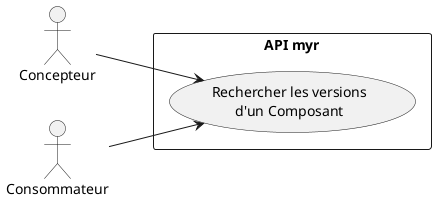
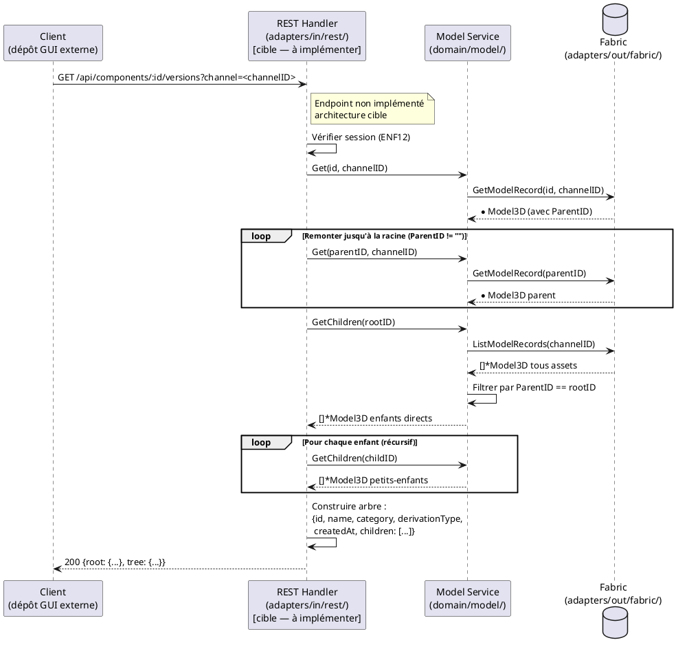

# Rechercher les versions des Composants

## Diagramme d'acteurs

## Contexte

Chaque Composant peut avoir une généalogie : il peut dériver d'un parent (via `ParentID`) selon l'une des 7 catégories de dérivation (RM02 : amélioration, variation, adaptation, dérivation, extension, régression, découpage). L'arbre de versions permet de visualiser cette généalogie : parent → enfants avec leur type de relation.

Cette fonctionnalité permet au Concepteur de naviguer dans la lignée d'un Composant pour trouver la version la plus adaptée (plus récente, plus légère, adaptée à une contrainte spécifique…). Elle permet aussi de tracer l'impact d'une modification : "quels Composants dépendent de celui-ci ?"

**Note :** Le champ `Model3D.Versions []Version` porte l'historique des fichiers CAO d'un même Composant (SHA-256 + référence IPFS), distinct de la généalogie `ParentID` qui représente la relation entre Composants différents. Cet UC traite la **généalogie `ParentID`** (relations entre assets), pas les versions de fichier.

**Statut d'implémentation :** `GetChildren(parentID)` est implémenté dans le service (service.go:~251). Aucun endpoint dédié à l'arbre de versions n'existe — à implémenter.

> Le rendu de l'arbre (navigation, mise en évidence, layout graphique) relève du dépôt GUI externe — hors périmètre de ce document. Seuls les contrats REST et CLI ci-dessous font partie de `myr`.

## Pré-conditions

- Utilisateur authentifié (rôle `Lecteur` minimum)
- Un Composant identifié (ID connu du client)
- Le Composant est accessible sur la blockchain

## Scénario

### Flux nominal — Arbre de versions retourné

1. Le client appelle `GET /api/components/:id/versions`
2. Handler : remonte la chaîne ascendante via `ParentID` jusqu'à la racine (`ParentID == ""`)
3. Handler : descend récursivement via `GetChildren()` pour trouver tous les enfants
4. L'arbre est construit : nœud racine → branches par type de dérivation
5. Chaque nœud contient : nom, catégorie de dérivation, date de création

### Flux alternatif — Composant racine (aucun parent)

1. Le Composant a `ParentID == ""` — il est une `base` ou une racine orpheline
2. L'arbre ne contient que le nœud courant et ses enfants (descend seulement)

### Flux alternatif — Composant feuille (aucun enfant)

1. `GetChildren(id)` retourne une liste vide
2. L'arbre ne contient que la chaîne ascendante jusqu'à la racine

### Flux erreur — Composant introuvable

1. L'ID ne correspond à aucun asset sur la blockchain
2. Le système retourne une erreur "Composant introuvable"

## Post-conditions

- L'arbre complet des versions du Composant est retourné (ancêtres + descendants)
- Aucune modification de la blockchain

## Diagramme de séquence

## Règles métier déclenchées

| Règle | Description | Point d'application |
|-------|-------------|---------------------|
| **RM02** | 8 catégories de dérivation — affichées sur chaque nœud de l'arbre | `Model3D.Category` |
| **RM05** | `ParentID` obligatoire pour tout asset non-`base` | Invariant pour les nœuds non-racine de l'arbre |

## Exigences non-fonctionnelles

- **ENF12** : Authentification par session (token opaque) obligatoire

## Notes d'implémentation

**Endpoints manquants :** `GET /api/components/:id/versions` n'existe pas. La route `handleComponent()` gère `/api/components/:id` mais pas le chemin enfant `/versions`.

**`GetChildren()` existant :** `service.GetChildren(parentID)` (service.go:~251) effectue un `ListModelRecords("")` puis filtre par `ParentID`. Réutilisable directement pour construire l'arbre descendant.

**Remontée ascendante :** Aucune fonction de remontée n'existe — à implémenter par itération sur `Get(m.ParentID)` jusqu'à `ParentID == ""`. Protéger contre les cycles potentiels (compteur de profondeur max, ex : 50).

**Catégorie `decoupage` absente (E1) :** La catégorie `decoupage` (RM02) n'est pas définie dans `entity.go`. Les Composants créés via UCAM05 n'auront pas cette catégorie dans le code actuel. L'arbre doit prévoir ce cas.

**Distinction `Versions []Version` vs arbre `ParentID` :** `Model3D.Versions` liste les fichiers CAO successifs d'un même asset (historique de fichier IPFS). L'arbre de cet UC est basé sur `ParentID` (généalogie inter-assets). Le contrat REST doit garder les deux structures clairement distinctes dans sa réponse.

**Commande CLI équivalente (alias limité) :** `myr model children <parentID>` (méthode `GetChildren`, déjà exposée par `ModelService`) couvre la branche descendante. La remontée ascendante n'a pas de méthode dédiée côté service — ni le REST ni le CLI n'offrent aujourd'hui de commande unique pour l'arbre complet ; elle se reconstitue par appels itérés à `myr model get <parentID>`, à l'image de ce que ferait le futur handler REST (voir Notes d'implémentation ci-dessus).
