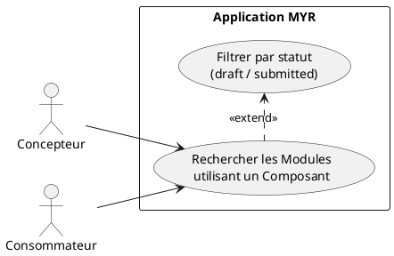
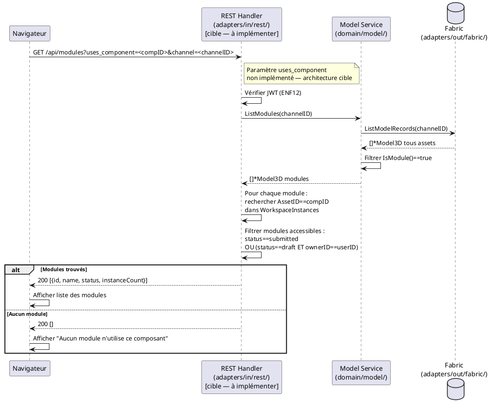

# Rechercher les Modules qui utilisent un Composant

## Diagramme d'acteurs



## Contexte

À partir d'un Composant sélectionné, lister tous les Modules du réseau qui l'intègrent dans leur assemblage. Cette fonctionnalité répond à deux besoins :
- **Impact analysis :** Un Concepteur veut savoir quels Modules seront affectés s'il modifie un Composant (nécessité de fork — RM19)
- **Découverte :** Un Consommateur veut trouver des Modules déjà assemblés utilisant un Composant spécifique qu'il connaît

Un Module "utilise" un Composant si son `WorkspaceInstances` contient une instance avec `AssetID == composantID`.

**Statut d'implémentation :** L'endpoint `/api/modules?uses_component=:id` est **absent** du code actuel. À implémenter.

## Pré-conditions

- Utilisateur authentifié (rôle `Lecteur` minimum)
- Un Composant sélectionné dans l'Explorer UI ou l'Asset UI
- La blockchain est accessible

## Scénario

**Déclencheur :** L'utilisateur sélectionne un Composant et accède à **Modules utilisant ce composant** depuis l'Asset UI.

### Flux nominal — Modules trouvés

1. L'utilisateur clique **Modules utilisant ce composant** sur l'Asset UI d'un Composant
2. Le système appelle `GET /api/modules?uses_component=<componentID>&channel=<channelID>`
3. Handler : `ListModules(channelID)` récupère tous les Modules du réseau
4. Handler : filtre les Modules dont `WorkspaceInstances` contient au moins une entrée avec `AssetID == componentID`
5. La liste des Modules correspondants est affichée avec : nom, statut (`draft`/`submitted`), nombre de liaisons
6. L'utilisateur peut cliquer sur un Module pour ouvrir son Asset UI

### Flux nominal — Aucun Module utilisant ce Composant

1. Aucun Module ne contient d'instance du Composant dans son Atelier
2. Message : "Aucun module n'utilise ce composant"

### Flux alternatif — Filtrage par statut

1. L'utilisateur filtre les résultats par statut `submitted` (Modules publics uniquement)
2. Les Modules en état `draft` (non publiés, appartenant à d'autres) sont exclus
3. La liste mise à jour n'affiche que les Modules soumis

### Flux alternatif — Composant utilisé dans un Module non accessible (draft d'un autre utilisateur)

1. Un Module contient le Composant mais est en état `draft` appartenant à un autre utilisateur
2. Ce Module n'apparaît pas dans les résultats (non visible sur le réseau tant que non soumis)
3. Comportement transparent pour l'utilisateur

## Post-conditions

- La liste des Modules utilisant le Composant est affichée
- Aucune modification de la blockchain
- L'utilisateur peut naviguer vers les Modules depuis les résultats

## Diagramme de séquence



## Règles métier déclenchées

| Règle | Description | Point d'application |
|-------|-------------|---------------------|
| **RM16** | Les Modules en `draft` appartenant à d'autres utilisateurs sont invisibles | Filtre sur `status + ownerID` dans le handler |
| **RM19** | Impact analysis — un Concepteur doit savoir quels Modules sont affectés avant de modifier un Composant | Contexte d'utilisation de cet UC |

## Exigences non-fonctionnelles

- **ENF12** : Authentification JWT obligatoire
- **ENF22** : Interface compatible navigateurs modernes

## Notes d'implémentation

**Endpoint manquant :** Le handler `handleModules()` (handlers.go:~965) ne supporte pas le paramètre `uses_component`. À ajouter dans la branche `GET` de `handleModules()` :
```go
if usesComp := r.URL.Query().Get("uses_component"); usesComp != "" {
    // filtrer filtered par WorkspaceInstances contenant usesComp
}
```

**Filtrage côté handler :** La recherche est effectuée côté handler (pas dans le chaincode Fabric) car `WorkspaceInstances` est un champ complexe difficile à requêter dans le chaincode v1. Pour les gros réseaux, un index secondaire dans le chaincode est à envisager.

**Modules `draft` d'autres utilisateurs :** Les Modules en `draft` ne doivent apparaître que pour leur propriétaire. L'information `ownerID` est disponible dans `Model3D.OwnerID`. Le handler doit extraire l'`userID` du JWT pour appliquer ce filtre.

**Cas des modules imbriqués :** Un Module peut contenir un sous-Module qui lui-même contient le Composant cible. Le filtrage actuel (direct `WorkspaceInstances`) ne détecte pas cette utilisation indirecte. La profondeur de recherche (directe vs récursive) est une décision de conception à soumettre au PO.
