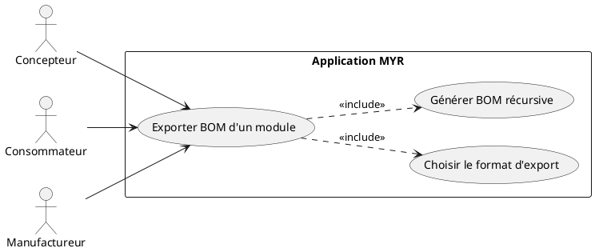
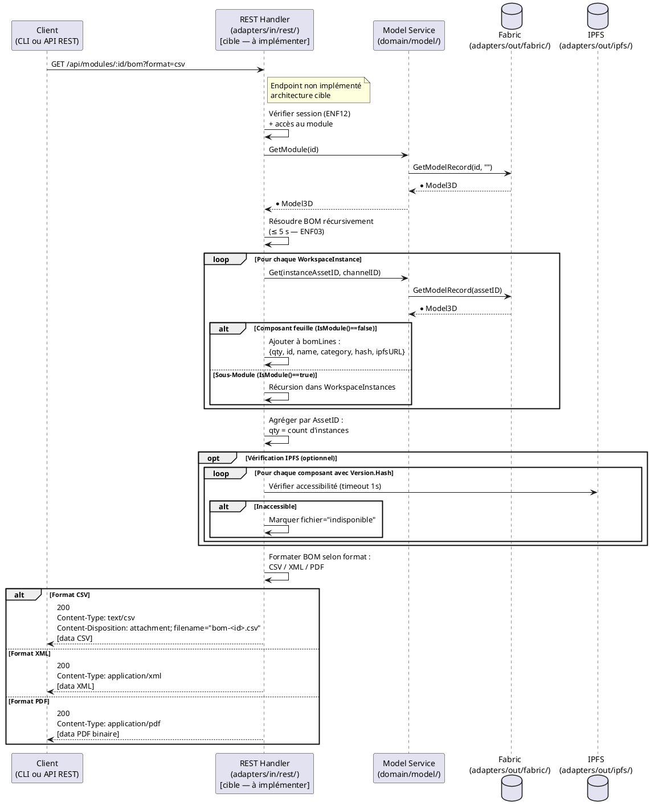

# Exporter BOM Module

## Diagramme d'acteurs



## Contexte

La **BOM** (Bill of Materials — Nomenclature) liste tous les Composants constitutifs d'un Module avec leurs quantités et références. Elle est indispensable pour la fabrication (commande pièces), la vérification de conformité et l'analyse de coût. L'export doit être disponible dans plusieurs formats : CSV, XML, PDF.

La BOM est **récursive** : un Module peut contenir des sous-Modules, qui contiennent eux-mêmes des Composants. La BOM finale doit descendre jusqu'aux Composants feuilles (sans sous-modules).

La BOM inclut aussi les fichiers 3D des Composants (référence IPFS via `Model3D.Versions`). Si un fichier IPFS est indisponible (nœud hors ligne), la BOM reste exportable avec un placeholder.

**ENF03 :** La génération de la BOM doit se terminer en **≤ 5 secondes** pour 100 composants.

**Statut d'implémentation :** Aucun endpoint BOM n'existe dans le code actuel. À implémenter.

## Pré-conditions

- Utilisateur authentifié (rôle `Lecteur`, `Concepteur`, `Consommateur`, ou `Manufactureur`)
- Un identifiant de Module connu du client
- Le Module est accessible (état `submitted` ou `draft` si propriétaire)

## Scénario

**Étape initiale :** `GET /api/modules/:id/bom?format=csv` est appelée (ou l'équivalent CLI `myr module bom export`) avec le format souhaité

### Flux nominal — BOM complète exportée

1. Le format d'export est transmis : `CSV`, `XML`, ou `PDF`
2. Handler : résout récursivement la BOM via `WorkspaceInstances` :
   - Pour chaque instance : si Composant → ajoute à la BOM (quantité incrémentée si même AssetID)
   - Si sous-Module → récursion dans ses `WorkspaceInstances`
3. Pour chaque Composant feuille : récupère le nom, catégorie, hash, référence IPFS (`Versions[last].Hash`)
4. La BOM est générée avec les colonnes : quantité, référence (ID), nom, catégorie, hash SHA-256, URL IPFS
5. Le fichier est retourné avec l'en-tête `Content-Disposition: attachment`

### Flux alternatif — Composants avec fichiers IPFS indisponibles

1. Pour un Composant, `Versions[last].Hash` référence un fichier non accessible sur le réseau IPFS
2. Le handler tente de vérifier l'accessibilité (optionnel selon config) — timeout court (1 s)
3. Le Composant est inclus dans la BOM avec `fichier: "indisponible"` à la place de l'URL IPFS
4. Avertissement dans la réponse : "X composant(s) sans fichier accessible — BOM partielle"
5. L'export est proposé avec les données disponibles

### Flux alternatif — Module avec instances multiples du même Composant (RM15)

1. Un Composant est instancié plusieurs fois dans le Module (RM15 — instances indépendantes)
2. La BOM agrège les instances : quantité = nombre d'instances du même `AssetID`
3. Les informations du Composant (nom, hash, URL IPFS) sont dédupliquées

### Flux erreur — Module introuvable

1. L'ID du Module ne correspond à aucun record
2. Réponse `404 Not Found`

### Flux erreur — Timeout de génération (ENF03)

1. La génération de la BOM dépasse 5 secondes (module très profond ou blockchain lente)
2. Le handler retourne `503 Service Unavailable` avec message : "Génération trop longue — réessayez"
3. Aucun fichier partiel exporté

## Post-conditions

- Le fichier BOM est généré et retourné dans la réponse
- Aucune modification de la blockchain
- Les composants sans fichier IPFS sont signalés mais n'empêchent pas l'export

## Diagramme de séquence



## Règles métier déclenchées

| Règle | Description | Point d'application |
|-------|-------------|---------------------|
| **RM15** | Instances multiples du même Composant → quantité agrégée dans la BOM | Comptage des instances par `AssetID` |

## Exigences non-fonctionnelles

- **ENF03** : Génération BOM ≤ 5 s pour 100 composants — timeout côté handler, récursion avec cache
- **ENF12** : Authentification par session (token opaque) obligatoire

## Notes d'implémentation

**Endpoint manquant :** `GET /api/modules/:id/bom` n'existe pas. À ajouter dans `handleModule()` (handlers.go) :
```go
// /api/modules/:id/bom
if strings.HasSuffix(rest, "/bom") {
    h.handleModuleBOM(w, r, id)
    return
}
```

**Récursion avec cache :** Pour respecter ENF03 (≤ 5 s / 100 composants), utiliser un cache `map[string]*Model3D` pour éviter les appels Fabric redondants. Le même pattern que `getModuleInterfacesInto()` (service.go:~640) peut être reproduit.

**Formats d'export :**
- **CSV** : simple, recommandé en priorité (colonnes : qty, id, name, category, hash, ipfs_url, file_status)
- **XML** : structure hiérarchique (arbre de sous-modules possible)
- **PDF** : nécessite une bibliothèque Go de génération PDF (ex: `github.com/jung-kurt/gofpdf`) — priorité basse

**Champ `Versions` :** La référence IPFS du fichier CAO est dans `Model3D.Versions[len-1].Hash` (dernière version du fichier). Si `Versions` est vide (Composant sans fichier), la colonne IPFS est vide.

**ENF03 — Stratégie de performance :** Paralléliser les appels `GetModelRecord` avec des goroutines + `sync.WaitGroup` pour les instances indépendantes au même niveau de l'arbre. Un cache par `assetID` évite les appels redondants pour les instances multiples (RM15).

**Questions ouvertes pour le PO :**
- La BOM doit-elle inclure les sous-modules comme lignes agrégées, ou uniquement les Composants feuilles ?
- Faut-il inclure les prix des Composants dans la BOM (si définis — UCPI04/05) ?
- Le format PDF est-il prioritaire pour v1 ?

**Commande CLI équivalente (point ouvert) :** Aucune méthode `ModelService` de résolution de nomenclature n'existe — ni l'endpoint REST (`GET /api/modules/:id/bom`) ni une commande CLI (`myr module bom-export`, à concevoir) ne sont disponibles tant que ce point n'est pas conçu au niveau du domaine (cf. `specs/3-Conception/DC_CLI_Model.md` § 6 point 3). En attendant, une BOM partielle et manuelle peut être reconstituée par script à partir de `myr module get <id>` (instances) et `myr model get <assetID>` (métadonnées par composant), sans export de fichier ni agrégation automatique des quantités (RM15).
