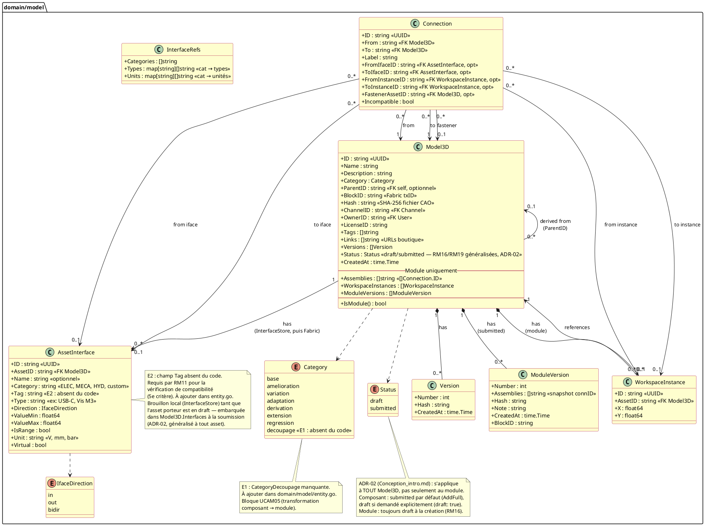
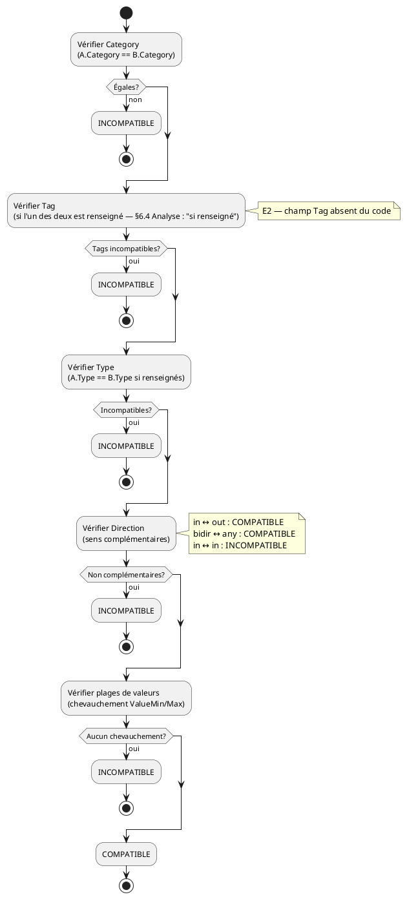
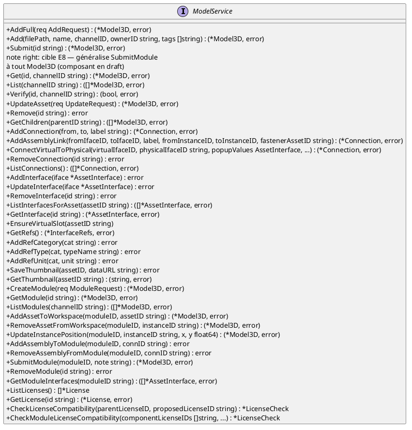
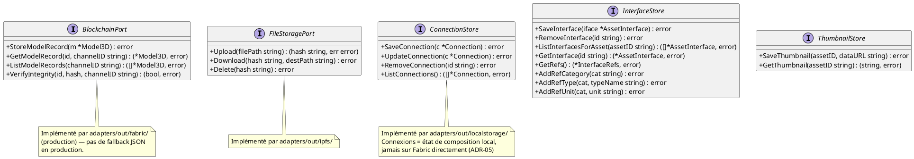

# Architecture — Composition (D3/D5/D6 : composant, assemblage, module)

> Phase 3 — Arrington | Use cases : UCCE01–06, UCAM01–08, UCMOD01–06 | Domaine : `domain/model`

---

## 1. Objectif

Il couvre le cœur fonctionnel de Myr : l'entité unifiée `Model3D` (ADR-01, `Conception_intro.md`), les interfaces et liaisons entre assets, et le cycle de composition d'un module.

Les entités elles-mêmes (attributs, types) sont normatives dans `Modele_Domaine.md` §2/§3 — ce document ne les reproduit que pour donner le contexte des diagrammes ; en cas de divergence, `Modele_Domaine.md` fait foi. Les commandes CLI/API sont normatives dans `DC_CLI_Model.md` — ce document explique le *pourquoi*, pas la syntaxe.

---

## 2. Diagramme de classes



`License` (catalogue de licences, `domain/model/license.go`) n'est pas centralisée dans `Modele_Domaine.md` (voir `Modele_Domaine.md` §5 « Informations manquantes ») — hors périmètre de ce document.

---

## 3. Diagramme d'états — Model3D

Depuis ADR-02 (`Conception_intro.md` §6), le cycle s'applique à **tout** `Model3D` — composant ou module — avec un comportement par défaut différent selon le type.

```plantuml
@startuml
skinparam state {
  BackgroundColor #FEFECE
  BorderColor #A80036
}
title États d'un Asset (Model3D) — ADR-02 généralisé

state "Composant (comportement par défaut)" {
  [*] --> submitted_direct : AddFull()\nvalidation + hash SHA-256\n+ StoreModelRecord (1 seule tx Fabric)
  state submitted_direct : Status = submitted\nInterfaces embarquées dès la création\nImmuable (RM19)
}

state "Composant en brouillon (draft: true explicite)" {
  [*] --> draft_asset : AddFull(draft: true)\nvalidation + hash SHA-256\nPAS de tx Fabric

  state draft_asset : Status = draft\nInterfaces éditables localement\n(InterfaceStore) sans coût blockchain

  draft_asset --> draft_asset : AddInterface / UpdateInterface\n/ EnsureVirtualSlot (UCCE06, UCAM03)

  draft_asset --> asset_submitted : Submit()\ncible E8 — généralise SubmitModule\nembarque Interfaces, 1 seule tx Fabric

  state asset_submitted : Status = submitted\nImmuable (RM19)
}

state "Module (toujours créé en brouillon — RM16)" {
  [*] --> module_draft : CreateModule()

  state module_draft : Status = draft\nAssemblies modifiables\nWorkspaceInstances modifiables
  state module_submitted : Status = submitted\nModuleVersion créée\nImmuable (RM19)

  module_draft --> module_submitted : SubmitModule()\nrequiert len(Assemblies)>0 (RM17)
}

submitted_direct --> fork : modification tentée\n⚠️ fork non contraint (E5)
asset_submitted --> fork : idem
module_submitted --> fork : idem
fork : nouveau Model3D en draft\nParentID = asset d'origine\nasset précédent inchangé (immuable)
fork --> [*] : Submit() / SubmitModule()\nsur le fork

note "Un composant peut devenir\nun module via Category=decoupage\n(UCAM05 — bloqué par E1)" as N1
@enduml
```

---

## 4. Description des classes

### Model3D

- **Rôle :** Entité centrale unifiée. Composant si `Hash != ""` et `WorkspaceInstances == nil`. Module si `WorkspaceInstances != nil`. La distinction est fonctionnelle, pas structurelle (ADR-01).
- **Invariants :**
  - `ID` est généré côté serveur — jamais fourni par le client (RM04).
  - `Category != base` → `ParentID` obligatoire (RM05).
  - `Category = base` → soumission à l'anti-plagiat SHA-256 + SCM (RM01, voir §6).
  - `OwnerID` doit correspondre au `UserID`/pseudo de la session — **non validé dans le code actuel** (écart sécurité, voir `Modele_Domaine.md` §2 note sur `owner_id`).
  - `BlockID` non vide → asset enregistré sur Fabric, immuable.
  - `Status = submitted` → toute modification doit passer par un fork (RM19 — **non contraint dans le code actuel**, écart E5).
- **Cycle de vie composant (par défaut) :** `AddFull` → validation → `StoreModelRecord` → `submitted` (une seule transaction).
- **Cycle de vie composant (brouillon explicite) :** `AddFull(draft: true)` → `draft` → édition locale des interfaces → `Submit` (cible E8) → `submitted`.
- **Cycle de vie module :** `CreateModule` → `draft` → `SubmitModule` → `submitted`.

### AssetInterface

- **Rôle :** Décrit un point de connexion physique ou un slot virtuel d'un composant. Deux interfaces sont compatibles si les 5 critères de RM11 sont satisfaits (§5).
- **Invariants :**
  - Une interface engagée dans une `Connection` ne peut plus être utilisée dans une autre (RM09).
  - `Virtual: true` = slot non encore matérialisé — tout asset possède toujours au moins un slot virtuel (RM13, `EnsureVirtualSlot`).
  - Champ `Tag` **manquant dans le code** (écart E2) — requis pour la vérification de compatibilité (5e critère RM11).
  - Éditée localement (`InterfaceStore`) tant que l'asset porteur est en `draft` ; embarquée dans `Model3D.Interfaces` à la soumission (ADR-02).

### Connection

- **Rôle :** Liaison entre deux assets (ou instances dans la composition d'un module). Stockée localement — jamais sur Fabric directement (ADR-05, `Conception_intro.md`). Fait partie du snapshot `ModuleVersion.Assemblies` lors de la soumission du module.
- **Invariants :**
  - `FromIfaceID` et `ToIfaceID` doivent pointer vers des interfaces compatibles (RM11).
  - `Incompatible: true` si les interfaces ont évolué après la création de la liaison — jamais supprimée automatiquement (RM12).
  - `FastenerAssetID` : asset d'accroche (vis, câble) — vide si liaison directe.

### WorkspaceInstance

- **Rôle :** Référence d'une instance d'un asset dans la composition d'un module. Permet d'avoir le même composant plusieurs fois, en instances indépendantes (RM15).
- **Invariants :** Le retrait d'une `WorkspaceInstance` déclenche la suppression en cascade de toutes les `Connection` qui la référencent (RM14, `RemoveAssetFromWorkspace`).

---

## 5. Algorithme de compatibilité d'interfaces (RM11)

Deux interfaces `A` et `B` sont compatibles si et seulement si les **5 critères** suivants sont satisfaits :



**État d'implémentation actuel :** `domain/model/service.go` `ifacesCompatible()` implémente 4 critères sur 5 (Tag absent — écart E2).

**Question ouverte pour le PO** (déjà notée `specs/2-Analyse/todo.md`) : le critère Tag est-il obligatoire (les deux interfaces doivent porter le même tag) ou seulement vérifié « si renseigné » sur l'une des deux ? Ce document ne tranche pas — l'algorithme ci-dessus documente la seconde lecture (cohérente avec `Analyse_des_besoins.md` §6.4) sans figer une réponse.

---

## 6. Contrat anti-plagiat (RM01)

**Obligation :** avant tout enregistrement d'un asset de catégorie `base`, vérifier :
1. **Unicité SHA-256** — le hash du fichier ne doit correspondre à aucun asset existant sur le canal.
2. **Similarité SCM ≤ 50%** — l'analyse structurelle du fichier CAO ne doit pas dépasser 50% de similarité avec tout asset existant.

**Contrat de port proposé** (ne préjuge pas de l'implémentation, seulement de la signature exposée au service domaine) :

```go
// domain/model — port out, nom indicatif
type PlagiarismChecker interface {
    // CompareStructural retourne un score de similarité structurelle
    // normalisé [0.0, 1.0] entre deux fichiers CAO. L'algorithme
    // sous-jacent n'est PAS spécifié par ce document (voir question
    // ouverte ci-dessous).
    CompareStructural(fileA, fileB []byte) (score float64, err error)
}
```

Seuil d'application : `score > 0.50` → rejet de la soumission (RM01), avant toute écriture Fabric (validation avant soumission, RM07).

**État d'implémentation :**

| Étape | État |
|-------|------|
| Calcul SHA-256 du fichier uploadé | ✅ Implémenté dans `AddFull()` |
| Comparaison SHA-256 avec assets Fabric existants | ❌ Absent — écart E4 |
| Algorithme SCM (`PlagiarismChecker.CompareStructural`) | ❌ Absent — voir question ouverte |

**Question bloquante pour le PO (non tranchée ici, cf. `specs/2-Analyse/todo.md`) :** l'algorithme de similarité structurelle SCM est-il une librairie Go existante, un service externe, ou un développement propriétaire ? Ce document fige uniquement le contrat (`PlagiarismChecker`, seuil 0.50) pour que l'écart E4 (comparaison SHA-256) et l'intégration SCM puissent être développés indépendamment de ce choix.

---

## 7. Règles de composition (RM09–RM19)

| RM | Règle | État d'implémentation |
|----|-------|---------------|
| RM09 | Interface à usage unique | ❌ Non vérifié dans `AddAssemblyLink()` |
| RM10 | Vérification automatique de compatibilité | ✅ `ifacesCompatible()` appelée |
| RM11 | 5 critères de compatibilité | ⚠️ 4/5 — Tag manquant (E2) |
| RM12 | Liaison incompatible → `Incompatible: true` sans suppression | ✅ Champ présent, géré |
| RM13 | Slot virtuel toujours présent | ✅ `EnsureVirtualSlot()` |
| RM14 | Suppression instance → cascade connexions | ✅ `RemoveAssetFromWorkspace()` |
| RM15 | Instances indépendantes du même asset | ✅ `WorkspaceInstance` par instance |
| RM16 | Module créé en `draft` | ✅ `CreateModule()` |
| RM17 | `SubmitModule` exige `len(Assemblies) > 0` | ✅ Vérifié dans `SubmitModule()` |
| RM18 | `ModuleVersion` immuable horodatée | ✅ Créée dans `SubmitModule()` |
| RM19 | Asset `submitted` → fork obligatoire (généralisée à tout `Model3D`, pas seulement module) | ❌ Non contraint (E5) |

---

## 8. Ports du domaine

### Port entrant — ModelService (vue d'ensemble)



> Signature exacte à vérifier dans `domain/model/port_in.go` avant implémentation — ce diagramme est une vue de conception, pas une copie du code source.

### Ports sortants



---

## 9. Décisions de conception héritées

| ID | Décision | Raison |
|----|---------|--------|
| ADR-01 | Entité unifiée `Model3D` | Un module est lui-même un asset réutilisable et dérivable. La distinction composant/module par le contenu (pas le type) évite la duplication de logique. Détail complet : `Conception_intro.md` §6. |
| ADR-02 | `Status` (`draft`/`submitted`) généralisé à tout `Model3D`, interfaces embarquées à la soumission | Voir `Conception_intro.md` §6 pour la décision complète et son historique (deux versions précédentes abandonnées). |
| ADR-05 | Connexions locales, `ModuleVersion` sur Fabric | La composition (état `draft`) est mutable — les connexions peuvent être créées, modifiées ou supprimées librement. La blockchain ne supporte pas la mutabilité. `ModuleVersion` est le snapshot immuable au moment de la soumission. |

---

## 10. Écarts code → specs (renvoi)

Le détail des écarts E1, E2, E4, E5, E6, E8 est centralisé dans `specs/roadmap_dev.md` § Écarts structurels — modèle & chaincode — ce document ne les duplique pas, il y renvoie depuis chaque section concernée (§2, §5, §6, §7 ci-dessus) pour garder une source unique.

---

## 11. Informations manquantes

- **Algorithme SCM** : spécification manquante pour l'analyse de similarité structurelle > 50% (RM01) — voir §6, question ouverte PO.
- **Persistance de la composition** : en cas de crash serveur avant `SubmitModule`, les connexions non sauvegardées sont perdues — aucun mécanisme de récupération n'est prévu.
- **`License`** : catalogue de licences (`domain/model/license.go`) non centralisé dans `Modele_Domaine.md` (voir `Modele_Domaine.md` §5).
