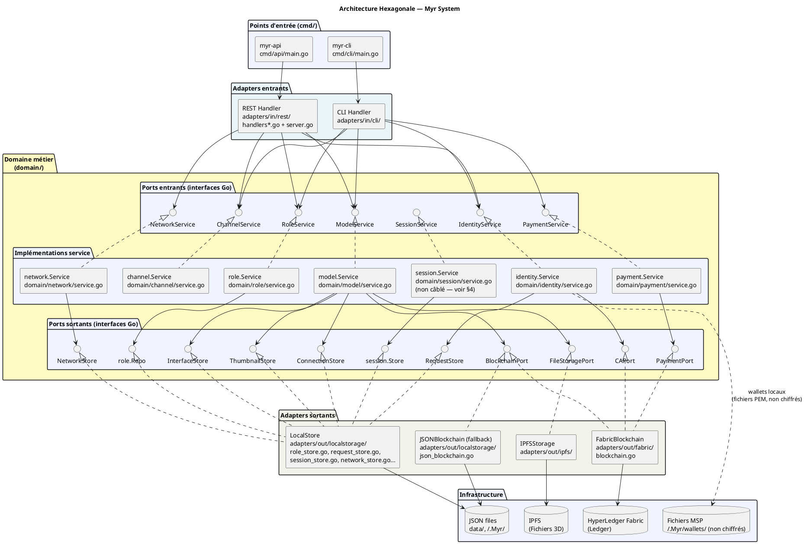
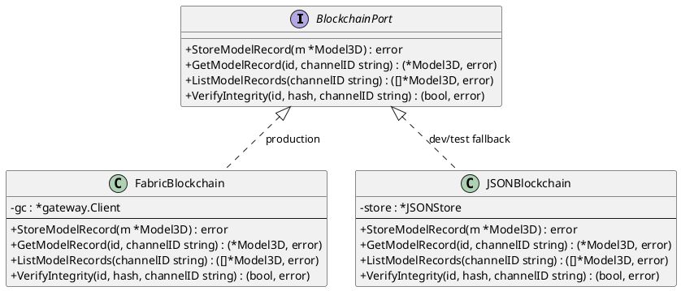

# Architecture Hexagonale — Myr System

> Phase 3 — Arrington | Contrainte ENF18 vérifiée par CI : `scripts/ci/check-domain-imports.sh`

---

## 1. Principes

L'architecture hexagonale (Ports & Adapters) garantit que la logique métier (`domain/`) est indépendante de toute technologie d'infrastructure. Le domaine ne connaît que des **interfaces Go** — jamais de références à Fabric, Redis ou IPFS.

**Règle de dépendance :** les dépendances pointent toujours **vers l'intérieur** (vers le domaine). Le domaine ne dépend de rien d'externe.

```
Adapter IN  →  Port IN  →  Service Domaine  →  Port OUT  →  Adapter OUT  →  Infrastructure
```

### 1.1 Vocabulaire blockchain-agnostique dans le domaine

Le domaine utilise un **vocabulaire neutre** — ni les noms de champs, ni les noms d'erreurs, ni les commentaires ne doivent nommer une technologie concrète (Fabric, Ethereum, etc.). La traduction vers la terminologie propre à chaque blockchain appartient **exclusivement** à son adapter `adapters/out/<blockchain>/`.

| Concept métier (domaine) | Traduction Fabric (adapter) | À ne PAS écrire dans le domaine |
|---|---|---|
| `Organization.ID` | MSP ID | `MSPID` |
| `Organization.RootCert` | Root CA PEM | — (OK, assez générique) |
| `NodeRole{"validator","sequencer"}` | `"peer"`, `"orderer"` | `NodeTypePeer`, `NodeTypeOrderer` |
| `NetworkProfile.ChannelName` | Fabric channel name | `FabricChannel` |
| `ErrBlockchainUnavailable` | gateway non configuré | `ErrFabricUnavailable` |
| `NetworkProfile.NodeEndpoint` | peer endpoint host:port | `PeerEndpoint`, `GatewayPeer` |
| `NetworkProfile.ContractName` | chaincode name | `ChaincodeName` |

### 1.2 Adapters remplaçables par configuration

L'architecture hexagonale a une conséquence directe et intentionnelle : **chaque adapter sortant est remplaçable sans toucher au domaine ni aux adapters entrants.** Ce n'est pas un détail d'implémentation — c'est l'objectif principal du pattern.

Cela vaut pour toutes les couches d'infrastructure :

| Port sortant | Implémentation(s) | Ce que l'admin choisit |
|---|---|---|
| `BlockchainPort` | Fabric, JSON local, *(futur : Ethereum, Substrate…)* | Backend blockchain du réseau |
| `FileStoragePort` | IPFS, stockage local, *(futur : S3, Filecoin…)* | Stockage des fichiers 3D |
| `IdentityPort` / `CAPort` | Fabric CA (certificats + fichiers wallet PEM locaux, non chiffrés — ADR-03) | Identité cryptographique — pas de base de données, pas de secret partagé |
| `SessionService` | Fichier local / JSON, Redis | Sessions REST (mono vs multi-instances) |

**Règle de sélection :** le choix de l'implémentation concrète se fait **uniquement dans `cmd/`** (point d'assemblage), à partir de la configuration active (profil réseau, variables d'environnement). Le domaine reçoit des interfaces déjà instanciées — il ne sait pas quelle implémentation est derrière.

```
// cmd/api/main.go — seul endroit qui connaît les implémentations concrètes
blockchain := selectBlockchain(activeProfile)   // lit BlockchainType du profil réseau
fileStore  := selectFileStorage(env)            // lit FILE_STORAGE_TYPE ou IPFS_URL
model.NewService(blockchain, fileStore, ...)
```

**Conséquence pratique :** ajouter un nouveau backend = créer `adapters/out/<technologie>/` qui implémente les ports concernés + enregistrer le cas dans `cmd/`. Aucun fichier dans `domain/`, `adapters/in/` ni dans les autres adapters `out` n'a besoin de changer.

Le CLI admin expose la sélection du backend blockchain via `myr network add --blockchain <type>` (cf. [DC_CLI_Admin.md](DC_CLI_Admin.md)). Les autres couches sont configurables via variables d'environnement (`IPFS_URL`, `REDIS_URL`, etc.).

---

## 2. Diagramme d'architecture global



---

## 3. Règle de dépendance — vérification CI

Le script `scripts/ci/check-domain-imports.sh` vérifie qu'aucun package de `domain/...` ne dépend — directement ou transitivement — d'un package d'infrastructure. Il résout l'arbre de dépendances complet via `go list -deps` (un grep sur les lignes d'import raterait les imports transitifs) et le compare à une liste de motifs interdits :

```bash
# check-domain-imports.sh (principe réel — voir le script pour la version complète)
forbidden_patterns=("myr/adapters/out" "github.com/hyperledger/fabric-gateway" "github.com/redis/go-redis" "google.golang.org/grpc" "net/http")
for pkg in $(go list ./domain/...); do
  deps="$(go list -deps "$pkg")"
  for forbidden in "${forbidden_patterns[@]}"; do
    grep -qF "$forbidden" <<<"$deps" && echo "ERREUR : $pkg dépend de $forbidden" && exit 1
  done
done
```

**Violation → build CI échoue.** Voir `scripts/ci/check-domain-imports.sh` pour l'usage et `check-licenses.sh` (ENF25).

---

## 4. Adapters entrants (IN)

| Adapter | Package | Port consommé | Rôle |
|---------|---------|--------------|------|
| REST Handler | `adapters/in/rest/` | ModelService, IdentityService, RoleService, NetworkService, ChannelService | Sert exclusivement l'API REST (consommée par le dépôt GUI externe) |
| CLI Handler | `adapters/in/cli/` | ModelService, IdentityService, RoleService, ChannelService, PaymentService | Commandes cobra CLI admin |

### Routes REST — niveaux d'accès

| Niveau | Middleware | Exemples de routes |
|--------|-----------|-------------------|
| Public | aucun | `POST /api/identity/request`, `POST /api/identity/session`, `POST /api/identity/guest`, `GET /api/identity/policy` |
| Authentifié (permission `read`) | `requireAuth` | `GET /api/components`, `GET /api/modules`, `/api/refs` |
| Écriture (permission `write`) | `requireRole(rbac.PermWrite)` | `POST /api/components`, `PUT /api/modules/`, `POST /api/assembly-links` |
| Admin (permission `admin`) | `requireRole(rbac.PermAdmin)` | `GET/DELETE /api/admin/sessions` |

> Le token de session est un jeton opaque (`X-Myr-Token`) vérifié par `requireAuth`, pas un JWT décodé côté handler. La permission est vérifiée via `domain/role.RoleService.HasPermission`, pas par une comparaison de chaîne de rôle codée en dur.

---

## 5. Adapters sortants (OUT)

| Adapter | Package | Implémente | Infrastructure |
|---------|---------|-----------|--------------|
| `FabricBlockchain` | `adapters/out/fabric/` | `BlockchainPort`, `CAPort`, `PaymentPort` | HyperLedger Fabric Gateway SDK v2 |
| `JSONBlockchain` | `adapters/out/localstorage/` | `BlockchainPort` | JSON files (fallback sans Fabric) |
| `IPFSStorage` | `adapters/out/ipfs/` | `FileStoragePort` | IPFS (stockage fichiers 3D) |
| `LocalStore` | `adapters/out/localstorage/` | `ConnectionStore`, `InterfaceStore`, `ThumbnailStore`, `NetworkStore`, `RequestStore`, `role.Repo`, `session.Store` | JSON files (`data/`) + fichiers MSP non chiffrés (wallets, `~/.Myr/wallets/`) |

> **`AssetInterface` (ADR-02) :** `InterfaceStore` est un **brouillon** — l'état de travail d'une interface tant que l'asset qui la porte n'est pas soumis. À la soumission (création d'un composant ou `SubmitModule`), les interfaces du brouillon sont embarquées dans `Model3D.Interfaces` et écrites une seule fois via `BlockchainPort` (`FabricBlockchain` ou son fallback `JSONBlockchain`). `InterfaceStore` n'est donc pas une persistance parallèle définitive : c'est la source de vérité avant soumission, la blockchain devenant la source de vérité après.

---

## 6. Mode de fallback (JSONBlockchain)

En développement ou si Fabric est indisponible, `JSONBlockchain` simule le comportement blockchain avec des fichiers JSON locaux. Il implémente `BlockchainPort` mais sans immuabilité réelle.



---

## 7. Points d'assemblage (cmd/)

`cmd/api/main.go` est le seul endroit où les adapters concrets sont instanciés et injectés dans les services domaine (injection de dépendances manuelle — pas de framework IoC) :

```
main.go
├── Crée FabricBlockchain(networkProfile) — laisse le port nil si Fabric est indisponible (aucun repli automatique)
├── Crée IPFSStorage() ou LocalStorage()
├── Crée LocalStore(dataDir) — connexions, interfaces (brouillon), rôles, requêtes de compte...
├── Injecte dans model.NewService(blockchain, storage).WithConnStore(...).WithIfaceStore(...) — les interfaces ne rejoignent `blockchain` (Model3D.Interfaces) qu'à la soumission de l'asset
├── Crée identity.NewService(walletDir, caPort).WithRequestStore(requestStore)
├── Crée role.NewService(roleStore)
├── Crée network.NewService(networkStore, nil)
├── Crée Handler(modelSvc, ...).WithIdentityService(...).WithNetworkService(...).WithRoleService(...)
├── Crée Server(handler, addr)
└── Server.StartWithShutdown(ctx)
```

---

## 8. Variables d'environnement

| Variable | Requis | Effet |
|----------|--------|-------|
| `REDIS_URL` | ❌ | Active les sessions REST partagées Redis (multi-instances) |
| Variables Fabric | ✅ pour Fabric | Lues via `fabricadapter.ConfigFromEnv()` ou fichier `fabric.env` |
