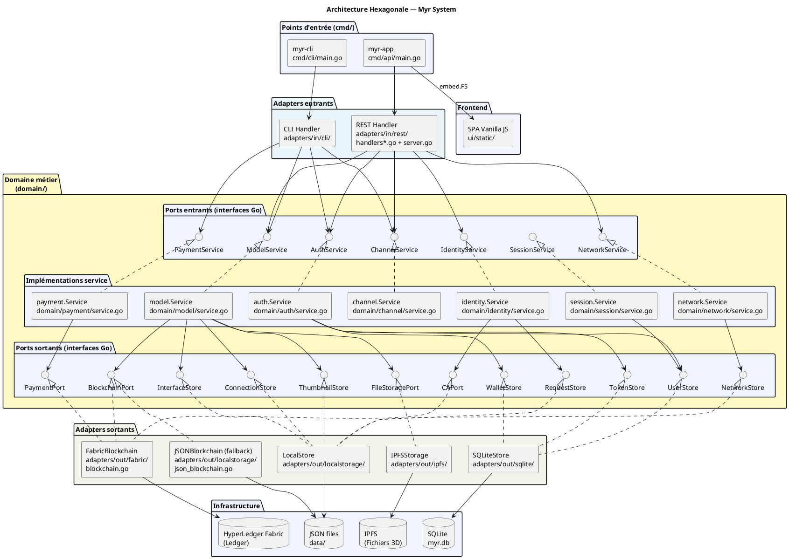
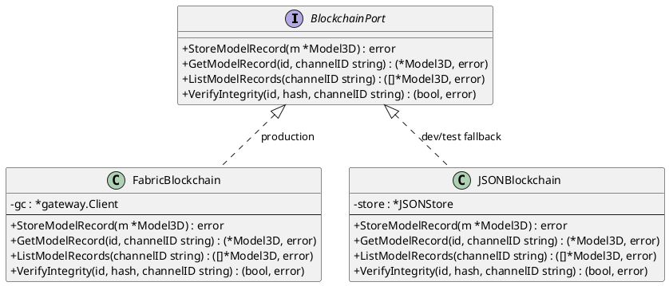

# Architecture Hexagonale — Myr System

> Phase 3 — Arrington | Contrainte ENF18 vérifiée par CI : `scripts/ci/check-domain-imports.sh`

---

## 1. Principes

L'architecture hexagonale (Ports & Adapters) garantit que la logique métier (`domain/`) est indépendante de toute technologie d'infrastructure. Le domaine ne connaît que des **interfaces Go** — jamais de références à Fabric, SQLite, Redis ou IPFS.

**Règle de dépendance :** les dépendances pointent toujours **vers l'intérieur** (vers le domaine). Le domaine ne dépend de rien d'externe.

```
Adapter IN  →  Port IN  →  Service Domaine  →  Port OUT  →  Adapter OUT  →  Infrastructure
```

---

## 2. Diagramme d'architecture global



---

## 3. Règle de dépendance — vérification CI

Le script `scripts/ci/check-domain-imports.sh` vérifie qu'aucun fichier dans `domain/` n'importe de packages infrastructure :

```bash
# check-domain-imports.sh (principe)
forbidden=("fabric" "redis" "sqlite" "ipfs" "net/http")
for pkg in "${forbidden[@]}"; do
  if grep -r "\"$pkg" domain/; then
    echo "ERREUR : import interdit dans domain/"
    exit 1
  fi
done
```

**Violation → build CI échoue.**

---

## 4. Adapters entrants (IN)

| Adapter | Package | Port consommé | Rôle |
|---------|---------|--------------|------|
| REST Handler | `adapters/in/rest/` | ModelService, AuthService, IdentityService, NetworkService, ChannelService | Sert l'API REST et le GUI embarqué |
| CLI Handler | `adapters/in/cli/` | ModelService, AuthService, ChannelService, PaymentService | Commandes cobra CLI admin |

### Routes REST — niveaux d'accès

| Niveau | Middleware | Exemples de routes |
|--------|-----------|-------------------|
| Public | aucun | `/api/auth/register`, `/api/auth/login`, `/api/identity/policy` |
| Authentifié (`reader+`) | `requireAuth` | `GET /api/components`, `GET /api/modules`, `/api/refs` |
| Contributeur (`contributor+`) | `requireRole("contributor")` | `POST /api/components`, `PUT /api/modules/`, `POST /api/assembly-links` |
| Admin | `requireRole("admin")` | `/api/admin/users`, `/api/admin/sessions` |

---

## 5. Adapters sortants (OUT)

| Adapter | Package | Implémente | Infrastructure |
|---------|---------|-----------|--------------|
| `FabricBlockchain` | `adapters/out/fabric/` | `BlockchainPort`, `CAPort`, `PaymentPort` | HyperLedger Fabric Gateway SDK v2 |
| `JSONBlockchain` | `adapters/out/localstorage/` | `BlockchainPort` | JSON files (fallback sans Fabric) |
| `IPFSStorage` | `adapters/out/ipfs/` | `FileStoragePort` | IPFS (stockage fichiers 3D) |
| `SQLiteStore` | `adapters/out/sqlite/` | `UserStore`, `TokenStore`, `WalletStore` | SQLite (`myr.db`) |
| `LocalStore` | `adapters/out/localstorage/` | `ConnectionStore`, `InterfaceStore`, `ThumbnailStore`, `NetworkStore`, `RequestStore` | JSON files (`data/`) |

---

## 6. Mode de fallback (JSONBlockchain)

En développement ou si Fabric est indisponible, `JSONBlockchain` simule le comportement blockchain avec des fichiers JSON locaux. Il implémente `BlockchainPort` mais sans immuabilité réelle.



---

## 7. Points d'assemblage (cmd/)

`cmd/api/main.go` est le seul endroit où les adapters concrets sont instanciés et injectés dans les services domaine (injection de dépendances manuelle — pas de framework IoC) :

```
main.go
├── Crée SQLiteStore(dbPath, encKey)
├── Crée FabricBlockchain(networkProfile) ou JSONBlockchain()
├── Crée IPFSStorage() ou LocalFileStorage()
├── Crée LocalStore(dataDir)
├── Injecte dans model.NewService(blockchain, storage, connStore, ifaceStore, ...)
├── Injecte dans auth.NewService(userStore, tokenStore, walletStore, jwtSecret)
├── Injecte dans identity.NewService(caPort, requestStore)
├── Crée Handler(modelSvc, authSvc, identitySvc, ...)
├── Crée Server(handler, addr)
└── Server.Start()
```

---

## 8. Variables d'environnement

| Variable | Requis | Effet |
|----------|--------|-------|
| `JWT_SECRET` | ✅ pour auth JWT | Active l'authentification email/password — absent = auth désactivée |
| `WALLET_ENCRYPT_KEY` | ✅ pour wallets | Clé AES-256 chiffrement/déchiffrement wallets SQLite |
| `MYR_DB_PATH` | ❌ | Chemin SQLite — défaut : `<data>/myr.db` |
| `REDIS_URL` | ❌ | Active les sessions partagées Redis (multi-instances) |
| `MYR_DEV` | ❌ | `=1` : sert les statiques depuis le disque (hot-reload frontend) |
| Variables Fabric | ✅ pour Fabric | Lues via `fabricadapter.ConfigFromEnv()` ou fichier `fabric.env` |
