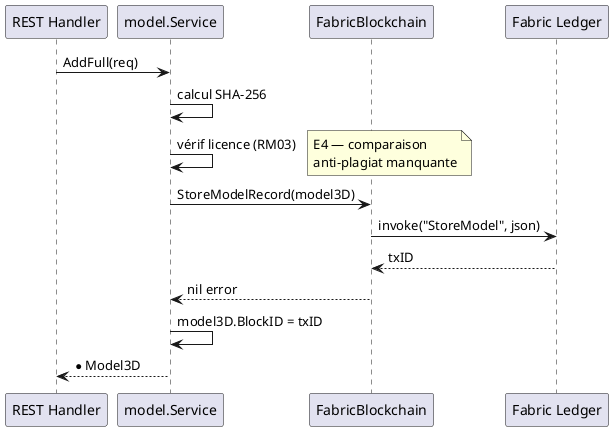
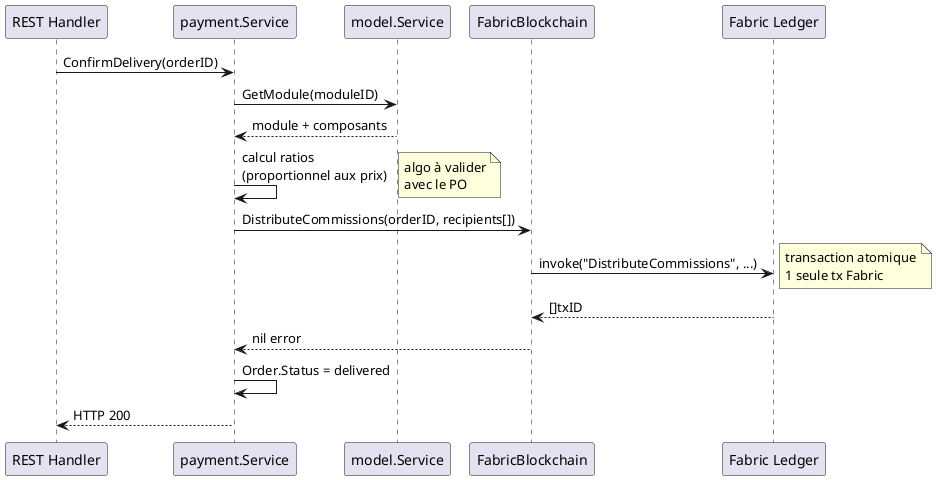

# Chaincode — Smart Contracts Fabric

> Phase 3 — Arrington | Package : `chaincode/model/` | Adapter : `adapters/out/fabric/`

---

## 1. Objectif

Le chaincode est le composant exécuté dans HyperLedger Fabric qui garantit :
- L'**immuabilité** des assets enregistrés (RM06)
- La **vérification d'intégrité** par hash SHA-256 (RM01, UCCE03)
- La **distribution automatique des commissions** à la livraison (RM23, RM24)
- La **traçabilité des transferts PI** et du clonage inter-réseaux (RM25, RM26)

---

## 2. État actuel — `chaincode/model/entity.go`

L'entité `Model3D` dans le chaincode est incomplète (E6) :

```go
// Actuel — 7 champs seulement
type Model3D struct {
    ID        string
    Name      string
    Hash      string
    ChannelID string
    OwnerID   string
    Tags      []string
    Versions  []Version
}
```

**Problème :** `adapters/out/fabric/blockchain.go` sérialise le `Model3D` domaine (20+ champs) vers le chaincode. Le chaincode ne désérialisera que les 7 champs qu'il connaît — **perte de données silencieuse en production**.

---

## 3. Entité chaincode `Model3D` — version cible

```go
// Cible — alignée avec domain/model/entity.go
type Model3D struct {
    ID          string    `json:"id"`
    Name        string    `json:"name"`
    Description string    `json:"description,omitempty"`
    Category    string    `json:"category"`
    ParentID    string    `json:"parent_id,omitempty"`
    Hash        string    `json:"hash,omitempty"`        // SHA-256 fichier CAO
    ChannelID   string    `json:"channel_id"`
    OwnerID     string    `json:"owner_id"`
    LicenseID   string    `json:"license_id,omitempty"`
    Tags        []string  `json:"tags,omitempty"`
    Links       []string  `json:"links,omitempty"`
    BlockID     string    `json:"block_id,omitempty"`    // renseigné par le chaincode
    CreatedAt   time.Time `json:"created_at"`
    // Champs module
    Status      string    `json:"status,omitempty"`      // draft|submitted
    ModuleVersions []ModuleVersion `json:"module_versions,omitempty"`
}

type ModuleVersion struct {
    Number     int       `json:"number"`
    Assemblies []string  `json:"assemblies"`
    Hash       string    `json:"hash"`
    Note       string    `json:"note,omitempty"`
    CreatedAt  time.Time `json:"created_at"`
    BlockID    string    `json:"block_id,omitempty"`
}

type Version struct {
    Number    int       `json:"number"`
    Hash      string    `json:"hash"`
    CreatedAt time.Time `json:"created_at"`
}
```

---

## 4. Fonctions chaincode — Store/Read (D3/D4/D6)

| Fonction | Arguments | Retour | UC déclencheur |
|----------|-----------|--------|---------------|
| `StoreModel` | `model3dJSON string` | `txID string, err` | UCCE01, UCMOD06 |
| `GetModel` | `id, channelID string` | `model3dJSON string, err` | UCCL01, UCMOD04 |
| `ListModels` | `channelID string` | `[]model3dJSON, err` | UCREC01 |
| `VerifyModel` | `id, hash, channelID string` | `bool, err` | UCCE03 |
| `UpdateModelOwner` | `id, newOwnerID string` | `txID string, err` | UCPI07 (transfert PI) |
| `CloneModel` | `model3dJSON, sourceNetworkID string` | `txID string, err` | UCPI08 |

---

## 5. Fonctions chaincode — Commissions (D7, à implémenter)

Les commissions doivent être calculées et distribuées dans **une seule transaction atomique** déclenchée par la confirmation de livraison (RM23).

| Fonction | Arguments | Retour | UC déclencheur |
|----------|-----------|--------|---------------|
| `DistributeCommissions` | `orderID, moduleID string, totalAmount float64, recipients []CommissionRecipient` | `[]txID, err` | UCAUT01 |
| `GetCommissions` | `userID string` | `[]CommissionJSON, err` | UCPI02 |
| `StoreAssetPrice` | `assetID string, price float64, currency string` | `txID string, err` | UCPI04, UCPI05 |
| `GetAssetPrice` | `assetID string` | `priceJSON string, err` | UCPI01 |

### Structure `CommissionRecipient`

```go
type CommissionRecipient struct {
    UserID  string  `json:"user_id"`
    AssetID string  `json:"asset_id"`
    Amount  float64 `json:"amount"`
    Ratio   float64 `json:"ratio"`  // 0.0-1.0
}
```

---

## 6. Diagramme de séquence — Soumission d'un asset (StoreModel)



---

## 7. Diagramme de séquence — Distribution de commissions (UCAUT01)



---

## 8. Événements Fabric (Events)

Le chaincode doit émettre des événements pour permettre aux clients de s'abonner :

| Événement | Payload | Déclencheur |
|-----------|---------|------------|
| `ModelStored` | `{id, name, ownerID, channelID}` | `StoreModel` |
| `ModuleSubmitted` | `{id, versionNumber, hash}` | `StoreModel` (module) |
| `CommissionDistributed` | `{orderID, recipientID, amount}` | `DistributeCommissions` (1 par destinataire) |
| `OwnershipTransferred` | `{assetID, fromOwnerID, toOwnerID}` | `UpdateModelOwner` |
| `ModelCloned` | `{originalID, sourceNetworkID, clonedNetworkID}` | `CloneModel` |

---

## 9. Politique d'endorsement

Définie par l'administrateur réseau dans `configtx.yaml`. Recommandation :

| Opération | Politique suggérée |
|-----------|-------------------|
| `StoreModel` | Majorité des organisations du canal |
| `DistributeCommissions` | Toutes les organisations impliquées dans la commande |
| `UpdateModelOwner` | Organisation source + organisation cible |

---

## 10. Informations manquantes

- **Implémentation Go chaincode** : seul `chaincode/model/entity.go` existe — aucune fonction chaincode n'est implémentée. Cela bloque toute mise en production Fabric.
- **Gestion des wallets inactifs** : que fait `DistributeCommissions` si un `userID` destinataire n'a plus de wallet actif ?
- **Versionnement du chaincode** : procédure de mise à jour du chaincode en production (endorsement, approvals des organisations)
- **Optimisation des lectures** : `ListModels` peut devenir très lent sur un ledger volumineux — index CouchDB à définir
