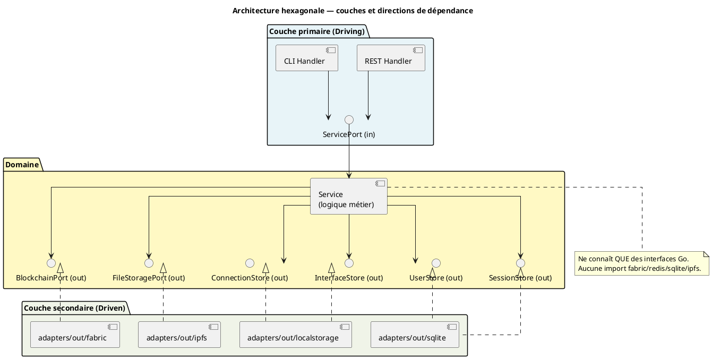

# Conception — Myr System

> Phase 3 de la méthode Arrington — produite à partir de `specs/2-Analyse/Analyse_des_besoins.md`.

---

## 1. Objet de la conception

Ce document introduit la phase de conception du projet **Myr System**. Il traduit les besoins analysés (`specs/2-Analyse/`) en décisions d'architecture concrètes et en structures de données définitives.

**Son rôle :**
- Établir les principes directeurs non négociables de l'architecture
- Fournir une vue d'ensemble des composants logiciels et de leurs interactions
- Documenter les décisions d'architecture (ADR) et leurs justifications
- Servir de point d'entrée vers tous les documents de conception détaillés
- Identifier les contraintes techniques transversales à respecter dans chaque composant

Ce document **ne remplace pas** les specs d'expression ou d'analyse — il les complète en précisant le *comment* (architecture, structures, contrats techniques) après que le *quoi* (besoins, règles métier) a été établi.

---

## 2. Principes directeurs

### 2.1 Architecture hexagonale stricte

Le domaine (`domain/`) contient uniquement la logique métier et des interfaces Go. Aucune dépendance à des technologies concrètes (Fabric, Redis, SQLite, IPFS) ne peut apparaître dans le domaine. Cette règle est vérifiée par script CI (`scripts/ci/check-domain-imports.sh`) et constitue une contrainte d'architecture non négociable (ENF18).

Flux obligatoire : `adapter in (REST/CLI)` → `service domaine` → `adapter out (Fabric/IPFS/SQLite/JSON)`.

### 2.2 Immuabilité blockchain

Toute transaction soumise à HyperLedger Fabric est définitive. Il n'existe pas d'opération de suppression sur la blockchain (RM06, RM08). Toute donnée soumise doit être entièrement validée côté serveur avant soumission (RM07). Les erreurs blockchain conservent l'état local intact (ENF30).

### 2.3 Séparation des préoccupations

Trois niveaux de persistance coexistent avec des responsabilités distinctes :

| Niveau | Support | Contenu | Mutabilité |
|--------|---------|---------|-----------|
| Blockchain | HyperLedger Fabric | Assets enregistrés, ModuleVersions, transactions PI | Immuable |
| Persistance locale sécurisée | SQLite (AES-256-GCM) | Utilisateurs, tokens JWT, wallets Fabric CA | Mutable |
| Persistance locale légère | JSON files | Connexions Atelier, interfaces physiques, profils réseau | Mutable |
| Stockage fichiers | IPFS | Fichiers CAO (modèles 3D) | Immuable (CID) |
| Éphémère | Mémoire / Redis optionnel | Sessions actives | Volatile |

### 2.4 Licence AGPL 3.0

Toute dépendance intégrée au binaire doit être compatible avec AGPL 3.0. La vérification est automatisée via `go-licenses` dans le script CI `scripts/ci/check-licenses.sh` (ENF25).

---

## 3. Vue d'ensemble des composants

```plantuml
@startuml
title Vue d'ensemble des composants Myr

skinparam componentStyle rectangle
skinparam rectangle {
  BackgroundColor #f8f9fa
  BorderColor #6c757d
}

package "Points d'entrée" {
  [cmd/api\nmyr-app] as CmdAPI
  [cmd/cli\nmyr-cli] as CmdCLI
}

package "Adapters IN" {
  [adapters/in/rest\nHandlers HTTP + Router] as REST
  [adapters/in/cli\nCommandes Cobra] as CLI
}

package "Domaine métier" {
  [domain/model\nAssets, Atelier, Modules] as DomModel
  [domain/auth\nJWT, Utilisateurs] as DomAuth
  [domain/identity\nIdentités Fabric CA] as DomIdentity
  [domain/network\nProfils réseau] as DomNetwork
  [domain/channel\nCanaux Fabric] as DomChannel
  [domain/session\nSessions utilisateur] as DomSession
  [domain/payment\nPaiements, Commissions] as DomPayment
}

package "Adapters OUT" {
  [adapters/out/fabric\nGateway SDK v2] as Fabric
  [adapters/out/sqlite\nAuth, Wallets] as SQLite
  [adapters/out/localstorage\nConnexions, Interfaces, Profils JSON] as LocalStorage
  [adapters/out/ipfs\nFichiers 3D] as IPFS
}

package "UI" {
  [ui/static/\nSPA Vanilla JS/HTML/CSS] as UI
}

CmdAPI --> REST
CmdAPI --> UI
CmdCLI --> CLI

REST --> DomModel
REST --> DomAuth
REST --> DomIdentity
REST --> DomNetwork
REST --> DomChannel
REST --> DomSession
REST --> DomPayment

CLI --> DomModel
CLI --> DomAuth
CLI --> DomChannel
CLI --> DomPayment

DomModel --> Fabric
DomModel --> LocalStorage
DomModel --> IPFS
DomAuth --> SQLite
DomIdentity --> Fabric
DomIdentity --> SQLite
DomNetwork --> LocalStorage
DomChannel --> Fabric
DomSession --> SQLite
DomPayment --> Fabric

@enduml
```

---

## 4. Domaines de conception

| Domaine | Entités principales | Ports out principaux | Adapters out | État |
|---------|--------------------|--------------------|--------------|------|
| D1 — Compte & Accès | `User`, `RefreshToken`, `EncryptedWallet` | `UserStore`, `TokenStore`, `WalletStore` | `sqlite` | Partiel (UCA08 manquant) |
| D1 — Session | `Session` | `SessionStore` | `sqlite` | Service défini, REST absent |
| D1 — Identité | `MyrIdentity`, `WalletEntry`, `AccountRequest` | `IdentityPort` | `fabric`, `sqlite` | Service défini, REST/CLI absents |
| D2 — Réseau | `NetworkProfile`, `ChaincodeConfig` | `NetworkStore` | `localstorage` | Service défini, REST/CLI absents |
| D2 — Canal | `Channel` | `ChannelPort` | `fabric` | Service défini, CLI exposé |
| D3/D4 — Composant | `Model3D`, `Version`, `AssetInterface` | `BlockchainPort`, `FileStoragePort`, `InterfaceStore` | `fabric`, `ipfs`, `localstorage` | REST + CLI exposés |
| D5 — Atelier | `WorkspaceInstance`, `Connection` | `ConnectionStore`, `InterfaceStore` | `localstorage` | REST exposé |
| D6 — Module | `Model3D` (module), `ModuleVersion` | `BlockchainPort` | `fabric` | REST + CLI exposés |
| D7 — PI & Paiement | `Payment` | `PaymentPort` | `fabric` | Service défini, REST absent |
| D8 — Recherche | (utilise Model3D) | `BlockchainPort` | `fabric` | Partiel |
| D9 — Automatisation | — | — | — | Non implémenté |
| D10-D13 — Transverses | — | — | — | Non implémenté |

---

## 5. Architecture hexagonale détaillée



---

## 6. Décisions de conception

### ADR-01 — Entité unifiée Model3D pour composants et modules

**Décision :** Une seule entité `Model3D` représente à la fois un composant (fichier physique) et un module (assemblage de composants).

**Justification :** Un module est lui-même un asset pouvant être réutilisé, dérivé et référencé dans d'autres assemblages. La distinction se fait par le contenu (`Hash` vs `WorkspaceInstances`) et non par le type.

**Conséquence :** La catégorie `decoupage` est la seule qui transforme un composant en module (UCAM05). Les invariants de chaque mode (composant ou module) doivent être vérifiés au niveau service.

---

### ADR-02 — Stockage des interfaces physiques en local (pas sur Fabric)

**Décision :** Les `AssetInterface` sont stockées dans `adapters/out/localstorage/` via `InterfaceStore`, pas sur la blockchain.

**Justification :** Les interfaces physiques servent à la vérification de compatibilité dans l'Atelier (RM11) — opération locale et fréquente. La blockchain n'est pas adaptée à des lectures fréquentes et rapides. Seul l'assemblage final (le `ModuleVersion`) est ancré sur Fabric.

**Conséquence :** Les interfaces ne sont pas versionnées blockchain. Si un asset change d'interfaces, l'historique n'est pas tracé sur la chaîne. Acceptable pour la v1.

---

### ADR-03 — Wallet chiffré AES-256-GCM en SQLite

**Décision :** Les wallets Fabric CA (certificats X.509 + clés privées) sont stockés chiffrés dans SQLite via `EncryptedWallet`, avec une clé AES-256-GCM dérivée de `WALLET_ENCRYPT_KEY`.

**Justification :** Le wallet doit survivre aux redémarrages du serveur et être accessible rapidement à chaque requête Fabric. La blockchain n'est pas appropriée pour stocker des clés privées. SQLite chiffré offre un bon compromis sécurité/performance.

**Conséquence :** `WALLET_ENCRYPT_KEY` est une variable d'environnement critique. Sa perte rend tous les wallets irrécupérables. La rotation de clé n'est pas implémentée en v1.

---

### ADR-04 — Sessions Fabric séparées de l'auth web (JWT)

**Décision :** L'authentification web (JWT email/password) et les sessions Fabric (identité CA, certificats) sont deux mécanismes indépendants dans des domaines séparés (`domain/auth` vs `domain/session` + `domain/identity`).

**Justification :** Un utilisateur peut être authentifié sur l'interface web sans avoir de wallet Fabric (cas : rôle Lecteur, première connexion). Le provisionnement Fabric est différé à la première connexion (RM20). La séparation évite un couplage fort entre les deux cycles de vie.

**Conséquence :** Deux sources d'identité coexistent. Le service `identity` est responsable de la synchronisation entre le compte web (`User.ID`) et le wallet Fabric (`EncryptedWallet.UserID`).

---

### ADR-05 — Connexions Atelier locales, ModuleVersions sur blockchain

**Décision :** Les `Connection` (liaisons de l'Atelier) sont stockées localement via `ConnectionStore`. Seule la `ModuleVersion` (hash de l'assemblage + liste des assemblages) est soumise à la blockchain à la soumission du module.

**Justification :** L'Atelier est un espace de travail mutable (RM16) — les connexions peuvent être créées, modifiées ou supprimées librement. La blockchain ne supporte pas la mutabilité. La `ModuleVersion` constitue le snapshot immuable et vérifiable de l'assemblage au moment de la soumission.

**Conséquence :** Les connexions Atelier ne sont pas traçables dans l'historique blockchain. En cas de crash serveur avant soumission, le travail en cours peut être perdu si aucune sauvegarde locale n'est implémentée.

---

### ADR-06 — Déploiement réseau Fabric distribué par mTLS

**Décision :** Chaque organisation du réseau Myr expose son peer Fabric avec une IP publique fixe (ou DNS) sur le port 7051. La sécurité inter-peers est assurée par mTLS natif Fabric — aucun VPN n'est requis.

**Justification :** La topologie réseau entre peers est entièrement gérée par Fabric via `configtx.yaml` distribué sur le ledger. Myr se connecte uniquement au peer de sa propre organisation. Fabric synchronise ensuite avec les peers des autres organisations en arrière-plan.

**Conséquence :** Chaque organisation doit fournir : un serveur avec IP fixe, le port 7051 ouvert, des certificats Fabric CA (pas Let's Encrypt), et une entrée DNS recommandée (ex. `peer0.org.com`). Ces prérequis sont documentés dans les profils de connexion (`connection-profiles/`).

---

## 7. Contraintes techniques transversales

| Contrainte | Variable / Mécanisme | Impact |
|-----------|---------------------|--------|
| Auth JWT | `JWT_SECRET` requis | Sans cette variable, l'auth email/password est désactivée |
| Chiffrement wallets | `WALLET_ENCRYPT_KEY` requis | Wallets inaccessibles sans cette clé |
| Base SQLite | `MYR_DB_PATH` (défaut: `<data>/myr.db`) | Auth, tokens, wallets |
| Sessions distribuées | `REDIS_URL` optionnel | Multi-instances : sessions partagées via Redis |
| Hot-reload frontend | `MYR_DEV=1` | Sert les statiques depuis le disque (pas depuis embed.FS) |
| mTLS Fabric | Certificats X.509 (CA Fabric) | Toute interaction Fabric exige un wallet valide |
| IPFS CID | Adresse de contenu immuable | Le CID d'un fichier CAO change si le fichier change — versionnement explicite requis |
| AGPL 3.0 | `go-licenses` CI | Toute dépendance doit être compatible AGPL 3.0 |
| Isolation hexagonale | Script CI `check-domain-imports.sh` | Aucun import infra dans `domain/` |

---

## 8. Index des documents de conception

| Fichier | Objet |
|---------|-------|
| `Conception_intro.md` (ce fichier) | Principes directeurs, vue d'ensemble, ADR, index |
| `MCD.md` | Modèle Conceptuel de Données — toutes les entités et leurs relations |

> Les documents suivants sont à produire dans les prochaines itérations de la phase Conception.

| Document à produire | Objet prévu |
|--------------------|------------|
| `Architecture_REST.md` | Contrats des endpoints REST — routes, paramètres, codes de retour |
| `Architecture_Fabric.md` | Chaincode, transactions, structure du ledger |
| `Architecture_Auth.md` | Flux JWT, provisionnement Fabric différé, rotation tokens |
| `Architecture_Atelier.md` | Workspace, slots virtuels, cascade de suppression, compatibilité interfaces |
| `Architecture_PI.md` | Flux commissions, transfert de propriété, clonage inter-réseaux |
| `Sequence_soumission_asset.md` | Diagramme de séquence : validation → anti-plagiat → blockchain |
| `Sequence_soumission_module.md` | Diagramme de séquence : Atelier → ModuleVersion → blockchain |

---

## 9. Écarts structurels à corriger

Ces écarts ont été identifiés lors de l'analyse (`specs/2-Analyse/`) entre le code existant et les specs. Ils doivent être corrigés dans le code — les specs (comportement cible) restent la référence.

| ID | Écart | Fichier à corriger | Règle violée | Impact conception |
|----|-------|-------------------|-------------|------------------|
| E1 | Catégorie `decoupage` absente du code | `domain/model/entity.go` | RM02 | Le MCD doit la lister comme valeur valide de `Category` |
| E2 | Champ `Tag` absent de `AssetInterface` | `domain/model/entity.go` | RM11 | Le MCD inclut ce champ — 6 attributs requis pour la compatibilité d'interfaces |
| E3 | Rôle `contributor` attribué à la création au lieu de `reader` | `domain/auth/service.go:93` | RM21 | L'entité `User.Role` doit recevoir `reader` à la création |
| E4 | Anti-plagiat SHA-256 calculé mais jamais comparé avec les assets existants | `domain/model/service.go` | RM01 | La logique de comparaison est manquante dans le service domaine |
| E5 | Fork obligatoire sur module soumis non contraint | `domain/model/service.go:461` | RM19 | Un module en état `submitted` doit être en lecture seule — toute modification doit créer une nouvelle version |
| E6 | Entité chaincode `Model3D` incomplète (7 champs vs 20+ dans le domaine) | `chaincode/model/entity.go` | RM06 | Le chaincode doit refléter fidèlement l'entité domaine pour garantir l'immuabilité blockchain |
