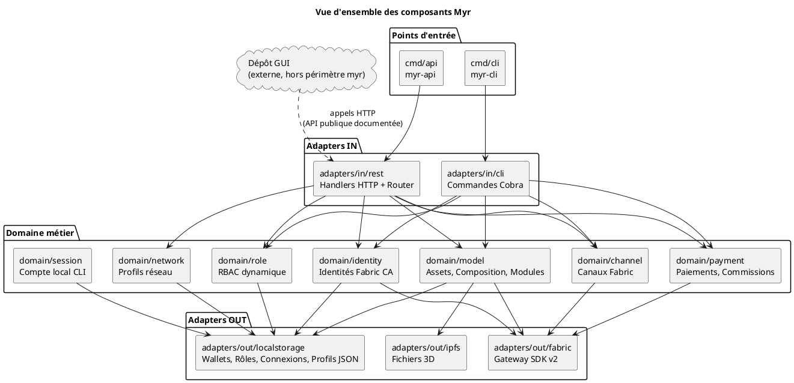
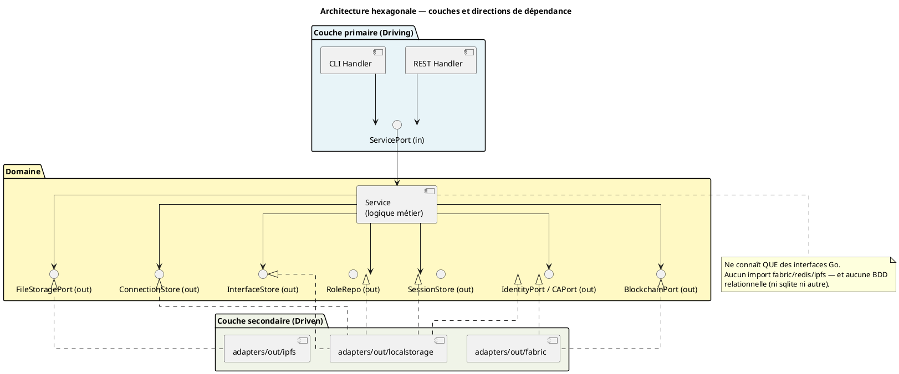

# Conception — Myr System

> Phase 3 de la méthode Arrington — produite à partir de `specs/2-Analyse/Analyse_des_besoins.md`.

---

## 1. Objet de la conception

Ce document introduit la phase de conception du projet **Myr System**. Il traduit les besoins analysés (`specs/2-Analyse/`) en décisions d'architecture concrètes et en structures de données définitives.

**Son rôle :**
- Établir les principes directeurs non négociables de l'architecture
- Fournir une vue d'ensemble des composants logiciels et de leurs interactions
- Documenter les décisions d'architecture (ADR) et leurs justifications
- Servir de point d'entrée vers tous les documents de conception détaillés
- Identifier les contraintes techniques transversales à respecter dans chaque composant

Ce document **ne remplace pas** les specs d'expression ou d'analyse — il les complète en précisant le *comment* (architecture, structures, contrats techniques) après que le *quoi* (besoins, règles métier) a été établi.

---

## 2. Principes directeurs

### 2.1 Architecture hexagonale stricte

Le domaine (`domain/`) contient uniquement la logique métier et des interfaces Go. Aucune dépendance à des technologies concrètes (Fabric, Redis, SQLite, IPFS) ne peut apparaître dans le domaine. Cette règle est vérifiée par script CI (`scripts/ci/check-domain-imports.sh`) et constitue une contrainte d'architecture non négociable (ENF18).

Flux obligatoire : `adapter in (REST/CLI)` → `service domaine` → `adapter out (Fabric/IPFS/JSON)`.

### 2.2 Immuabilité blockchain

Toute transaction soumise à HyperLedger Fabric est définitive. Il n'existe pas d'opération de suppression sur la blockchain (RM06, RM08). Toute donnée soumise doit être entièrement validée côté serveur avant soumission (RM07). Les erreurs blockchain conservent l'état local intact (ENF30).

### 2.3 Séparation des préoccupations

Trois niveaux de persistance coexistent avec des responsabilités distinctes :

| Niveau | Support | Contenu | Mutabilité |
|--------|---------|---------|-----------|
| Blockchain | HyperLedger Fabric | Assets soumis, interfaces physiques et virtuelles au moment de la soumission (`AssetInterface`, embarquées dans `Model3D.Interfaces` — ADR-02), ModuleVersions, transactions PI | Immuable |
| Persistance locale (wallets) | Fichiers MSP (PEM), **non chiffrés au repos** ⚠️ (voir ADR-03) | Certificats X.509 + clés privées Fabric CA | Mutable |
| Persistance locale légère (brouillon) | JSON files | Connexions entre instances (liaisons, ADR-05), interfaces physiques en cours d'édition avant soumission (ADR-02), profils réseau, rôles RBAC | Mutable |
| Stockage fichiers | IPFS | Fichiers CAO (modèles 3D) | Immuable (CID) |
| Éphémère | Mémoire / Redis optionnel | Sessions actives | Volatile |

### 2.4 Licence AGPL 3.0

Toute dépendance intégrée au binaire doit être compatible avec AGPL 3.0. La vérification est automatisée via `go-licenses` dans le script CI `scripts/ci/check-licenses.sh` (ENF25).

---

## 3. Vue d'ensemble des composants

---

## 4. Domaines de conception

| Domaine | Entités principales | Ports out principaux | Adapters out |
|---------|--------------------|--------------------|--------------|
| D1 — Identité | `MyrIdentity`, `WalletEntry`, `AccountRequest` | `IdentityPort`, `CAPort`, `RequestStore` | `fabric`, `localstorage` |
| D1 — RBAC | `Role`, `Permission` | `RoleRepo` | `localstorage` |
| D1 — Session REST | `myrSession` (détail d'implémentation adapter, pas une entité domaine) | `sessionBackend` | mémoire / JSON (défaut), Redis (`session_redis.go`, multi-instances) |
| D1 — Session locale CLI | `Session` (`domain/session`, distinct de la session REST) | `SessionStore` | `localstorage` |
| D2 — Réseau | `NetworkProfile`, `ChaincodeConfig` | `NetworkStore` | `localstorage` |
| D2 — Canal | `Channel` | `ChannelPort` | `fabric` |
| D3/D4 — Composant | `Model3D`, `Version`, `AssetInterface` (brouillon local jusqu'à soumission, puis embarquée dans `Model3D.Interfaces` — ADR-02) | `BlockchainPort`, `FileStoragePort`, `InterfaceStore` | `fabric`, `ipfs`, `localstorage` |
| D5 — Composition de Module | `WorkspaceInstance`, `Connection` | `ConnectionStore`, `InterfaceStore` | `localstorage` |
| D6 — Module | `Model3D` (module), `ModuleVersion` | `BlockchainPort` | `fabric` |
| D7 — PI & Paiement | `Payment` ; `Order`, `OrderItem`, `Commission`, `AssetPrice`, `PITransfer`, `CloneRecord` (`DC_D7_Payment.md`) | `PaymentPort` | `fabric` |
| D8 — Recherche | (réutilise `Model3D` — pas de nouvelle entité) | `BlockchainPort` | `fabric` |
| D9 — Automatisation | (réutilise `Order`/`Commission` de D7, `Version` de D3) | `PaymentPort`, `RoleRepo` | `fabric`, `localstorage` |
| D13 — Développement autour de Myr | — | — | — |

> État d'implémentation par domaine (service/CLI/REST) : `specs/roadmap_dev.md` § État de l'implémentation.

---

## 5. Architecture hexagonale détaillée

---

## 6. Décisions de conception

### ADR-01 — Entité unifiée Model3D pour composants et modules

**Décision :** Une seule entité `Model3D` représente à la fois un composant (fichier physique) et un module (assemblage de composants).

**Justification :** Un module est lui-même un asset pouvant être réutilisé, dérivé et référencé dans d'autres assemblages. La distinction se fait par le contenu (`Hash` vs `WorkspaceInstances`) et non par le type.

**Conséquence :** La catégorie `decoupage` est la seule qui transforme un composant en module (UCAM05). Les invariants de chaque mode (composant ou module) doivent être vérifiés au niveau service.

---

### ADR-02 — Interfaces enregistrées sur la blockchain via le cycle brouillon → soumission (généralisé à tout asset)

**Décision (remplace les deux versions précédentes de l'ADR-02) :** Le cycle `draft` → soumission, déjà défini pour les modules (RM16 : `Status = draft` jusqu'à `SubmitModule` ; RM19 : `submitted` = lecture seule) s'applique de la même façon à **tout** `Model3D` — composant ou module — et à ses `AssetInterface`. Tant que l'asset qui les porte est en brouillon, ses interfaces (physiques et slots virtuels) sont éditées localement, librement et sans coût blockchain, via CLI/API REST (`AddInterface`, `UpdateInterface`, `EnsureVirtualSlot`, `ConnectVirtualToPhysical`). Elles ne rejoignent la blockchain qu'au moment où l'asset lui-même est soumis (création/soumission d'un composant, ou `SubmitModule` pour un module) — un seul aller-retour Fabric (`StoreModelRecord`) commet alors l'intégralité du brouillon, `Interfaces` compris, exactement comme RM07 l'énonce déjà : *« Toutes les données (métadonnées, licences, **interfaces**, UUID) sont validées côté serveur avant soumission »* — les interfaces font partie du payload soumis, pas d'écritures blockchain indépendantes.

**Une fois soumis, un asset est immuable (règle 7, RM19)** : plus aucune interface ne peut lui être ajoutée ou modifiée directement. Toute évolution passe par un **fork** — un nouveau `Model3D` en brouillon (`ParentID` = asset d'origine, catégorie `amelioration`/`extension`/`variation`/`adaptation`/`derivation`/`regression` selon RM02), qui démarre avec les interfaces du parent copiées localement, peut les modifier librement tant qu'il reste en brouillon, et n'atteint la blockchain qu'à sa propre soumission.

**Décisions précédentes (abandonnées) :**
- v1 (ADR-02 d'origine) : interfaces toujours locales (`InterfaceStore`), jamais vraiment garanties sur la blockchain.
- v2 : interfaces enregistrées immédiatement sur la blockchain à chaque édition (`StoreModelRecord` par action) — rejetée : elle traitait comme définitive une action de composition encore réversible (brouillon), et aurait pollué un ledger immuable (règle 9 : pas de suppression) avec des tentatives de liaison abandonnées avant soumission.

**Justification :** La blockchain reste la source de vérité finale pour toute interface — l'exigence d'origine (« toutes les interfaces doivent être enregistrées dans la blockchain ») est satisfaite à la soumission, sans sacrifier la réactivité des opérations de composition (assemblage de module, essais de liaison, ajustements avant validation), qui restent locales tant que rien n'est soumis.

**Conséquence :** Il existe de nouveau un store local (`InterfaceStore`, `adapters/out/localstorage/`) faisant office de **brouillon** — non une persistance parallèle définitive, mais l'état de travail avant soumission. Les exigences de temps de réponse des UCAM (`< 200 ms`, `< 300 ms`) redeviennent valides puisque la composition reste locale.

**Décision de conception (généralisation RM16/RM19, `Regles_Metier.md` §5) :** `Status` (`draft`/`submitted`) cesse d'être un champ « module seulement » — il s'applique à tout `Model3D`. Pour ne pas ajouter de friction au cas simple (un composant dont toutes les interfaces sont déjà connues à la création, UCCE01 nominal), le comportement par défaut d'un composant reste **inchangé : `AddFull` le crée directement `submitted`** (une seule transaction Fabric, comme aujourd'hui). Un composant n'entre en `draft` que si le client le demande explicitement (`draft: true` / `myr model add --draft`) — il est alors mutable (interfaces via UCCE06/UCAM03) jusqu'à une action de soumission explicite qui commet `Interfaces` sur Fabric et passe `Status` à `submitted` (voir UCCE01 « Flux alternatif — Création en brouillon », `DC_CLI_Model.md` § 3.1/3.6bis pour la commande CLI/API). Un module, lui, reste **toujours** créé en `draft` (RM16) puisque RM17 exige un assemblage avant soumission. Suivi de la mise en œuvre de cette décision : `specs/roadmap_dev.md`.

---

### ADR-03 — Wallet stocké en fichiers MSP locaux, chiffrement au repos non tranché

**Décision :** Les wallets Fabric CA (certificats X.509 + clés privées) sont représentés par une seule entité `WalletEntry` — des fichiers PEM sous `~/.Myr/wallets/<pseudo@org>/msp/` (permissions `0600`), sans miroir chiffré en base (pas de BDD relationnelle, cf. principe de décentralisation).

**Point ouvert :** ENF10 (`Exigences_Non_Fonctionnelles.md`) exige un chiffrement au repos des wallets. Ce point n'est pas tranché : soit un mécanisme de chiffrement au repos est ajouté (ex. clé dérivée d'un secret d'exploitation), soit ENF10 est révisée pour accepter des fichiers PEM en clair sous permissions restreintes comme niveau de risque assumé. Décision à prendre par le product owner — ne pas supposer l'une ou l'autre option tranchée dans les autres documents (`Securite.md`, `Modele_Domaine.md`, `Deploiement.md`).

**Conséquence :** Tant que la décision n'est pas prise, `Securite.md` §4 documente cette surface comme un risque à mitiger.

---

### ADR-04 — Identité CA comme source unique, RBAC dynamique séparé

**Décision :** Il n'existe qu'une seule source d'identité (`domain/identity`, adossée à la Fabric CA) — pas de second système d'authentification web (email/mot de passe/JWT). L'autorisation (RBAC) est un domaine séparé (`domain/role`), découplé du rôle porté par le certificat CA.

**Justification :** Un accès invité (`POST /api/identity/guest`) peut être délivré sans aucune identité CA (cas : rôle Lecteur automatique sur réseau public). Séparer le RBAC de l'identité CA permet de faire évoluer les permissions (`myr role create/update`) sans dépendre du cycle de vie des certificats.

**Conséquence :** Le rôle appliqué à une session REST est déterminé **à la connexion**, à partir du rôle CA de l'identité — un changement de rôle administratif (`myr identity set-role`) ne se répercute que sur les sessions créées après le changement, pas sur les sessions déjà ouvertes (voir `DC_D1_Auth_Identity.md`, et `specs/roadmap_dev.md` § Écarts Identité & Session pour l'état de cette dépendance).

---

### ADR-05 — Connexions de composition locales, ModuleVersions sur blockchain

**Décision :** Les `Connection` (liaisons entre instances d'un module) sont stockées localement via `ConnectionStore`. Seule la `ModuleVersion` (hash de l'assemblage + liste des assemblages) est soumise à la blockchain à la soumission du module.

**Justification :** La composition d'un module (état `draft`, RM16) est mutable — les connexions peuvent être créées, modifiées ou supprimées librement par action directe. La blockchain ne supporte pas la mutabilité. La `ModuleVersion` constitue le snapshot immuable et vérifiable de l'assemblage au moment de la soumission.

**Conséquence :** Les connexions locales ne sont pas traçables dans l'historique blockchain. En cas de crash serveur avant soumission, le travail en cours peut être perdu si aucune sauvegarde locale n'est implémentée.

---

### ADR-06 — Déploiement réseau Fabric distribué par mTLS

**Décision :** Chaque organisation du réseau Myr expose son peer Fabric avec une IP publique fixe (ou DNS) sur le port 7051. La sécurité inter-peers est assurée par mTLS natif Fabric — aucun VPN n'est requis.

**Justification :** La topologie réseau entre peers est entièrement gérée par Fabric via `configtx.yaml` distribué sur le ledger. Myr se connecte uniquement au peer de sa propre organisation. Fabric synchronise ensuite avec les peers des autres organisations en arrière-plan.

**Conséquence :** Chaque organisation doit fournir : un serveur avec IP fixe, le port 7051 ouvert, des certificats Fabric CA (pas Let's Encrypt), et une entrée DNS recommandée (ex. `peer0.org.com`). Ces prérequis sont documentés dans les profils de connexion (`connection-profiles/`).

---

### ADR-07 — Émission d'identité permissionnée (Fabric CA), pas d'auto-génération de clé sans registrar

**Décision :** Toute identité `myr` (UCA01) doit être émise par une Fabric CA à partir d'une identité **registrar** (attribut CA `hf.Registrar.*`) — il n'existe et n'existera pas de mécanisme où un client génère seul une paire de clés et l'auto-enregistre sur le réseau sans passer par ce registrar. C'est une contrainte native de Hyperledger Fabric CA, pas un choix `myr` : Fabric est une blockchain **permissionnée** par conception, à la différence d'une blockchain permissionless (ex. Bitcoin) où la génération de clé locale suffit sans autorité d'enregistrement.

**Justification :** Le RBAC de `myr` (`domain/role`) s'appuie sur des attributs portés par le certificat CA (`Myr.role`, RM21/RM22) — un mécanisme d'identité sans CA romprait ce lien et exigerait de reconstruire l'autorisation autrement. Adopter une identité purement auto-générée (self-sovereign) sortirait du stack technique validé (`CLAUDE.md` § Stack technique, hors périmètre de cet ADR) et n'est pas retenu à ce jour.

**Ce que fait réellement `AllowAutoRegister=true` (UCA01) :** ce réglage automatise le rôle de registrar côté serveur — aucune validation humaine n'est requise **par demande** — mais ne supprime pas le registrar lui-même. Une identité admin CA est enrôlée une seule fois à la création du réseau (`myr network create`) et ses certificat/clé (`NetworkProfile.CAAdminCertPath`/`CAAdminKeyPath`) signent ensuite chaque appel `Register`/`UpdateAttributes` effectué par le serveur en son nom.

**Conséquence — point de confiance par organisation :** `CAAdminCertPath`/`CAAdminKeyPath` est un champ par `NetworkProfile`, donc par organisation — la compromission de cette clé sur le serveur d'une organisation ne permet de forger des identités que pour cette organisation, pas pour les autres organisations membres du même réseau décentralisé. Ce n'est donc pas un point de défaillance unique à l'échelle du réseau, mais ça en reste un à l'échelle d'une organisation : ce risque résiduel est tracé comme besoin de mitigation dans `specs/roadmap_dev.md` (§ Compléments — Post-V1), sans action corrective entreprise à ce jour.

---

### ADR-08 — Point ouvert : le client CA du serveur REST ignore le `NetworkProfile` actif

**Constat vérifié (2026-07-17, serveur de production) :** `cmd/api/main.go` construit le client CA utilisé par `domain/identity` (`caPort`, ligne ~103) exclusivement depuis `fabricadapter.ConfigFromEnv()` (variables d'environnement `FABRIC_CA_*` ou un `fabric.env` optionnel), jamais depuis les champs `CAEndpoint`/`CAAdminCertPath`/`CAAdminKeyPath` du `NetworkProfile` actif — alors que `ConfigFromProfile(np *NetworkProfile)` existe dans `adapters/out/fabric/config.go` et est déjà utilisé pour construire la config Fabric à partir d'un profil réseau, à deux autres endroits : le CLI (`cmd/cli/main.go`) et le pool blockchain multi-réseau du serveur (`adapters/out/fabric/network_pool.go`, pour les opérations `model`/Fabric Gateway).

**Conséquence observée :** un opérateur qui configure `AllowAutoRegister=true` et les identifiants CA admin via `myr network update` (règle 20 — configuration, pas nouvelle techno) obtient une confirmation cohérente côté CLI (`myr network show`) et côté API (`GET /api/identity/policy`), sans que l'auto-enregistrement (UCA01) ne fonctionne réellement si le processus `myr-api` n'a pas été lancé avec les variables d'environnement `FABRIC_CA_*` correspondantes (ou un `fabric.env`) — un état qui n'est signalé nulle part (voir aussi `specs/roadmap_dev.md` § Écarts Identité & Session, écart connexe sur l'absence de log de cet échec).

**Point ouvert, non tranché par cet ADR :** faut-il (a) faire de `ConfigFromProfile(activeProfile)` la base de la config CA du serveur REST, les variables d'environnement ne servant plus que de surcharge optionnelle — alignant `cmd/api/main.go` sur ce que fait déjà le CLI et le `NetworkPool` — ou (b) une autre approche (ex. déprécier `CAAdminCertPath`/`CAAdminKeyPath` sur `NetworkProfile` si la configuration par environnement doit rester la seule source de vérité pour le serveur) ? Décision au product owner — suivi dans `specs/roadmap_dev.md`.

---

### ADR-09 — Deux canaux de fabrication : organisation réseau (nœud propre) pour un atelier qui rejoint le réseau, adaptateur externe (oracle) pour un partenaire industriel

**Décision :** UCAUT01 (fabrication/livraison) et UCPI01 (commande) sont servis par **deux canaux distincts et coexistants** :

1. **Fabricant réseau natif** — un atelier qui rejoint réellement le réseau décentralisé Myr comme organisation Fabric (`myr org add --role manufacturer`, éventuellement son propre nœud via `myr node add`/`node provision`, UCADM03). Il confirme la livraison lui-même, depuis son propre nœud, via `POST /api/orders/:id/deliver` (rôle RBAC `manufacturer`) — c'est le canal déjà documenté par `DC-D7-08` (`DC_D7_Payment.md`).
2. **Fabricant partenaire externe** — un acteur industriel déjà établi (ex. Sculpteo, Xometry, PCBWay) qui expose sa propre API commerciale mais n'a ni raison ni intérêt à opérer un pair blockchain pour rejoindre le réseau Myr. Myr intègre son API via un nouveau port sortant `ManufacturingPort`, avec un adapter dédié par partenaire (`adapters/out/manufacturing/<partenaire>/`, même pattern que `adapters/out/fabric`/`ipfs` — un adapter par technologie/partenaire implémentant le même port). Myr transmet la commande (fichier CAO + spécifications + adresse de livraison) via l'API propre du partenaire ; la confirmation de livraison revient par webhook vers un endpoint Myr dédié, et c'est **le backend Myr lui-même** (pas le partenaire) qui soumet alors `ConfirmDelivery` au smart contract — Myr agit ici comme tiers de confiance (oracle) attestant qu'un événement hors-chaîne a eu lieu.

**Justification :** Exiger un nœud ou un compte blockchain de tout fabricant (modèle initial de `DC-D7-08`) est réaliste pour un petit atelier qui souhaite réellement participer au réseau décentralisé, mais irréaliste pour un acteur industriel qui ne changera pas son système d'information pour intégrer Myr. Les deux canaux coexistent : aucun n'est retiré, le second s'ajoute pour ne pas fermer la porte aux gros volumes de fabrication externalisée.

**Conséquence :**
- `OrderItem` (`DC_D7_Payment.md` §3) porte un champ `FulfillmentChannel` (`network_node` / `external_adapter`) déterminant qui est autorisé à confirmer la livraison et par quel mécanisme.
- Le rôle RBAC `manufacturer` (RM22, `myr role create manufacturer`) ne s'applique qu'au canal `network_node` — un partenaire externe n'est jamais authentifié dans le RBAC Myr ; l'authenticité de son webhook repose sur un secret propre à l'intégration (signature HMAC par adapter), pas sur une identité CA Fabric.
- Aucune nouvelle technologie n'est introduite : chaque adapter `adapters/out/manufacturing/<partenaire>/` appelle l'API HTTP déjà documentée du partenaire via `net/http` stdlib, au même titre que n'importe quel client REST — cohérent avec le stack technique existant (§ Stack technique, `CLAUDE.md`).
- Une blockchain de traçabilité propre au partenaire (s'il en opère une de son côté) ou le choix d'une cryptomonnaie pour les transactions du réseau Myr restent des choix d'infrastructure hors du périmètre de ce dépôt — cohérent avec le principe d'interchangeabilité technologique déjà acté (aucun de ces choix ne modifie le domaine `myr`).

**Point ouvert pour le PO :** le taux de commission (RM29) et la répartition (RM24) s'appliquent-ils identiquement sur le canal `external_adapter`, sachant que le partenaire prélève probablement sa propre marge de fabrication en amont, hors du prix suivi par `AssetPrice` ? Non tranché — suivi dans `specs/roadmap_dev.md`.

---

### ADR-10 — Intégration continue par GitHub Actions, accès au serveur distant par clé SSH en secret

**Décision :** Un pipeline GitHub Actions (`.github/workflows/ci.yml`) exécute, sur un runner GitHub hébergé standard (pas de runner self-hosted), les étapes suivantes à chaque push/pull request :

1. **Compilation** — `make build` (cross-compilation Linux amd64, cohérent avec le principe d'exécution distante).
2. **Tests unitaires** — `make test` (`go test ./...`).
3. **Analyse statique** — `go vet ./...`. Le standard MISRA évoqué initialement ne s'applique qu'au C/C++ et n'a pas d'équivalent pour ce projet (Go) ; `go vet` est retenu car déjà intégré au toolchain Go standard, sans dépendance supplémentaire (cohérent avec la règle 20 — aucune nouvelle techno à valider pour ce choix précis).
4. **Vérifications d'isolation hexagonale et de licences** — `make ci` (`scripts/ci/check-domain-imports.sh` + `check-licenses.sh`, déjà existants).
5. **Tests d'intégration et déploiement** — exécutés depuis le runner via une connexion SSH vers le serveur Ubuntu distant, seule infrastructure exposant un peer Fabric et un daemon IPFS réels (même contrainte que `scripts/test_remote.ps1`, voir `CLAUDE.md` § Tests d'intégration à distance). L'authentification utilise une clé SSH dédiée stockée en secret GitHub Actions (ex. `secrets.MYR_DEPLOY_SSH_KEY`) — pas de runner self-hosted installé sur/à proximité du serveur.

**Justification :** Le développement se fait sur Windows (`CLAUDE.md` § Commandes dev) alors que les tests d'intégration et le déploiement ne peuvent s'exécuter que sur l'infrastructure Linux réelle du serveur — un runner GitHub hébergé classique n'a par nature aucun accès réseau à ce serveur ; l'authentification par clé SSH en secret est le mécanisme le plus direct pour combler cet écart sans opérer d'infrastructure CI supplémentaire (pas de runner self-hosted à maintenir).

**Conséquence — nouvelle surface de risque :** le secret SSH donnant accès au serveur devient détenu par GitHub Actions, en plus du poste de l'administrateur. Une compromission du dépôt (ex. modification du workflow via une pull request, ou compte mainteneur compromis) expose potentiellement le serveur. Ce risque est à mitiger a minima par : restriction du déclenchement des étapes 5 (intégration/déploiement) aux push directs sur `main`/`develop` (jamais aux pull requests provenant de forks externes), et une clé SSH dédiée à la CI, distincte de celle utilisée pour un accès manuel (`scripts/deploy_api.ps1`, `scripts/deploy_cli.ps1`, `scripts/test_remote.ps1`), afin de pouvoir la révoquer indépendamment. Le mot de passe actuellement en dur dans `scripts/deploy.ps1` (non versionné, appelé par `make deploy`) n'est pas repris tel quel par ce pipeline — l'authentification retenue est par clé SSH, cohérente avec le mécanisme déjà utilisé par `deploy_api.ps1`/`deploy_cli.ps1`/`test_remote.ps1`.

**Point ouvert pour le PO :** la gestion précise du secret (rotation, restriction d'IP source si le fournisseur d'hébergement du serveur le permet, compte SSH dédié à la CI avec permissions minimales plutôt que le compte admin existant) reste à définir avant la mise en service du pipeline — non tranché par cet ADR, suivi dans `specs/roadmap_dev.md`.

---

## 7. Contraintes techniques transversales

| Contrainte | Variable / Mécanisme | Impact |
|-----------|---------------------|--------|
| Session REST | Token opaque aléatoire (32 octets hex), en-tête `X-Myr-Token` — **pas de JWT** | Sans token valide, tout accès `Auth`/`Write`/`Admin` (`API_REST.md` §1) est refusé — sauf routes `Public` |
| Chiffrement des wallets | Fichiers PEM sous `~/.Myr/wallets/` (`0600`) — voir ADR-03 ci-dessus pour le point ouvert sur le chiffrement au repos | Compromission du serveur = exposition des clés tant que la décision ADR-03 n'est pas prise |
| Pas de base relationnelle | Aucune BDD SQL, ni dans le domaine ni dans les adapters | Toute persistance mutable passe par fichiers JSON (`adapters/out/localstorage/`) ; l'identité est cryptographique, récupérable depuis la CA Fabric sans BDD locale |
| Sessions distribuées | `REDIS_URL` optionnel | Multi-instances : sessions REST partagées via Redis (`session_redis.go`) au lieu de mémoire/JSON |
| mTLS Fabric | Certificats X.509 (CA Fabric) | Toute interaction Fabric exige un wallet valide |
| IPFS CID | Adresse de contenu immuable | Le CID d'un fichier CAO change si le fichier change — versionnement explicite requis |
| AGPL 3.0 | `go-licenses` CI | Toute dépendance doit être compatible AGPL 3.0 |
| Isolation hexagonale | Script CI `check-domain-imports.sh` | Aucun import infra dans `domain/` |

---

## 8. Index des documents de conception

| Fichier | Domaine(s) | Objet |
|---------|-----------|-------|
| `Conception_intro.md` (ce fichier) | — | Principes directeurs, vue d'ensemble, ADR, index |
| `Modele_Domaine.md` | Tous | Modèle de domaine — agrégats, entités et relations |
| `Architecture_Hexagonale.md` | — | Détail de la séparation domaine/adapters, flux de dépendances |
| `DC_D1_Auth_Identity.md` | D1 | Identité CA, RBAC dynamique, session REST, session locale CLI |
| `DC_D2_Administration.md` | D2 | Organisations, canaux, nœuds réseau |
| `Architecture_Composition.md` | D3, D5, D6 | Classes, états, algorithmes de compatibilité (RM11) et anti-plagiat (RM01), ports du domaine `model` |
| `Sequence_soumission_asset.md` | D3 | Diagramme de séquence : validation → anti-plagiat → blockchain (composant) |
| `Sequence_soumission_module.md` | D5, D6 | Diagramme de séquence : composition → ModuleVersion → blockchain (module) |
| `DC_CLI_Model.md` | D3–D6, D8 | Contrat des commandes CLI du domaine `model` |
| `DC_CLI_Admin.md` | D2, D13 | Contrat des commandes CLI d'administration réseau |
| `DC_D7_Payment.md` | D7 | Commissions, commandes, transfert de PI, clonage inter-réseaux |
| `DC_D8_Recherche.md` | D8 | Composants compatibles, généalogie, modules utilisant un composant, BOM |
| `DC_D9_Automatisation.md` | D9 | Déclenchement commissions (renvoi D7), boutique partenaire, plugin CAO, SCM |
| `API_REST.md` | Tous | Contrat des endpoints REST — routes, accès, codes de retour |
| `Chaincode.md` | D3, D6, D7 | Fonctions chaincode Fabric |
| `Securite.md` | Tous | Modèle de sécurité, surfaces d'attaque et mitigations attendues (ENF) |
| `Deploiement.md` | — | Topologie de déploiement, serveur distant, mTLS |

> Aucun document « à produire » ne subsiste pour les domaines couverts par cette passe (D1–D9, D13). Les points encore ouverts sont documentés comme questions PO explicites dans le fichier du domaine concerné, pas comme document manquant.

---

> État d'avancement et écarts entre code et spécification : `specs/roadmap_dev.md`.
