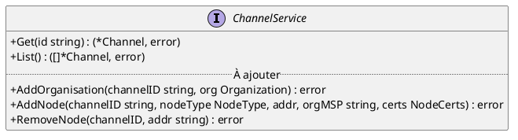
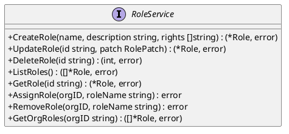
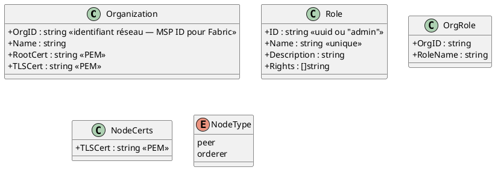
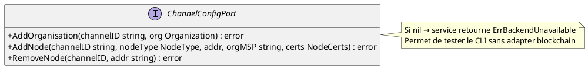
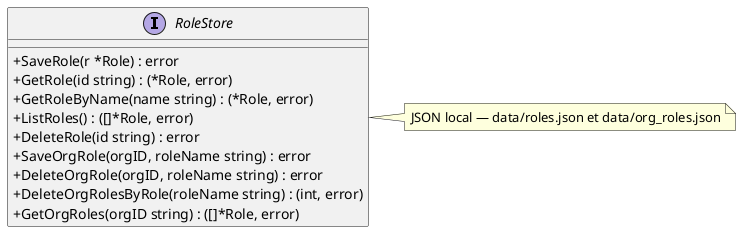
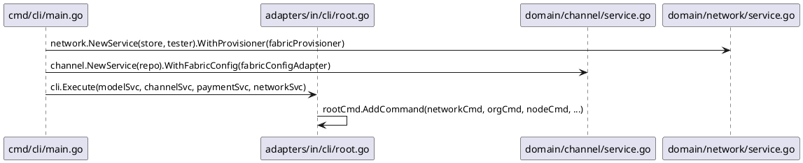

# DC — CLI Admin : Référence des commandes administrateur

> Phase 3 — Arrington | Use cases : UCADM01–UCADM05, UCDEV02 | Outil : `myr` (`bin/myr-linux`, installé dans `~/.local/bin/myr` sur le serveur)

---

## 1. Objectif

Ce document définit le **contrat d'interface du CLI administrateur** (`myr`). Il précise, pour chaque commande, la syntaxe complète, les drapeaux, les messages de sortie, les codes d'erreur, et le service domaine appelé.

Le CLI est le **seul point d'entrée** pour les opérations d'installation et de configuration d'un réseau Myr (UCADM01–05). L'API REST n'expose jamais ces opérations. Les opérations d'infrastructure irréversibles (`myr network destroy`) n'existent donc que dans ce binaire.

La structure de ce document suit la hiérarchie des commandes cobra définie dans `adapters/in/cli/`.

---

## 2. Arbre de commandes

```
myr
├── network                     — gestion des profils réseau (blockchain configurable)
│   ├── list                    — liste les profils configurés
│   ├── show <id>               — affiche les détails d'un profil
│   ├── add                     — configure un nouveau profil réseau (--blockchain <type>)
│   ├── update <id>             — modifie un profil existant (flags fournis seulement)
│   ├── activate <id>           — définit le réseau actif
│   ├── delete <id>             — supprime un profil de configuration
│   ├── test [id]               — teste la connectivité TCP vers le nœud
│   ├── import                  — importe un profil depuis un fichier JSON/YAML
│   ├── destroy <id> --confirm  — démantèle un réseau dev/test (UCADM05, irréversible)
│   ╌╌ create                   — [POST-V1] crée un réseau blockchain from scratch (configtx, genesis block)
│   └─╌ sync                    — [POST-V1] synchronise la configuration d'un canal distant
├── org
│   └── add                     — ajoute une organisation au canal (UCADM01)
├── node
│   ├── add                     — ajoute un nœud peer ou orderer au réseau (UCADM03)
│   ├── provision                — enregistre un nouveau nœud auprès de la CA et génère ses identifiants
│   └── remove                  — retire administrativement un nœud du réseau (UCADM04)
├── model                       — gestion des modèles 3D
├── channel                     — lecture des canaux blockchain
└── payment                     — commandes de paiement
```

---

## 3. Groupe `myr network` — Gestion des profils réseau

Un **profil réseau** (`NetworkProfile`) est la configuration qui permet à `myr-app` de se connecter à un nœud blockchain d'une organisation. Myr se connecte à **un seul nœud** (celui de son organisation) — le réseau synchronise ensuite avec les autres organisations.

### 3.1 `myr network list`

```
myr network list
```

**Comportement :** Liste tous les profils réseau configurés dans `data/networks.json`.

**Sortie :**

```
ID                   NOM                  ENDPOINT                  ORG-ID       ACTIF
net-1700000000000    diy-network          89.167.102.193:7051       Org1MSP      *
net-1700000000001    sandbox-test         localhost:7051             Org2MSP
```

**Sortie (aucun réseau) :** `Aucun réseau configuré. Utilisez "myr network add" ou "myr network import".`

**Service :** `networkSvc.List()`

---

### 3.2 `myr network show <id>`

```
myr network show <id>
```

**Comportement :** Affiche tous les champs d'un profil réseau identifié par son `id`.

**Sortie :**

```
────────────────────────────────────────────────────
Réseau : diy-network  (id: net-1700000000000)
────────────────────────────────────────────────────
Endpoint du nœud : 89.167.102.193:7051
Nœud d'entrée TLS: peer0.org1.diy-network.com
Org ID           : Org1MSP
Canal            : sandbox
Certificat       : data/certs/org1/client.pem
Clé privée       : data/certs/org1/client-key.pem
Certificat TLS   : data/certs/org1/tls-root.pem
Contrat          : myrcc
Autorité cert.   : https://89.167.102.193:7054
Nom autorité     : ca-org1
Server URL       : (non configuré)
Auto guest       : false
Auto register    : false
Auto role        : reader
Production       : false
Actif            : true
Créé le          : 2026-01-15 10:23:45
────────────────────────────────────────────────────
```

**Erreur :** `Erreur : réseau introuvable : <id>`

**Service :** `networkSvc.List()` puis recherche par ID (aucun `Get(id)` dans le port v1 — recherche linéaire acceptable).

---

### 3.3 `myr network add`

```
myr network add --name <nom> --node <host:port> --org-id <id> [options]
```

**Drapeaux :**

| Drapeau | Type | Requis | Description |
|---------|------|--------|-------------|
| `--name` | string | ✅ | Nom lisible du réseau |
| `--node` | string | ✅ | Adresse du nœud d'entrée (`host:port`) |
| `--org-id` | string | ✅ | Identifiant de l'organisation (`ex: Org1MSP`) |
| `--gateway` | string | — | Nom TLS du nœud d'entrée (ex: `peer0.org1.com`) |
| `--cert` | string | — | Chemin vers le certificat client PEM |
| `--key` | string | — | Chemin vers la clé privée PEM |
| `--tls-cert` | string | — | Chemin vers le certificat TLS du nœud PEM |
| `--channel` | string | — | Nom du canal blockchain par défaut |
| `--contract` | string | — | Nom du contrat déployé |
| `--ca` | string | — | URL de l'autorité de certification (`https://host:port`) |
| `--ca-name` | string | — | Nom de l'autorité de certification (ex: `ca-org1`) |
| `--server` | string | — | URL du MYR Server central (`https://host:port`) |
| `--auto-guest` | bool | — | Autoriser les accès invité automatiques (défaut: `false`) |
| `--auto-register` | bool | — | Autoriser l'enregistrement CA automatique (défaut: `false`) |
| `--auto-role` | string | — | Rôle auto-register : `reader`, `contributor`, `auditor` (défaut: `reader`) |
| `--production` | bool | — | Marquer ce réseau comme réseau de production — protège contre `destroy` (défaut: `false`) |

> **Note :** certains flags sont spécifiques à un backend. Si un flag non supporté par le `--blockchain` choisi est fourni, le CLI émet un avertissement et l'ignore. La documentation des flags par backend est dans `adapters/in/cli/network_<type>.go` (à créer pour chaque nouveau backend).

**Comportement :** Crée un nouveau profil réseau et le persiste dans `data/networks.json`. N'active PAS le réseau automatiquement.

**Sortie :**
```
Réseau "diy-network" configuré (id: net-1700000000000).
Activez-le avec : myr network activate net-1700000000000
```

**Erreurs :**
- `Erreur : le nom est requis`
- `Erreur : adresse du nœud invalide "localhost" — utilisez le format host:port`
- `Erreur : un réseau avec ce nom existe déjà — utilisez "myr network update <id>"`

**Service :** `networkSvc.Add(...)`

---

### 3.4 `myr network update <id>`

```
myr network update <id> [--name <nom>] [--node <host:port>] [--org-id <id>] [options]
```

**Drapeaux :** mêmes que `add`, tous optionnels. Seuls les drapeaux explicitement fournis écrasent les valeurs existantes.

**Comportement :**
1. Charge le profil existant via `networkSvc.List()` (recherche par ID).
2. Fusionne les champs : pour chaque drapeau fourni (`cmd.Flags().Changed("flag")`), la nouvelle valeur remplace l'ancienne.
3. Appelle `networkSvc.Update(id, ...)` avec les valeurs fusionnées.

**Sortie :** `Réseau net-1700000000000 mis à jour.`

**Erreurs :**
- `Erreur : réseau introuvable : <id>`
- `Erreur : adresse du nœud invalide "<val>" — utilisez le format host:port`

**Service :** `networkSvc.List()` + `networkSvc.Update(...)`

> **Note implémentation :** `networkSvc.Update()` remplace tous les champs — le merge doit se faire côté CLI Handler avant l'appel.

---

### 3.5 `myr network activate <id>`

```
myr network activate <id>
```

**Comportement :** Marque le profil `<id>` comme actif. Le précédent réseau actif est désactivé automatiquement.

**Sortie :** `Réseau "diy-network" activé (id: net-1700000000000).`

**Erreurs :**
- `Erreur : réseau introuvable : <id>`

**Service :** `networkSvc.Activate(id)`

---

### 3.6 `myr network delete <id>`

```
myr network delete <id> [--yes]
```

**Drapeaux :**

| Drapeau | Type | Description |
|---------|------|-------------|
| `--yes` | bool | Ignore la demande de confirmation interactive |

**Comportement :** Supprime le profil de configuration. Si le réseau est actif, affiche un avertissement supplémentaire.

**Sortie (confirmation) :**
```
Supprimer le réseau "diy-network" (net-1700000000000) ? [o/N] : o
Réseau supprimé.
```

**Sortie (--yes) :** `Réseau "diy-network" supprimé.`

**Erreurs :**
- `Erreur : réseau introuvable : <id>`
- `Avertissement : ce réseau est actuellement actif. La suppression désactive la connexion au réseau blockchain.`

**Service :** `networkSvc.Delete(id)`

> **Distinction avec `destroy` :** `delete` supprime uniquement le profil de configuration. Il ne touche pas aux processus blockchain, ni aux données ledger locales. Utilisé pour retirer un réseau mal configuré ou désusage.

---

### 3.7 `myr network test [id]`

```
myr network test [id]
```

**Comportement :** Teste la connectivité TCP vers l'endpoint du nœud du profil. Si `id` est omis, utilise le réseau actif.

**Sortie :**
```
Test de connectivité vers 89.167.102.193:7051...
OK — nœud joignable
```

> La latence n'est pas retournée par `networkSvc.TestConnection(id)` en v1 (le port retourne uniquement `error`). Un affichage de latence supposerait que le port retourne une durée — à ajouter si nécessaire en v2.

**Erreurs :**
- `Erreur : aucun réseau actif — activez-en un avec "myr network activate <id>"`
- `Erreur : impossible de joindre 89.167.102.193:7051 — vérifiez le pare-feu et la disponibilité réseau`

**Service :** `networkSvc.TestConnection(id)`

---

### 3.8 `myr network import`

```
myr network import --profile <chemin> [--name <nom>] [--activate]
```

**Drapeaux :**

| Drapeau | Type | Requis | Description |
|---------|------|--------|-------------|
| `--profile` | string | ✅ | Chemin vers le fichier JSON ou YAML du profil |
| `--name` | string | — | Surcharge le nom importé depuis le fichier |
| `--activate` | bool | — | Active automatiquement le réseau importé |

**Comportement :**
Le CLI Handler tente de parser le fichier selon deux formats :
1. **Format Fabric gateway-connection.json** (ex: `connection-profiles/connection-org1.json`) — extrait :
   - `name` → `Name`
   - `client.organization` → organisation cible
   - `organizations[org].mspid` → `MSPID`
   - premier peer de l'organisation → `PeerEndpoint` (URL sans `grpcs://`)
   - `peers[peer].grpcOptions.ssl-target-name-override` → `GatewayPeer`
   - `peers[peer].tlsCACerts.pem` → écrit dans `data/certs/<nom>/tls-root.pem`, chemin stocké dans `TLSCertPath`
   - `certificateAuthorities[ca].url` → `CAEndpoint`
   - `certificateAuthorities[ca].caName` → `CAName`
   - premier canal → `FabricChannel`
2. **Format NetworkProfile JSON** (export d'un profil myr existant) — désérialisation directe.

Les champs non extractibles du profil Fabric (CertPath, KeyPath) restent vides — l'admin les complète via `myr network update <id>`.

**Sortie :**
```
Profil importé depuis connection-org1.json
  Nom        : diy-network
  Org ID     : Org1MSP
  Nœud       : 89.167.102.193:7051
  Canal      : sandbox
  CA         : https://89.167.102.193:7054
  TLS cert   : data/certs/diy-network/tls-root.pem (extrait du profil)

Réseau importé (id: net-1700000000000).
Complétez la configuration avec : myr network update net-1700000000000 --cert <cert> --key <key>
```

**Erreurs :**
- `Erreur : fichier introuvable : <chemin>`
- `Erreur : format de profil invalide — ni Fabric connection profile ni NetworkProfile JSON reconnus`
- `Erreur : champ obligatoire manquant dans le profil : <champ>`

**Service :** CLI Handler parse le fichier, puis appelle `networkSvc.Add(...)`

---

### 3.9 `myr network destroy <id> --confirm` *(UCADM05)*

```
myr network destroy <id> --confirm [--data-path <chemin>]
```

**Drapeaux :**

| Drapeau | Type | Requis | Description |
|---------|------|--------|-------------|
| `--confirm` | bool | ✅ | Confirmation explicite obligatoire (RM28) |
| `--data-path` | string | — | Chemin du répertoire ledger blockchain local à supprimer (défaut: `MYR_FABRIC_DATA_PATH` ou `/var/hyperledger/production`) |

**Comportement (CLI Handler uniquement — pas dans le domaine, règle DC-D2-05) :**

1. Vérifier la présence du flag `--confirm`. Si absent → afficher l'avertissement et sortir.
2. Charger le profil via `networkSvc.List()`.
3. Vérifier `profile.IsProduction == false`. Si production → refuser et sortir.
4. **Arrêter les processus blockchain** (dépend du mode de déploiement — cf. § 3.9.1).
5. **Supprimer les données ledger locales** : `os.RemoveAll(dataPath)`.
6. **Supprimer les artefacts cryptographiques** : `os.RemoveAll("data/certs/" + profile.ID)`.
7. **Supprimer le profil** : `networkSvc.Delete(id)`.
8. Afficher confirmation.

**Sortie (--confirm absent) :**
```
ATTENTION : Cette opération est irréversible.
Elle supprimera toutes les données locales du réseau "diy-network".
  - Processus blockchain (nœuds, CA) arrêtés
  - Données ledger supprimées (/var/hyperledger/production)
  - Artefacts cryptographiques supprimés (data/certs/net-1700000000000/)
  - Profil réseau supprimé

Utilisez --confirm pour confirmer :
  myr network destroy net-1700000000000 --confirm
```

**Sortie (réseau de production) :**
```
Erreur : "diy-network" est marqué comme réseau de production (IsProduction: true).
Démantèlement refusé. Pour forcer, retirez le flag production :
  myr network update net-1700000000000 --production=false
```

**Sortie (avertissement processus) :**
```
Avertissement : processus peer (PID 1234) non arrêté — poursuite de la suppression.
Avertissement : processus orderer (PID 1235) non arrêté — poursuite de la suppression.
Données ledger supprimées.
Artefacts cryptographiques supprimés.
Réseau "diy-network" démantelé. Toutes les données locales ont été supprimées.
```

**Sortie (succès) :**
```
Réseau "diy-network" démantelé. Toutes les données locales ont été supprimées.
```

**Service :** `networkSvc.List()` (validation) + `networkSvc.Delete(id)` (suppression profil)
Opérations OS restent dans le CLI Handler (ENF18, DC-D2-05).

#### 3.9.1 Arrêt des processus blockchain

Le mode d'arrêt dépend du déploiement et de l'adaptateur actif (Fabric par défaut). Le CLI tente dans l'ordre :

| Méthode | Condition | Commande |
|---------|-----------|---------|
| Docker Compose | `docker ps` détecte des conteneurs blockchain | `docker compose -f <compose-file> down` |
| systemd | `/etc/systemd/system/fabric-*.service` existe | `systemctl stop fabric-peer fabric-orderer fabric-ca` |
| pkill (fallback) | Toujours | `pkill -SIGTERM peer orderer fabric-ca-server` |
| Timeout | Processus toujours actif après 10s | SIGKILL + avertissement |

Le chemin vers le fichier `docker-compose.yaml` est lu depuis `MYR_FABRIC_COMPOSE_PATH` ou `data/docker-compose.yaml`.

---

## 4. Groupe `myr org` — Gestion des organisations *(UCADM01)*

### 4.1 `myr org add`

```
myr org add --org-id <id> --name <nom> --cert <cert.pem> [options]
```

**Drapeaux :**

| Drapeau | Type | Requis | Description |
|---------|------|--------|-------------|
| `--org-id` | string | ✅ | Identifiant de l'organisation (`[a-zA-Z0-9_.-]{1,128}`) |
| `--name` | string | ✅ | Nom lisible de l'organisation |
| `--cert` | string | ✅ | Chemin vers le certificat CA racine PEM |
| `--channel` | string | — | ID du canal cible (défaut: canal du réseau actif) |
| `--tls-cert` | string | — | Chemin vers le certificat TLS CA racine PEM |
| `--update` | bool | — | Force la mise à jour si l'organisation est déjà membre (sans prompt interactif) |

> **Note Fabric :** Pour HyperLedger Fabric, `--org-id` correspond au MSP ID et doit respecter le format `[a-zA-Z0-9_.-]{1,128}`. La validation du format est déléguée à l'adapter `adapters/out/fabric/` (DC-D2-09).

**Comportement :**
1. Le CLI Handler lit le certificat depuis `--cert` et optionnellement depuis `--tls-cert`.
2. Valide que l'identifiant d'organisation respecte le format attendu (`[a-zA-Z0-9_.\-]{1,128}`).
3. Résout le canal cible : `--channel` si fourni, sinon le canal du réseau actif.
4. Appelle `channelSvc.AddOrganisation(channelID, org)`.

**Sortie (succès) :**
```
Organisation "Mon Organisation" (id: MonOrgMSP) ajoutée au canal sandbox.
La configuration du canal est mise à jour sur le réseau.
```

**Sortie (organisation déjà membre — mise à jour) :**
```
L'organisation MonOrgMSP est déjà membre du réseau.
Mise à jour des informations...
Organisation "Mon Organisation" mise à jour sur le réseau.
```

**Erreurs :**

| Code interne | Message CLI |
|-------------|------------|
| `ErrInvalidMSPID` | `Erreur : identifiant d'organisation invalide — caractères non autorisés ou longueur hors limites (max 128).` |
| `ErrFabricUnavailable` | `Erreur : adaptateur blockchain non configuré — vérifiez le réseau actif et les variables d'environnement.` |
| `ErrEndorsementPolicy` | `Erreur : politique d'endorsement non satisfaite. Contactez les autres administrateurs d'organisation.` |
| `file not found` | `Erreur : certificat introuvable : <chemin>` |
| `ErrAlreadyMember` (si pas de --update) | Déclenche le flux de mise à jour (interactif ou via flag `--update`) |

**Service :** `channelSvc.AddOrganisation(channelID, Organization{OrgID, Name, RootCert, TLSCert})`

**Port requis :** `ChannelService.AddOrganisation()` — méthode à ajouter au port `domain/channel/port_in.go`

---

### 4.2 `myr org role assign` *(UCADM06)*

```
myr org role assign --org <orgID> --role <roleNom>
```

**Drapeaux :**

| Drapeau | Type | Requis | Description |
|---------|------|--------|-------------|
| `--org` | string | ✅ | Identifiant de l'organisation cible |
| `--role` | string | ✅ | Nom du rôle à attribuer |

**Comportement :** Appelle `roleSvc.AssignRole(orgID, roleName)`.

**Sortie :** `Rôle "contributeur" attribué à l'organisation "MonOrgMSP".`

**Erreurs :**

| Code interne | Message CLI |
|-------------|------------|
| `ErrOrgNotFound` | `Erreur : organisation "<orgID>" introuvable sur le réseau.` |
| `ErrRoleNotFound` | `Erreur : rôle "<roleNom>" introuvable. Créez-le avec "myr role create".` |
| `ErrAdminRoleProtected` | `Erreur : le rôle "admin" est protégé et ne peut pas être attribué via cette commande. [RM34]` |

**Service :** `roleSvc.AssignRole(orgID, roleName string) error`

---

### 4.3 `myr org role remove` *(UCADM06)*

```
myr org role remove --org <orgID> --role <roleNom>
```

**Drapeaux :**

| Drapeau | Type | Requis | Description |
|---------|------|--------|-------------|
| `--org` | string | ✅ | Identifiant de l'organisation cible |
| `--role` | string | ✅ | Nom du rôle à retirer |

**Comportement :** Appelle `roleSvc.RemoveRole(orgID, roleName)`.

**Sortie :** `Rôle "contributeur" retiré de l'organisation "MonOrgMSP".`

**Erreurs :**
- `Erreur : liaison inexistante — l'organisation "<orgID>" ne possède pas le rôle "<roleNom>".`

**Service :** `roleSvc.RemoveRole(orgID, roleName string) error`

---

## 5. Groupe `myr role` — Gestion des rôles *(UCADM07)*

Un **rôle** est un ensemble nommé de droits d'accès. Il est stocké localement — indépendant du backend blockchain. Le rôle `admin` (ID constant `"admin"`) est protégé et ne peut pas être modifié, supprimé, ni attribué à une organisation tierce (RM34).

### 5.1 `myr role list`

```
myr role list
```

**Comportement :** Liste tous les rôles disponibles dans le système.

**Sortie :**

```
NOM              DESCRIPTION                        DROITS
admin            Rôle administrateur (protégé)      *
contributeur     Peut soumettre des assets           read, write, submit
lecteur          Accès en lecture seule              read
```

**Service :** `roleSvc.ListRoles()`

---

### 5.2 `myr role create` *(UCADM07)*

```
myr role create --name <nom> --desc <description> --rights <droit1,droit2,...>
```

**Drapeaux :**

| Drapeau | Type | Requis | Description |
|---------|------|--------|-------------|
| `--name` | string | ✅ | Nom unique du rôle (insensible à la casse) |
| `--desc` | string | — | Description lisible du rôle |
| `--rights` | string | ✅ | Liste de droits séparés par des virgules (ex: `read,write,submit`) |

**Comportement :** Appelle `roleSvc.CreateRole(name, desc, rights)`.

**Sortie :** `Rôle "contributeur" créé avec les droits : read, write, submit.`

**Erreurs :**

| Code interne | Message CLI |
|-------------|------------|
| `ErrRoleNameConflict` | `Erreur : un rôle avec le nom "<nom>" existe déjà. [RM36]` |

**Service :** `roleSvc.CreateRole(name, description string, rights []string) (*Role, error)`

---

### 5.3 `myr role edit <id>` *(UCADM07)*

```
myr role edit <id> [--name <nom>] [--desc <description>] [--rights <droits>]
```

**Drapeaux :**

| Drapeau | Type | Description |
|---------|------|-------------|
| `--name` | string | Nouveau nom (si fourni, vérifie l'unicité) |
| `--desc` | string | Nouvelle description |
| `--rights` | string | Nouvelle liste de droits (remplace la liste existante) |

**Comportement :** Merge partiel — seuls les flags fournis sont modifiés. Appelle `roleSvc.UpdateRole(id, patch)`.

**Sortie :** `Rôle "contributeur" mis à jour.`

**Erreurs :**

| Code interne | Message CLI |
|-------------|------------|
| `ErrAdminRoleProtected` | `Erreur : le rôle "admin" est protégé et ne peut pas être modifié. [RM34]` |
| `ErrRoleNameConflict` | `Erreur : le nom "<nom>" est déjà utilisé par un autre rôle. [RM36]` |

**Service :** `roleSvc.UpdateRole(id string, patch RolePatch) (*Role, error)`

---

### 5.4 `myr role delete <id>` *(UCADM07)*

```
myr role delete <id> [--yes]
```

**Drapeaux :**

| Drapeau | Type | Description |
|---------|------|-------------|
| `--yes` | bool | Ignore la demande de confirmation interactive |

**Comportement :**
1. Vérifie que l'ID n'est pas `"admin"` (RM34).
2. Supprime toutes les liaisons `OrgRole` référençant ce rôle (RM35).
3. Supprime le rôle.

**Sortie :**
```
Supprimer le rôle "contributeur" ? Il sera retiré de 3 organisation(s). [o/N] : o
Rôle "contributeur" supprimé. Retiré de 3 organisation(s).
```

**Erreurs :**

| Code interne | Message CLI |
|-------------|------------|
| `ErrAdminRoleProtected` | `Erreur : le rôle "admin" est protégé et ne peut pas être supprimé. [RM34]` |

**Service :** `roleSvc.DeleteRole(id string) (nOrgsImpacted int, error)`

---

## 6. Groupe `myr node` — Gestion des nœuds réseau

### 5.1 `myr node add` *(UCADM03)*

```
myr node add --type <peer|orderer> --addr <host:port> --org-id <id> [options]
```

**Drapeaux :**

| Drapeau | Type | Requis | Description |
|---------|------|--------|-------------|
| `--type` | string | ✅ | Type de nœud : `peer` ou `orderer` |
| `--addr` | string | ✅ | Adresse du nœud (`host:port`, ex: `89.167.102.193:7051`) |
| `--org-id` | string | ✅ | Identifiant de l'organisation propriétaire du nœud |
| `--channel` | string | — | Canal cible (défaut: canal du réseau actif) |
| `--cert` | string | — | Chemin vers le certificat TLS du nœud PEM |

**Comportement :**
1. Valide le format `host:port` de `--addr`.
2. Résout le canal cible (cf. `--channel` ou réseau actif).
3. Lit le certificat TLS si `--cert` fourni.
4. Appelle `channelSvc.AddNode(channelID, nodeType, addr, orgID, certs)`.

**Sortie :**
```
Soumission de la demande d'ajout du nœud peer 89.167.102.193:7051 au canal sandbox...
Nœud peer 89.167.102.193:7051 ajouté. Synchronisation du ledger en cours.
Synchronisation terminée à la hauteur 1042.
```

**Erreurs :**

| Code interne | Message CLI |
|-------------|------------|
| `ErrNodeUnreachable` | `Erreur : impossible de joindre 89.167.102.193:7051 — vérifiez le pare-feu et la disponibilité réseau.` |
| `ErrFabricUnavailable` | `Erreur : adaptateur blockchain non configuré.` |
| `ErrEndorsementPolicy` | `Erreur : politique d'endorsement non satisfaite. Contactez les autres administrateurs.` |
| `ErrSyncTimeout` | `Avertissement : le nœud est ajouté mais la synchronisation a dépassé le délai. Vérifiez la connectivité avec : myr network test` |

**Cas orderer :** Mêmes flags. Le CLI Handler communique que les paramètres de consensus sont gérés par l'adaptateur actif — seuls addr, org-id et cert sont requis pour l'enregistrement.

**Service :** `channelSvc.AddNode(channelID, nodeType, addr, orgID, certs)`

**Port requis :** `ChannelService.AddNode()` — méthode à ajouter au port `domain/channel/port_in.go`

---

### 5.2 `myr node provision` — enregistrer l'identité d'un nouveau nœud

```
myr node provision --node-id <id> [--hostname <host>] [--out <dossier>] [options]
```

**Drapeaux :**

| Drapeau | Type | Requis | Description |
|---------|------|--------|-------------|
| `--node-id` | string | ✅ | Identité CA du nœud, ex: `node1.org1.example.com` |
| `--hostname` | string | — | Hostname/IP pour le SAN TLS (défaut: `--node-id`) |
| `--secret` | string | — | Secret d'enrôlement (généré automatiquement si omis) |
| `--out` | string | — | Répertoire de sortie pour les identifiants (défaut: `./<node-id>`) |
| `--network` | string | — | ID du réseau (défaut: réseau actif) |

**Comportement :** Enregistre le nœud auprès de l'autorité de certification du réseau actif (`networkSvc.AddPeer`), puis écrit sur disque les fichiers renvoyés par l'adaptateur actif (`PeerCredentials.Files`) et affiche les instructions de démarrage qu'il fournit (`PeerCredentials.StartupInstructions`). Le CLI ne connaît ni la mise en page des fichiers ni la manière de démarrer le nœud — c'est l'adaptateur (ex: `adapters/out/fabric/`) qui porte cette connaissance.

**Sortie :** liste des fichiers générés et instructions de démarrage propres à l'adaptateur actif.

**Erreurs :**
- `Erreur : service réseau non disponible — relancez myr avec une configuration réseau`
- `Erreur : échec : <détail renvoyé par l'adaptateur>`

**Service :** `networkSvc.AddPeer(networkID, AddPeerRequest{PeerID, Hostname, Secret})`

---

### 5.3 `myr node remove` *(UCADM04)*

```
myr node remove --addr <host:port> [--channel <channelID>]
```

**Drapeaux :**

| Drapeau | Type | Requis | Description |
|---------|------|--------|-------------|
| `--addr` | string | ✅ | Adresse du nœud à retirer (`host:port`) |
| `--channel` | string | — | Canal cible (défaut: canal du réseau actif) |

**Comportement :**
1. Résout le canal cible.
2. Appelle `channelSvc.RemoveNode(channelID, addr)`.
3. Le service vérifie (côté domaine) : appartenance au canal, seuil minimum 3 nœuds (RM27).
4. Affiche le nombre de nœuds actifs restants.

**Sortie :**
```
Nœud 89.167.102.193:7051 retiré du canal sandbox.
3 nœuds actifs restants sur ce canal.
```

**Avertissement nœud d'entrée :**
```
Avertissement : le nœud retiré était le nœud d'entrée (TLS) du réseau actif.
Reconfigurez le nœud d'entrée avec :
  myr network update net-1700000000000 --gateway <nouveau-nœud>
```

**Erreurs :**

| Code interne | Message CLI |
|-------------|------------|
| `ErrNodeNotMember` | `Erreur : 89.167.102.193:7051 n'est pas membre actif du canal sandbox.` |
| `ErrMinNodesRequired` | `Erreur : le réseau doit conserver au moins 3 nœuds actifs. Retrait impossible (actuellement 3 nœuds actifs). [RM27]` |
| `ErrFabricUnavailable` | `Erreur : adaptateur blockchain non configuré.` |
| `ErrEndorsementPolicy` | `Erreur : politique d'endorsement non satisfaite. Contactez les autres administrateurs.` |

**Service :** `channelSvc.RemoveNode(channelID, addr)`

**Port requis :** `ChannelService.RemoveNode()` — méthode à ajouter au port `domain/channel/port_in.go`

---

## 6. Ports Go requis

### 7.1 Extensions de `ChannelService` (port_in)

Les commandes UCADM01/03/04 nécessitent l'extension du port d'entrée `domain/channel/port_in.go` :



### 7.2 `RoleService` (port_in) *(UCADM06/07)*

À définir dans `domain/channel/port_in.go` :



### 7.3 Nouvelles entités dans `domain/channel/entity.go`



### 7.4 Extension de `ChannelConfigPort` (port_out)

Nouveau port sortant `domain/channel/ports.go` implémenté par `adapters/out/fabric/` :



### 7.5 `RoleStore` (port_out) *(UCADM06/07)*

À définir dans `domain/channel/ports.go`, implémenté par `adapters/out/localstorage/role_store.go` :



### 7.6 Champ à ajouter à `NetworkProfile` (`domain/network/entity.go`)

| Champ | Type | Défaut | Description |
|-------|------|--------|-------------|
| `IsProduction` | `bool` | `false` | Protège contre `myr network destroy`. `true` → refuse le démantèlement. |

---

## 8. Format de sortie et codes de retour

### 7.1 Codes de sortie

| Code | Signification |
|------|--------------|
| `0` | Succès |
| `1` | Erreur (cobra retourne 1 par défaut — sortie sur stderr) |

### 7.2 Conventions de sortie

- **Sortie nominale** : stdout — texte lisible, formaté
- **Erreurs** : stderr via `cobra.Command.RunE` qui retourne une `error`
- **Avertissements** : stdout, prefixés `Avertissement :`
- **Tableaux** : colonnes alignées avec tabwriter (`%-20s  %s\n`)
- **Séparateurs** : `─` (U+2500) × 60 pour les sections détaillées
- **Unités** : dates en local format `2006-01-02 15:04:05`, durées en `Xh Xm Xs`

### 7.3 Mode machine-parsable (futur)

Réservé pour v2 : flag global `--output json` pour les intégrations CI/CD.

---

## 8. Résolution du canal cible

Plusieurs commandes acceptent un `--channel` optionnel. La règle de résolution est :

```
1. Si --channel fourni → utiliser cette valeur
2. Sinon → charger le réseau actif via networkSvc.GetActive()
           → utiliser profile.FabricChannel
3. Si FabricChannel vide → erreur : "canal non configuré — utilisez --channel ou myr network update --channel <id>"
```

Cette résolution est mutualisée dans une fonction `resolveChannel(cmd, networkSvc)` dans `adapters/in/cli/`.

---

## 9. Injection de services



La commande `myr network destroy` est la seule commande CLI qui appelle directement l'OS (processus, fichiers). Elle n'injecte pas de nouveau service — elle opère sur le système de fichiers local via les packages `os` et `os/exec` directement dans le CLI Handler.

---

## 10. Décisions de conception

| ID | Décision | Raison |
|----|---------|--------|
| DC-CLI-01 | Résolution du canal par défaut via le réseau actif | Évite à l'admin de répéter `--channel <id>` sur chaque commande — le réseau actif fournit le contexte implicite. |
| DC-CLI-02 | `myr network destroy` opère en CLI Handler, pas dans le domaine | Les opérations OS (pkill, os.RemoveAll) violent ENF18 si placées dans `domain/network/`. Conforme à DC-D2-05. |
| DC-CLI-03 | `ChannelConfigPort` nullable — service retourne `ErrFabricUnavailable` si nil | Permet d'utiliser le CLI sans adapter Fabric (mode dev, simulation). La commande existe et valide ses flags même sans Fabric. |
| DC-CLI-04 | `--confirm` obligatoire pour `destroy`, sans alternative interactive | Cohérence avec les outils d'admin Unix standard. Le `--confirm` est scriptable, le prompt interactif ne l'est pas. |
| DC-CLI-05 | `myr network update` fusionne côté CLI Handler | `networkSvc.Update()` remplace tous les champs. La fusion (`Changed("flag")`) doit être faite dans le CLI Handler pour ne modifier que les champs fournis. |
| DC-CLI-06 | `myr network import` supporte deux formats | Le format natif du backend (ex: Fabric gateway-connection.json) est parsé si détecté. Le format NetworkProfile JSON générique facilite la portabilité entre instances Myr et entre backends. |
| DC-CLI-07 | Arrêt processus dans `destroy` : Docker > systemd > pkill | Ordre de priorité adapté aux déploiements réels. Les noms de processus à arrêter dépendent du `BlockchainType` du profil. |
| DC-CLI-08 | `--blockchain` obligatoire à la création, pas modifiable ensuite | Changer de backend impliquerait une migration des données on-chain. Si le besoin se présente, supprimer et recréer le profil. |

---

## 11. Écarts code → specs

| ID | Écart | Fichier | Impact |
|----|-------|---------|--------|
| E-CLI-01 | `myr network` (list/show/add/update/activate/delete/test/import/destroy) absent | `adapters/in/cli/network.go` (à créer) | CLI non exploitable pour la gestion réseau |
| E-CLI-02 | `myr org add` absent | `adapters/in/cli/org.go` (à créer) | UCADM01 non exposé |
| E-CLI-03 | `myr node add` et `myr node remove` absents | `adapters/in/cli/node.go` (à créer) | UCADM03 et UCADM04 non exposés |
| E-CLI-04 | `ChannelService.AddOrganisation()`, `AddNode()`, `RemoveNode()` absents | `domain/channel/port_in.go`, `service.go` | Ports d'entrée UCADM01/03/04 non définis |
| E-CLI-05 | `ChannelConfigPort` absent | `domain/channel/ports.go` | Port sortant UCADM non défini |
| E-CLI-06 | `Organization`, `NodeType`, `NodeCerts` absents | `domain/channel/entity.go` | Entités UCADM01/03/04 non définies |
| E-CLI-07 | `IsProduction bool` absent de `NetworkProfile` | `domain/network/entity.go` | Protection UCADM05 non disponible |
| E-CLI-08 | `networkCmd`, `orgCmd`, `nodeCmd` non enregistrés dans `root.go` | `adapters/in/cli/root.go` | Commandes non accessibles via `myr` |
| E-CLI-09 | ~~UCDEV02 Analyse ne mentionne pas les commandes UCADM~~ — **résolu** | `specs/2-Analyse/UCDEV-Developpement/UCDEV02.md` | Corrigé : UCDEV02 inclut maintenant les commandes UCADM |
| E-CLI-10 | `myr role` (list/create/edit/delete) absent | `adapters/in/cli/role.go` (à créer) | UCADM07 non exposé |
| E-CLI-11 | `myr org role assign` et `myr org role remove` absents | `adapters/in/cli/org.go` (à étendre) | UCADM06 non exposé |
| E-CLI-12 | `RoleService` absent de `domain/channel/port_in.go` | `domain/channel/port_in.go`, `service.go` | Ports UCADM06/07 non définis |
| E-CLI-13 | `RoleStore` absent de `domain/channel/ports.go` | `domain/channel/ports.go` | Port sortant UCADM06/07 non défini |
| E-CLI-14 | `Role`, `OrgRole` absents de `domain/channel/entity.go` | `domain/channel/entity.go` | Entités UCADM06/07 non définies |
| E-CLI-15 | `adapters/out/localstorage/role_store.go` absent | `adapters/out/localstorage/role_store.go` | Implémentation JSON de `RoleStore` manquante |
| E-CLI-16 | `roleCmd` non enregistré dans `root.go` | `adapters/in/cli/root.go` | Commandes `myr role` non accessibles |
| E-CLI-17 | `Organization.OrgID` non renommé depuis `MSPID` | `domain/channel/entity.go` | Abstraction terminologique DC-D2-09 non appliquée |

---

## 12. Informations manquantes / points ouverts

| # | Question | Impact |
|---|---------|--------|
| 1 | **Format de sortie des nœuds actifs** dans `RemoveNode` — l'API Fabric Gateway v2 expose-t-elle un compteur ou faut-il interroger la config du canal ? | Détermine si le message `<N> nœuds actifs restants` est calculé côté service ou affichage estimé |
| 2 | **Politique d'endorsement multi-admin** — pour UCADM01/03/04, la configuration du canal Fabric requiert la signature de la majorité des admins d'organisation. Quel workflow Myr propose-t-il pour collecter ces signatures ? | Workflow multi-admin non modélisé en v1 |
| 3 | **Chemin ledger configurable** pour `myr network destroy` — `MYR_FABRIC_DATA_PATH` ou dans `config/` ? | Nécessaire pour UCADM05 fonctionnel |
| 4 | **Mode déploiement** de l'infrastructure Fabric pour `destroy` — Docker Compose ou bare-metal ? Quelle est la cible principale de déploiement ? | Détermine l'ordre de priorité de la logique d'arrêt processus (DC-CLI-07) |
| 5 | **`myr network create`** (UCADM02 flux nominal — création réseau Fabric from scratch) — reporté post-v1. En v1, `myr network import` depuis un profil `gateway-connection.json` existant couvre le cas nominal. La création from scratch (configtx.yaml, genesis block, cryptogen) est documentée manuellement hors CLI. Visible dans l'arbre avec tag `[POST-V1]`. | Résolu — reporté explicitement. |
