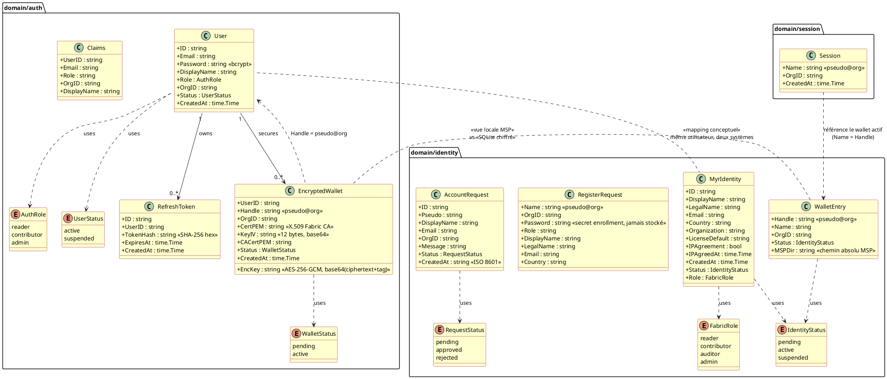
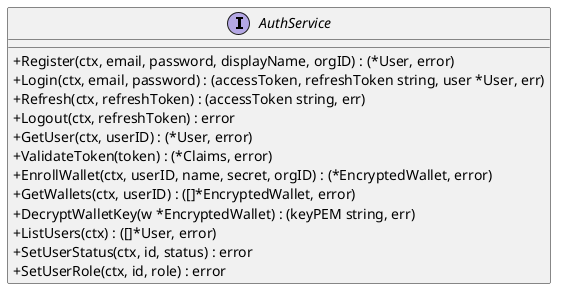
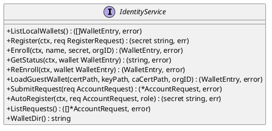
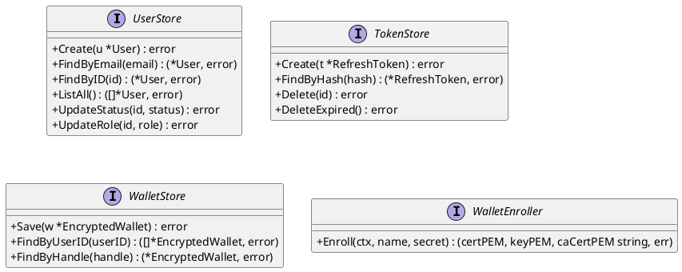
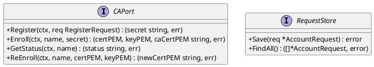
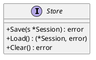

# DC — D1 : Auth, Identity et Session

## 1. Objectif

Ce document couvre les trois domaines qui composent la couche identité du système Myr :

- **auth** : gestion des comptes web avec authentification JWT (email/password), refresh tokens et wallets Fabric chiffrés en SQLite.
- **identity** : gestion des identités blockchain Fabric CA — enrôlement X.509, wallets locaux MSP, demandes d'accès.
- **session** : session locale mono-utilisateur persistée en JSON (pseudo@org courant).

Ces trois domaines modélisent le même utilisateur sous deux angles distincts : un compte applicatif web (`User`) et une identité cryptographique sur la blockchain Hyperledger Fabric (`MyrIdentity`). La relation entre les deux est un mapping intentionnel, non une dépendance directe.

---

## 2. Diagramme de classes

---

## 3. Description des classes

### User (domain/auth)

- **Rôle :** Compte applicatif web. Utilisé pour l'authentification email/password et l'émission de JWT. Persiste dans SQLite via `UserStore`.
- **Invariants :**
  - `Email` est unique dans le système.
  - `Password` est toujours stocké en hash bcrypt — jamais en clair.
  - `Role` à la création doit être `reader` (voir Écart E3 — le code actuel assigne `contributor` en violation de RM21).
  - `Status` est `active` ou `suspended` — un utilisateur suspendu ne peut pas se connecter.
  - `OrgID` référence l'organisation Fabric de rattachement (ex : `Org1MSP`).
- **Cycle de vie :** `Register` → `active` ; `SetUserStatus(suspended)` → `suspended` ; pas de suppression.

### RefreshToken (domain/auth)

- **Rôle :** Token opaque persisté (hash SHA-256) permettant de renouveler l'access token JWT sans re-authentification.
- **Invariants :**
  - `TokenHash` est le SHA-256 hex du token brut transmis au client — jamais le token brut.
  - `ExpiresAt` est obligatoire et définit la durée de validité.
  - Un token expiré doit être supprimé par `DeleteExpired()`.
- **Cycle de vie :** Créé à la connexion, invalidé à la déconnexion ou à l'expiration.

### EncryptedWallet (domain/auth)

- **Rôle :** Représentation SQLite d'un wallet Fabric CA. Contient le certificat X.509 (`CertPEM`) et la clé privée chiffrée (`EncKey`). Permet à l'application de signer des transactions Fabric au nom de l'utilisateur.
- **Invariants :**
  - `Handle` suit le format `pseudo@org` (ex : `alice@Org1`).
  - `EncKey` est chiffré AES-256-GCM avec la clé d'environnement `WALLET_ENCRYPT_KEY`. La valeur brute n'est jamais stockée.
  - `KeyIV` est un vecteur d'initialisation de 12 bytes encodé en base64 — unique par wallet.
  - `CertPEM` contient le certificat X.509 délivré par la Fabric CA.
  - `Status = pending` jusqu'à l'enrôlement effectif ; `active` après.
- **Cycle de vie :** `EnrollWallet` → `pending` → enrôlement Fabric CA réussi → `active`.

### Claims (domain/auth)

- **Rôle :** Contenu décodé d'un JWT access token. Valeur passagère, non persistée.
- **Invariants :** `UserID` (`sub`) est toujours présent et non vide.

### MyrIdentity (domain/identity)

- **Rôle :** Identité blockchain d'un auteur dans le réseau Myr. Les attributs `Status`, `Role` et `Channels` sont écrits dans le certificat X.509 par la Fabric CA.
- **Invariants :**
  - `IPAgreement` doit être `true` avant tout acte de publication sur la blockchain.
  - `LicenseDefault` définit la licence par défaut appliquée aux créations de cet auteur.
  - `Role` peut être `reader`, `contributor`, `auditor` ou `admin` — différent du rôle web JWT.
  - `Status` reflète l'état de l'identité dans la CA Fabric — pas l'état du compte web.
- **Cycle de vie :** `pending` → `Register` + `Enroll` → `active` ; `suspended` via admin CA.

### WalletEntry (domain/identity)

- **Rôle :** Vue locale d'un wallet Fabric (fichiers MSP sur disque). Lue depuis `~/.Myr/wallets/<handle>/msp/`. Complémentaire de `EncryptedWallet` (qui est la vue SQLite chiffrée).
- **Invariants :**
  - `Handle` suit le format `pseudo@org` — identique à `EncryptedWallet.Handle`.
  - `MSPDir` est un chemin absolu vers le répertoire MSP local.
  - `Status` est lu depuis le certificat X.509, pas depuis une base de données.

### RegisterRequest (domain/identity)

- **Rôle :** DTO de création d'identité auprès de la Fabric CA. Valeur éphémère, non persistée.
- **Invariants :** `Password` (secret d'enrôlement) n'est jamais stocké.

### AccountRequest (domain/identity)

- **Rôle :** Demande d'accès soumise par un inconnu avant la création de son compte. Stockée localement. Traitée par l'administrateur.
- **Invariants :**
  - `Status` initial est `pending`.
  - `CreatedAt` est en ISO 8601 (type `string` dans le code — voir Écart E1).
- **Cycle de vie :** `pending` → `approved` (admin crée le compte CA) | `rejected`.

### Session (domain/session)

- **Rôle :** Session locale mono-utilisateur. Identifie le wallet actif de la session courante. Persistée en JSON.
- **Invariants :**
  - `Name` suit le format `pseudo@org` — correspond à `WalletEntry.Handle`.
  - Un seul fichier session à la fois (pas de sessions multiples en mode local).
- **Cycle de vie :** `Save` au démarrage ou changement de contexte ; `Clear` à la déconnexion.

---

## 4. Relations et dépendances

- **User → RefreshToken** : un utilisateur peut avoir plusieurs refresh tokens actifs (multi-device). Les tokens expirés sont purgés périodiquement.
- **User → EncryptedWallet** : un utilisateur peut avoir plusieurs wallets (un par organisation Fabric). Le wallet est créé via `EnrollWallet` qui appelle la Fabric CA.
- **User ↔ MyrIdentity** : mapping conceptuel entre les deux systèmes. Ils partagent `Email` et `OrgID` comme corrélateurs naturels, mais ne se référencent pas directement en code (les domaines sont indépendants).
- **WalletEntry ↔ EncryptedWallet** : les deux représentent le même wallet Fabric, vu sous deux angles. `WalletEntry` est la vue fichier locale (MSP sur disque), `EncryptedWallet` est la vue SQLite (clé privée chiffrée AES-256-GCM). Le `Handle` est le lien commun.
- **Session → WalletEntry** : `Session.Name` correspond à `WalletEntry.Handle` — identifie le wallet actif de la session CLI.

---

## 5. Ports (interfaces Go)

### Port entrant — AuthService

### Port entrant — IdentityService

### Ports sortants — auth

### Ports sortants — identity

### Port sortant — session

---

## 6. Décisions de conception

| ID  | Décision | Raison |
|-----|----------|--------|
| DC-D1-01 | `auth` et `identity` sont deux domaines distincts | `auth` gère le compte web JWT ; `identity` gère l'identité Fabric CA. Les deux représentent le même utilisateur mais dans des systèmes de sécurité indépendants. Fusionner les deux créerait une dépendance Fabric dans le domaine auth. |
| DC-D1-02 | La clé privée du wallet est chiffrée AES-256-GCM dans SQLite | La clé privée X.509 ne doit jamais être stockée en clair. La variable d'environnement `WALLET_ENCRYPT_KEY` est l'unique vecteur de déchiffrement. |
| DC-D1-03 | `Session` est mono-utilisateur, persiste en JSON | Le mode nominal d'utilisation de `myr-app` est mono-utilisateur par instance. Redis est disponible optionnellement (`REDIS_URL`) pour le mode multi-instances. |
| DC-D1-04 | `WalletEntry` et `EncryptedWallet` coexistent | `WalletEntry` couvre le cas CLI (fichiers MSP locaux) ; `EncryptedWallet` couvre le cas web (SQLite). Ce sont deux vues du même objet métier selon le contexte d'utilisation. |
| DC-D1-05 | `AccountRequest.CreatedAt` est `string` (ISO 8601) | Écart volontaire — facilite la sérialisation JSON sans dépendance `time.Time` dans un DTO. Mais incohérent avec les autres entités (voir Écart E1). |

---

## 7. Écarts code → specs

| ID  | Entité concernée | Écart | Impact |
|-----|-----------------|-------|--------|
| E3  | `User.Role` à la création | Le code `auth/service.go` assigne le rôle `contributor` lors du `Register`. La règle RM21 impose `reader` comme rôle initial. | **Sécurité** — un nouvel utilisateur obtient des droits d'écriture Fabric qu'il ne devrait pas avoir initialement. |
| E1  | `AccountRequest.CreatedAt` | Type `string` au lieu de `time.Time` — incohérent avec toutes les autres entités du domaine. | Mineur — risque de parsing incorrect à la désérialisation. |
| E2  | `MyrIdentity` non liée à `User` | Il n'existe pas de champ commun explicite reliant les deux entités (ex. pas de `UserID` dans `MyrIdentity`). La corrélation se fait via `Email` et `OrgID` de manière implicite. | Conception — rend difficile la navigation d'un compte web vers son identité blockchain. |

---

## 8. Informations manquantes

- **Lien User ↔ MyrIdentity** : aucun champ de référence croisée explicite n'existe. Il faudrait soit ajouter `UserID` dans `MyrIdentity`, soit documenter la règle de corrélation par `Email + OrgID`.
- **Consumer et Manufacturer** : les rôles `consumer` et `manufacturer` apparaissent dans les specs UCPI (acheteur, fabricant) mais n'existent dans aucune entité du code — ni dans `AuthRole`, ni dans `FabricRole`. À concevoir.
- **Profil consommateur** : UCPI01 mentionne une "adresse de livraison dans le profil du consommateur" — aucune entité `ConsumerProfile` n'existe.
- **Multi-org** : le comportement de `User.OrgID` lorsqu'un utilisateur appartient à plusieurs organisations n'est pas défini.
- **Service Session** : `domain/session/` ne définit pas de port entrant (`SessionService` interface). Les adapters appellent directement le store, ce qui viole l'architecture hexagonale.
- **Révocation de tokens** : il n'existe pas de mécanisme de liste noire (`blacklist`) pour les access tokens JWT compromis avant expiration.
