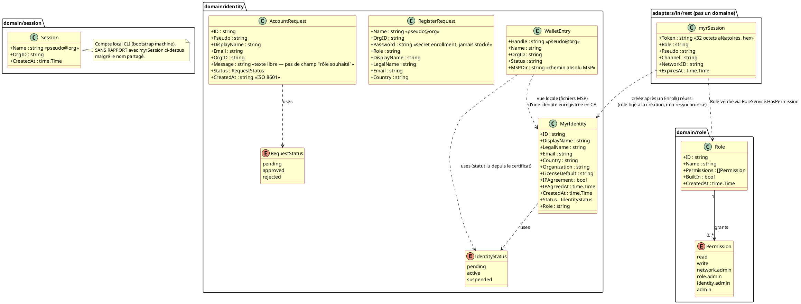
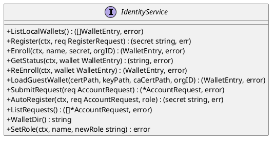
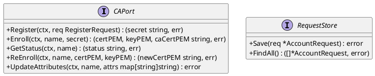
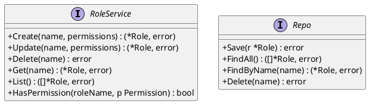
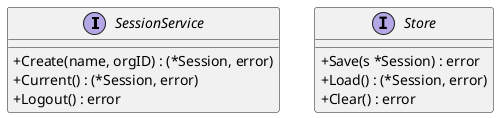
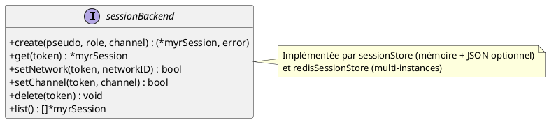

# DC — D1 : Identité, RBAC et Session

## 1. Objectif

Ce document couvre les domaines qui composent la couche accès du système Myr. **Il n'existe pas de domaine `auth` au sens email/mot de passe/JWT** — l'architecture repose sur quatre pièces distinctes :

- **`domain/identity`** : identité cryptographique Fabric CA — enrôlement X.509, wallets locaux MSP, demandes d'accès (`AccountRequest`). C'est la seule source de vérité de « qui est quelqu'un ».
- **`domain/role`** : RBAC dynamique — un catalogue de permissions (`read`, `write`, `network.admin`, `role.admin`, `identity.admin`, `admin`) et des rôles (4 intégrés + rôles personnalisés) associant un sous-ensemble de ces permissions.
- **Sessions REST** (`adapters/in/rest/session.go`, `session_redis.go`) : couche adaptateur (pas un domaine) qui émet un **token opaque** (32 octets aléatoires hex, pas un JWT) après un enrôlement CA réussi ou un accès invité, et le fait correspondre à `{role, pseudo, channel}` pendant 7 jours.
- **`domain/session`** : concept **sans rapport** avec les sessions REST ci-dessus — c'est le compte local de la machine exécutant le CLI `myr` (`{Name, OrgID}`, un seul enregistrement, bootstrap au premier lancement). Nommage historique malheureux à ne pas confondre.

Il n'y a ni bcrypt, ni JWT, ni table SQL utilisateur nulle part dans le code — aucun adapter `sqlite` n'existe dans `adapters/out/`.

---

## 2. Diagramme de classes

---

## 3. Description des classes

### MyrIdentity (`domain/identity`)

- **Rôle :** Identité blockchain d'un auteur dans le réseau Myr. Les attributs `Status` et `Role` sont écrits dans le certificat X.509 par la Fabric CA (attribut `Myr.role`).
- **Invariants :**
  - `IPAgreement` doit être `true` avant tout acte de publication sur la blockchain.
  - `LicenseDefault` définit la licence par défaut appliquée aux créations de cet auteur.
  - `Role` est une chaîne libre — sa validité vis-à-vis du catalogue RBAC (`domain/role`) n'est pas vérifiée à ce niveau.
  - `Status` reflète l'état de l'identité dans la CA Fabric.
- **Cycle de vie :** `pending` (demande soumise ou enregistrée) → `Register` + `Enroll` → `active` ; `suspended` via admin CA.

### WalletEntry (`domain/identity`)

- **Rôle :** Vue locale d'un wallet Fabric (fichiers MSP sur disque, `~/.Myr/wallets/<handle>/msp/`). C'est la **seule** représentation du wallet — aucun miroir chiffré en base ne coexiste (pas de BDD relationnelle, cf. principe de décentralisation).
- **Invariants :**
  - `Handle` suit le format `pseudo@org` (ex : `alice@Org1`).
  - `MSPDir` est un chemin absolu vers le répertoire MSP local.
  - `Status` est lu directement depuis le certificat X.509 local (`statusFromCert`), pas depuis une base de données.

### RegisterRequest (`domain/identity`)

- **Rôle :** DTO de création d'identité auprès de la Fabric CA (`CAPort.Register`). Valeur éphémère, non persistée.
- **Invariants :** `Password` (secret d'enrôlement) n'est jamais stocké par `myr` — seul le certificat/clé résultant de l'enrôlement l'est (dans le wallet local).

### AccountRequest (`domain/identity`)

- **Rôle :** Demande d'accès soumise par un inconnu avant l'obtention d'une identité CA. Stockée localement (`adapters/out/localstorage/request_store.go`), consultable par un administrateur.
- **Invariants :**
  - `Status` initial est `pending`.
  - `CreatedAt` est une chaîne ISO 8601 (`string`, pas `time.Time`).
  - **Aucun champ structuré pour un rôle souhaité** — seul `Message` (texte libre) existe (voir Écart E3).
- **Cycle de vie :** `pending` → `approved` (auto-enregistrement CA réussi, voir UCA01) | reste `pending` indéfiniment en l'absence de mécanisme d'approbation manuelle (voir Écart E2).

### Role / Permission (`domain/role`)

- **Rôle :** RBAC dynamique. `Permission` est un catalogue plat de 6 valeurs. `Role` associe un nom à un sous-ensemble de permissions.
- **Invariants :**
  - 4 rôles **intégrés** (`reader`, `contributor`, `auditor`, `admin`) existent toujours (créés par `seedBuiltins` à l'initialisation du service) et ne peuvent pas être modifiés ni supprimés (`ErrBuiltIn`).
  - Le nom d'un rôle personnalisé doit respecter `^[a-z][a-z0-9_-]{1,63}$`.
  - `HasPermission` échoue fermé : un rôle inconnu ne porte aucune permission.
- **Cycle de vie :** `Create`/`Update`/`Delete` via `myr role ...` (CLI uniquement — pas de CRUD REST, seulement une consultation implicite par le middleware `requireRole`).

### myrSession (adaptateur REST, `adapters/in/rest/session.go`)

- **Rôle :** Jeton opaque de session HTTP. **Ce n'est pas une entité de domaine** — c'est un détail d'implémentation de l'adaptateur `in/rest`, documenté ici car il joue le rôle qu'un domaine `auth` aurait joué dans une architecture plus classique.
- **Invariants :**
  - `Token` est généré par `crypto/rand`, jamais dérivé de données utilisateur.
  - `ExpiresAt` = création + 7 jours (`sessionTTL`), non renouvelable automatiquement.
  - `Role` est fixé **une fois pour toutes à la création** de la session, sans resynchronisation ultérieure avec l'identité CA (voir `specs/roadmap_dev.md` § Écarts Identité & Session pour l'état de cette dépendance).
- **Cycle de vie :** `create` (connexion ou invité) → `get` (vérifié à chaque requête protégée) → `delete` (révocation admin uniquement, pas de self-service) ou expiration naturelle.

### Session (`domain/session`)

- **Rôle :** Compte local **de la machine** exécutant le CLI `myr` — pas un compte utilisateur au sens web. Un seul enregistrement possible, persisté en JSON.
- **Invariants :**
  - `Name` suit le format `pseudo@org`.
  - Un seul fichier session à la fois.
- **Cycle de vie :** `Create` au premier lancement du CLI ; `Logout`/`Clear` réinitialise le fichier.
- **Exposition :** `myr session create --name <n> [--org-id <id>]` / `myr session show` / `myr session logout` (`adapters/in/cli/session.go`), câblés dans `cmd/cli/main.go` (`localstorage.NewJSONSessionStore` + `session.NewService`). N'est volontairement pas exposé en REST : c'est un concept propre à la machine qui exécute le CLI (voir § « Rôle » ci-dessus), sans équivalent côté session HTTP.

---

## 4. Relations et dépendances

- **WalletEntry → MyrIdentity** : `WalletEntry` est la vue fichier locale d'une identité enregistrée auprès de la CA ; il n'existe pas de seconde vue chiffrée en base (pas de BDD relationnelle, cf. principe de décentralisation).
- **myrSession → MyrIdentity** : une session REST est créée après un enrôlement CA réussi (`POST /api/identity/session`), mais **ne référence pas** l'identité après coup — son champ `Role` est une copie figée au moment de la création, jamais resynchronisée (voir `specs/roadmap_dev.md` § Écarts Identité & Session).
- **myrSession → Role** : à chaque requête protégée, `requireRole` interroge `RoleService.HasPermission(session.Role, permission)` — c'est le seul point de contact entre la session REST et le RBAC.
- **Session (domain/session) ↔ WalletEntry** : lien conceptuel seulement (`Session.Name` pourrait correspondre à un `WalletEntry.Handle`) — aucune vérification ni jointure automatique entre les deux n'est requise par la conception.

---

## 5. Ports (interfaces Go)

### Port entrant — IdentityService

### Port sortant — CAPort / RequestStore (identity)

### Port entrant/sortant — RoleService / Repo (role)

### Port entrant/sortant — SessionService / Store (domain/session — compte local CLI)

### Interface interne (non-domaine) — sessionBackend (REST)

---

## 6. Décisions de conception

| ID  | Décision | Raison |
|-----|----------|--------|
| DC-D1-01 | Pas de domaine `auth` séparé — l'identité CA est l'unique source de vérité | Une architecture à deux systèmes d'identité (compte web + identité blockchain) a été abandonnée au profit d'un système unique : l'identité CA. La session REST n'est qu'une couche d'adaptateur au-dessus, pas un second domaine d'identité. |
| DC-D1-02 | Le wallet local n'est représenté que par des fichiers MSP sur disque, sans miroir chiffré en base | Source unique pour éviter la divergence entre deux vues du même wallet — voir `Conception_intro.md` ADR-03 pour l'écart de sécurité qui en résulte (absence de chiffrement au repos). |
| DC-D1-03 | RBAC dynamique (`domain/role`) découplé de l'identité CA | Le rôle RBAC (permissions) et le rôle CA (`Myr.role`, attribut de certificat) sont deux notions distinctes qui ne se synchronisent pas automatiquement — voir `specs/roadmap_dev.md` § Écarts Identité & Session. |
| DC-D1-04 | Le token de session REST est opaque, pas un JWT | Évite toute dépendance à une bibliothèque JWT et tout risque de claims falsifiables côté client ; en contrepartie, aucune information (rôle, pseudo) n'est extractible du token lui-même — elle doit être recherchée côté serveur (`sessionBackend.get`). |
| DC-D1-05 | `domain/session` (compte local CLI) reste un domaine à part, non couplé conceptuellement aux autres domaines (identité CA, RBAC) | Exposé en CLI (`myr session create/show/logout`) comme bootstrap machine, mais `Session.Name` n'est ni validé ni synchronisé automatiquement avec `WalletEntry.Handle` (`domain/identity`) ou un rôle RBAC (`domain/role`) — un lien purement conceptuel, pas une jointure applicative (voir § 4 « Relations et dépendances »). |
| DC-D1-06 | Lecture des composants (`GET /api/components`) ouverte aux visiteurs non authentifiés, inconditionnellement — écriture (POST/PUT/PATCH/DELETE) reste gated par rôle | EF17 (D4, `specs/2-Analyse/UCCL-Composant_Lecture/UCCL01.md`) exige un accès public en lecture, sans condition. Le RBAC dynamique (`domain/role`) et la session REST (`myrSession`) ne changent pas de mécanisme : la route GET est dispensée de `requireAuth` par distinction de méthode HTTP dans le routeur (`server.go`, pattern déjà décrit dans `API_REST.md` §1 « routes mixtes ») — pas par un nouveau système d'identité « visiteur ». |

**⚠️ Incohérence relevée entre deux documents d'analyse (ni l'un ni l'autre n'est corrigé ici — signalée pour arbitrage PO) :** `UCCL01.md` (composants) décrit l'accès visiteur comme **toujours ouvert**, sans condition. `specs/2-Analyse/UCMOD-Module/UCMOD04.md` (ligne 134, lecture d'un module) décrit au contraire un accès **conditionné par la configuration réseau** (« sauf si la configuration réseau autorise les Visiteurs »). DC-D1-06 ci-dessus ne couvre donc que `GET /api/components`, conformément à `UCCL01.md` — il ne s'étend pas à `GET /api/modules`, dont la lecture reste `Auth` par défaut (voir `API_REST.md` §6) tant que le PO n'a pas tranché si D4 doit avoir un comportement uniforme entre composants et modules, ou si cette différence (composant toujours public, module conditionnel) est intentionnelle. C'est aussi la question déjà notée `specs/2-Analyse/todo.md` (accès visiteur conditionné par un flag réseau) — elle ne semble concerner que les modules, pas les composants, au vu du texte actuel des deux UC.

---
