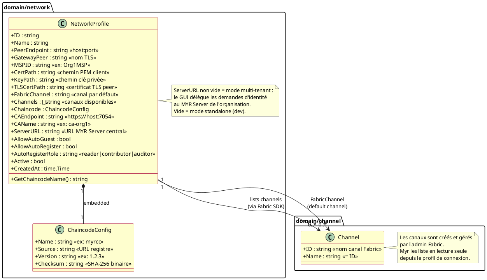
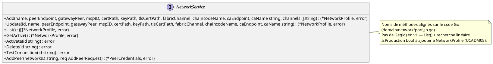
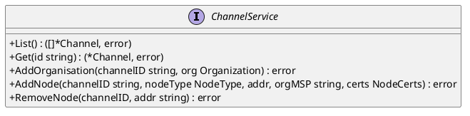
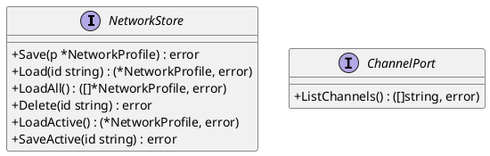

# DC — D2 : Administration réseau

> Phase 3 — Arrington | Use cases : UCADM01–UCADM05 | Domaine : `network`, `channel`, `identity`

---

## 1. Objectif

Ce document couvre les structures de données et contrats d'interface du domaine Administration réseau (D2). Il modélise la configuration d'un réseau HyperLedger Fabric depuis le point de vue de `myr-app` : un réseau est une connexion à un peer Fabric, pas la gestion de l'infrastructure Fabric elle-même.

> **Rappel** : Myr ne gère pas la topologie réseau entre peers — c'est 100% Fabric (configtx.yaml). Myr se connecte à **un seul peer** (celui de son organisation). Fabric synchronise ensuite en arrière-plan.

---

## 2. Diagramme de classes

---

## 3. Description des classes

### NetworkProfile (domain/network)

- **Rôle :** Configuration d'un réseau Fabric depuis le point de vue de l'application. Représente la connexion à un peer d'une organisation. Persistée en JSON via `NetworkStore`.
- **Invariants :**
  - `PeerEndpoint` suit le format `host:port` (ex. `peer0.org1.com:7051`).
  - `MSPID` identifie l'organisation Fabric (ex. `Org1MSP`).
  - `TLSCertPath` pointe vers le certificat TLS du peer — requis pour mTLS.
  - Un seul `NetworkProfile` peut être `Active: true` à la fois (la session active).
  - `AutoRegisterRole` ne peut prendre que les valeurs `reader`, `contributor`, `auditor`.
- **Cycle de vie :** Créé par l'admin via CLI ou import de profil de connexion. Activé via `PUT /api/networks/active`. Ne peut pas être supprimé si `Active: true`. Supprimable via `myr network destroy` (UCADM05) uniquement si `IsProduction: false`.

### ChaincodeConfig (domain/network)

- **Rôle :** Décrit le chaincode déployé sur ce réseau — réseau-spécifique (chaque organisation peut avoir son propre chaincode).
- **Invariants :**
  - `Checksum` est le SHA-256 du binaire chaincode téléchargé — vérifié avant déploiement.
  - `Source` vide = chaincode déjà déployé et accessible directement.
- **Note :** `NetworkProfile.ChaincodeName` est deprecated — utiliser `Chaincode.Name`.

### Channel (domain/channel)

- **Rôle :** Canal Fabric auquel l'application a accès. Énuméré depuis la configuration du réseau. **Lecture seule** côté myr-app.
- **Invariants :**
  - `ID` = nom du canal Fabric (ex. `greenchannel`) — défini dans `configtx.yaml`.
  - `Name` = `ID` pour les canaux Fabric (pas de nom d'affichage distinct en v1).

### Champ à ajouter à NetworkProfile

| Champ | Type | Valeur par défaut | Description |
|-------|------|-------------------|-------------|
| `IsProduction` | `bool` | `false` | Protège le réseau contre le démantèlement accidentel (UCADM05). `true` = refus de `myr network destroy`. |

### Entités à concevoir (non présentes dans le code)

| Entité | Champs proposés | UC déclencheur |
|--------|----------------|----------------|
| `Organization` | id (= MSPID), name, peer_endpoint, admin_cert_path | UCADM01, UCADM02 |
| `Peer` | id, endpoint, org_id, status (active\|dead), tls_cert_path | UCADM03, UCADM04 |

---

## 4. Politique d'accès réseau

`NetworkProfile` expose trois paramètres de politique d'accès configurés par l'admin :

| Paramètre | Valeur par défaut | Comportement |
|-----------|-------------------|-------------|
| `AllowAutoGuest` | `false` | `false` : tout accès requiert une identité validée. `true` : `POST /api/identity/guest` délivre immédiatement un token `reader`. |
| `AllowAutoRegister` | `false` | `false` : la demande reste en attente, l'admin crée le compte manuellement. `true` : `POST /api/identity/request` enregistre directement dans la CA Fabric. |
| `AutoRegisterRole` | `""` → `reader` | Rôle attribué lors d'un auto-register. `""` = `reader`. |

---

## 5. Ports (interfaces Go)

### Port entrant — NetworkService

### Port entrant — ChannelService

> `AddOrganisation` — UCADM01 : soumet une channel config update Fabric pour ajouter l'organisation. Valide le MSP ID avant soumission (RM07).
> `AddNode` — UCADM03 : soumet une channel config update Fabric pour ajouter le nœud (peer ou orderer).
> `RemoveNode` — UCADM04 : soumet une channel config update Fabric pour retirer le peer. Vérifie le seuil RM27 avant soumission.

### Ports sortants

---

## 6. Infrastructure réseau Fabric

Chaque organisation du réseau Myr expose son peer avec :

| Élément | Détail |
|---------|--------|
| Serveur | VPS ou cloud (DigitalOcean, AWS, OVH…) |
| IP | Fixe et publique |
| DNS | `peer0.orgname.com` → IP (recommandé) |
| Port | 7051 (peer), 7050 (orderer si hébergé), 7054 (CA) |
| Certificats | Fabric CA — **pas** Let's Encrypt |
| mTLS | TLS mutuel natif Fabric — aucun VPN requis |

Annuaire des peers : déclaré dans `configtx.yaml`, distribué sur le ledger. Chaque peer connaît les autres dès qu'il rejoint le channel — pas de DNS central.

---

## 7. Décisions de conception

| ID | Décision | Raison |
|----|---------|--------|
| DC-D2-01 | `NetworkProfile` ne modélise pas les peers individuels | Myr se connecte à **un seul peer** par organisation. La topologie multi-peer est gérée par Fabric. Modéliser les peers dans Myr serait une duplication inutile. |
| DC-D2-02 | `Channel` est en lecture seule | La création de canaux Fabric requiert des opérations d'admin (configtx, genesis block) hors du périmètre de l'API myr-app v1. |
| DC-D2-03 | `ServerURL` permet le mode multi-tenant | Sans `ServerURL`, myr-app gère lui-même les identités CA (mode standalone, dev). Avec `ServerURL`, le GUI délègue au MYR Server central de l'organisation. |
| DC-D2-04 | Politique d'accès dans `NetworkProfile` | L'admin configure `AllowAutoGuest` et `AllowAutoRegister` au niveau du réseau — pas au niveau de l'application. Permet des réseaux publics ou privés selon le contexte. |
| DC-D2-05 | Démantèlement réseau dans le CLI Handler, pas dans le domaine | Les opérations OS (arrêt processus, suppression fichiers) violent ENF18 si placées dans `domain/network/`. Elles restent dans `adapters/in/cli/`. Le domaine ne fait que `NetworkService.Delete(id)`. |
| DC-D2-06 | `IsProduction` dans `NetworkProfile` pour protéger les réseaux réels | `myr network destroy` refuse d'agir sur `IsProduction: true`. Évite un démantèlement accidentel d'un réseau de production par une commande de test. |

---

## 8. Écarts code → specs

| ID | Écart | Impact |
|----|-------|--------|
| E-D2-01 | `myr network`, `myr org`, `myr node` absents du CLI | UCADM01–05 non exposés — contrat défini dans `specs/3-Conception/DC_CLI_Admin.md` |
| E-D2-02 | `AddOrganisation()`, `AddNode()`, `RemoveNode()` absents de `ChannelService` | Ports UCADM01/03/04 à ajouter dans `domain/channel/port_in.go` et `service.go` |
| E-D2-03 | `ChannelConfigPort` (out-port Fabric config) absent | Port sortant UCADM01/03/04 à définir dans `domain/channel/ports.go` |
| E-D2-04 | Entités `Organization`, `NodeType`, `NodeCerts` absentes | À ajouter dans `domain/channel/entity.go` |
| E-D2-05 | `IsProduction bool` absent de `NetworkProfile` | À ajouter dans `domain/network/entity.go` — protège `myr network destroy` |

---

## 9. Informations manquantes

- **Politique d'endorsement multi-admin** : pour les mises à jour de canal (UCADM01, UCADM03, UCADM04), plusieurs signatures d'admins d'organisation sont requises — workflow de collecte de signatures non défini en v1
- **Minimum de nœuds** : le seuil de 3 nœuds (RM27) est-il configurable dans `config/` ou constant ? En v1 : constante.
- **Répertoire ledger Fabric** : chemin des données à supprimer (UCADM05) — configurable via `MYR_FABRIC_DATA_PATH`. Détails dans `DC_CLI_Admin.md` §3.9.1.
- **`myr network create`** (UCADM02 flux nominal) : opération complexe impliquant `configtx.yaml`, genesis block, démarrage des nœuds — reportée post-v1. En v1 : `myr network import` depuis un profil existant couvre le besoin principal.
