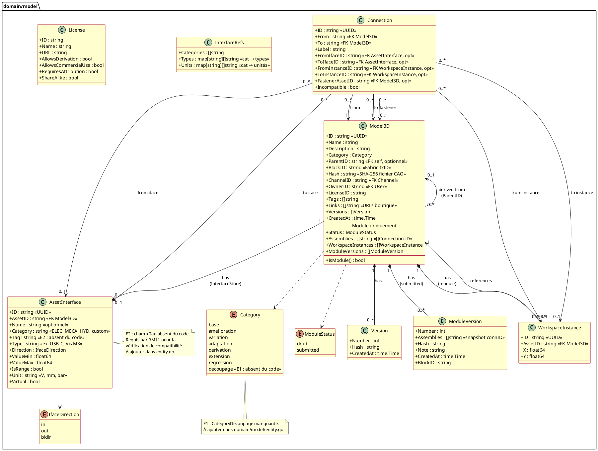
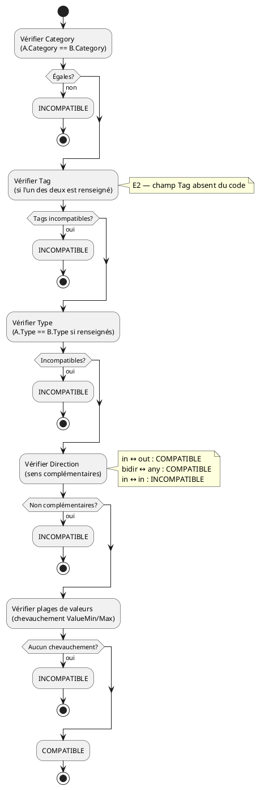
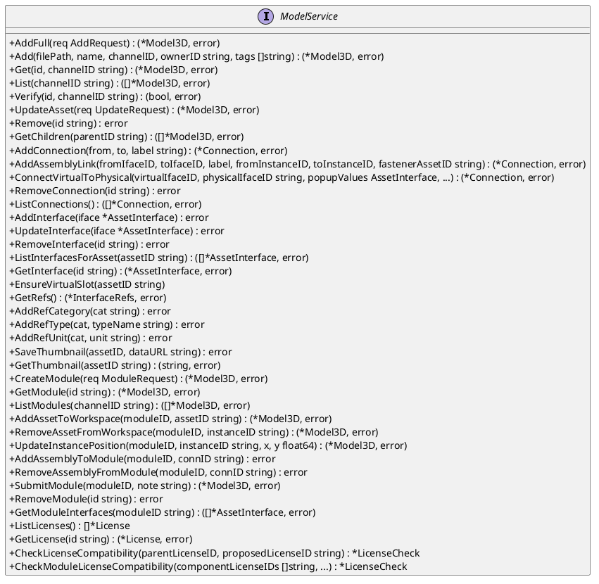
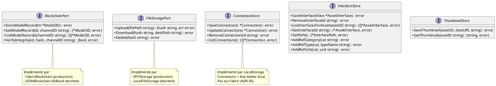

# DC — D3/D4/D5/D6 : Domaine Model

> Phase 3 — Arrington | Domaines : D3 (écriture composant), D4 (lecture), D5 (atelier), D6 (modules)

---

## 1. Objectif

Le domaine `model` est le cœur fonctionnel de Myr. Il gère une entité unifiée `Model3D` représentant à la fois un composant (fichier CAO physique ou déclaratif) et un module (assemblage de composants). Ce document couvre les classes, états, algorithmes et ports de ce domaine.

---

## 2. Diagramme de classes global



---

## 3. Diagramme d'états — Model3D

```plantuml
@startuml
skinparam state {
  BackgroundColor #FEFECE
  BorderColor #A80036
}
title États d'un Asset (Model3D)

state "Composant" {
  [*] --> local : AddFull()\nvalidation + hash SHA-256

  state local : Hash renseigné\nBlockID vide\nInterfaces définissables
  state blockchained : Hash + BlockID renseignés\nImmuable sur Fabric

  local --> blockchained : StoreModelRecord()\nFabric Ledger
  blockchained --> blockchained : UpdateAsset()\npatch local (Name/Tags/Links)\n⚠️ BlockID inchangé
}

state "Module" {
  [*] --> draft : CreateModule()

  state draft : Status = draft\nModifiable librement\nAssemblies modifiables
  state submitted : Status = submitted\nModuleVersion créée\nImmuable (RM19)

  draft --> submitted : SubmitModule()\nrequiert len(Assemblies)>0

  submitted --> draft_fork : modification tentée\n(fork RM19)\n⚠️ NON IMPLÉMENTÉ (E5)
  draft_fork : nouveau draft\nModuleVersion précédente\npréservée
  draft_fork --> submitted : SubmitModule()
}

note "Un composant peut devenir\nun module via Category=decoupage\n(UCAM05 — E1)" as N1
@enduml
```

---

## 4. Description des classes

### Model3D

- **Rôle :** Entité centrale unifiée. Composant si `Hash != ""` et `WorkspaceInstances == nil`. Module si `WorkspaceInstances != nil`. La distinction est fonctionnelle, pas structurelle (ADR-01).
- **Invariants :**
  - `ID` est généré côté serveur — jamais fourni par le client (RM04).
  - `Category != base` → `ParentID` obligatoire (RM05).
  - `Category = base` → soumission à l'anti-plagiat SHA-256 + SCM (RM01).
  - `OwnerID` doit correspondre au `UserID` extrait du JWT (sécurité — non validé dans le code actuel).
  - `BlockID` non vide → asset enregistré sur Fabric, immuable.
  - `Status = submitted` → toute modification doit passer par un fork (RM19 — **non contraint dans le code actuel**).
- **Cycle de vie composant :** `AddFull` → local → `StoreModelRecord` → blockchained.
- **Cycle de vie module :** `CreateModule` → draft → `SubmitModule` → submitted.

### AssetInterface

- **Rôle :** Décrit un point de connexion physique d'un composant. Deux interfaces sont compatibles si les 5 critères de RM11 sont satisfaits.
- **Invariants :**
  - Une interface engagée dans une `Connection` ne peut plus être utilisée dans une autre (RM09).
  - `Virtual: true` = slot non encore matérialisé — tout asset dans l'Atelier en possède toujours au moins un (RM13).
  - Champ `Tag` **manquant dans le code** (E2) — requis pour la vérification de compatibilité (5e critère RM11).

### Connection

- **Rôle :** Liaison entre deux assets (ou instances dans l'Atelier). Stockée localement — jamais sur Fabric directement (ADR-05). Fait partie du snapshot `ModuleVersion.Assemblies` lors de la soumission.
- **Invariants :**
  - `FromIfaceID` et `ToIfaceID` doivent pointer vers des interfaces compatibles (RM11).
  - `Incompatible: true` si les interfaces ont évolué après la création de la liaison — jamais supprimée automatiquement (RM12).
  - `FastenerAssetID` : asset d'accroche (vis, câble) — vide si liaison directe.

### WorkspaceInstance

- **Rôle :** Slot de référence d'un asset dans l'Atelier d'un module. Permet d'avoir le même composant plusieurs fois (instances indépendantes — RM15).
- **Invariants :** La suppression d'une `WorkspaceInstance` déclenche la suppression en cascade de toutes les `Connection` qui la référencent (RM14).

---

## 5. Algorithme de compatibilité d'interfaces (RM11)

Deux interfaces `A` et `B` sont compatibles si et seulement si **les 5 critères** suivants sont satisfaits :



**Code actuel :** `domain/model/service.go` `ifacesCompatible()` implémente 4 critères sur 5 (Tag absent — E2).

---

## 6. Algorithme anti-plagiat (RM01)

**Obligation** : avant tout enregistrement d'un asset de catégorie `base`, vérifier :
1. **Unicité SHA-256** : le hash du fichier ne doit correspondre à aucun asset existant sur le canal.
2. **Similarité SCM ≤ 50%** : l'analyse structurelle du fichier CAO ne doit pas dépasser 50% de similarité avec tout asset existant.

**État d'implémentation :**

| Étape | État |
|-------|------|
| Calcul SHA-256 du fichier uploadé | ✅ Implémenté dans `AddFull()` |
| Comparaison SHA-256 avec assets Fabric existants | ❌ Absent — E4 |
| Algorithme SCM (similarité structurelle) | ❌ Absent — algorithme à définir |

**Question bloquante pour le PO :** L'algorithme SCM est-il une librairie Go existante, un service externe, ou un développement propriétaire ?

---

## 7. Règles de composition (RM09–RM15 et RM16–RM19)

| RM | Règle | Implémentation |
|----|-------|---------------|
| RM09 | Interface à usage unique | ❌ Non vérifié dans `AddAssemblyLink()` |
| RM10 | Vérification automatique de compatibilité | ✅ `ifacesCompatible()` appelée |
| RM11 | 5 critères de compatibilité | ⚠️ 4/5 — Tag manquant (E2) |
| RM12 | Liaison incompatible → `Incompatible: true` sans suppression | ✅ Champ présent, géré |
| RM13 | Slot virtuel toujours présent | ✅ `EnsureVirtualSlot()` |
| RM14 | Suppression instance → cascade connexions | ✅ `RemoveAssetFromWorkspace()` |
| RM15 | Instances indépendantes du même asset | ✅ `WorkspaceInstance` par instance |
| RM16 | Module créé en `draft` | ✅ `CreateModule()` |
| RM17 | `SubmitModule` exige `len(Assemblies) > 0` | ✅ Vérifié dans `SubmitModule()` |
| RM18 | `ModuleVersion` immuable horodatée | ✅ Créée dans `SubmitModule()` |
| RM19 | Module `submitted` → fork obligatoire | ❌ Non contraint (E5) |

---

## 8. Ports du domaine

### Port entrant — ModelService (complet)



### Ports sortants



---

## 9. Décisions de conception

| ID | Décision | Raison |
|----|---------|--------|
| ADR-01 | Entité unifiée `Model3D` | Un module est lui-même un asset réutilisable et dérivable. La distinction composant/module par le contenu (pas le type) évite la duplication de logique. |
| ADR-02 | Interfaces physiques en local (InterfaceStore) | Lecture fréquente pour compatibilité — Fabric n'est pas adapté. Seule la `ModuleVersion` est ancrée. |
| ADR-05 | Connexions locales, ModuleVersions sur Fabric | L'Atelier est mutable librement. La blockchain ne supporte pas la mutabilité. Le snapshot `ModuleVersion` est le seul artefact immuable. |

---

## 10. Écarts code → specs

| ID | Écart | Fichier | Impact |
|----|-------|---------|--------|
| E1 | `CategoryDecoupage` absente | `domain/model/entity.go:21` | UCAM05 (découpage en module) impossible |
| E2 | `AssetInterface.Tag` absent | `domain/model/entity.go:114` | RM11 incomplet — 4 critères sur 5 |
| E4 | Anti-plagiat SHA-256 non comparé | `domain/model/service.go AddFull()` | RM01 partiellement respecté |
| E5 | Fork module soumis non contraint | `domain/model/service.go:461` | RM19 violée — module soumis modifiable |
| — | `OwnerID` non validé vs JWT | `adapters/in/rest/handlers.go:531` | Sécurité — tout client peut revendiquer un owner_id |

---

## 11. Informations manquantes

- **Algorithme SCM** : spécification manquante pour l'analyse de similarité structurelle > 50% (RM01)
- **Catalogue de licences** : `License` est implémentée dans `domain/model/license.go` — à ajouter au MCD complet
- **`Model3D.LicenseID`** : référence vers `License.ID` mais aucune contrainte FK dans le stockage JSON
- **Persistance Atelier** : en cas de crash serveur avant `SubmitModule`, les connexions non sauvegardées sont perdues — aucun mécanisme de récupération n'est prévu
