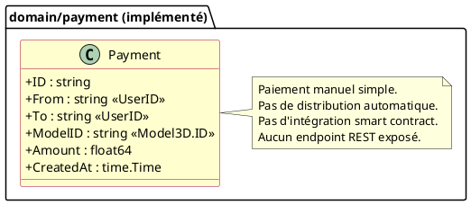
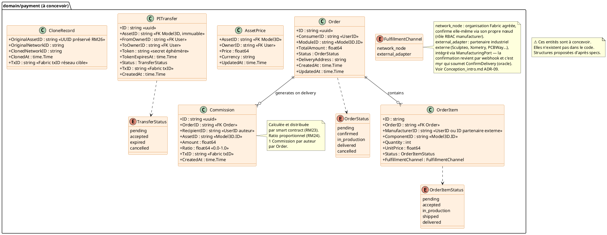
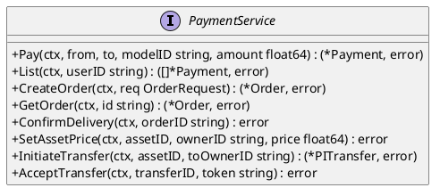
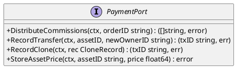
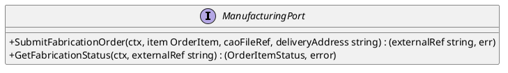

# DC — D7 : Propriété Intellectuelle & Paiements

> Phase 3 — Arrington | Use cases : UCPI01–UCPI10 | Domaine : `payment`

---

## 1. Objectif

Ce document modélise les structures de données pour le domaine D7 Propriété Intellectuelle. Il distingue ce qui **est implémenté** (paiement manuel simple) de ce qui **est à concevoir** (commissions automatiques, ordres de fabrication, transferts PI, clonage inter-réseaux).

---

## 2. Entités existantes

### Payment (domain/payment/entity.go)



---

## 3. Entités à concevoir (RM23/RM24)

Les use cases UCPI01 (commande), UCPI02 (commissions), UCAUT01 (livraison) requièrent un modèle de données plus complet.



---

## 4. Algorithme de distribution des commissions (RM23/RM24)

**Déclencheur :** `UCAUT01` — confirmation de livraison → appel chaincode `DistributeCommissions`.

**Algorithme proposé (à valider avec PO) :**

```
1. Récupérer tous les composants du module livré (récursif)
2. Pour chaque composant C :
   - ratio_C = price(C) / total_price_all_components
   - commission_C = order.TotalAmount × commission_rate × ratio_C
   - créer Commission(recipient=owner(C), amount=commission_C)
3. Soumettre toutes les Commission en une seule transaction Fabric (atomique)
4. Mettre à jour Order.Status = delivered
```

**Questions ouvertes pour le PO :**
- Taux de commission (`commission_rate`) : fixe (ex. 10%), configurable par réseau, ou défini par l'auteur ?
- Ratio : proportionnel au prix de chaque composant (ci-dessus) ou poids défini par le concepteur du module ?
- Wallet inactif : séquestre, redistribution proportionnelle, ou abandon après délai ?
- **Périmètre de la « chaîne de propriété » (RM23) — composition seule ou aussi dérivation ?** L'algorithme ci-dessus ne parcourt que les composants directement constitutifs du module livré (composition). `specs/2-Analyse/UCPI-Propriete_Intellectuelle/UCPI02.md` et `UCPI04.md` évoquent en plus une remontée de commission vers les auteurs de la chaîne de dérivation (`ParentID`) — non implémentée ici. Si le PO tranche pour l'inclusion de la dérivation, l'algorithme (étape 1) et l'entité `Commission` (§3, `AssetID` actuel ne porte pas de lien vers une lignée) doivent être revus en conséquence.

---

## 5. Ports (interfaces Go)

### Port entrant — PaymentService (existant, partiel)



### Port sortant — PaymentPort (à créer)



### Port sortant — ManufacturingPort (à créer, canal `external_adapter` — ADR-09)

Un adapter par partenaire industriel externe (`adapters/out/manufacturing/<partenaire>/`), chacun implémentant ce même port — pattern identique à `adapters/out/fabric`/`ipfs` (un adapter par technologie/fournisseur, domaine et CLI inchangés).



**Réception du webhook :** une route REST dédiée par partenaire (ex. `POST /api/manufacturing/:partner/webhook`) reçoit la confirmation de livraison, vérifie la signature (secret propre à l'intégration, pas une identité CA Fabric — voir ADR-09), puis appelle en interne le même chemin de service que `POST /api/orders/:id/deliver` pour soumettre `ConfirmDelivery` au smart contract. Le partenaire externe n'a donc jamais d'accès direct à la blockchain ni au RBAC Myr.

---

## 6. Décisions de conception

| ID | Décision | Raison |
|----|---------|--------|
| DC-D7-01 | Distribution par smart contract, pas par le service applicatif | Les commissions doivent être immuables et vérifiables sur la blockchain (RM23). Le smart contract garantit l'atomicité livraison + distribution. |
| DC-D7-02 | `PITransfer` avec token à durée limitée | Le transfert de PI est irréversible (RM25) — un mécanisme d'acceptation explicite (token) évite les transferts accidentels. Durée suggérée : 48h. |
| DC-D7-03 | `CloneRecord` sur les deux réseaux | RM26 exige que l'UUID original soit préservé et que la traçabilité soit maintenue sur les deux réseaux source et cible. |
| DC-D7-04 | `AssetPrice` séparé de `Model3D` | Le prix peut évoluer sans créer une nouvelle version de l'asset. `Model3D` est immuable sur Fabric — le prix est mutable et local. |

---

## 7. Écarts code → specs

| Écart | Impact |
|-------|--------|
| Aucun endpoint REST pour le domaine payment | Tout D7 est inaccessible depuis l'API — donc depuis tout client (dépôt GUI externe compris) |
| `Payment` est un paiement manuel sans distribution automatique | RM23/RM24 non implémentées |
| Smart contract de commission absent du chaincode | Bloquerait UCAUT01 en production |
| Entités Order, Commission, AssetPrice, PITransfer, CloneRecord absentes | UCPI01-09 entièrement non implémentables |
| `ManufacturingPort` et ses adapters (`adapters/out/manufacturing/<partenaire>/`) absents ; `OrderItem.FulfillmentChannel` absent | Le canal `external_adapter` (ADR-09) — donc toute intégration avec un partenaire industriel externe (Sculpteo, Xometry, PCBWay...) — est non implémentable |

---

## 8. Décisions arrêtées sur les points ouverts

| Point | Décision | Règle |
|-------|---------|-------|
| **Taux de commission** | Défini par l'administrateur au niveau du réseau (défaut : 10 %). Uniforme — l'auteur ne peut pas définir son propre taux. Il accepte le taux du réseau en publiant dessus. | RM29 |
| **Prix module** | Si l'auteur définit un prix via UCPI05, ce prix est utilisé. Sinon : prix = somme des prix unitaires des composants constitutifs (composant sans prix compté à 0). | RM30 |
| **Modification de prix** | Le prix (`AssetPrice`) est local et mutable — il n'est **pas** stocké sur Fabric (cf. DC-D7-04). Toute modification s'applique aux commandes futures uniquement. Les `OrderItem.UnitPrice` historiques sont figés à la création de la commande. | RM31 |
| **Asset gratuit** | `AssetPrice.Price = 0` ou absence d'`AssetPrice` → asset libre d'accès, aucune commission. Indépendant de la licence AGPL du code Myr. | RM32 |
| **Devise** | Une devise par réseau, choisie par l'admin à la création. Tous les prix et commissions du réseau s'expriment dans cette devise. Aucune conversion. Un asset cloné sur un réseau étranger adopte la devise du réseau cible. | RM33 |
| **Wallet de paiement** | En V1 : comptabilité interne — les commissions sont enregistrées sur Fabric comme des écritures comptables (crédit/débit). Pas de transfert crypto ou fiat réel. L'encaissement effectif se fait hors système (accord direct manufactureur/auteur). Le solde de commissions est lisible depuis la blockchain. Post-V1 : intégration d'un mécanisme de paiement réel à définir (token réseau, passerelle fiat). | DC-D7-05 (nouveau) |
| **Wallet inactif** | Si un auteur destinataire de commission n'a plus de wallet actif : la commission est mise en séquestre (état `sequestered`) pendant 90 jours. Après ce délai, elle est redistribuée proportionnellement aux autres auteurs impliqués dans la commande. | DC-D7-06 (nouveau) |
| **Escrow** | Pas d'escrow en V1 — le débit côté consommateur est supposé acquis à la commande (hors système). Le système enregistre les obligations de paiement, pas les flux financiers réels. | DC-D7-07 (nouveau) |
| **Registre boutiques et manufactureurs** | Tenu sur la blockchain (canal dédié ou attributs d'identité Fabric CA) pour le canal `network_node` uniquement : l'administrateur agrée les manufactureurs via `myr org add` avec rôle `manufacturer`. Les boutiques partenaires sont enregistrées comme organisations avec rôle `shop`. Un fabricant intégré via le canal `external_adapter` (partenaire industriel externe, ADR-09) n'est jamais une organisation Fabric — son identifiant est celui de l'adapter (`adapters/out/manufacturing/<partenaire>/`), pas un `UserID` RBAC. | UCADM01, DC-D7-08 |
| **Fabrication via partenaire industriel externe** | Deux canaux coexistent sur `OrderItem.FulfillmentChannel` : `network_node` (organisation Fabric, confirme elle-même) et `external_adapter` (ManufacturingPort, confirmation par webhook, myr soumet `ConfirmDelivery` en tant qu'oracle). Voir `Conception_intro.md` ADR-09. | DC-D7-09 (nouveau) |

### Nouvelles décisions de conception

| ID | Décision | Raison |
|----|---------|--------|
| DC-D7-05 | Commissions = écritures comptables sur blockchain en V1, pas de flux financier réel | Évite la complexité d'un système de paiement réel en V1 tout en garantissant la traçabilité immuable des droits à percevoir. |
| DC-D7-06 | Commission séquestrée 90j puis redistribuée si wallet inactif | Préserve les droits de l'auteur absent sans bloquer indéfiniment la distribution. |
| DC-D7-07 | Pas d'escrow en V1 — obligations enregistrées, flux hors système | Simplifie radicalement l'implémentation. Le système est un registre de droits, pas un processeur de paiement. |
| DC-D7-08 | Manufactureurs et boutiques du canal `network_node` = organisations Fabric avec rôle spécifique | Réutilise le mécanisme d'organisation Fabric existant (UCADM01) plutôt qu'un registre externe séparé. |
| DC-D7-09 | Canal `external_adapter` : partenaire industriel externe intégré via `ManufacturingPort`, confirmation de livraison par webhook soumise au smart contract par myr (oracle) | Un acteur industriel établi (Sculpteo, Xometry, PCBWay...) n'a ni raison ni intérêt à opérer un pair blockchain pour rejoindre le réseau Myr — voir `Conception_intro.md` ADR-09. |

### Champ à ajouter à `OrderItem`

| Champ | Type | Description |
|-------|------|-------------|
| `FulfillmentChannel` | `FulfillmentChannel` (`network_node` / `external_adapter`) | Détermine qui peut confirmer la livraison et par quel mécanisme (RBAC `manufacturer` vs webhook `ManufacturingPort`) — ADR-09 |

### Champ à ajouter à `AssetPrice`

| Champ | Type | Description |
|-------|------|-------------|
| `CommissionRate` | `float64` | Taux de commission du réseau au moment de la définition du prix — snapshot pour éviter les variations rétroactives |

### Champ à ajouter à `Commission`

| Champ | Type | Description |
|-------|------|-------------|
| `Status` | `CommissionStatus` | `pending` / `paid` / `sequestered` — suit le cycle de vie de la commission |
| `SequesteredUntil` | `*time.Time` | Date limite avant redistribution (RM wallet inactif) |
