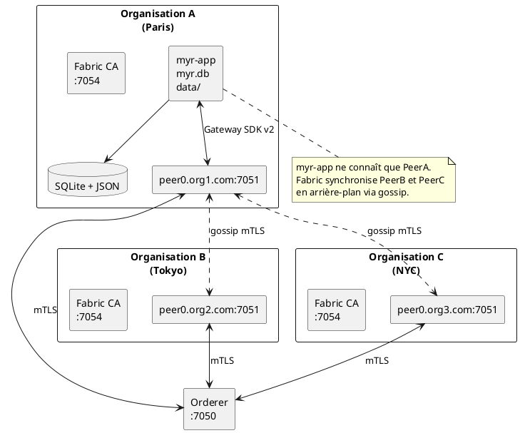
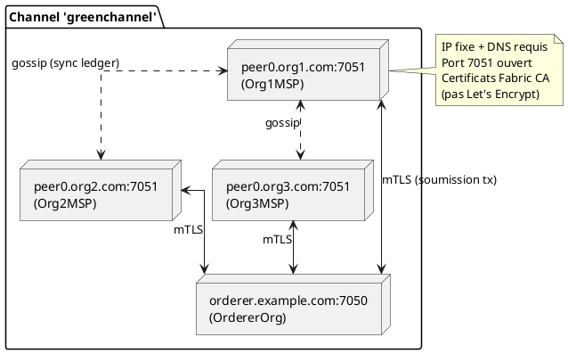
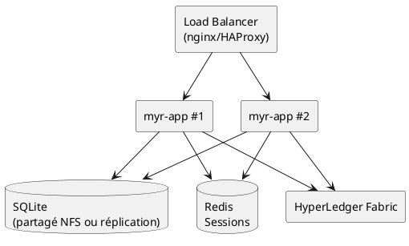

# Déploiement — Infrastructure Myr

> Phase 3 — Arrington | Référence : `specs/3-Conception/Architecture_Hexagonale.md`

---

## 1. Vue d'ensemble

Myr se déploie comme un binaire Go autonome (`myr-app.exe`) qui embarque le frontend (SPA) et sert l'API REST. Il se connecte à une infrastructure HyperLedger Fabric externe gérée par chaque organisation.



---

## 2. Infrastructure minimale par organisation

| Élément | Détail |
|---------|--------|
| Serveur | VPS ou cloud (DigitalOcean, AWS, OVH, serveur physique) |
| OS | Linux recommandé (Ubuntu 22.04 LTS) |
| CPU | 2 vCPU minimum (4 recommandé) |
| RAM | 4 GB minimum (8 GB recommandé) |
| Stockage | 20 GB minimum (SSD recommandé) |
| IP | Fixe et publique |
| DNS | `peer0.orgname.com` → IP (fortement recommandé) |
| Ports ouverts | 7051 (peer), 7050 (orderer si hébergé), 7054 (CA), 8080 (myr-app) |
| Certificats | Fabric CA (PEM) — **pas** Let's Encrypt |
| mTLS | Natif Fabric — aucun VPN requis |

---

## 3. Binaires produits

| Binaire | Description | Commande de build |
|---------|-------------|------------------|
| `bin/myr-app.exe` | Serveur HTTP + GUI embarqué + API REST | `make app` |
| `bin/myr.exe` | CLI d'administration | `make cli` |

**Cross-compilation Linux :**
```bash
make deploy  # compile Linux + déploie via scripts/deploy.ps1
```

---

## 4. Configuration d'un profil réseau

Chaque instance `myr-app` est configurée via un `NetworkProfile` (JSON dans `data/`) et des variables d'environnement :

### Variables d'environnement obligatoires

| Variable | Description |
|----------|-------------|
| `JWT_SECRET` | Clé de signature JWT (≥ 32 bytes aléatoires) |
| `WALLET_ENCRYPT_KEY` | Clé AES-256 pour les wallets SQLite (32 bytes en hex) |

### Variables optionnelles

| Variable | Défaut | Description |
|----------|--------|-------------|
| `MYR_DB_PATH` | `<data>/myr.db` | Chemin SQLite |
| `REDIS_URL` | — | Sessions Redis (multi-instances) |
| `MYR_DEV` | — | `=1` : hot-reload frontend (développement uniquement) |

### Profil de connexion Fabric

`connection-profiles/gateway-connection.json` ou `.yaml` : configuration du peer, TLS, certificats. Ce fichier est lu via `fabricadapter.ConfigFromEnv()` ou en argument de démarrage.

---

## 5. Lancement

### Mode développement (hot-reload frontend)

```bash
MYR_DEV=1 ./bin/myr-app.exe --open
# Sert ui/static/ depuis le disque — pas besoin de recompiler pour les changements JS/CSS
```

### Mode production

```bash
JWT_SECRET=<secret> WALLET_ENCRYPT_KEY=<key> ./bin/myr-app.exe
```

### CLI admin

```bash
./bin/myr.exe --help
./bin/myr.exe channel list
./bin/myr.exe model add --file ./mypart.stl --name "Vis M3" --channel greenchannel
```

---

## 6. Topologie réseau Fabric

La topologie des peers est entièrement définie dans `configtx.yaml` et distribuée sur le ledger Fabric. Myr n'a pas à gérer les connexions inter-peers.



**Annuaire des peers** : déclaré dans la configuration du canal (`configtx.yaml`), distribué sur le ledger. Chaque peer connaît les autres dès qu'il rejoint le canal — pas de DNS central.

---

## 7. Scalabilité — Mode multi-instances

Pour déployer plusieurs instances `myr-app` derrière un load balancer :

```bash
REDIS_URL=redis://localhost:6379 ./bin/myr-app.exe
```

Avec `REDIS_URL`, les sessions sont partagées entre instances via Redis. Sans `REDIS_URL`, chaque instance a ses propres sessions (mode standalone).



> ⚠️ SQLite n'est pas conçu pour les accès concurrents multi-processus. En mode multi-instances, PostgreSQL est recommandé (non implémenté en v1 — adapter SQLite).

---

## 8. Monitoring

| Endpoint | Accès | Description |
|----------|-------|-------------|
| `GET /api/ping` | Public | Liveness sans appel Fabric |
| `GET /api/health` | Public | Health check complet (appelé par infra/load balancer) |
| `GET /api/status` | Public | Statut applicatif détaillé |
| `GET /metrics` | Public | Métriques Prometheus |

---

## 9. Génération de documentation CLI

```bash
go run ./cmd/mangen  # génère les man pages dans docs/man/
```

---

## 10. Informations manquantes

- **SQLite multi-instances** : SQLite n'est pas adapté pour plusieurs processus en écriture simultanée — migration PostgreSQL à prévoir si besoin de scalabilité horizontale
- **Rotation de clé WALLET_ENCRYPT_KEY** : aucun mécanisme de re-chiffrement des wallets existants lors d'un changement de clé
- **Sauvegardes** : stratégie de backup de `myr.db` et `data/` non documentée
- **TLS pour myr-app** : le serveur HTTP de `myr-app` ne fait pas TLS lui-même — à placer derrière un reverse proxy (nginx, Caddy) avec certificat Let's Encrypt
- **Procédure de mise à jour du chaincode** : le versionnement et l'upgrade du chaincode en production (lifecycle Fabric v2) n'est pas documenté
