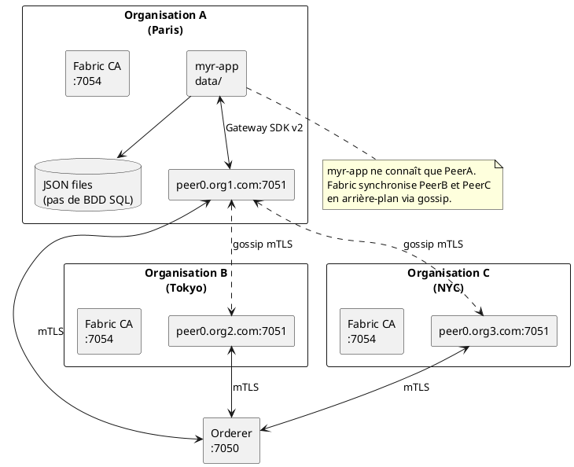
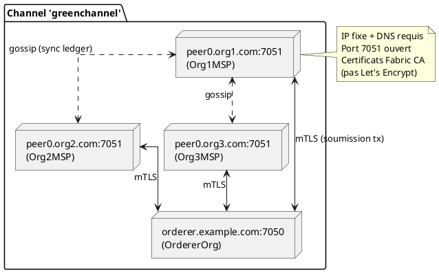

# Déploiement — Infrastructure Myr

> Phase 3 — Arrington | Référence : `specs/3-Conception/Architecture_Hexagonale.md`

---

## 1. Vue d'ensemble

Myr se déploie comme un binaire Go autonome (`myr-app`) qui sert exclusivement l'API REST — aucune interface graphique n'est embarquée dans ce binaire. Il se connecte à une infrastructure blockchain externe gérée par chaque organisation (implémentation par défaut : HyperLedger Fabric via `adapters/out/fabric/`).

> Le site web (SPA) qui pilote `myr` vit dans un dépôt séparé, consommateur exclusif de cette API REST.



---

## 2. Infrastructure minimale par organisation

| Élément | Détail |
|---------|--------|
| Serveur | VPS ou cloud (DigitalOcean, AWS, OVH, serveur physique) |
| OS | Linux recommandé (Ubuntu 22.04 LTS) |
| CPU | 2 vCPU minimum (4 recommandé) |
| RAM | 4 GB minimum (8 GB recommandé) |
| Stockage | 20 GB minimum (SSD recommandé) |
| IP | Fixe et publique |
| DNS | `peer0.orgname.com` → IP (fortement recommandé) |
| Ports ouverts | 7051 (peer), 7050 (orderer si hébergé), 7054 (CA), 8080 (myr-app) |
| Certificats | Fabric CA (PEM) — **pas** Let's Encrypt |
| mTLS | Natif Fabric — aucun VPN requis |

---

## 3. Binaires produits

| Binaire | Description | Commande de build |
|---------|-------------|------------------|
| `bin/myr-app-linux` | Serveur HTTP — API REST uniquement (Linux amd64) | `make app` |
| `bin/myr-cli` | CLI d'administration (Linux amd64) | `make cli` |

```bash
make deploy  # compile + déploie les deux sur le serveur distant via scripts/deploy.ps1
```

---

## 4. Configuration d'un profil réseau

Chaque instance `myr-app` est configurée via un `NetworkProfile` (JSON dans `data/`) et des variables d'environnement :

### Variables d'environnement obligatoires

Aucune variable n'est strictement obligatoire pour démarrer `myr-app` — les variables Fabric (`fabric.env` ou équivalent) sont nécessaires pour une connexion blockchain réelle, sinon le mode simulation JSON local s'active automatiquement.

> ⚠️ `JWT_SECRET` et `WALLET_ENCRYPT_KEY` ne sont lues nulle part dans le code actuel — il n'y a pas de JWT, et les wallets (fichiers PEM sous `~/.Myr/wallets/`) ne sont pas chiffrés au repos (écart de sécurité connu, voir `Securite.md` et `Conception_intro.md` ADR-03).

### Variables optionnelles

| Variable | Défaut | Description |
|----------|--------|-------------|
| `REDIS_URL` | — | Sessions REST partagées Redis (multi-instances) |

### Profil de connexion Fabric

`connection-profiles/gateway-connection.json` ou `.yaml` : configuration du peer, TLS, certificats. Ce fichier est lu via `fabricadapter.ConfigFromEnv()` ou en argument de démarrage.

---

## 5. Lancement

### Mode production

```bash
./myr-app --addr 0.0.0.0:8080 --data /var/myr
```

### CLI admin (via SSH sur le serveur)

```bash
myr --help
myr channel list
myr model add --file ./mypart.stl --name "Vis M3" --channel greenchannel
```

---

## 6. Topologie réseau Fabric

La topologie des peers est entièrement définie dans `configtx.yaml` et distribuée sur le ledger Fabric. Myr n'a pas à gérer les connexions inter-peers.



**Annuaire des peers** : déclaré dans la configuration du canal (`configtx.yaml`), distribué sur le ledger. Chaque peer connaît les autres dès qu'il rejoint le canal — pas de DNS central.

---

## 7. Scalabilité — Mode multi-instances

Pour déployer plusieurs instances `myr-app` derrière un load balancer :

```bash
REDIS_URL=redis://localhost:6379 ./myr-app
```

Avec `REDIS_URL`, les sessions sont partagées entre instances via Redis. Sans `REDIS_URL`, chaque instance a ses propres sessions (mode standalone).


> ⚠️ Le stockage JSON local (`adapters/out/localstorage/` — pas de BDD SQL, ni en v1 ni en cible) n'est pas conçu pour les accès concurrents multi-processus : un partage par NFS expose à des écritures concurrentes non arbitrées. Seules les sessions REST ont un mécanisme multi-instances dédié et éprouvé (`REDIS_URL`). Le partage cohérent de l'état JSON (connexions, interfaces en brouillon, rôles…) entre plusieurs instances `myr-app` reste une question de conception ouverte — voir § Informations manquantes.

---

## 8. Monitoring

| Endpoint | Accès | Description |
|----------|-------|-------------|
| `GET /api/ping` | Public | Liveness sans appel Fabric |
| `GET /api/health` | Public | Health check complet (appelé par infra/load balancer) |
| `GET /api/status` | Public | Statut applicatif détaillé |
| `GET /metrics` | Public | Métriques Prometheus |

---

## 9. Génération de documentation CLI

```bash
go run ./cmd/mangen  # génère les man pages dans docs/man/
```

---

## 10. Informations manquantes

- **Chiffrement des wallets au repos** : aucun mécanisme n'existe actuellement (fichiers PEM en clair, `0600`) — décision à prendre (voir `Securite.md`, `Conception_intro.md` ADR-03)
- **Partage de l'état JSON en mode multi-instances** : `adapters/out/localstorage/` (connexions, interfaces en brouillon, rôles, profils réseau…) n'a pas de mécanisme de cohérence multi-processus — contrairement aux sessions REST (Redis). Un partage NFS naïf (§7) expose à des écritures concurrentes non arbitrées. Aucune base de données relationnelle n'est envisageable comme solution — la solution reste à concevoir (verrouillage fichier, backend clé-valeur distribué, ou autre mécanisme cohérent avec l'absence de BDD SQL).
- **Sauvegardes** : stratégie de backup de `data/` et `~/.Myr/` non documentée
- **TLS pour myr-app** : le serveur HTTP de `myr-app` ne fait pas TLS lui-même — à placer derrière un reverse proxy (nginx, Caddy) avec certificat Let's Encrypt
- **Procédure de mise à jour du chaincode** : le versionnement et l'upgrade du chaincode en production (lifecycle Fabric v2) n'est pas documenté
