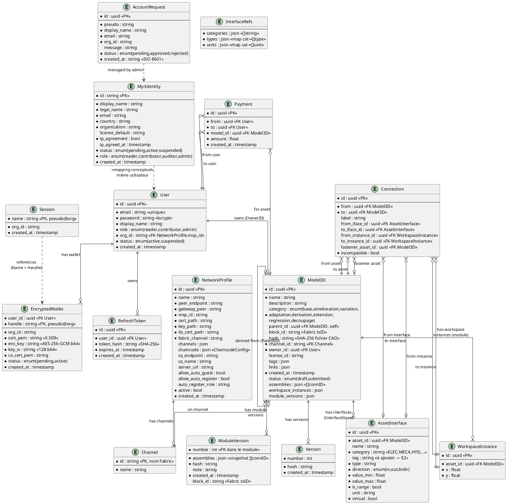
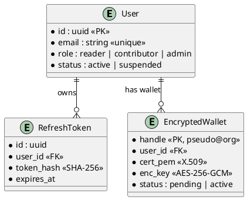
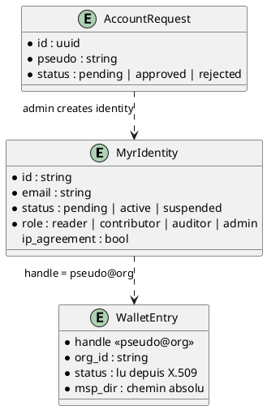
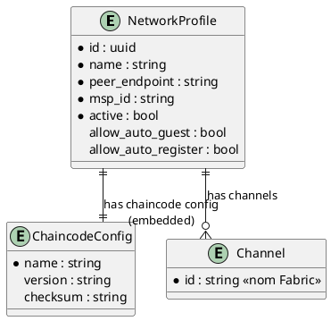

# MCD — Modèle Conceptuel de Données

> Phase 3 — Arrington | Référence : `specs/2-Analyse/Analyse_des_besoins.md` §6.3

---

## 1. Vue d'ensemble

Le modèle de données de Myr est distribué sur quatre supports de persistance aux responsabilités distinctes :

| Support | Adapter | Entités | Mutabilité |
|---------|---------|---------|-----------|
| SQLite (`myr.db`) | `adapters/out/sqlite/` | User, RefreshToken, EncryptedWallet | Mutable |
| JSON files (`data/`) | `adapters/out/localstorage/` | Connection, AssetInterface, InterfaceRefs, NetworkProfile, Session | Mutable |
| HyperLedger Fabric | `adapters/out/fabric/` | Model3D (asset), ModuleVersion (hash) | Immuable |
| IPFS | `adapters/out/ipfs/` | Fichiers CAO (3D) — référencés par `Model3D.Hash` | Immuable (CID) |

---

## 2. MCD global

---

## 3. Agrégats détaillés

### Agrégat Utilisateur (D1 — auth)

### Agrégat Identité Blockchain (D1 — identity)

### Agrégat Réseau (D2)

### Agrégat Asset (D3/D4/D5/D6)

Voir MCD global §2 — entités Model3D, AssetInterface, Connection, WorkspaceInstance, ModuleVersion.

Distinction Composant vs Module :

| Critère | Composant | Module |
|---------|-----------|--------|
| `Hash` | non vide (SHA-256 fichier CAO) | vide |
| `WorkspaceInstances` | vide | non vide |
| `Status` | vide | `draft` ou `submitted` |
| `ModuleVersions` | vide | non vide si `submitted` |

### Agrégat Paiement (D7)

Entité `Payment` implémentée (paiement manuel).

**Entités à concevoir** pour RM23/RM24 :

| Entité | Champs proposés | UC déclencheur |
|--------|----------------|----------------|
| `Order` | id, consumer_id, module_id, amount, status, created_at | UCPI01 |
| `OrderItem` | order_id, manufacturer_id, component_id, quantity | UCPI01 |
| `Commission` | id, order_id, recipient_id, asset_id, amount, ratio, tx_id | UCPI02, UCAUT01 |

> Ces entités sont à concevoir avec le PO — elles n'existent pas dans le code actuel.

---

## 4. Règles d'intégrité (contraintes MCD)

| Règle | Entité | Contrainte |
|-------|--------|-----------|
| RM01 | `Model3D` | `Category = base` → `Hash` unique parmi tous les assets Fabric |
| RM02 | `Model3D.Category` | valeur parmi les 8 catégories (dont `decoupage` — E1) |
| RM03 | `Model3D` | `ParentID != ""` → compatibilité licence vérifiée avant soumission |
| RM04 | `Model3D.ID` | UUID généré côté serveur — jamais fourni par le client |
| RM05 | `Model3D` | `Category != base` → `ParentID` obligatoire |
| RM09 | `AssetInterface` | un `id` ne peut apparaître qu'une seule fois dans `Connection.FromIfaceID` ou `ToIfaceID` |
| RM11 | `Connection` | `FromIface` et `ToIface` doivent satisfaire les 5 critères de compatibilité |
| RM12 | `Connection` | jamais supprimée automatiquement — `Incompatible: true` si interfaces évoluent |
| RM13 | `AssetInterface` | tout asset dans l'Atelier possède toujours au moins un `Virtual: true` |
| RM14 | `WorkspaceInstance` | suppression → cascade sur toutes les `Connection` liées |
| RM15 | `WorkspaceInstance` | plusieurs instances du même `AssetID` dans un module sont indépendantes |
| RM16 | `Model3D` (module) | `CreateModule` → `Status = draft` obligatoire |
| RM17 | `Model3D` (module) | `SubmitModule` → `len(Assemblies) > 0` requis |
| RM18 | `ModuleVersion` | créée à `SubmitModule` — immuable, horodatée, hashée |
| RM19 | `Model3D` (module) | `Status = submitted` → lecture seule — toute modification crée un fork |
| RM21 | `User.Role` | création → `reader` (E3 : le code assigne `contributor`) |
| RM25 | `Model3D.OwnerID` | transfert définitif et immuable sur Fabric |
| RM26 | `Model3D.ID` | UUID préservé lors du clonage inter-réseaux |

---

## 5. Informations manquantes

- **Commission, Order, OrderItem** : entités D7 à concevoir (voir §3 Agrégat Paiement)
- **Licence** : `Model3D.LicenseID` référence un catalogue de licences (`domain/model/license.go`) — entité `License` à ajouter au MCD
- **Organization** : entité logique référencée par `User.OrgID` et `NetworkProfile.MSPID` — pas d'entité Go dédiée dans le code
- **Peer** : entité infrastructure Fabric (peer endpoint) — pas modélisée côté applicatif
- **Adresse de livraison** : UCPI01 mentionne une adresse dans le profil consommateur — entité `ConsumerProfile` absente
