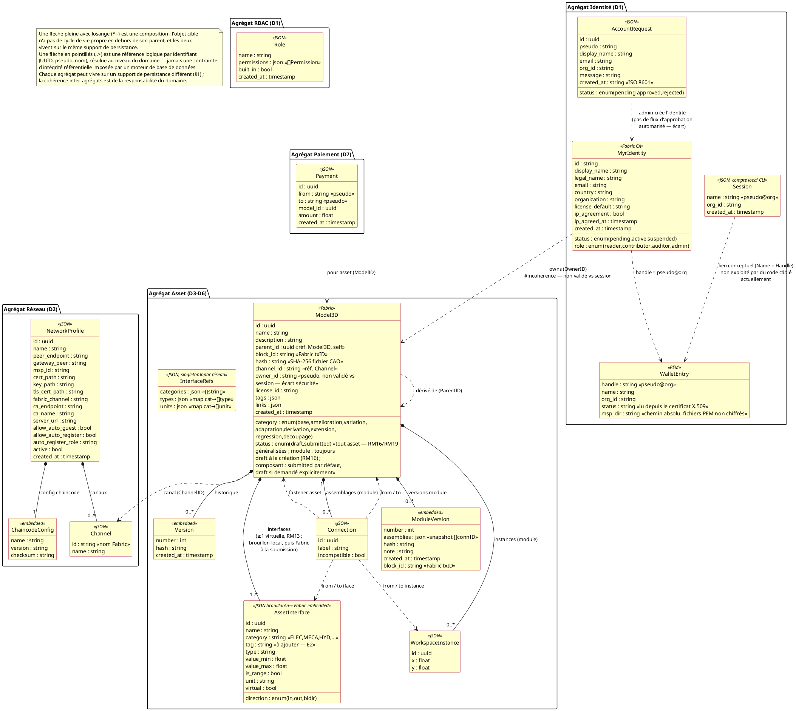

# Modèle de domaine — Agrégats et relations

> Phase 3 — Arrington | Référence : `specs/2-Analyse/Analyse_des_besoins.md` §6.3

---

## 1. Vue d'ensemble

Le modèle de données de Myr est distribué sur trois supports de persistance aux responsabilités distinctes — il n'y a pas de base SQL :

| Support | Adapter | Entités | Mutabilité |
|---------|---------|---------|-----------|
| Fichiers MSP locaux (non chiffrés) | `adapters/out/localstorage/` (wallets) | WalletEntry (PEM), MyrIdentity (attributs CA) | Mutable |
| JSON files (`data/`, `~/.Myr/`) | `adapters/out/localstorage/` | Connection, AssetInterface (brouillon — tant que l'asset porteur n'est pas soumis, ADR-02), InterfaceRefs, NetworkProfile, Session (local CLI), AccountRequest, Role | Mutable |
| HyperLedger Fabric | `adapters/out/fabric/` | Model3D (asset), AssetInterface (embarquée dans `Model3D.Interfaces` **à partir de la soumission** — ADR-02, `Conception_intro.md`), ModuleVersion (hash) | Immuable |
| IPFS | `adapters/out/ipfs/` | Fichiers CAO (3D) — référencés par `Model3D.Hash` | Immuable (CID) |

> La session REST (token opaque, `myrSession`) n'est pas un agrégat métier — c'est un détail d'implémentation de l'adaptateur `in/rest/`, en mémoire ou JSON/Redis selon la configuration. Voir `DC_D1_Auth_Identity.md`.

Le modèle est organisé par **agrégats** (au sens DDD) plutôt que par schéma relationnel : chaque agrégat regroupe les objets dont le cycle de vie est solidaire (composition), et référence les autres agrégats uniquement par identifiant (UUID, pseudo, nom) — jamais par une contrainte d'intégrité référentielle appliquée par un moteur de base de données, puisqu'aucun des quatre supports du tableau ci-dessus n'en fournit une de façon transversale. Cette cohérence inter-agrégats est portée par le domaine (`domain/`), pas par le support de stockage.

---

## 2. Vue globale du domaine

---

## 3. Détail par agrégat

### Agrégat RBAC (D1 — role)

4 rôles intégrés (`reader`, `contributor`, `auditor`, `admin`) — non supprimables. Rôles personnalisés créés via `myr role create`.

> Il n'existe pas d'agrégat « Utilisateur/compte web » — voir `DC_D1_Auth_Identity.md`. L'identité de référence est `MyrIdentity` (agrégat suivant).

### Agrégat Identité (D1 — identity)

Voir §2 — entités MyrIdentity, WalletEntry, AccountRequest, Session.

### Agrégat Réseau (D2)

Voir §2 — entités NetworkProfile, ChaincodeConfig (embarquée), Channel.

### Agrégat Asset (D3/D4/D5/D6)

Voir §2 — entités Model3D, AssetInterface, Connection, WorkspaceInstance, ModuleVersion, InterfaceRefs.

Distinction Composant vs Module :

| Critère | Composant | Module |
|---------|-----------|--------|
| `Hash` | non vide (SHA-256 fichier CAO) | vide |
| `WorkspaceInstances` | vide | non vide |
| `ModuleVersions` | vide | non vide si `submitted` |

> `Status` (`draft`/`submitted`) n'est plus un critère distinctif depuis la généralisation de RM16/RM19 — il s'applique aux deux types (voir §1, §2 et ADR-02 dans `Conception_intro.md`). Seuls `Hash`, `WorkspaceInstances` et `ModuleVersions` distinguent un composant d'un module.

### Agrégat Paiement (D7)

Entité `Payment` implémentée (paiement manuel).

**Entités à concevoir** pour RM23/RM24 :

| Entité | Champs proposés | UC déclencheur |
|--------|----------------|----------------|
| `Order` | id, consumer_id, module_id, amount, status, created_at | UCPI01 |
| `OrderItem` | order_id, manufacturer_id, component_id, quantity | UCPI01 |
| `Commission` | id, order_id, recipient_id, asset_id, amount, ratio, tx_id | UCPI02, UCAUT01 |

> Ces entités sont à concevoir avec le PO — elles n'existent pas dans le code actuel.

---

## 4. Règles d'intégrité (invariants du domaine)

| Règle | Entité | Contrainte |
|-------|--------|-----------|
| RM01 | `Model3D` | `Category = base` → `Hash` unique parmi tous les assets Fabric |
| RM02 | `Model3D.Category` | valeur parmi les 8 catégories (dont `decoupage` — E1) |
| RM03 | `Model3D` | `ParentID != ""` → compatibilité licence vérifiée avant soumission |
| RM04 | `Model3D.ID` | UUID généré côté serveur — jamais fourni par le client |
| RM05 | `Model3D` | `Category != base` → `ParentID` obligatoire |
| RM09 | `AssetInterface` | un `id` ne peut apparaître qu'une seule fois dans `Connection.FromIfaceID` ou `ToIfaceID` |
| RM11 | `Connection` | `FromIface` et `ToIface` doivent satisfaire les 5 critères de compatibilité |
| RM12 | `Connection` | jamais supprimée automatiquement — `Incompatible: true` si interfaces évoluent |
| RM13 | `AssetInterface` | tout asset possède toujours au moins un `Virtual: true` |
| RM14 | `WorkspaceInstance` | suppression → cascade sur toutes les `Connection` liées |
| RM15 | `WorkspaceInstance` | plusieurs instances du même `AssetID` dans un module sont indépendantes |
| RM16 | `Model3D` (module) | `CreateModule` → `Status = draft` obligatoire |
| RM17 | `Model3D` (module) | `SubmitModule` → `len(Assemblies) > 0` requis |
| RM18 | `ModuleVersion` | créée à `SubmitModule` — immuable, horodatée, hashée |
| RM19 | `Model3D` (module) | `Status = submitted` → lecture seule — toute modification crée un fork |
| RM21 | `MyrIdentity.Role` | rôle `reader` par défaut à l'auto-enregistrement, sauf rôle explicite |
| RM22 | `myrSession.Role` (REST) | déterminé à la connexion depuis `MyrIdentity.Role` #incoherence — cette ligne décrit un écart de synchronisation (état de suivi : `specs/roadmap_dev.md` § Écarts Identité & Session, E1), pas la règle RM22 telle que formulée dans `Regles_Metier.md` (changement de rôle réservé à l'admin, effectif au prochain ré-enrôlement) ; à réconcilier |
| RM25 | `Model3D.OwnerID` | transfert définitif et immuable sur Fabric |
| RM26 | `Model3D.ID` | UUID préservé lors du clonage inter-réseaux |

---

## 5. Informations manquantes

- **Commission, Order, OrderItem** : entités D7 à concevoir (voir §3 Agrégat Paiement)
- **Licence** : `Model3D.LicenseID` référence un catalogue de licences (`domain/model/license.go`) — entité `License` à ajouter au modèle de domaine
- **Organization** : entité logique référencée par `MyrIdentity.Organization` et `NetworkProfile.MSPID` — pas d'entité Go dédiée dans le code
- **Chiffrement des wallets** : décision de conception à trancher entre wallet chiffré au repos ou fichiers PEM en clair (`0600`) — voir `Securite.md`, `Conception_intro.md` ADR-03
- **Peer** : entité infrastructure Fabric (peer endpoint) — pas modélisée côté applicatif
- **Adresse de livraison** : UCPI01 mentionne une adresse dans le profil consommateur — entité `ConsumerProfile` absente
