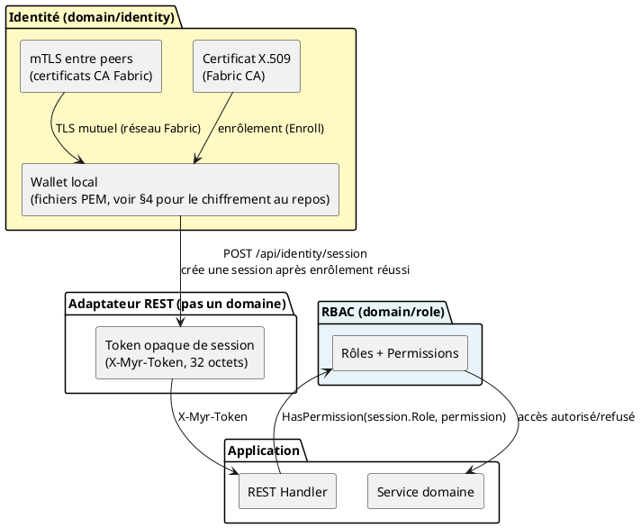
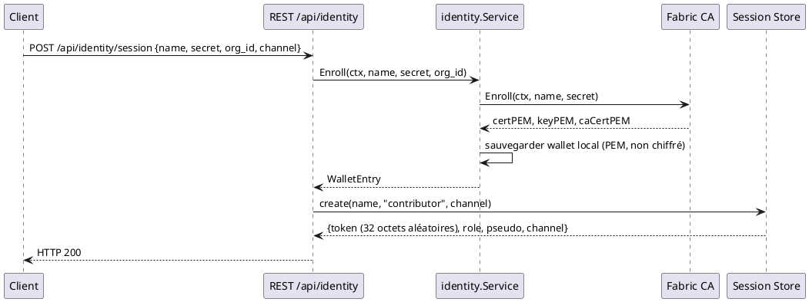
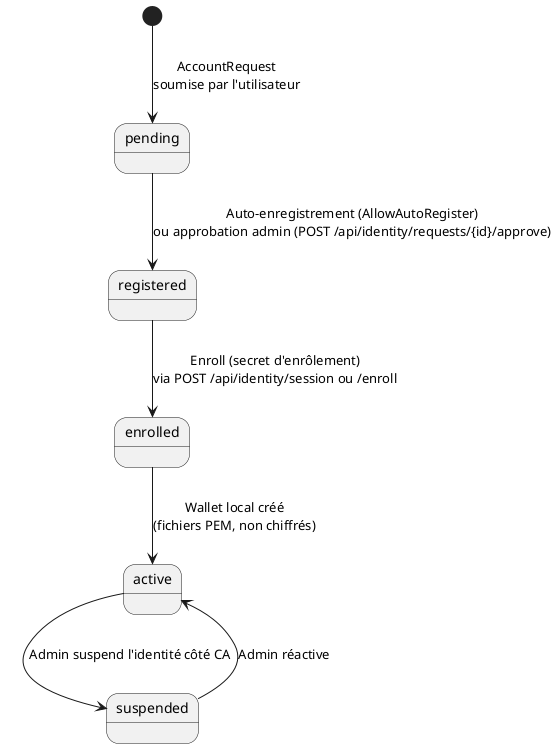

# Modèle de sécurité — Myr System

> Phase 3 — Arrington | Référence : ENF10, ENF12, ENF18, ENF27, ENF28

---

## 1. Vue d'ensemble

**Il n'y a qu'une seule couche d'identité** — pas de couche « auth web JWT » séparée d'une couche « identité blockchain ». L'identité cryptographique Fabric CA est la source de vérité unique ; une couche fine d'adaptateur REST (token opaque de session) s'appuie dessus pour éviter d'exiger un certificat client à chaque requête HTTP.



---

## 2. Authentification REST — token opaque (pas de JWT)

### Flux d'authentification



### Le token n'est pas un JWT

Il n'y a **aucune bibliothèque JWT, aucun claim signé, aucun décodage côté client possible**. Le token est 32 octets générés par `crypto/rand`, encodés en hexadécimal — une clé opaque vers un enregistrement `myrSession{Role, Pseudo, Channel, ExpiresAt}` conservé côté serveur (mémoire, JSON optionnel, ou Redis).

> ⚠️ Des commentaires de code encore présents dans `adapters/in/rest/handlers.go` et `handlers_network.go` mentionnent « JWT Bearer (nouveau) » — ce sont des reliquats obsolètes, pas une description du comportement réel. Seul l'en-tête `X-Myr-Token` est lu.

### Durée de vie

- **Session REST** : 7 jours (`sessionTTL`, constante `adapters/in/rest/session.go`), pas de renouvellement automatique.
- **Secret d'enrôlement CA** : durée/nombre d'usages dépendant de la configuration de la Fabric CA elle-même (hors périmètre `myr`).

### Stockage des tokens

| Élément | Stockage côté client | Stockage côté serveur |
|---------|----------------------|------------------------|
| Token de session | À la charge du client (pas de recommandation imposée par `myr`) | En mémoire (défaut), fichier JSON optionnel, ou Redis (`REDIS_URL`) — jamais en clair transmis deux fois, comparaison en temps constant (`subtle.ConstantTimeCompare`) |
| Secret d'enrôlement CA | Transmis une fois par l'admin, à la charge de l'utilisateur | Jamais stocké par `myr` (`RegisterRequest.Password` — commentaire explicite « jamais stocké ») |

### Révocation

**Pas de révocation en libre-service.** Seul un administrateur peut révoquer une session, via `DELETE /api/admin/sessions/{token}` — après consultation de `GET /api/admin/sessions` (§ 9 pour l'identifiant de session à exposer). En l'absence de révocation, un token reste valide jusqu'à expiration naturelle (7 jours).

---

## 3. Identité — pas de mot de passe applicatif

Il n'existe ni bcrypt, ni hash de mot de passe, ni table d'utilisateurs. Le secret manipulé est un **secret d'enrôlement Fabric CA** (`RegisterRequest.Password` dans le code, nommage historique trompeur) — un jeton d'enregistrement à usage limité délivré par la CA, pas un mot de passe choisi par l'utilisateur.

---

## 4. Identités blockchain — Fabric CA

### Cycle de vie d'une identité



### Chiffrement des wallets au repos (ENF10)

ENF10 exige que les wallets soient stockés chiffrés — voir `Conception_intro.md` ADR-03 pour la décision de conception et son état.

---

## 5. Contrôle d'accès (RBAC dynamique)

### Rôles et permissions

Le RBAC (`domain/role`) est **dynamique**, pas une énumération figée : un rôle est un nom associé à un sous-ensemble du catalogue de permissions (`read`, `write`, `network.admin`, `role.admin`, `identity.admin`, `admin`). Seuls les 4 rôles suivants sont **intégrés** (non supprimables) :

| Rôle intégré | Permissions typiques | Droits REST |
|---------------|----------------------|-------------|
| `reader` | `read` | `GET /api/*` authentifié |
| `contributor` | `read`, `write` | Lecture + écriture assets |
| `auditor` | `read` | Lecture authentifiée (rôle intégré, usage non détaillé dans le code REST actuel) |
| `admin` | toutes | Tous droits + `/api/admin/*` |

D'autres rôles (ex. `consumer`, `manufacturer`) peuvent être créés à la demande via `myr role create --permission ...` — ils n'existent pas par défaut.

> **Rôle de session :** le rôle attribué à une session REST doit refléter l'attribut `Myr.role` réel de l'identité CA enrôlée — un changement de rôle via `myr identity set-role` doit se répercuter sur les sessions REST créées ensuite. État de cet écart : `specs/roadmap_dev.md` § Écarts Identité & Session, E1.

### Middleware de contrôle d'accès

```go
// requireAuth  — vérifie que le token opaque (X-Myr-Token) correspond à une session active
// requireRole(perm) — vérifie que le rôle de la session porte la permission requise,
//                      via domain/role.RoleService.HasPermission (ou repli sur un rang historique
//                      reader < contributor < admin si aucun RoleService n'est injecté)

// adapters/in/rest/handlers.go — routes mixtes (lecture libre, écriture protégée) :
contrib := func(next http.HandlerFunc) http.HandlerFunc {
    return func(w http.ResponseWriter, r *http.Request) {
        switch r.Method {
        case http.MethodPost, http.MethodPut, http.MethodPatch, http.MethodDelete:
            s.handler.requireRole(rbac.PermWrite, next)(w, r)
        default:
            auth(next)(w, r) // lecture : auth seule
        }
    }
}
```

---

## 6. mTLS entre peers Fabric

HyperLedger Fabric impose le TLS mutuel (mTLS) entre tous les composants du réseau :
- Chaque peer présente son certificat X.509 (émis par la Fabric CA du canal)
- Le peer vérifie le certificat de l'appelant — aucune connexion sans certificat valide
- **Pas de VPN requis** — mTLS assure le chiffrement et l'authentification au niveau transport
- Les certificats sont stockés dans les chemins configurés dans `NetworkProfile` (CertPath, KeyPath, TLSCertPath)

---

## 7. Headers de sécurité HTTP

Appliqués à toutes les réponses par le middleware `secureHeaders` :

| Header | Valeur | Protection |
|--------|--------|-----------|
| `X-Content-Type-Options` | `nosniff` | Sniffing MIME |
| `X-Frame-Options` | `DENY` | Clickjacking |
| `Referrer-Policy` | `strict-origin-when-cross-origin` | Fuite d'URL |
| `Content-Security-Policy` | `default-src 'none'` (API JSON pure, pas de page HTML servie) | XSS, injection |

> `myr` ne sert plus de GUI embarquée — la politique CSP applicable à une éventuelle SPA relève désormais du dépôt GUI externe.

---

## 8. Rate limiting

`authLimiter` (`ipRateLimiter`, `adapters/in/rest/handlers.go`) limite à **10 tentatives par minute par IP** (`clientIP(r)`) sur les routes sensibles :

- `POST /api/identity/request`
- `POST /api/identity/session`
- `POST /api/identity/guest`

Au-delà, `HTTP 429` est retourné.

---

## 9. Surfaces d'attaque et mitigations

| Surface | Risque | Mitigation attendue |
|---------|--------|-----------|
| Enrôlement/connexion | Brute force du secret CA sur `POST /api/identity/session` | Rate limiting 10/min/IP (`authLimiter`, § 8) |
| Token de session | Vol de token (`X-Myr-Token`) | Pas de recommandation de stockage client imposée par `myr` ; comparaison serveur en temps constant |
| `owner_id` | Client peut forger n'importe quel `owner_id` en lecture (`GET /api/components?owner_id=`) et en écriture (`POST /api/components`) | `owner_id` validé/dérivé de `sess.Pseudo` (OWASP A01, `UCA06`) |
| Wallets | Clés privées en fichiers PEM (permissions `0600`) | Chiffrement au repos requis par ENF10 — voir §4 et `Conception_intro.md` ADR-03 |
| Rôle de session | Rôle REST doit refléter le rôle CA réel de l'identité enrôlée | Lecture du rôle depuis l'identité plutôt qu'une valeur fixe — voir §5 |
| Révocation de session | `DELETE /api/admin/sessions/{token}` doit pouvoir être ciblée depuis `GET /api/admin/sessions` sans recherche annexe | Identifiant de session exploitable exposé par la liste |
| Injection chaincode | Arguments Fabric | Validation stricte côté serveur avant soumission (RM07) |
| Module immuable | Un module `submitted` ne doit plus être modifiable directement | Garde `Status != submitted`, fork obligatoire (RM19) |

État de suivi de ces écarts : `specs/roadmap_dev.md` § Écarts Identité & Session et § Bugs bloquants.
