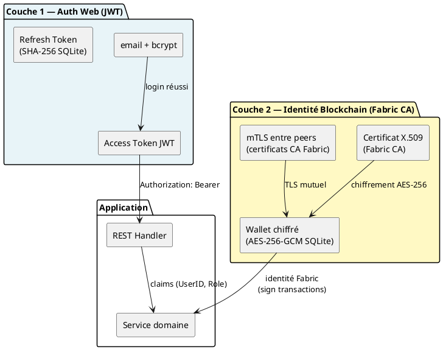
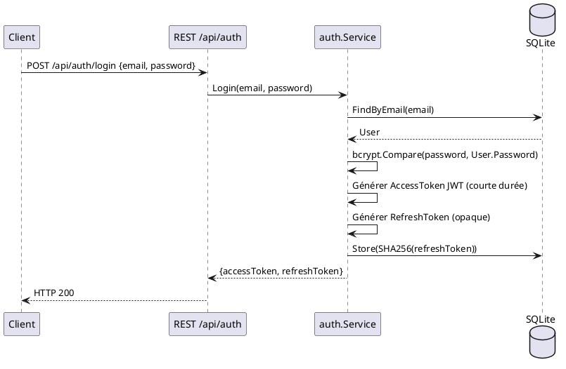
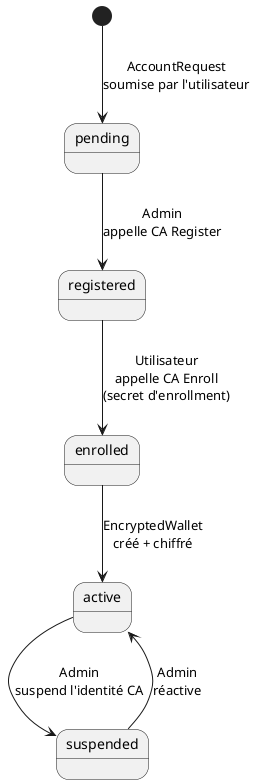

# Modèle de sécurité — Myr System

> Phase 3 — Arrington | Référence : ENF10, ENF12, ENF18, ENF27, ENF28

---

## 1. Vue d'ensemble

La sécurité Myr repose sur deux couches indépendantes :



---

## 2. Authentification web — JWT

### Flux d'authentification



### Structure du JWT

```json
{
  "sub": "user-uuid",
  "email": "user@org.com",
  "role": "contributor",
  "org_id": "Org1MSP",
  "display_name": "Alice",
  "exp": 1234567890,
  "iat": 1234567800
}
```

**Durées recommandées :**
- Access token : 15 minutes (courte durée — à configurer)
- Refresh token : 7 jours (longue durée — révocable)

### Stockage des tokens

| Token | Stockage côté client | Stockage côté serveur |
|-------|---------------------|----------------------|
| Access token | Mémoire / sessionStorage (jamais localStorage) | Non stocké |
| Refresh token | HttpOnly cookie recommandé | SHA-256 hex dans SQLite |

### Révocation

Le refresh token peut être révoqué via `DELETE /api/admin/sessions/{id}` (admin) ou `POST /api/auth/logout` (utilisateur). Les access tokens expirés ne peuvent pas être révoqués avant expiration — durée courte recommandée.

---

## 3. Hachage des mots de passe — bcrypt

- Algorithme : bcrypt
- Coût recommandé : **12** (bon équilibre sécurité/performance)
- Stockage : uniquement le hash — jamais le mot de passe en clair

---

## 4. Identités blockchain — Fabric CA

### Cycle de vie d'une identité



### Wallets Fabric chiffrés (ENF10)

Les certificats X.509 (clé privée) sont stockés chiffrés dans SQLite via `EncryptedWallet` :

```
EncryptedWallet.EncKey = AES-256-GCM(keyPEM, WALLET_ENCRYPT_KEY)
EncryptedWallet.KeyIV  = IV 12 bytes (aléatoire, unique par wallet)
```

**Algorithme : AES-256-GCM** (authenticated encryption)
- IV de 12 bytes généré aléatoirement pour chaque wallet
- Tag d'authentification 16 bytes inclus dans le ciphertext
- Clé dérivée de `WALLET_ENCRYPT_KEY` (variable d'environnement obligatoire)

> ⚠️ La perte de `WALLET_ENCRYPT_KEY` rend tous les wallets irrécupérables. Aucun mécanisme de rotation de clé en v1.

---

## 5. Contrôle d'accès (RBAC)

### Rôles et droits

| Rôle | Code | Droits REST | Droits Fabric |
|------|------|-------------|--------------|
| Visiteur | — | Lecture publique (si AllowAutoGuest) | Aucun |
| Lecteur | `reader` | `GET /api/*` authentifié | Lecture ledger |
| Concepteur | `contributor` | Lecture + écriture assets | Lecture + écriture ledger |
| Admin | `admin` | Tous droits + `/api/admin/*` | Admin CA + ledger |
| *(À créer)* | `consumer` | Commande modules | Lecture ledger |
| *(À créer)* | `manufacturer` | Livraison | Lecture + écriture livraison |

> **Écart E3 :** le code `domain/auth/service.go` attribue `contributor` à la création au lieu de `reader` (violation RM21).

### Middleware de contrôle d'accès

```go
// requireAuth — vérifie que le JWT est valide
// requireRole("contributor") — vérifie le rôle minimum

// Logique dans adapters/in/rest/handlers.go
// Pour les routes mixtes (lecture libre, écriture protégée) :
contrib := func(next http.HandlerFunc) http.HandlerFunc {
    return func(w http.ResponseWriter, r *http.Request) {
        switch r.Method {
        case http.MethodPost, http.MethodPut, http.MethodPatch, http.MethodDelete:
            s.handler.requireRole("contributor", next)(w, r)
        default:
            auth(next)(w, r)  // lecture : auth seule
        }
    }
}
```

---

## 6. mTLS entre peers Fabric

HyperLedger Fabric impose le TLS mutuel (mTLS) entre tous les composants du réseau :
- Chaque peer présente son certificat X.509 (émis par la Fabric CA du canal)
- Le peer vérifie le certificat de l'appelant — aucune connexion sans certificat valide
- **Pas de VPN requis** — mTLS assure le chiffrement et l'authentification au niveau transport
- Les certificats sont stockés dans les chemins configurés dans `NetworkProfile` (CertPath, KeyPath, TLSCertPath)

---

## 7. Headers de sécurité HTTP

Appliqués à toutes les réponses par le middleware `secureHeaders` :

| Header | Valeur | Protection |
|--------|--------|-----------|
| `X-Content-Type-Options` | `nosniff` | Sniffing MIME |
| `X-Frame-Options` | `DENY` | Clickjacking |
| `Referrer-Policy` | `strict-origin-when-cross-origin` | Fuite d'URL |
| `Content-Security-Policy` | `default-src 'self'; script-src 'self' 'unsafe-inline'; ...` | XSS, injection |

> `'unsafe-inline'` dans `script-src` est présent pour la SPA Vanilla JS. À remplacer par des nonces CSP dans une version future.

---

## 8. Surfaces d'attaque et mitigations

| Surface | Risque | Mitigation |
|---------|--------|-----------|
| Authentification | Brute force sur `POST /api/auth/login` | Rate limiting (non implémenté en v1) |
| JWT | Token volé dans localStorage | Utiliser sessionStorage ou HttpOnly cookie pour le refresh token |
| `OwnerID` | Client peut forger n'importe quel `owner_id` | Valider `OwnerID == claims.UserID` dans les handlers (non implémenté — voir OWASP A01) |
| Injection SQL | Requêtes SQLite | Utilisation de requêtes paramétrées |
| Injection chaincode | Arguments Fabric | Validation stricte côté serveur avant soumission (RM07) |
| Exfiltration wallets | Clés privées en SQLite | AES-256-GCM — clé en env var uniquement (pas dans le code ni le repo) |
| Module immuable | Module soumis modifiable (E5) | Fork obligatoire à implémenter (RM19) |
| Nouveau compte trop privilégié | Rôle `contributor` à la création (E3) | Corriger → `reader` (RM21) |

---

## 9. Écarts de sécurité connus

| ID | Écart | Risque | Action requise |
|----|-------|--------|----------------|
| E3 | `User.Role = contributor` à la création | Tout nouvel utilisateur a des droits d'écriture Fabric immédiats | Corriger `domain/auth/service.go:93` → `reader` |
| E5 | Module soumis modifiable | Immuabilité post-publication non garantie (RM19) | Ajouter garde `Status != submitted` |
| — | `OwnerID` non validé vs JWT | Usurpation d'identité sur les assets | Valider dans les handlers REST |
| — | Aucun rate limiting sur login | Brute force possible | À implémenter (middleware ou reverse proxy) |
| — | Access token non révocable | Token compromis valide jusqu'à expiration | Durée courte recommandée (15 min) |
