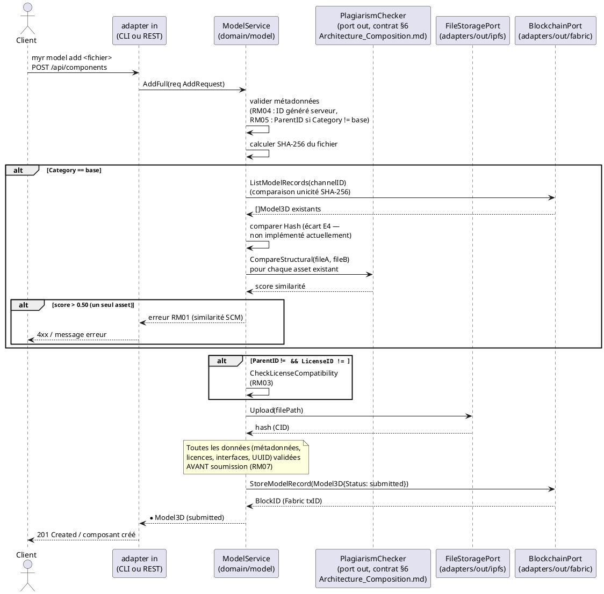
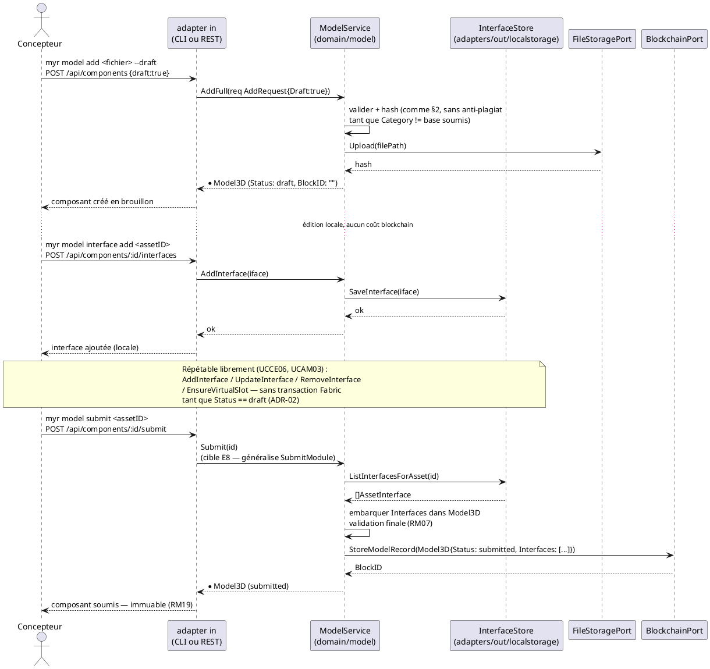

# Séquence — Soumission d'un composant (D3)

> Phase 3 — Arrington | Use cases : UCCE01, UCCE06 | Domaine : `domain/model`

---

## 1. Objectif

Diagramme de séquence détaillant les deux chemins de soumission d'un composant définis par ADR-02 (`Conception_intro.md` §6) et repris dans `Architecture_Composition.md` §3 : la création directe (comportement par défaut, une seule transaction Fabric) et le cycle brouillon → soumission explicite (`draft: true`).

---

## 2. Chemin par défaut — création directe (`AddFull`)

---

## 3. Chemin brouillon — `draft: true` puis `Submit` (E8)

---

## 4. Notes

- Les deux chemins convergent : une seule écriture Fabric (`StoreModelRecord`) commet l'intégralité du brouillon, `Interfaces` compris — jamais d'écriture blockchain par édition individuelle (ADR-02, `Conception_intro.md` §6).
- Le contrat `PlagiarismChecker.CompareStructural` (§6 `Architecture_Composition.md`) est représenté ci-dessus pour situer où l'algorithme SCM s'intégrerait une fois choisi — l'algorithme lui-même reste une question ouverte pour le PO, non tranchée par ce diagramme.
- `Submit(id)` (chemin §3) n'a pas de méthode `ModelService` dédiée : ce diagramme documente la cible — état de cet écart : `specs/roadmap_dev.md` § Écarts structurels — modèle & chaincode, E8.
